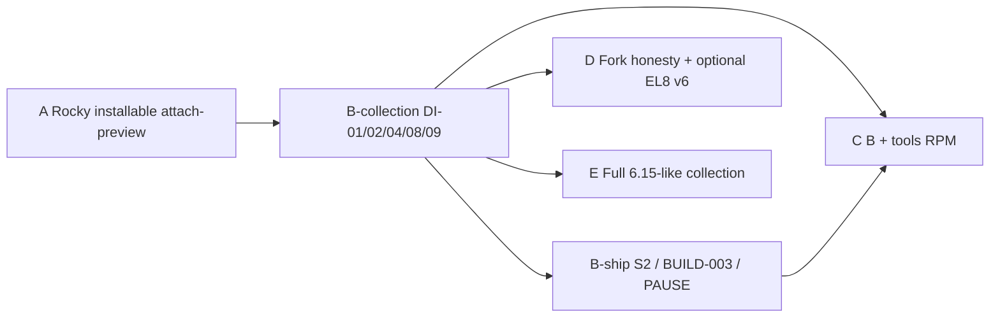
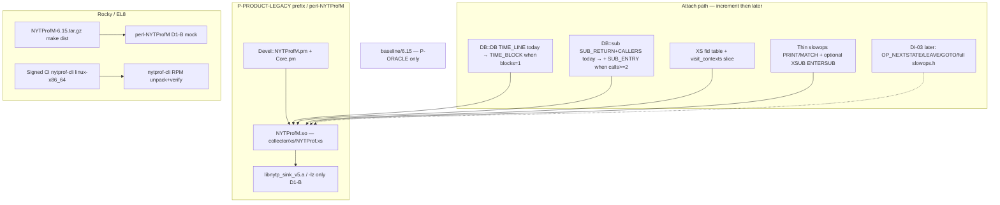

# Remaining drop-in replacement + Rocky/EL8 RPM deployment

| Field | Value |
|-------|-------|
| **Document title** | Program completion: remaining D1–D6 drop-in + Rocky/EL8 RPM deployment |
| **Author** | design-doc-writer (Grok) |
| **Date** | 2026-08-13 |
| **Status** | Draft (rev 4 — DI-04 projection) |
| **Baseline commit** | `main` @ `48e9266` (attach-preview MVP + NYTProfM identity landed) |
| **Does not supersede** | [`docs/PROGRAM_CHARTER.md`](https://github.com/hilather/nytprof-modernization/blob/main/docs/PROGRAM_CHARTER.md), accepted ADRs 0001–0010, [`docs/contracts/DROP_IN_DOD_v0.md`](https://github.com/hilather/nytprof-modernization/blob/main/docs/contracts/DROP_IN_DOD_v0.md), [`docs/PRODUCT_COMPLETION_DROP_IN_v0.md`](https://github.com/hilather/nytprof-modernization/blob/main/docs/PRODUCT_COMPLETION_DROP_IN_v0.md) (rev 4, identity superseded by Option B), residual matrix |
| **Board row** | `DROP-IN-REMAINING` (residual). `NS-NYTPROFM-IDENTITY` done. |

This design covers **how** to finish drop-in replacement and RPM deployment after attach-preview. It does not re-litigate shipped G03–G06 / J01–J02 / K01–K02 MVP. Agents own **tasks**; this document does not override fixtures, ADRs, or the charter.

---

## Overview

Attach-preview is live: `perl -d:NYTProfM` with `NYTPROF file=` writes `NYTProf 5` via Perl `DB::DB` / `DB::sub` and shipped `nytp_emit_*`. Default-calls1-shaped work reports leaf **15** / mid **3** / mid→leaf **15**. That is **not** 6.15 opcode/`entersub` attach: product `DB::DB` always emits `TIME_LINE` (never live `TIME_BLOCK`), and `DB::sub` emits `SUB_RETURN` + `SUB_CALLERS` but never `SUB_ENTRY`. RPM specs exist (`perl-NYTProfM.spec`, `nytprof-cli.spec`) but are **not** mock-certified; `make dist` does not produce an ingestible `NYTProfM-6.15.tar.gz`; tools ingest of signed CI prebuilts is policy-only (ADR-0010).

The completion plan is two independent tracks that meet at a **split** GA-candidate:

1. **Collection fidelity (B-collection)** — extend the existing Perl debugger hooks (plus XS helpers) to land **TIME_BLOCK** + resolved-fid line5 **780** / block_line **810**, and `calls=2` **27** `SUB_ENTRY`, **without** grafting the full 6.15 opcode table. Full opcode is later (DI-03). **DI-01/DI-02 aggregate smokes are the 780/27 gates.** DI-04 is a **product-defined mini kinds/multiset** check — **not** raw `compare_jsonl.pl` full `tag+args` against oracle primary fixtures, and **not** a second copy of 780/27.
2. **Rocky/EL8 deploy** — produce a real Source0 tarball, maintainer-mock-certify the D1-B module RPM, then (separately) stand up the ADR-0010 signed prebuilt pipeline. Default Rocky stays **D1-B** (v5-only, zlib, no cargo).
3. **B-ship (packaging/release)** — S2, BUILD-003-FULL, PAUSE TRIAL, module RPM re-cert. PAUSE may lag collection green. S2 is allowed after **I01 + DI-01/02**, not after BUILD-003-FULL.

Recommended start: **milestone A** (Rocky installable attach-preview) in parallel with **DI-01**, then **B-collection**, then **B-ship**. Opcode, mid-deflate-in-child, EL8 v6, and COMPAT-007 stay later.

---

## Background & Motivation

### What is already shipped (do not re-design)

| Surface | Evidence | Honesty |
|---------|----------|---------|
| Live attach MVP | `collector/xs/Devel/NYTProfM.pm` `DB` / `sub`; `g04_v5_parity_smoke.sh` | Perl hooks, not opcode |
| Options + `format` | `g05_options_format_smoke.sh` | unknown + `dual` fail-closed; D1-B `format=v6` fail-closed; D1-A `xs-nytprof-v6` → `NYTPROF6` |
| Fork + `addpid` | `CORE::GLOBAL::fork` → `nytp_fork_*`; `g06_fork_addpid_smoke.sh` | child **re-inits** a clean stream; mid-deflate-continue residual |
| Identity | `NAME => Devel::NYTProfM`, `DISTNAME => NYTProfM`, `$VERSION` **6.15** | Option B; no `Provides: perl(Devel::NYTProf)` |
| Module RPM spec | `packaging/rpm/perl-NYTProfM.spec` | spec MVP; k01 skips mock/`rpmbuild` |
| Tools RPM spec | `packaging/rpm/nytprof-cli.spec` | ingest contract; no live signed artifacts |
| CPAN TRIAL notes | `docs/RELEASE_NOTES_CPAN_TRIAL_v0.md` | notes-ready; **not** PAUSE uploaded |
| Dual-path | `dual_path_smoke.sh` | **oracle-primary** until explicit S2 |
| `collection_default` | capability JSON | **v5** until R4 / ADR-0008 |
| Report facades | `perl/lib/Devel/NYTProf/*` | stay `Devel::NYTProf::*`; CollectorBootstrap remains `Devel::NYTProf::CollectorBootstrap` |

### Pain points that still block “drop-in” and “dnf install”

1. **Advertised aggregates the attach-MVP cannot produce.** Oracle `fixtures/v5/blocks-calls1` has `line_totals["1:5"].calls = 780` and `block_line_totals["1:4"].calls = 810`. Product `DB::DB` calls `DB::emit_time_line(1, 1, $line)` only. **780 is also present on TIME_LINE-only default-calls1** — it is a **line visit count**, not unique to TIME_BLOCK. DI-01 unique bars are **TIME_BLOCK present** + **block_line 810** on the **resolved** workload fid. Oracle `fixtures/v5/calls2-default` has **27** `SUB_ENTRY` tags (`calls=2`). Product `DB::sub` never calls `DB::emit_sub_entry`.
2. **Fid is hardcoded to 1.** Every statement from every file is emitted as fid 1. After a real fid table, first-seen NEW_FID may **not** be `workload.pl`. Smokes must resolve fid from product NEW_FID basename, not hardcode `1:5`.
3. **No installable Source0.** Root `Makefile.PL` is still `BUILD-MAKEMAKER-OPT` (`PM => {}`, `full_build003=0`). `perl-NYTProfM.spec` `%setup -n NYTProfM-%{version}` has nothing real to unpack.
4. **`%check` drives repo scripts.** The spec calls `scripts/packaging/g05_options_format_smoke.sh` if present. A mock chroot after `%setup` of a proper dist must check **installed** files, not a git checkout.
5. **Tools RPM cannot be mock-certified** until ADR-0010 publish/verify exists. k02 still greps `nytprof-cli-7.00` in one path — identity leftover.
6. **Operator docs still say `perl-Devel-NYTProf` ≥ 7.00 / `-d:NYTProf`.** MIG01, graft annex C, and the approved rev-4 body predate Option B.

### Binding constraints (do not violate)

- Dual_path stays **oracle-primary** until explicit **S2**. Do not rewrite `dual_path_smoke.sh` primary half before S2.
- `collection_default` stays **v5** until R4 ADR-0008 flip.
- Never put `crates/` on oracle `PERL5LIB`.
- Tests must drive shipped emit/dump/install/configure/spec/notes/convert/merge paths.
- Do **not** flip: `BUILD-003-FULL` without a dedicated PR; COL-008; PAUSE/SEC-012-complete GA marketing; product `format=dual`; tablesorter (WAIVED).
- Product debugger is **Option B**: `perl -d:NYTProfM` loads `Devel::NYTProfM`; CPAN `DISTNAME` **NYTProfM**; `$VERSION` **6.15**. Operators switch. Do **not** `Provides: perl(Devel::NYTProf)`.
- EL8 default module is **D1-B** (v5-only, zlib-only, no cargo). D1-A is `--with v6_collect` / `NYTPROF_V6_COLLECT=1`.
- EL8 tools RPM ingest is **ADR-0010 signed CI prebuilts** (not rustup-in-mock, not system EL8 rustc).
- Every bug fix lands with a regression test that fails before and passes after.
- Docs in the same change; absolute HTTPS links.
- Light rows in `docs/agent-notes/` when abandoning approaches.

---

## Goals & Non-Goals

### Goals

1. Land **DI-01** (TIME_BLOCK + resolved-fid line5 **780** / block_line **810**) and **DI-02** (`calls=2` **27** `SUB_ENTRY` + CORE: names) on live `perl -d:NYTProfM` without full opcode graft (DI-03). **Do not redefine 780 downward.**
2. Land **DI-04** as a **product-defined M4-mini live-attach kinds/multiset** check (named reduced comparator). Not raw `compare_jsonl.pl` vs oracle primary fixtures. Not a second 780/27 gate. Required before claiming “advertised-options attach.”
3. Make Rocky 8 **installable** at attach-preview fidelity: real `NYTProfM-6.15.tar.gz`, **maintainer-mock-certified** `perl-NYTProfM` (CI mock optional), `%check` on installed files, Option B docs. Public COPR/`rpmsign` may lag (A claim does not require them).
4. Complete the ADR-0010 **pipeline** so `nytprof-cli` mock ingest is real (milestone C).
5. Sequence **B-ship** separately: S2 after **I01 + DI-01/02**; BUILD-003-FULL dedicated; PAUSE may lag.
6. Keep marketing honest: milestone A is “Rocky installable attach-preview”, not drop-in.

### Non-goals (this program completion)

| Non-goal | Residual ID / note |
|----------|-------------------|
| Full 6.15 opcode / `goto` / **full** slowops table / leave-correction | **DI-03** — milestone E (thin `OP_PRINT`/`OP_MATCH` is B2, not this residual) |
| Full TEST-003 corpus | **DI-05** — after mini |
| COMPAT-007 bless-array Data | **DI-13** — explicit first-GA residual |
| Full oracle HTML DOM / jquery / tablesorter | **DI-15** — **WAIVED** (M01/Q4) |
| Product `format=dual` | OQ-4 / KD-14 |
| R3/R4 runtime default flips | ADR-0005 / ADR-0008 |
| COL-008 batched Rust writer | ADR-0007 |
| `Provides: perl(Devel::NYTProf)` / EVR fight with stock 6.15 | Option B |
| rustup-in-mock / system EL8 rustc for tools | KD-13 |
| Linking full `libnytp_sink.a` on D1-B | KD-24 |
| AppStream Perl 5.32 as first advertised stream | **RPM-10** residual |
| Independent SEC-012 as a code PR | **RPM-11** — checklist + reviewer |
| PAUSE/SEC-012-complete **GA marketing** | P01 stays GA-candidate |

---

## Milestone bars

These are **claim bars**, not a single git branch. Each bar’s claim language is the only language operators and release notes may use.



| Milestone | Includes | Claim language | Must not claim |
|-----------|----------|----------------|----------------|
| **A. Rocky installable attach-preview** | RPM-01, 02, 03, 08 (+ RPM-06/07 stubs). Mock **absent** = honest SKIP | “`perl-NYTProfM` attach-preview 15/3/15; `format=v6` fail-closed; **maintainer-mock certified** when a mock host ran A3” | drop-in, 780, SUB_ENTRY 27, tools drop-in, S2, **CI-mock certified** unless a GHA mock job exists, public COPR unless A5b landed |
| **B-collection. GA-candidate collection** | A + **DI-01, 02, 04, 08, 09-subset** | “Drop-in **collection** on advertised options that are green / **D1-B** Rocky default / **D1-A** CPAN source” | full opcode, COMPAT-007, DOM/JS, Rocky `format=v6` unless RPM-09, tools RPM, S2, PAUSE, BUILD-003-FULL |
| **B-ship. Packaging / release** | DI-10, 11, 12 + module RPM **re-cert** on B-collection attach | “product prefix is dual_path primary (S2)”; “MakeMaker XS dist”; “NYTProfM TRIAL on PAUSE” — each only when that PR lands | collection integers (those are B-collection) |
| **C. B + tools RPM** | B-collection + RPM-04, 05 (B-ship optional) | “Native NYTProf tools on EL8” + B-collection claim | tools-alone drop-in |
| **D. Fork honesty + optional EL8 v6** | C or B-collection + DI-06, 07 + RPM-09 | mid-deflate-in-child + TEST-018 subset; Rocky `format=v6` **only** on `--with v6_collect` | default Rocky is D1-A |
| **E. Full 6.15-like collection** | D or B-collection + DI-03, 05 | “opcode/`entersub` attach; full TEST-003 corpus” | first GA-candidate |

**Start at A, then B-collection.** DI-03 and COMPAT-007 are later. PAUSE (B-ship) may lag.

---

## Proposed Design

### Architecture (shipped + remaining)



### Component map (do not invent new trees)

| Component | Path | Remaining change |
|-----------|------|------------------|
| Debugger entry | `collector/xs/Devel/NYTProfM.pm` | Honor `blocks` / `calls` / `slowops` (subset policy) / `sigexit`; emit TIME_BLOCK + SUB_ENTRY |
| XS | `collector/xs/NYTProf.xs` | Fid table, `visit_contexts`, **thin PRINT/MATCH slowops**, optional XSUB ENTERSUB, mid-deflate child continue, sigexit |
| v5 sink | `collector/src/nytp_sink_v5.c` | `fork_child_reinit` today **aborts** deflate; DI-06 continues it |
| D1-B link | `collector/Makefile` `libnytp_sink_v5.a` | Unchanged policy (KD-24) |
| Dist facade | root `Makefile.PL` | RPM-01 dist inventory; later DI-11 `full_build003=1` |
| Module spec | `packaging/rpm/perl-NYTProfM.spec` | Source0 real; `%check` installed; mock-certified |
| Tools spec | `packaging/rpm/nytprof-cli.spec` | Live verify; Version 6.15 identity leftovers |
| Smokes | `scripts/packaging/di01_*.sh` … `k01`/`k02` | New DI smokes; k01 **runs** mock when present, **SKIP** when absent |
| Isolation | `scripts/packaging/dual_path_smoke.sh` | Untouched until **DI-10 / S2** |

---

## DI-01 / DI-02 — first increment that can land 780 and SUB_ENTRY 27

This is the load-bearing collection design. Full opcode (DI-03) is **not** required for these two numbers.

### What 780 and 27 actually are

Both primary fixtures use the **same** `workload.pl` shape (`leaf` ×15 via `mid` ×3 × `leaf` ×5; `$x++ for 1 .. 50` on line 5):

| Fixture | Option | Binding integer | Source |
|---------|--------|-----------------|--------|
| `fixtures/v5/blocks-calls1` | `blocks=1` (oracle) | `line_totals` workload fid line 5 = **780** | TIME_* visits on `$x++ for 1 .. 50` |
| same | | `block_line_totals` workload fid line 4 = **810** | `TIME_BLOCK.last_block_line` = leaf body start |
| `fixtures/v5/default-calls1` | default `blocks=0` | `line_totals` fid line 5 = **780** | **TIME_LINE only** — 780 is **not** unique to TIME_BLOCK |
| `fixtures/v5/calls2-default` | `calls=2` | `sub_entry_events = **27**` | `SUB_ENTRY` tag count |
| `fixtures/v5/default-calls1` | `calls=1` (default) | `sub_entry_events = **0**` | no `SUB_ENTRY` tags; `sub_return` still **27** |

780 = 15 leaf calls × 52 statement visits on line 5. It exists on **TIME_LINE** fixtures too. **DI-01 unique bars:** (1) dump contains `TIME_BLOCK` (not only TIME_LINE) when `blocks=1`; (2) `block_line_calls(resolved_fid, 4) = 810`. 6.15 writes `TIME_BLOCK` from `pp_stmt_profiler` (`baseline/6.15/src/NYTProf.xs` ~1583–1586) when `profile_blocks`. 810 = 780 (line 5 inside the leaf block) + 15 (line 4) + 15 (line 6 `return`).

**Resolved fid (KD-31):** smokes **must** parse product `NEW_FID` events, find the fid whose filename basename is `workload.pl` (or the bundled twin), then assert `line_calls(fid, 5) = 780` and `block_line_calls(fid, 4) = 810`. Do **not** hardcode `1:5` / `1:4`. 6.15 `get_file_id` is first-seen with `NYTP_FIDf_VIA_STMT` (`NYTProf.xs` ~1008+); main script = 1 is **oracle-shaped luck**, not an API.

27 `SUB_RETURN` names in the oracle aggregate are:

| Sub | Returns | DB::sub? |
|-----|---------|----------|
| `main::leaf` | 15 | yes |
| `main::mid` | 3 | yes |
| `main::BEGIN@1`, `@2` | 1+1 | yes |
| `strict::import` | 1 | yes |
| `warnings::import`, `_bits`, `_expand_bits` | 1+1+1 | yes |
| `main::CORE:print` | 1 | **slowop** (`OP_PRINT`, not a CV) |
| `warnings::CORE:match` | 2 | **slowop** (`OP_MATCH`) |
| **Total** | **27** | 24 Perl + **3 slowops** |

`calls=2` writes `SUB_ENTRY` in `subr_entry_setup` when `opt_calls >= 2` (`NYTProf.xs` ~2620–2622). `opt_calls` truthy still writes `SUB_RETURN` (~2258). Slowop names are `${CopSTASHPV}::` + `CORE:` + `PL_op_name[op]` when `profile_slowops == 2` (`subr_entry_setup` ~2457–2485). Those three events are **not** `OP_ENTERSUB` XSUBs; a thin XSUB-only ENTERSUB does **not** close 27.

### Why today’s attach cannot hit either bar

```72:79:collector/xs/Devel/NYTProfM.pm
sub DB {
    return unless $Devel::NYTProfM::PRODUCT_XS_ATTACH;
    return if $product_in_hook;
    my ( undef, undef, $line ) = caller;
    $product_in_hook = 1;
    eval { DB::emit_time_line( 1, 1, $line || 1 ); 1 };
    $product_in_hook = 0;
}
```

```124:163:collector/xs/Devel/NYTProfM.pm
# ... DB::sub emits SUB_RETURN + SUB_CALLERS only; no emit_sub_entry ...
        DB::emit_sub_return( $depth, 0.0, 0.0, $called );
        DB::emit_sub_callers( 1, 1, 1, 0.0, 0.0, 0.0, 0, $called, $caller );
```

| Gap | Effect |
|-----|--------|
| Always `TIME_LINE`, never `TIME_BLOCK` | no DI-01 unique bar (TIME_BLOCK / 810) |
| `fid` hardcoded `1` for every file | mixes workload line 5 with other files’ line 5 |
| No `visit_contexts` | even if TIME_BLOCK is emitted, `block_line` defaults to the executed line → 810 missing |
| No `emit_sub_entry` | `sub_entry_events == 0` on `calls=2` |
| `DB::sub` does not see slowops / XSUBs | at most 24 of 27 after adding Perl SUB_ENTRY |
| `blocks` / `calls` parsed as known (`%PRODUCT_NYTPROF_KNOWN`) but ignored | G05 will not fail closed, and will not enable the features |

`DB::emit_time_block` and `DB::emit_sub_entry` **already exist** in `collector/xs/NYTProf.xs` (G03b/G03c). The increment wires them into the **live** hooks.

### Alternatives (this increment)

| Alt | Approach | Hits 780/27? | Cost / risk | Decision |
|-----|----------|--------------|-------------|----------|
| **A — Extend Perl hooks + XS helpers** | Honor `blocks`/`calls`; `DB::DB` → TIME_BLOCK; fid table; `visit_contexts` from `PL_curcop`; `DB::sub` → SUB_ENTRY; **thin slowops** for `OP_PRINT`/`OP_MATCH`; optional thin XSUB ENTERSUB | **Yes**, if dbstate (or NEXTSTATE fallback) matches visit multiplicity | Reviewable; residual vs full opcode is honest | **Accept as first increment** |
| **B — Graft full 6.15 opcode table now** | Copy `pp_stmt_profiler` / `pp_entersub_profiler` / leave / slowops / goto | Yes, and more | Mega-PR; RSK-001; blocks A / B-collection | **Defer to DI-03** |
| **C — Hooks only, no visit_contexts / no slowops** | TIME_BLOCK with `block_line = line`; SUB_ENTRY on Perl subs only | **No** — 810 and 27 miss | Looks green on a weak test | **Reject** |

If increment A measures resolved `line_calls(fid,5)` **short of 780**, the **same PR series** may add a **targeted** `PL_ppaddr[OP_NEXTSTATE]` / `OP_DBSTATE` slice that only calls existing `nytp_emit_time_*`. That slice is **not** DI-03. Record the miss in `docs/agent-notes/failed-attempts.md`. **PR-B1 fails if 780 is redefined downward** (e.g. “nonzero TIME_BLOCK” or “≥750”).

### Recommended first increment (land 780 + 27)

**Step 1 — parse and stamp (same change as emit).**

In `Devel::NYTProfM.pm` after `_product_parse_nytprof`:

- `blocks` default **0** to match 6.15 (`options[2]` default 0). Live `NYTPROF=…:blocks=1` enables TIME_BLOCK.
- `calls` default **1** (6.15 `opt_calls`). `calls=2` enables SUB_ENTRY; `calls=0` suppresses the entry/return stream (keep SUB_CALLERS if `subs` on — match 6.15; if uncertain, fail-closed `calls=0` until a fixture proves it).
- `slowops` default **2** (6.15). See **slowops subset policy** under Step 6 — **not** fail-closed on `2`.
- Stamps: `$PRODUCT_BLOCKS`, `$PRODUCT_CALLS`, `$PRODUCT_SLOWOPS` (integers). Capability / smoke grep these.

**Step 2 — fid table (mandatory for honest 780).**

Port the smallest 6.15 `get_file_id` first-seen map into `NYTProf.xs` (`NYTP_FIDf_VIA_STMT` path only; eval/autosplit residual):

```text
DB::fid_for_filename($path) -> UV
  # first seen: nytp_emit_new_fid + remember
  # repeat: return existing fid
```

`DB::DB` uses `(caller)[1]` (filename) + `[2]` (line), **not** hardcoded fid 1. Do **not** assume the workload is fid 1 (`start=begin` may NEW_FID an earlier module). Smokes resolve fid from NEW_FID basename (KD-31). Do not invent fixture constants.

**Step 3 — `visit_contexts` from `DB::DB` (mandatory for 810).**

Copy `visit_contexts` + `_check_context` + `start_cop_of_context` from `baseline/6.15/src/NYTProf.xs` (~1399–1523) into `collector/xs/` (new `nytprof_contexts.c` or a section of `NYTProf.xs`). **Do not edit** `baseline/6.15/src` (ADR-0004).

6.15’s block/sub logic is a **previous-statement write** inside `pp_stmt_profiler` (~1582–1652) using `PL_curcop_nytprof` and `last_executed_*`. DI-01 does **not** port that timing/DISCOUNT model (residual for DI-03 / later clock work). For **call-count** 810 we only need enclosing block/sub **line numbers** on the statement being entered.

**XS entry (binding):**

```text
# Called from DB::DB (Perl hook), not from pp_stmt_profiler.
DB::block_and_sub_lines() -> (block_line, sub_line)
  1. COP *cur = PL_curcop;          /* current COP when XS runs inside DB::DB */
  2. skip CXt_SUB whose CvSTASH == PL_debstash (6.15 _check_context)
  3. walk cxstack via visit_contexts(aTHX_ ~0, &_check_context)
     using cur as the pin-equivalent of PL_curcop_nytprof
  4. CXt_BLOCK / LOOP / SUB start_cop_of_context → last_block_line / last_sub_line
  5. if no block: block_line = CopLINE(cur)   /* 6.15 fallback */
```

Do **not** take `exec_line` as the only input and ignore COP identity.

When `blocks=1`, `DB::DB` becomes:

```perl
sub DB {
    return unless $Devel::NYTProfM::PRODUCT_XS_ATTACH;
    return if $product_in_hook;
    my (undef, $file, $line) = caller;
    $product_in_hook = 1;
    eval {
        my $fid = DB::fid_for_filename($file);
        if ($Devel::NYTProfM::PRODUCT_BLOCKS) {
            my ($bl, $sl) = DB::block_and_sub_lines();  # walks cxstack + PL_curcop
            DB::emit_time_block(1, $fid, $line || 1, $bl || $line, $sl || $line);
        } else {
            DB::emit_time_line(1, $fid, $line || 1);
        }
        1;
    };
    $product_in_hook = 0;
}
```

Ticks stay `1` for this increment. **780/810 are call counts**, not tick totals. Discount **818** and previous-statement attribution stay residual (Annex A.5).

**PR-B1 spike artifact (mandatory, before claiming 810):** dump raw `TIME_BLOCK (fid, line, block_line, sub_line)` multiplicities for **one** `leaf()` call on Perl 5.26 (and the implementer’s host perl). Commit under `fixtures/v5/product-attach/di01-spike/` or attach to the PR. If `CXt_BLOCK` for the `for` modifier does not yield `block_line=4` on 5.26, use NEXTSTATE fallback **and** document the block_line strategy for that path in the same PR + `docs/agent-notes/failed-attempts.md`.

**Step 4 — keep dbstate-per-iteration.**

`$^P` is already non-zero at compile (`0x010|0x100|0x200`), so user code (and `use strict/warnings`) compiles `dbstate` instead of `nextstate`. G04 sets `$^P |= 0x02|0x20` when `file=` is set. **PR-7:** `$DB::single = 1` is set in `INIT` (not at enable) so `use Getopt::Long` compiles. **Do not** clear `$DB::single` inside `DB::DB`. If perl’s optimizer collapses the for-modifier, set `PL_perldb |= PERLDBf_NOOPT` from XS when `optimize=0` (6.15 default is optimize **on**; only flip if measurement shows a short count).

**Step 5 — SUB_ENTRY on `DB::sub` when `calls >= 2`.**

Before `&$called`:

```perl
if ($Devel::NYTProfM::PRODUCT_CALLS >= 2) {
    my (undef, $cfile, $cline) = caller(0);
    eval { DB::emit_sub_entry(DB::fid_for_filename($cfile), $cline || 1); 1 };
}
```

Keep skip list (`DB::`, `Devel::NYTProfM::`, `CORE::GLOBAL::fork`). Caller fid/line need not match 6.15 COP; DI-02 is **counts + names**, not stream equality (DI-04).

**Step 6 — close 27: thin slowops (print/match) + optional XSUB ENTERSUB.**

`main::CORE:print` / `warnings::CORE:match` are **slowops** (`subr_entry_setup` ~2457–2485), not XSUB CVs. **27 requires a thin slowops slice** in PR-B2.

**`slowops` option policy (KD-26 / KD-35) — pick this; do not silent-ignore:**

| `NYTPROF` value | Product behavior (B-collection) |
|-----------------|----------------------------------|
| **omit** / `slowops=2` (6.15 default) | **slowops=2 subset:** if `file=` attach and `calls>=1` and profiling on, install **only** `OP_PRINT` and `OP_MATCH`. Names = `CopSTASHPV` + `::CORE:` + `PL_op_name` (pin ~2475–2485). Optional XSUB-only `OP_ENTERSUB` may install on the same condition. |
| `slowops=0` | **Do not** install PRINT/MATCH (or XSUB ENTERSUB). No `CORE:` events. **27 is not claimed** on this run. |
| `slowops=1` | **Fail-closed** with: `slowops=1 (collapsed CORE:: package) is residual until full opcode attach; use default/slowops=2 (PRINT/MATCH subset) or slowops=0`. Do **not** implement package-collapsed `CORE::print` names in B2. |
| other integer / unknown | Fail-closed as unknown or out-of-range (same as other unknown keys). |
| full `slowops.h` table (printf, system, …) | **DI-03**. Never silent no-op. |

```text
# Not full slowops.h / DI-03. Only OP_PRINT + OP_MATCH.
# Install iff PRODUCT_SLOWOPS==2 && calls>=1 && PRODUCT_XS_ATTACH
save PL_ppaddr[OP_PRINT] and PL_ppaddr[OP_MATCH]
pp_product_slowop:
  if profiling && calls>=1 && PRODUCT_SLOWOPS==2:
      name = CopSTASHPV(PL_curcop) + "::CORE:" + PL_op_name[op]
      emit SUB_ENTRY if calls>=2
      run original op
      emit SUB_RETURN(name) + SUB_CALLERS
  else: original
```

Optional same-PR thin `OP_ENTERSUB` **XSUB-only** (Perl CVs stay on `DB::sub`; **not** print/match):

```text
if CvISXSUB(cv) && profiling && calls>=1 && PRODUCT_SLOWOPS==2:
    emit SUB_ENTRY if calls>=2
    run original
    emit SUB_RETURN + SUB_CALLERS   # 6.15 still writes RETURN when opt_calls is truthy (~2258)
else:
    return original   # must NOT wrap main::leaf
```

Do **not** redirect `OP_GOTO`, leave ops, or the **full** slowops table here.

**DI-02 acceptance (all required):**

| Assert | When |
|--------|------|
| `sub_entry_events = 27` | `calls=2` live attach |
| SUB_RETURN name multiset includes `main::CORE:print` (1) and `warnings::CORE:match` (2) | same file |
| `sub_entry_events = 0` | `calls=1` (G04 path; ENTERSUB/slowops installed) |
| `leaf` returns **15**, `mid` **3**, mid→leaf **15** | both `calls=1` and `calls=2` |
| no double `SUB_RETURN` for `main::leaf` | `calls=1` and `calls=2` with ENTERSUB installed |

If the slowops slice is abandoned, **do not** call 24 “27”. Residual honesty must say 24 Perl-only; 27 stays open. Prefer landing the thin print/match slice in B2.

**Step 7 — tests that fail before this increment.**

| Smoke | Drive | Fail today | Pass after |
|-------|-------|------------|------------|
| `scripts/packaging/di01_blocks_780_smoke.sh` | live `perl -d:NYTProfM` `blocks=1` on `fixtures/v5/blocks-calls1/workload.pl` | no TIME_BLOCK | TIME_BLOCK present; resolve fid from NEW_FID basename `workload.pl`; `line_calls(fid,5)=780`; `block_line_calls(fid,4)=810`; leaf 15 / mid 3 / edge 15 |
| `scripts/packaging/di02_calls2_sub_entry_smoke.sh` | same workload `calls=2` | `sub_entry_events=0` | **27** + CORE: names; `calls=1` still **0** SUB_ENTRY; leaf/mid 15/3; no double leaf RETURN |
| existing `g04_v5_parity_smoke.sh` | default (no blocks) | still 15/3/15 | **must stay green** — default remains TIME_LINE |

Never mutate oracle `fixtures/v5/**/nytprof.out`. Product outputs go under `fixtures/v5/product-attach/**` or tmp.

**PR-B1 measurement (mandatory):** before merge, print resolved fid, TIME_BLOCK count, `line_calls(fid,5)`, `block_line_calls(fid,4)`. **Fail the PR** if the smoke is changed to drop 780/810 or to hardcode fid 1. NEXTSTATE fallback is allowed; lowering the integer is not.

**Step 8 — docs / board in the same change.**

Flip honesty on `DROP-IN-REMAINING` only as far as 780/27 live attach. Keep “not full opcode”. Update `docs/contracts/DROP_IN_DOD_v0.md` options matrix rows `blocks` / `calls` from “work (G03b emit)” to “**live attach work**”.

### Sequence diagram (increment A)

```mermaid
sequenceDiagram
  participant Perl as perl -d:NYTProfM
  participant PM as Devel::NYTProfM
  participant XS as NYTProfM.so
  participant Sink as nytp_sink_v5
  Perl->>PM: compile user script (dbstate; $^P!=0)
  PM->>XS: enable_sink(file)
  Note over XS: if slowops=2 and calls>=1: install OP_PRINT/OP_MATCH
  Note over XS: optional: XSUB-only OP_ENTERSUB (real CVs, not print/match)
  Perl->>PM: DB::DB each dbstate
  PM->>XS: fid_for_filename + block_and_sub_lines
  XS->>Sink: nytp_emit_time_block / time_line
  Perl->>PM: DB::sub (Perl CV)
  PM->>XS: emit_sub_entry if calls>=2
  PM->>Perl: &$called
  PM->>XS: emit_sub_return + emit_sub_callers
  Perl->>XS: OP_PRINT / OP_MATCH (slowops=2 subset)
  XS->>Sink: SUB_ENTRY? + SUB_RETURN CORE:print/match + SUB_CALLERS
  Perl->>XS: OP_ENTERSUB only if XSUB CV (optional)
  XS->>Sink: SUB_ENTRY? + SUB_RETURN + SUB_CALLERS
```

### Risks for this increment

| Risk | Sev | Mitigation |
|------|-----|------------|
| dbstate does not fire 52× per leaf | High | B1 spike; NEXTSTATE slice; **fail PR if 780 redefined downward** |
| visit_contexts from `DB::DB` cannot see `for` block_line=4 on 5.26 | High | Spike dump (fid,line,block,sub); NEXTSTATE + documented block_line; agent-notes row |
| Workload is not fid 1 | High | Resolve NEW_FID basename; never hardcode `1:5` |
| Double-count `main::leaf` if ENTERSUB wraps Perl CVs | High | XSUB-only + slowops-only guards; assert leaf RETURN count == 15 |
| Hook overhead vs opcode | Low for GA-candidate | DI-03 later; no public P1–P4 claims |
| Clock/discount 818 | Med | Out of 780 bar; do not “fix” ticks without Annex A.5 |

---

## Remaining drop-in tasks (how, not a restatement)

### DI-03 — Opcode / `entersub` attach (milestone E)

**Status:** **in progress, not done.** E0 landed parse/stamp of `wrap` / `entersub` / `use_db_sub` (0/1 only) with **no hook change**. Default attach is still wrap + C `OP_DBSTATE`. Design: [`docs/plan/DI03_OPCODE_ENTERSUB_ATTACH_v0.md`](https://github.com/hilather/nytprof-modernization/blob/main/docs/plan/DI03_OPCODE_ENTERSUB_ATTACH_v0.md). Provenance pin (no files copied in E0): [`docs/graft/PROVENANCE.md`](https://github.com/hilather/nytprof-modernization/blob/main/docs/graft/PROVENANCE.md).

**When:** after **B-collection** is green and advertised-options residuals are listed. **Not** first GA-candidate.

**How:** graft write-sites already mapped in [`docs/schemas/product-xs-graft-annex-v0.md`](https://github.com/hilather/nytprof-modernization/blob/main/docs/schemas/product-xs-graft-annex-v0.md) A.3. Copy `pp_stmt_profiler`, `pp_leave_profiler`, `pp_subcall_profiler` / `pp_entersub_profiler`, `pp_slowop_profiler`, `pp_fork_profiler` from the 6.15 pin into `collector/xs/`. Replace every `NYTP_write_*` with `nytp_emit_*`. Keep **one** writer (`nytp_sink_v5`). Install opcode only when `PRODUCT_ENTERSUB && !PRODUCT_WRAP`. Canonical wrap escape is **`wrap=1`**. Product **`use_db_sub=1` is the same escape** (not 6.15 stmt `DB::DB` + opcode still on — do **not** copy `init_profiler` `if (opt_use_db_sub)`). See [`docs/plan/DI03_OPCODE_ENTERSUB_ATTACH_v0.md`](https://github.com/hilather/nytprof-modernization/blob/main/docs/plan/DI03_OPCODE_ENTERSUB_ATTACH_v0.md) **KD-E11**.

Phase the graft:

1. NEXTSTATE/DBSTATE (if not already taken as DI-01 fallback)
2. ENTERSUB + GOTO (replace the thin XSUB slice)
3. leave ops (`leave=1`)
4. **Full** `slowops.h` table (printf, system, accept, …) — B2 already has PRINT/MATCH subset
5. Wrap escape remains `wrap=1` / forked `use_db_sub=1` (KD-E11) — not a 6.15 stmt-`DB::DB` hook path

Do not enable opcode and Perl `DB::sub` for the same call (double SUB_RETURN).

### DI-04 — Product mini kinds / tag-multiset (before advertised-options)

**Do not** run raw [`tools/oracle/compare_jsonl.pl`](https://github.com/hilather/nytprof-modernization/blob/main/tools/oracle/compare_jsonl.pl) full `tag+args` against oracle `fixtures/v5/default-calls1` / `blocks-calls1` / `calls2-default`. That comparator ignores only `seq`. [`normalize_jsonl.py`](https://github.com/hilather/nytprof-modernization/blob/main/tools/oracle/normalize_jsonl.py) does **not** strip ticks, DISCOUNT, SRC_LINE bodies, SUB_INFO, TIME_* fields, or OPTION/ATTRIBUTE sets. Oracle primaries have **818 DISCOUNT**, **632 SRC_LINE**, **31 SUB_INFO**, **18 OPTION**, **9 ATTRIBUTE**, **START_DEFLATE**, and **916 TIME_*** events. Hooks-only attach emits ticks=`1`, no DISCOUNT, no previous-statement timing, no SRC_LINE finalize. A full-args compare **cannot** pass until DI-03 + clock work (milestone E).

**DI-01/DI-02 aggregate smokes are the 780/27 gates.** DI-04 is **not** a second copy of those integers.

**Bar (KD-32):** product-defined **M4-mini** + **two-run kinds compare** (product vs P-ORACLE) + named reduced comparator.

**Golden derivation (required — do not invent a product-only self-pass):**

1. **Preferred (this design):** two collects on the **same** `fixtures/v5/product-attach/m4-mini/workload.pl` and the **same** `NYTPROF` options (`file=`, `calls=1` and a second run `calls=2`; `blocks` off unless a documented `blocks=1` row is added):
   - **P-PRODUCT-LEGACY:** `perl -d:NYTProfM` (product `@INC` only).
   - **P-ORACLE:** `perl -d:NYTProf` from `baseline/6.15/install` only — **never** `crates/` / product / `collector/` on that `PERL5LIB`.
2. Dump **both** with the **same** cargo-free dump path to JSONL.
3. Run **`compare_event_kinds` projection** (below) — **not** full `tag+args`, **not** unprojected multiset equality.
4. Checked-in goldens store the **projected** oracle presence vector (see format below). Regen comment: `regen only with dual dump + project + review`. Smoke still dual-collects when the pin is present; honest SKIP of the live oracle half if pin absent, then product vs committed **projected** golden (golden must come from oracle, not product).

**Comparator projection (binding — implement this in `compare_event_kinds.py` and copy into `docs/schemas/product-attach-mini-kinds-v0.md`):**

Oracle dumps **always** include tags hooks omit (`DISCOUNT`, `SRC_LINE`, `SUB_INFO`, `ATTRIBUTE`, `OPTION`, `START_DEFLATE`, `PID_*`, `COMMENT`, …). A literal tag-multiset of the two full dumps **always fails**. The bar is **projected** kinds only.

```text
MUST_KIND_SET (default mini, blocks=0):
  NEW_FID, TIME_LINE, SUB_RETURN, SUB_CALLERS, SUB_ENTRY

DROP_SET (ignore on both sides; not exhaustive — anything not in MUST_KIND_SET is dropped):
  DISCOUNT, SRC_LINE, SUB_INFO, ATTRIBUTE, OPTION, START_DEFLATE,
  PID_START, PID_END, COMMENT, TIME_BLOCK   # TIME_BLOCK dropped on default mini

algorithm:
  1. Parse each dump to a bag of tag names (ignore args, ticks, seq, strings).
  2. projected[side] = { tag: count | tag in MUST_KIND_SET }
     # tags in DROP_SET / not in MUST_KIND_SET are discarded
  3. Compare projected[product] vs projected[oracle] (or vs golden) using
     the per-kind rule table — never bag-equality of unprojected dumps.
```

**Per-kind rules (default mini; `blocks` off):**

| Projected tag | `calls=1` | `calls=2` | Why not exact-count unless stated |
|---------------|-----------|-----------|-----------------------------------|
| `NEW_FID` | **presence** `count ≥ 1` both sides | same | opcode may see more files |
| `TIME_LINE` | **presence** `count ≥ 1` both sides | same | `DB::DB` vs nextstate multiplicity drifts |
| `TIME_BLOCK` | **absent** (`count == 0`) after projection | same | default mini is TIME_LINE-only |
| `SUB_RETURN` | **presence** `count ≥ 1` both sides | same | names/27 live on DI-02, not here |
| `SUB_CALLERS` | **presence** `count ≥ 1` both sides | same | same |
| `SUB_ENTRY` | **absent** (`count == 0`) both sides | **presence** `count ≥ 1` both sides | **not** the global 27 bar; do not require product count == 27 here |

Optional later freeze (schema may add, not required for first B3 green): exact `SUB_ENTRY` count **product ↔ projected oracle** on this mini only. If that count drifts, keep presence-only and record it — **do not** silently require unprojected equality.

If a **`blocks=1` mini row** is added later: put `TIME_BLOCK` in `MUST_KIND_SET`, drop `TIME_LINE`; assert TIME_BLOCK presence ≥1 and TIME_LINE absent. 780/810 stay on DI-01.

**Golden file shape** (`fixtures/v5/product-attach/m4-mini/expected-kinds-calls1.txt`):

```text
# projected oracle presence — regen: dual dump then project; not a full dump
NEW_FID present
TIME_LINE present
TIME_BLOCK absent
SUB_RETURN present
SUB_CALLERS present
SUB_ENTRY absent
```

`expected-kinds-calls2.txt` is the same except `SUB_ENTRY present`.

Header magic is out of band. Kind **order** is **not** asserted (BEGIN/import drift). `kinds-ordered` is optional later. 780/27 stay on DI-01/DI-02.

| Piece | Spec |
|-------|------|
| Corpus | `fixtures/v5/product-attach/m4-mini/workload.pl` (tiny sibling of default-calls1; **not** the full oracle fixture file) |
| Collect | **Dual:** product `-d:NYTProfM` **and** P-ORACLE `-d:NYTProf` |
| Fake-clock | **`NYTPROF_FAKE_CLOCK=1`** product-only (dev-only). Oracle run does not need it for kinds. |
| Comparator | `tools/oracle/compare_event_kinds.py`: **project then** presence/absent rules above. **Not** unprojected multiset. |
| Smoke | `scripts/packaging/di04_mini_kinds_smoke.sh` |

**Advertised-options (DI-09):** may claim only option rows whose **own** smokes are green **and** DI-04 dual-kinds smoke is green. Full TEST-003 `compare_jsonl` stays **DI-05 / E**.

### DI-05 — Full TEST-003 corpus (milestone E)

Expand to agreed `fixtures/v5/*` under fake-clock using **full** `normalize_jsonl.py` + `compare_jsonl.pl` **after** opcode + DISCOUNT + finalize exist. Residual until E. Do not edit oracle goldens.

### DI-06 — Mid-deflate continue-in-child

**Today:** `nytp_v5_sink_fork_child_reinit` (`collector/src/nytp_sink_v5.c` ~1124–1159) **aborts** an inherited compressor (`deflateEnd`) and writes a fresh `NYTProf 5 0\n`. G06 documents this. 6.15 continues the deflate stream into the child file after fork when compression was already started.

**How:**

1. Add `nytp_v5_sink_fork_child_continue` that:
   - does **not** `deflateEnd` if `deflating && !deflate_finished`;
   - rebinds path via `nytp_fork_addpid_path`;
   - copies zlib state **or** (if copy is illegal) finishes the parent buffer, then starts a **documented** child header+deflate that dump/verify still inflate;
   - fail-closed if state is not continuable.
2. Choose continue vs reinit from a `fork_deflate=continue|reinit` **internal** flag; product default becomes **continue** when `compress` is on, matching 6.15. **Keep `nytp_v5_sink_fork_child_reinit` as the test hook** when continue lands (G06 / unit tests must still be able to force a clean child header).
3. Smoke: start deflate (`DB::emit_start_deflate` or `compress=1` once that option is wired), then `fork`+`addpid=1`; child file must inflate to a valid post-fork stream (not a second raw header-only abort). Drive `g06` plus new `di06_mid_deflate_child_smoke.sh`.
4. If zlib stream copy cannot be made correct without a timing ADR, **stop and escalate** (charter: do not guess clock/deflate semantics). Record the attempt.

### DI-07 — Full TEST-018 fork corpus

After DI-06: nested `forkdepth`, addpid naming, parent+child dump compare against `baseline/6.15` tests in `t/18*` (oracle suite subset under P-PRODUCT-LEGACY). Honest skip of rows that need opcode. New `scripts/packaging/di07_test018_subset_smoke.sh`.

### DI-08 — `sigexit` / `_exit`

**How (GA-candidate subset):**

- `sigexit=1`: install `$SIG{INT}` / `$SIG{TERM}` (and 6.15’s documented set) to `DB::finish_profiler` then re-raise. Do **not** do unsafe heap work beyond `nytp_sink_close` if already in the handler; prefer `endatexit` / `END` already present.
- `POSIX::_exit`: 6.15 detects this in entersub. For B, document as residual **or** hook `POSIX::_exit` via the thin XSUB slice to flush. Test: `scripts/packaging/di08_sigexit_smoke.sh` sends SIGTERM to a child `-d:NYTProfM` process and asserts parent/child files are valid `NYTProf 5` (or documented incomplete fail-closed — never a truncated silent file).

### DI-09 — Remaining advertised options

Claim **only** rows that go green. Implementation pattern: each option gets a smoke that drives live `-d:NYTProfM` and asserts dump/capability.

| Option | First-GA target | How |
|--------|-----------------|-----|
| `leave` | work **or** residual | Needs leave-op redirect (DI-03). For B: residual unless a cheap `DB::sub` leave-correction experiment is green on primary fixtures |
| `slowops` | **work subset** (KD-35) | `0` disables PRINT/MATCH; omit/`2` = default subset (B2); `1` fail-closed residual message; **full** table = DI-03. Never silent ignore; never croak on `2` |
| `findcaller` | residual | opcode COP |
| `nameevals` / `nameanonsubs` | work if cheap | already set `$^P` 0x100/0x200; add tests that eval/anon names match 6.15 shape |
| `evals` | residual | |
| extra `start`/`end` | work subset | `start=begin` already; `start=no` + explicit enable; `end=…` documented subset only |
| `compress` | work (G03e emit exists) | Wire `compress=1` in the parser to `DB::emit_start_deflate` after header; test inflate |

G05 remains the unknown/`dual`/D1-B v6 gate.

### DI-10 — S2 dual_path flip

**Explicit PR. Do not sneak into A or DI-01.**

Today `dual_path_smoke.sh` always runs `legacy_only_smoke.sh` (P-ORACLE) first, then optional native.

S2 behavior ([`docs/BUILD_SUPPORT_POLICY.md`](https://github.com/hilather/nytprof-modernization/blob/main/docs/BUILD_SUPPORT_POLICY.md)):

1. Primary half → `product_legacy_smoke.sh` (P-PRODUCT-LEGACY).
2. **Required** second step: still `legacy_only_smoke.sh` (P-ORACLE forever).
3. Optional native unchanged.
4. Never put `crates/` on oracle `PERL5LIB`.

**Prerequisite (KD-33):** **I01 `product_legacy_smoke` + DI-01/DI-02 green.** I01 already installs product XS into a prefix and proves P-PRODUCT-LEGACY attach without cargo. BUILD policy S2 is “after G03a+I01”; this design does **not** invent a BUILD-003-FULL gate for S2. DI-11 remains a dedicated MakeMaker PR and is **not** required to flip dual_path.

Offline_gate product steps become required when XS can build, honest skip when CC/XS headers absent.

### DI-11 — BUILD-003-FULL

Dedicated PR. Root `Makefile.PL` stops being `PM => {}` facade:

- `MYEXTLIB = collector/build/libnytp_sink_v5.a`, `LIBS = -lz` (D1-B default).
- `OBJECT` / XS from `collector/xs/NYTProf.xs`.
- Install `Devel::NYTProfM` + `Core` + report facades + I03 scripts.
- `NYTPROF_V6_COLLECT=1` → D1-A objects + `-lz -lzstd -llz4`.
- Stamp `full_build003=1`, `not_full_xs_cpan=0`.
- `make test` runs product attach smokes (not oracle `t/` wholesale).
- `NYTPROF_NATIVE` unchanged (I02).

Do **not** mix this with the first 780 PR.

### DI-12 — PAUSE upload of NYTProfM TRIAL

Operational + hygiene, not a rename:

1. PAUSE perms for **NYTProfM** (not `Devel::NYTProf`).
2. **Decide OQ-TRIAL-ver before upload** (recommend `$VERSION = '6.15_01'` trial; RPM `Version: 6.15` unchanged).
3. `cpan-upload` of `make dist` artifact; J02 notes become the upload body.
4. Smoke: `j02` grows an “uploaded” stamp only after the file is on PAUSE; until then `cpan_trial_uploaded=0`.
5. Do not market GA.

### DI-13 — COMPAT-007 bless-array Data

**Explicit residual for first GA.** Annex B stands: default Data = 6.15 legacy materializer when shipped; facade `JsonlData` is not API drop-in. No implementation PR in A–C. Marketing must say “collection drop-in ≠ API drop-in”.

### DI-14 — Full nytprofmerge option parity

After L02 (`--aggregate-sum` MVP). Later tools PR: eval-fold, overflow, option flags vs `baseline/6.15/install/bin/nytprofmerge`. Drive `nytprof-cli merge` and compare through `report --json`. Not on the A/B critical path.

### DI-15 — Full oracle HTML DOM / jquery

**WAIVED** (M01/Q4). Out of scope unless explicitly un-waived. Native HTML stays CSS + excl + optional flame MVP.

---

## RPM deployment design

### Package identity (frozen)

| RPM | Role | Version | Provides / Recommends |
|-----|------|---------|------------------------|
| `perl-NYTProfM` | Collection + debugger | **6.15** | `perl(Devel::NYTProfM) = 6.15` only |
| `nytprof-cli` | Tools companion | **6.15** | `Recommends: perl-NYTProfM` |

Parallel to stock `perl-Devel-NYTProf`. **No** self-Obsoletes. **No** `Provides: perl(Devel::NYTProf)`. Operators switch to `-d:NYTProfM`.

Advertised stream: **Rocky 8 / EL8 base Perl 5.26**. AppStream 5.32 = RPM-10 residual.

### RPM-01 — Real `make dist` `NYTProfM-6.15.tar.gz`

**Problem:** `Makefile.PL` writes packaging stamps and `PM => {}`. `MANIFEST.SKIP` already excludes `baseline/`, `target/`, `prefix/`, `crates/`, `collector/build/`, `fixtures/`, and the tarball itself. There is no inventory that `%setup -n NYTProfM-6.15` can build.

**How (without claiming BUILD-003-FULL) — one mechanism, pick this:**

**Chosen inventory:** `scripts/packaging/make_nytprofm_dist.sh` **stages a clean tree** then tars it. Do **not** grow root `Makefile.PL` `PM`/`OBJECT` in this PR (that is DI-11). Do **not** rely on `make manifest` from the packaging facade (`PM => {}` will not list collector).

```text
# make_nytprofm_dist.sh
STAGE=$TMP/NYTProfM-6.15
mkdir -p $STAGE/collector/{include,src,xs/Devel/NYTProfM} $STAGE/t
cp collector/Makefile collector/include/** collector/src/** \
   collector/xs/NYTProf.xs collector/xs/Devel/NYTProfM.pm \
   collector/xs/Devel/NYTProfM/Core.pm $STAGE/...
cp Changes t/workload-calls1.pl t/installed_attach.t $STAGE/
# minimal Makefile.PL in STAGE: NAME/VERSION only; %build still
#   make -C collector xs-nytprof
# (same as today's spec)
tar czf NYTProfM-6.15.tar.gz -C $TMP NYTProfM-6.15
```

Inventory **must** include: `collector/include/**`, `collector/src/**`, `collector/Makefile`, `collector/xs/NYTProf.xs`, `NYTProfM.pm`, `Core.pm`, `Changes`, `t/workload-calls1.pl` (15/3/15 twin — **not** `fixtures/`), `t/installed_attach.t`.

Keep `full_build003=0` on the **repo** Makefile.PL until DI-11.

Smoke `scripts/packaging/rpm01_make_dist_smoke.sh`: tarball name `NYTProfM-6.15.tar.gz`; unpack; `make -C collector xs-nytprof`; no `baseline/` / `crates/` / `target/`.

DI-11 later replaces this staging script with a true MakeMaker `make dist`.

### RPM-02 — Mock-certified `perl-NYTProfM`

**Chroot:** `mock -r rocky+epel-8-x86_64` (or `rocky-8-x86_64` + documented EPEL only if a BR needs it — default D1-B should **not** need EPEL: `gcc`, `perl-devel`, `perl-generators`, `zlib-devel`, `make`).

```text
# packager
./scripts/packaging/make_nytprofm_dist.sh
mock -r rocky+epel-8-x86_64 --buildsrpm --spec packaging/rpm/perl-NYTProfM.spec \
     --sources dist/
mock -r rocky+epel-8-x86_64 --rebuild /path/to/perl-NYTProfM-6.15-1.src.rpm
```

`%build` stays `make -C collector xs-nytprof` (no cargo). `%install` as today.

`%check` must prove:

1. Installed `perl -I%{buildroot}… -d:NYTProfM` + `file=` on `t/workload-calls1.pl` → leaf **15** / mid **3** / mid→leaf **15** via **`t/installed_attach.t` tag parser** (below). **Not** `nytprof-cli`.
2. `NYTPROF=file=…:format=v6` fail-closed with the exact v6_collect string; no `NYTPROF6` file.
3. `ldd NYTProfM.so` has no libzstd/liblz4.

**k01 / A claim:** if `mock` is on PATH, **run it**. Honest **SKIP** when mock is absent — that does **not** fail k01. Milestone A language is **“maintainer-mock certified”** when a human/CI mock host has a green A3 log linked from the board. It is **not** “CI mock certified” unless a GHA mock job exists. Do not block A on ceremony keys (A5b).

### RPM-03 — `%check` on installed files

Replace:

```spec
if [ -x scripts/packaging/g05_options_format_smoke.sh ]; then
  bash scripts/packaging/g05_options_format_smoke.sh
fi
```

with something that **only** sees `%{buildroot}` + files from the tarball:

```spec
%check
export PERL5LIB=%{buildroot}%{perl_vendorlib}
export NYTPROF=file=%{buildroot}/tmp/nytprof.out
mkdir -p %{buildroot}/tmp
# t/installed_attach.t lives in the dist; it execs the installed -d:NYTProfM
%{__perl} t/installed_attach.t
```

`t/installed_attach.t` must load `-d:NYTProfM` from `PERL5LIB` and refuse to run if `@INC` contains repo `collector/build`. k01 host smoke may still run G05 against git; mock `%check` must not.

**Tag parser (A2):** cargo-free, shippable in the tarball. **Preferred reuse:** if a smallest existing product dump path is already cargo-free and can be copied into `t/` (e.g. a thin Perl stream callback already used by I03 `nytprof-engine` without `nytprof-cli`), reuse it. **Otherwise** implement a **bounded** scanner in `t/installed_attach.t` + `t/nytprof_v5_tag_table.inc` (copy of the COMPAT-001 tag → payload-layout table):

1. Confirm magic `NYTProf 5`.
2. For each tag: look up the copied table. **Parse only** `SUB_RETURN` (string name) and `SUB_CALLERS` (caller/called pair). **All other known tags:** skip by reading the length prefix / documented fixed width from the table — do **not** interpret TIME_*, DISCOUNT, SRC_LINE, SUB_INFO.
3. Unknown tag or oversize length: **fail closed** (no large alloc).
4. Counts: `SUB_RETURN` `main::leaf` == 15, `main::mid` == 3; `SUB_CALLERS` `main::mid → main::leaf` == 15.

Do not parse TIME_* ticks. A second invocation with `format=v6` must croak the v6_collect string.

### RPM-04 — Signed CI prebuilt pipeline (ADR-0010)

Hard gate for tools RPM certification (KD-22 already accepted the policy).

**ADR-0010 footnote (implementation note, same PR as C1):** ADR-0010 left builder image and signing mechanism residual. This design **closes** those residuals as **KD-27/KD-28**: GPG detached over `SHA256SUMS` is official ingest; Rocky 8 CI container is the official builder; ubuntu-latest rust-smoke binaries are **not** EL8 inputs. ADR-0010 §6 prose still says `Recommends: perl-Devel-NYTProf` — amend that sentence to `perl-NYTProfM` (Option B). Do not renumber the ADR.

#### Recommended default: **GPG detached over SHA256SUMS** + optional cosign attestation

| Mechanism | Role | Why |
|-----------|------|-----|
| **OpenPGP/GPG detached `SHA256SUMS.sig`** | **Primary ingest** for mock `%prep` | `gpg --verify` exists in EL8 buildroot (or `gnupg2` BR); COPR/EPEL culture; matches `rpmsign` key story |
| **cosign keyless** (GitHub OIDC) | **Additional** GitHub Release attestation | Good for operators with cosign; **not** required in mock (no cosign in EL8 chroot by default) |
| Unsigned Actions artifact | **Forbidden** as official EL8 input | ADR-0010 |

Do **not** make cosign the mock-primary: it forces a BR or a vendor-cosign binary into the chroot. Publish both; spec verifies **GPG**.

#### Builder image (EL8-runnable glibc)

`ubuntu-latest` rust-smoke binaries are **not** official EL8 inputs (ADR-0010 §3). Official job:

```text
container: rockylinux:8
  # rustup + stable rustc  — allowed here (CI), forbidden in mock
  # dnf install gcc make perl zlib-devel
  cargo build -p nytprof-cli -p nytprof-dump --release
  strip; pack linux-x86_64 tarball
```

Record `rustc --version` in `manifest.json`. Do not invent MSRV (ADR-Q017 still open).

#### Artifact layout (already in ADR-0010)

```text
nytprof-cli-6.15-linux-x86_64.tar.gz
  # payload: nytprof-cli, optional nytprof-dump,
  #          share/nytprof-cli/tiny-v5.out   ← few-KB valid NYTProf 5
  #          (NOT repo fixtures/v5/default-calls1/)
SHA256SUMS
SHA256SUMS.sig          # gpg -ab -u <PROJECT_RPM_OR_RELEASE_KEY>
manifest.json           # version, git SHA, triple, rustc --version
# optional:
SHA256SUMS.cosign       # keyless; not used by mock
```

`%check` must use **that bundled tiny-v5.out**, never repo `fixtures/`.

Publish on `v*` tags / GitHub Release. Workflow: `.github/workflows/publish-nytprof-cli-prebuilt.yml` (`permissions: id-token: write` only if cosign keyless is enabled; GPG via Actions secret `NYTPROF_RELEASE_GPG_KEY`).

#### Fail-closed verify (shared script)

`scripts/packaging/verify_nytprof_cli_prebuilt.sh`:

1. `sha256sum -c SHA256SUMS`
2. `gpg --verify SHA256SUMS.sig SHA256SUMS` against published keyring file `packaging/rpm/RPM-GPG-KEY-nytprofm`
3. `manifest.json` version == `6.15` and triple == `linux-x86_64`
4. Exit non-zero on any miss — **no** unsigned fallback

Regression: `scripts/packaging/rpm04_verify_failclosed_smoke.sh` tampers one SHA256SUMS byte and asserts the **real** verify script fails.

### RPM-05 — K02 mock ingest of signed payload

Once RPM-04 publishes a tarball:

1. Spec `%prep` calls `verify_nytprof_cli_prebuilt.sh` on `%{SOURCE0..3}`.
2. Uncomment the sha256/gpg lines already sketched in `nytprof-cli.spec`.
3. `k02_el8_tools_rpm_smoke.sh`:
   - **`nytprof-cli-6.15` assert lands in PR-A0** (not deferred to C2). C2 only adds mock ingest.
   - When mock + signed sources exist: mock rebuild; `%check` runs `%{buildroot}/usr/bin/nytprof-cli report --json` on the **bundled tiny-v5.out**.
   - Tamper case: mock `%prep` fails.

### RPM-06 — RPM package signatures (`rpmsign`)

After mock produces `.rpm`:

```text
rpmsign --addsign perl-NYTProfM-6.15-1.el8.x86_64.rpm
rpmsign --addsign nytprof-cli-6.15-1.el8.x86_64.rpm
```

Use the **same org key** published as `RPM-GPG-KEY-nytprofm` (or a dedicated RPM subkey). This does **not** replace prebuilt GPG at ingest. Runbook: `dnf`/`rpm --import` the key; `rpm -K` must say `pgp ok`.

### RPM-07 — Repo deploy + dnf runbook

**Recommended default: COPR** (`hilather/nytprofm` or maintainer-chosen) for public Rocky 8 x86_64. Internal alternative: `createrepo_c` on an HTTPS yum baseurl.

**KD-34:** Milestone A **may** be claimed with **internal yum only** (or no public repo) as long as A1–A3 + A4/A0 docs are green and a maintainer-mock log exists. Public COPR and live `rpmsign` are **A5b** (ceremony) and do **not** block A engineering.

Operator snippet (absolute docs, Option B):

```text
sudo rpm --import https://github.com/hilather/nytprof-modernization/raw/v6.15/packaging/rpm/RPM-GPG-KEY-nytprofm
sudo dnf copr enable <owner>/nytprofm
sudo dnf install perl-NYTProfM          # collection
sudo dnf install nytprof-cli            # tools companion; Recommends module
NYTPROF=file=/tmp/nytprof.out perl -d:NYTProfM script.pl
```

Rollback: `dnf remove perl-NYTProfM` (stock `perl-Devel-NYTProf` is untouched). Do **not** tell operators to `dnf downgrade perl-Devel-NYTProf` — that was the pre-Option-B story.

### RPM-08 — MIG01 / operator docs → perl-NYTProfM / `-d:NYTProfM`

Update in the **same** packaging/docs PR (or a fast parallel PR before A is announced):

| File | Change |
|------|--------|
| `docs/MIGRATION_DROP_IN_v0.md` | CPAN `NYTProfM`; `dnf install perl-NYTProfM`; `-d:NYTProfM`; parallel to stock; no EVR ≥ 7.00 upgrade story |
| `packaging/rpm/README.md` | already Option B — keep; add mock + COPR commands |
| `docs/R1_PREVIEW_OPERATOR_RUNBOOK.md` | pointer to MIG01 Option B (do not rewrite R1 history) |
| `docs/BUILD_SUPPORT_POLICY.md` | **S0–S3 identity pass:** replace stale `-d:NYTProf` / `perl-Devel-NYTProf.spec` wording with `-d:NYTProfM` / `perl-NYTProfM.spec` so S2 implementers do not re-introduce old names |
| `docs/FIRST_SLICE_BOARD.md` | `EL8-RPM-MODULE` path is `perl-NYTProfM.spec` (board still cites `perl-Devel-NYTProf.spec`) |
| `docs/schemas/product-xs-graft-annex-v0.md` Annex C | names `perl-NYTProfM` / no Provides stock |
| `packaging/rpm/nytprof-cli.spec` changelog | 6.15 / `perl-NYTProfM` (changelog still says 7.00-1 / `perl-Devel-NYTProf`) |
| `k02_el8_tools_rpm_smoke.sh` | `nytprof-cli-6.15` |

Approved rev-4 `PRODUCT_COMPLETION_DROP_IN_v0.md` stays historical; add a one-line banner: **identity superseded by Option B / this completion design**. Do not silently rewrite frozen rev-4 KDs in that file.

### RPM-09 — PRODUCT-V6-COLLECT-EL8 mock `--with v6_collect`

Optional. Default Rocky stays D1-B.

```text
mock … --with v6_collect
# BR: libzstd-devel lz4-devel (EPEL if needed)
# %check: format=v6 writes NYTPROF6; still collection_default v5
```

New `scripts/packaging/rpm09_v6_collect_mock_smoke.sh`. Board row `PRODUCT-V6-COLLECT-EL8` flips only when this path is mock-green **or** the claim permanently says “Rocky default is D1-B only”.

### RPM-10 — AppStream Perl 5.32

Residual after 5.26. Second spec or `perl:5.32` module stream. Not milestone A/B.

### RPM-11 — Independent SEC-012 sign-off

Not a code PR. Reviewer walks [`docs/contracts/SEC_012_RELEASE_REVIEW_CHECKLIST_v0.md`](https://github.com/hilather/nytprof-modernization/blob/main/docs/contracts/SEC_012_RELEASE_REVIEW_CHECKLIST_v0.md) against evidence, signs a dated note (or GitHub issue). P02 checklist MVP is **not** this. Blocks **GA marketing**, not milestone A.

---

## Data Model / Wire

No v6 wire ID changes (ADR-0006). Product still emits COL-006 v5. New files only under `fixtures/v5/product-attach/**`. Oracle archives stay immutable.

`collection_default` remains **v5**. Product `format=dual` remains rejected.

---

## API / Interface Changes

| Surface | Change |
|---------|--------|
| `NYTPROF=blocks=1` | live TIME_BLOCK (DI-01) |
| `NYTPROF=calls=2` | live SUB_ENTRY (DI-02) |
| `NYTPROF=compress=1` | live `nytp_emit_start_deflate` (DI-09 subset) |
| `NYTPROF=sigexit=1` | documented subset (DI-08) |
| `NYTPROF=slowops=` omit/`2` | PRINT/MATCH subset + optional XSUB ENTERSUB (DI-02) |
| `NYTPROF=slowops=0` | slice off; no CORE: events |
| `NYTPROF=slowops=1` | fail-closed residual message (not DI-03 croak on `2`) |
| `NYTPROF=wrap=1` | product wrap-escape stamp (DI-03 E0); **no hook change** (default still wrap + C DBSTATE) |
| `NYTPROF=entersub=1` | product opcode opt-in stamp (DI-03 E0); **opcode not installed**; wrap wins if both set |
| `NYTPROF=use_db_sub=1` | **forked synonym for `wrap=1`**, **not** 6.15 stmt `DB::DB` + opcode calls (KD-E11) |
| `perl Makefile.PL` dist | ships collector + `t/installed_attach.t` (RPM-01) |
| `full_build003` | `0` until DI-11 |
| `dual_path_smoke.sh` | unchanged until DI-10 |
| capability JSON | keep `collection_default: v5`; optional `product_blocks` / `product_calls` |
| RPM NEVRA | `perl-NYTProfM-6.15-*`, `nytprof-cli-6.15-*` |

Debugger name and `$VERSION` do **not** change.

---

## Security & Privacy Considerations

| Threat | Mitigation |
|--------|------------|
| Unsigned tools binary in mock | RPM-04/05 fail-closed GPG; no rustup fallback |
| Key compromise | rotate published `RPM-GPG-KEY-nytprofm`; old sigs stop verifying |
| Profile path symlink / world-writable | keep 0600 default; document; setuid module forbidden |
| Signal handler in `sigexit` | flush only; no malloc-heavy dump; incomplete → fail-closed |
| Malicious profiles (tools) | existing fail-closed decode; SEC-012 independent walk before GA marketing |
| Supply chain for module RPM | Source0 = `make dist` of this tree; mock has no network for D1-B |
| Cosign-only operators | optional attestation; GPG remains SoT for EL8 ingest |

---

## Observability

- Smokes print `OK:` / `SKIP:` / `NOT-YET:` (existing pattern).
- capability JSON unchanged default; do not claim `collection_default: v6`.
- Mock logs retained as certification evidence (link from board when A lands).
- No public P1–P4 / BENCH certification from these PRs.
- Light `docs/agent-notes/failed-attempts.md` row if hook-only 780 is abandoned for NEXTSTATE slice.

---

## Rollout Plan

| Stage | What ships | Rollback |
|-------|------------|----------|
| A | Maintainer-mock `perl-NYTProfM` attach-preview (COPR optional) | `dnf remove perl-NYTProfM`; stock 6.15 untouched |
| B-collection | advertised-options collection integers + DI-04 kinds | revert attach PRs; `format=v5` |
| B-ship | S2 / BUILD-003 / PAUSE (each optional-lag) | dual_path revert is a dedicated revert PR; prior TRIAL |
| C | `nytprof-cli` EL8 | remove tools RPM; module remains |
| D | fork continue + optional v6_collect | default D1-B package |
| E | opcode attach | `wrap=1` (or forked `use_db_sub=1`) escape |

Feature flags: `blocks`, `calls`, `compress`, `sigexit` are **NYTPROF options**, not compile flags. D1-A is `--with v6_collect` / `NYTPROF_V6_COLLECT=1`. S2 is a smoke rewrite, not a runtime flag.

---

## Open Questions

### Spike in PR (not product forks)

Close inside PR-B1/B2 with recorded outcomes; append `docs/agent-notes/` if an approach is abandoned.

| ID | Question | Close in |
|----|----------|----------|
| OQ-CORE-names | Do `CORE:print` / `CORE:match` names match the pin formatter on 5.26? | PR-B2 (count 27 **and** names) |

### Maintainer decision **before a claim** (not before engineering)

| ID | Question | Blocks |
|----|----------|--------|
| OQ-GPG-who | Who holds the release key | **A5b / C1 publish** — still open; do not block A2/B2 |

### Decided here (removed from open)

| ID | Decision |
|----|----------|
| OQ-fake-clock-live | Env is **`NYTPROF_FAKE_CLOCK=1`**, dev-only, never production default (DI-04). |
| S2 prerequisite | **I01 + DI-01/02 green** (KD-33). Not BUILD-003-FULL. |
| DI-04 comparator | Dual collect + **project** onto MUST_KIND_SET; presence/absent rules (KD-32). Not unprojected equality. |
| OQ-780-hook | PR-B1 spike: `DB::DB`+`visit_contexts` saw line5 once; landed DBSTATE/NEXTSTATE/UNSTACK slice → **52×** line5 / `block_line=4`. See `fixtures/v5/product-attach/di01-spike/`. |
| **OQ-TRIAL-ver** | User-final 2026-08-13: CPAN TRIAL **`6.15_01`**; RPM **Version stays 6.15**. |
| **OQ-COPR** | User-final 2026-08-13: **internal yum/dnf first**; public COPR is not required for milestone A. |

### Still escalate (charter)

| ID | Question | Blocking? |
|----|----------|-----------|
| OQ-deflate-copy | Can zlib state be continued legally? | DI-06 — escalate; do not guess |

Resolved product answers are in **Key Decisions** below (not reopened).

---

## Alternatives Considered

### Collection: hooks vs full opcode first

Already tabulated under DI-01/DI-02. First increment = **hooks + visit_contexts + thin slowops PRINT/MATCH (+ optional XSUB ENTERSUB)**. **Full** slowops table / leave / goto = milestone E.

### RPM Source0: git snapshot vs `make dist`

| | `make dist` | Raw git archive |
|--|-------------|-----------------|
| CPAN identity | Matches J01 `DISTNAME` | Wrong layout / includes baseline unless filtered |
| `%setup -n NYTProfM-6.15` | Matches spec | Extra strip/prefix hacks |
| MANIFEST.SKIP | Already excludes pin/crates | Easy to leak `baseline/` |
| **Decision** | **`make dist`** (RPM-01) | Reject as primary |

### Tools builder: manylinux vs Rocky 8 container

| | `rockylinux:8` + rustup in CI | manylinux2014 | rustup-in-mock |
|--|-------------------------------|---------------|----------------|
| EL8 glibc | Native | Older glibc; usually OK | N/A |
| Policy | Allowed (CI) | Allowed if documented | **Forbidden** |
| **Decision** | **Rocky 8 CI container** | Fallback if Rocky image lacks rustc deps | Reject |

### Signing: GPG vs cosign-only

GPG primary for mock + `rpmsign`. Cosign additional. Cosign-only rejected for EL8 ingest.

### Module RPM `%check`: keep calling G05 from spec

Rejected: G05 builds `collector/` from a git layout and looks for repo smokes. Mock after `%setup` is not the repo. RPM-03 installs `t/installed_attach.t`.

---

## Risks

| Risk | Sev | Mitigation |
|------|-----|------------|
| 780 unachievable without opcode | High | NEXTSTATE slice; bar does not move |
| Mega-PR mixing 780 + BUILD-003 + S2 | High | PR plan below; S2/BUILD-003 dedicated |
| Mock unavailable in CI | Med | k01 honest skip; A certification on maintainer mock host; document |
| Ubuntu CI binary used as EL8 tools | High | Rocky 8 builder required; verify script checks triple + glibc note in manifest |
| Docs still teach `-d:NYTProf` / ≥ 7.00 | High | RPM-08 in milestone A |
| Stack merge drops implementation | Med | AGENTS.md rust-smoke list; do not tag on docs-only tip |
| Mid-deflate continue wrong ticks | High | DI-06 escalate; keep reinit until proven |

---

## Acceptance matrix

One page. Claim language is allowed **only** when every assert in that row is green.

| Smoke / entry | Exact asserts | Claim language allowed |
|---------------|---------------|------------------------|
| `g04_v5_parity_smoke.sh` | live `-d:NYTProfM` default-calls1-shaped; leaf **15** / mid **3** / mid→leaf **15**; `NYTProf 5` | attach-preview (already shipped) |
| `g05_options_format_smoke.sh` | unknown + `dual` fail-closed; D1-B `format=v6` exact v6_collect string; no `NYTPROF6` | D1-B fail-closed v6 |
| `t/installed_attach.t` / mock `%check` | installed prefix only; tag parser: `main::leaf` RETURN 15, `main::mid` 3, mid→leaf CALLERS 15; v6 croak | **A** Rocky installable attach-preview |
| `k01_el8_module_rpm_smoke.sh` | spec identity; G05 on git; **mock when present**; **SKIP** if mock absent | A **maintainer-mock certified** iff a mock log is linked; not “CI mock certified” |
| `di01_blocks_780_smoke.sh` | TIME_BLOCK present; fid = NEW_FID basename `workload.pl`; `line_calls(fid,5)=780`; `block_line_calls(fid,4)=810`; 15/3/15 | DI-01 / B-collection blocks row |
| `di02_calls2_sub_entry_smoke.sh` | default/`slowops=2` + `calls=2` → `sub_entry_events=27` **and** `main::CORE:print` + `warnings::CORE:match`; `calls=1` → 0 SUB_ENTRY; `slowops=0` → no CORE:; leaf/mid 15/3; no double leaf RETURN | DI-02 / B-collection `calls=2` |
| `di04_mini_kinds_smoke.sh` | dual collect; **project** both onto `{NEW_FID,TIME_LINE,SUB_RETURN,SUB_CALLERS,SUB_ENTRY}`; drop DISCOUNT/SRC_LINE/SUB_INFO/ATTRIBUTE/OPTION/START_DEFLATE/PID_*/COMMENT; `calls=1`: SUB_ENTRY absent; `calls=2`: SUB_ENTRY present ≥1; others present ≥1; TIME_BLOCK absent; **not** unprojected equality; **not** 780/27 | gate for “advertised-options attach” wording |
| `di08_sigexit_smoke.sh` | SIGTERM → valid `NYTProf 5` or documented fail-closed incomplete | `sigexit` subset |
| `di09_options_subset_smoke.sh` | `compress`/nameevals/start subset green; `slowops=2` (default) does **not** croak; `slowops=0` no CORE:; `slowops=1` exact residual fail-closed message; unknown still fail-closed | advertised-options **subset** (green rows only) |
| `product_legacy_smoke.sh` + dual_path after S2 | P-PRODUCT-LEGACY first; P-ORACLE still required | S2 (B-ship) |
| `k02` + verify script | Version **6.15**; no rustup; signed ingest when artifacts exist | tools companion (C), never drop-in |

**Forbidden:** claiming B-collection from 15/3/15 alone; claiming 780 via TIME_LINE-only; claiming 27 without CORE: names or without residual honesty that 27 is open; claiming A as “CI mock certified” without a GHA mock job.

## Key Decisions

| ID | Decision | Rationale |
|----|----------|-----------|
| **KD-1** | Drop-in = D1–D6, not CLI-only | Operator expectation; tools RPM is a companion |
| **KD-2** | CPAN primary + Rocky/EL8 RPM companion (same sources) | Ecosystem + fleets |
| **KD-5** | `collection_default` v5 until R4 | ADR-0008 |
| **KD-13** | EL8 tools from signed CI prebuilts | No rustup-in-mock; no system EL8 rustc |
| **KD-16/17** | **NYTProfM / Devel::NYTProfM 6.15**, Option B operator switch | Parallel to stock; no Provides stock; no EVR fight |
| **KD-21** | EL8 default = D1-B v5-only zlib | Simple BR; `format=v6` fail-closed |
| **KD-24** | Do not product-link full `libnytp_sink.a` for D1-B | That archive is test-only (v6/dual + zstd/lz4) |
| **KD-25** | dual_path oracle-primary until explicit S2 | Avoid red gate; P-ORACLE remains a required second step |
| **M01/Q4** | tablesorter / shared JS **WAIVE** | Not CLOSE; jquery not shipped |
| **KD-26** (this design) | First 780/27 increment = **Perl hooks + fid table + visit_contexts + thin slowops PRINT/MATCH (+ optional XSUB ENTERSUB)** | Lands B-collection without mega opcode graft; CORE: names are slowops, not XSUBs |
| **KD-27** (this design) | Official prebuilt signing **default = GPG over SHA256SUMS**; cosign optional extra | Mock-ingestable; `rpmsign` aligned |
| **KD-28** (this design) | Official tools builder = **Rocky 8 container in CI**, not ubuntu-latest | EL8-runnable glibc |
| **KD-29** (this design) | Milestone A first, then B; DI-03/COMPAT-007 later | Deploy attach-preview without over-claim |
| **KD-30** (this design) | RPM-01 staged-tree tarball may precede BUILD-003-FULL | Unblocks mock; facade stays `full_build003=0` |
| **KD-31** (this design) | Aggregate smokes **resolve workload fid** from product `NEW_FID` basename (`workload.pl`); never hardcode `1:5` | First-seen fid is not an API; 780 exists on TIME_LINE fixtures too |
| **KD-32** (this design) | DI-04 = dual collect + **project both dumps onto MUST_KIND_SET**, then presence/absent rules; **not** unprojected multiset | Oracle-only DISCOUNT/SRC_LINE/… would always fail a raw bag compare |
| **KD-33** (this design) | S2 prerequisite = **I01 + DI-01/02 green** | BUILD policy already says after G03a+I01; do not invent a BUILD-003 gate |
| **KD-34** (this design) | Milestone A may be claimed **without public COPR** | A = maintainer-mock + installable dist; A5b is ceremony |
| **KD-35** (this design) | Default attach = **`slowops=2` subset** (PRINT/MATCH only); `0` disables; `1` fail-closed residual; full table = DI-03 | Matches 6.15 default option without claiming full slowops.h |
| **KD-36** (user-final) | PAUSE TRIAL = **`6.15_01`**; RPM Version **6.15**; first repo = **internal yum/dnf**; GPG holder later | OQ-TRIAL-ver / OQ-COPR closed 2026-08-13; OQ-GPG-who remains |

---

## References

| Doc | Role |
|-----|------|
| [DROP_IN_DOD_v0.md](https://github.com/hilather/nytprof-modernization/blob/main/docs/contracts/DROP_IN_DOD_v0.md) | D1–D6 + options matrix |
| [PRODUCT_COMPLETION_DROP_IN_v0.md](https://github.com/hilather/nytprof-modernization/blob/main/docs/PRODUCT_COMPLETION_DROP_IN_v0.md) | Rev-4 body (identity superseded by Option B) |
| [product-xs-graft-annex-v0.md](https://github.com/hilather/nytprof-modernization/blob/main/docs/schemas/product-xs-graft-annex-v0.md) | Write-site map; visit_contexts lives in 6.15 pin |
| [BUILD_SUPPORT_POLICY.md](https://github.com/hilather/nytprof-modernization/blob/main/docs/BUILD_SUPPORT_POLICY.md) | P-ORACLE / P-PRODUCT-LEGACY / P-PRODUCT-DUAL; S0–S3 |
| [0010-signed-ci-prebuilt-native-cli.md](https://github.com/hilather/nytprof-modernization/blob/main/docs/adrs/0010-signed-ci-prebuilt-native-cli.md) | Tools ingest policy |
| [MIGRATION_DROP_IN_v0.md](https://github.com/hilather/nytprof-modernization/blob/main/docs/MIGRATION_DROP_IN_v0.md) | Operator guide (needs RPM-08) |
| [packaging/rpm/README.md](https://github.com/hilather/nytprof-modernization/blob/main/packaging/rpm/README.md) | Spec MVP |
| [AGENTS.md](https://github.com/hilather/nytprof-modernization/blob/main/AGENTS.md) | Quality bars + CI watch |
| `collector/xs/Devel/NYTProfM.pm`, `collector/xs/NYTProf.xs` | Live attach |
| `baseline/6.15/src/NYTProf.xs` | Opcode / visit_contexts / SUB_ENTRY (pin only) |
| `fixtures/v5/blocks-calls1`, `calls2-default`, `default-calls1` | Binding integers |

---

## PR Plan

Each PR is independently reviewable and mergeable. Offline_gate stays green. Dual_path primary half is **not** rewritten except in **PR-B7**. `collection_default` stays v5. Person-day EE is engineering effort, not calendar.

Suggested start: **PR-A0** (tiny identity) then **PR-A1 ∥ PR-B1**.

### Milestone A — Rocky installable attach-preview

#### PR-A0 — k02 / tools spec identity 6.15 (do first)

- **Title:** `test: k02 rpmspec assert is nytprof-cli-6.15 not 7.00`
- **Files:** `scripts/packaging/k02_el8_tools_rpm_smoke.sh`, `packaging/rpm/nytprof-cli.spec` changelog (7.00 → 6.15 / `perl-NYTProfM`)
- **Dependencies:** none
- **EE:** 0.5 pd (part of RPM-08)
- **Description:** `rpmspec` today can fail k02 on `nytprof-cli-7.00`. This is a **test bug**, not a docs sweep. Land before A4.

#### PR-A1 — Staged `NYTProfM-6.15.tar.gz` (RPM-01)

- **Title:** `packaging: stage NYTProfM-6.15.tar.gz for EL8 %setup (RPM-01)`
- **Files:** `scripts/packaging/make_nytprofm_dist.sh` (stage-then-tar), `scripts/packaging/rpm01_make_dist_smoke.sh`, `t/workload-calls1.pl`, `t/installed_attach.t` (parser can land in A2), `packaging/rpm/README.md`
- **Dependencies:** none
- **EE:** 2.5 pd (RPM-01)
- **Description:** **Staging script**, not `Makefile.PL` `PM` growth. Tarball builds `make -C collector xs-nytprof`. No `baseline/` / `crates/`. Not BUILD-003-FULL.

#### PR-A2 — Installed-tree `%check` (RPM-03)

- **Title:** `rpm: %check drives installed -d:NYTProfM tag parser`
- **Files:** `packaging/rpm/perl-NYTProfM.spec`, `t/installed_attach.t`, `t/nytprof_v5_tag_table.inc` (COMPAT-001 copy), `k01_el8_module_rpm_smoke.sh`
- **Dependencies:** PR-A1
- **EE:** 2 pd (RPM-03; bounded skip-by-length parser or reuse cargo-free dump)
- **Description:** `%check` = `PERL5LIB=%{buildroot}…` + `t/installed_attach.t` only. Parser: SUB_RETURN + SUB_CALLERS only; skip other tags by COMPAT-001 length table; fail closed on unknown/oversize. 15/3/15 + v6 fail-closed.

#### PR-A3 — Maintainer-mock module RPM (RPM-02)

- **Title:** `rpm: mock perl-NYTProfM EL8 D1-B when mock present`
- **Files:** spec BRs, `k01_el8_module_rpm_smoke.sh`, `packaging/rpm/README.md`, board `EL8-RPM-MODULE`
- **Dependencies:** PR-A1, PR-A2
- **EE:** 4.5 pd (RPM-02)
- **Description:** `mock -r rocky+epel-8-x86_64` when present (red if present and fails). **Honest SKIP if mock absent** — does not block A **claim** if board says **maintainer-mock certified** and a mock log is linked. Not “CI mock certified” without GHA mock.

#### PR-A4 — Option B docs + BUILD policy identity (RPM-08 rest)

- **Title:** `docs: MIG01 + BUILD_SUPPORT_POLICY are perl-NYTProfM / -d:NYTProfM`
- **Files:** `docs/MIGRATION_DROP_IN_v0.md`, `docs/BUILD_SUPPORT_POLICY.md` (S0–S3 identity), `docs/FIRST_SLICE_BOARD.md`, graft annex C, `docs/PRODUCT_COMPLETION_DROP_IN_v0.md` banner, ADR-0010 §6 Recommends footnote
- **Dependencies:** none (parallel; **A0 should already have k02 6.15**)
- **EE:** 1.5 pd (RPM-08 remainder)
- **Description:** Operator install instructions + S2 narrative names. Do not rewrite historical rev-4 KDs in place.

#### PR-A5a — Pubkey + runbook stubs (RPM-06/07 engineering)

- **Title:** `docs: RPM-GPG-KEY stub + dnf/COPR runbook (no ceremony)`
- **Files:** `packaging/rpm/RPM-GPG-KEY-nytprofm` (placeholder or real pubkey if already held), `packaging/rpm/README.md`, MIG01 rollback/`dnf remove` text
- **Dependencies:** none
- **EE:** 1 pd
- **Description:** Operators can import a key **when published**. No COPR project, no `rpmsign` of a live RPM required.

#### PR-A5b — `rpmsign` + COPR publish (ceremony)

- **Title:** `release: rpmsign + COPR/yum publish perl-NYTProfM`
- **Files:** `scripts/packaging/rpm_sign_and_publish.sh`, runbook URLs
- **Dependencies:** PR-A3, PR-A5a, **OQ-GPG-who / OQ-COPR**
- **EE:** 3 pd (ceremony-bound; may stall)
- **Description:** Sign mock RPMs; publish COPR or internal repo. **Does not block milestone A claim** (KD-34). Tools RPM publish waits for C.

**Milestone A engineering EE (A0–A5a):** ~12 pd. A5b extra ~3 pd when keys exist.

---

### Milestone B-collection — DI-01 / 02 / 04 / 08 / 09

#### PR-B1 — Live TIME_BLOCK + resolved-fid 780/810 (DI-01)

- **Title:** `collector: live blocks=1 TIME_BLOCK (resolved fid 780 / block 810)`
- **Files:** `collector/xs/Devel/NYTProfM.pm`, `collector/xs/NYTProf.xs` (+ contexts helper), `scripts/packaging/di01_blocks_780_smoke.sh`, `fixtures/v5/product-attach/di01-spike/`, DROP_IN_DOD, graft annex
- **Dependencies:** none (parallel with A). No mock required.
- **EE:** 6 pd (DI-01)
- **Description:** Fid table; `visit_contexts` from `PL_curcop`; spike dump of TIME_BLOCK tuples. Smoke: TIME_BLOCK present; resolve fid from NEW_FID; 780/810; 15/3/15. **Fail PR if 780 redefined downward.** NEXTSTATE fallback + agent-notes if 5.26 cannot see block scopes. Default attach stays TIME_LINE.

#### PR-B2 — Live `calls=2` SUB_ENTRY 27 (DI-02)

- **Title:** `collector: live calls=2 SUB_ENTRY 27 (DB::sub + thin slowops)`
- **Files:** `NYTProfM.pm`, `NYTProf.xs`, `scripts/packaging/di02_calls2_sub_entry_smoke.sh`
- **Dependencies:** PR-B1 recommended (shared fid helper)
- **EE:** 6 pd (DI-02; +1 for CORE: names / slowops)
- **Description:** `emit_sub_entry` on Perl `DB::sub`; thin `OP_PRINT`/`OP_MATCH` for `CORE:print`/`CORE:match`; optional XSUB-only ENTERSUB. Acceptance: 27 **and** CORE: names; `calls=1` → 0 SUB_ENTRY; leaf/mid 15/3; no double leaf RETURN. Not full opcode.

#### PR-B3 — Product mini kinds / tag-multiset (DI-04)

- **Title:** `test: product vs oracle M4-mini projected kinds (not full compare_jsonl)`
- **Files:** `docs/schemas/product-attach-mini-kinds-v0.md` (copy projection + per-kind table), `fixtures/v5/product-attach/m4-mini/` (workload + **projected** expected-kinds + regen note), `tools/oracle/compare_event_kinds.py`, `scripts/packaging/di04_mini_kinds_smoke.sh`
- **Dependencies:** PR-B1, PR-B2 (kinds the hooks emit)
- **EE:** 7 pd (DI-04; dual collect + project + comparator)
- **Description:** Dual collect. **Project both** onto MUST_KIND_SET; ignore oracle-only tags. Presence/absent rules from the design table (`SUB_ENTRY` 0 on `calls=1`, ≥1 on `calls=2`). **Full unprojected multiset is not the bar.** Not 780/27.

#### PR-B4 — `sigexit` / `_exit` subset (DI-08)

- **Title:** `collector: sigexit flush subset + POSIX::_exit honesty`
- **Files:** `NYTProfM.pm`, XS, `scripts/packaging/di08_sigexit_smoke.sh`, DROP_IN_DOD row
- **Dependencies:** PR-B2 if sharing XSUB hook
- **EE:** 3.5 pd (DI-08)
- **Description:** Documented signal set flushes a valid v5 file. Residual for unimplemented signals.

#### PR-B5 — Advertised-options subset (DI-09)

- **Title:** `collector: wire compress + nameevals/start; honor slowops=0/1/2 policy`
- **Files:** `NYTProfM.pm`, XS, `scripts/packaging/di09_options_subset_smoke.sh`, DROP_IN_DOD matrix
- **Dependencies:** PR-B2 (slice exists), PR-B3 (do not claim advertised-options before kinds smoke)
- **EE:** 6 pd (DI-09 subset)
- **Description:** `compress=1` → `emit_start_deflate`. **`slowops=2`/omit already installed in B2 — do not croak.** `slowops=0` disables CORE:; `slowops=1` residual fail-closed message. Full table remains DI-03. Claim only green rows.

**B-collection incremental EE:** ~28.5 pd

### Milestone B-ship — S2 / BUILD-003 / PAUSE + module re-cert

#### PR-B6 — BUILD-003-FULL (DI-11)

- **Title:** `build: Makefile.PL full XS dual-build (full_build003=1)`
- **Files:** `Makefile.PL`, `collector/` link, `makemaker_build003_depth_smoke.sh`, BUILD_SUPPORT_POLICY, stamps
- **Dependencies:** PR-B1 (attach worth shipping via MakeMaker)
- **EE:** 7 pd (DI-11)
- **Description:** Dedicated PR. D1-B default MYEXTLIB v5 archive. `make test` product attach. **Not** a gate for S2. Not CPAN upload.

#### PR-B7 — S2 dual_path primary → P-PRODUCT-LEGACY (DI-10)

- **Title:** `packaging: S2 dual_path primary is product_legacy (oracle still required)`
- **Files:** `scripts/packaging/dual_path_smoke.sh`, `offline_gate.sh`, BUILD_SUPPORT_POLICY S2
- **Dependencies:** **I01 already landed + PR-B1 + PR-B2** (KD-33). **Not** PR-B6.
- **EE:** 2.5 pd (DI-10)
- **Description:** Rewrite **only** the primary half. `legacy_only_smoke.sh` remains required. Never drop P-ORACLE.

#### PR-B8 — PAUSE NYTProfM TRIAL (DI-12)

- **Title:** `release: PAUSE upload NYTProfM 6.15 TRIAL`
- **Files:** Changes, J02 notes, `cpan_trial_uploaded` stamp
- **Dependencies:** PR-B3 + PR-A4; **OQ-TRIAL-ver decided**; **may lag** B-collection claim
- **EE:** 2.5 pd (DI-12, ops)
- **Description:** Upload TRIAL. Not GA marketing. Not `Devel::NYTProf`. Not required to say “B-collection green.”

#### PR-B9 — Module RPM re-cert on B-collection attach

- **Title:** `rpm: re-mock perl-NYTProfM after DI-01/02`
- **Files:** `t/installed_attach.t` (optional blocks/calls rows), k01, board
- **Dependencies:** PR-A3, PR-B1, PR-B2
- **EE:** 1.5 pd
- **Description:** Repeat maintainer mock so the **installed** RPM still 15/3/15 and does not regress. 780/27 remain git smokes unless `%check` grows an opt-in env.

**B-ship incremental EE:** ~13.5 pd (PAUSE may slip)

---

### Milestone C — tools RPM

#### PR-C1 — Signed CI prebuilt pipeline (RPM-04)

- **Title:** `ci: publish GPG-signed nytprof-cli linux-x86_64 (ADR-0010)`
- **Files:** `.github/workflows/publish-nytprof-cli-prebuilt.yml`, `scripts/packaging/verify_nytprof_cli_prebuilt.sh`, `scripts/packaging/rpm04_verify_failclosed_smoke.sh`, `packaging/rpm/RPM-GPG-KEY-nytprofm`, ADR-0010 implementation note, BUILD policy
- **Dependencies:** none (can start during A; **hard-gates** PR-C2)
- **EE:** 8 pd (RPM-04; first publish/sign/verify path)
- **Description:** Rocky 8 container build; GPG over SHA256SUMS; optional cosign; tiny-v5.out inside tarball; ADR-0010 implementation footnote (KD-27/28 + Recommends `perl-NYTProfM`). Fail-closed tamper test. Not rustup-in-mock. Not ubuntu-latest as official EL8 input.

#### PR-C2 — K02 mock ingest (RPM-05)

- **Title:** `rpm: nytprof-cli mock ingest of signed prebuilt`
- **Files:** `packaging/rpm/nytprof-cli.spec`, `k02_el8_tools_rpm_smoke.sh`
- **Dependencies:** PR-C1, **PR-A0** (6.15 identity already landed)
- **EE:** 2.5 pd (RPM-05)
- **Description:** `%prep` runs verify script. Mock rebuild. Tamper fails. `%check` capability + tiny fixture. Tools never claim drop-in.

**Milestone C incremental EE:** ~10.5 pd

---

### Milestone D — fork honesty + optional EL8 v6

#### PR-D1 — Mid-deflate continue-in-child (DI-06)

- **Title:** `collector: continue zlib stream in addpid child`
- **Files:** `collector/src/nytp_sink_v5.c`, `NYTProf.xs`, `g06_fork_addpid_smoke.sh`, `di06_mid_deflate_child_smoke.sh`
- **Dependencies:** PR-B5 (`compress` wired) recommended
- **EE:** 4.5 pd (DI-06)
- **Description:** Stop aborting deflate in child. Escalate if zlib state cannot continue. **Keep `nytp_v5_sink_fork_child_reinit` as the test hook** when continue is default.

#### PR-D2 — TEST-018 subset (DI-07)

- **Title:** `test: product TEST-018 fork subset vs oracle`
- **Files:** `scripts/packaging/di07_test018_subset_smoke.sh`
- **Dependencies:** PR-D1
- **EE:** 6 pd (DI-07)
- **Description:** forkdepth/addpid/nested subset. Honest skip opcode-only rows.

#### PR-D3 — EL8 `--with v6_collect` mock (RPM-09)

- **Title:** `rpm: mock --with v6_collect D1-A (not default)`
- **Files:** `perl-NYTProfM.spec`, `scripts/packaging/rpm09_v6_collect_mock_smoke.sh`, board `PRODUCT-V6-COLLECT-EL8`
- **Dependencies:** PR-A3
- **EE:** 3 pd (RPM-09)
- **Description:** Optional flavor. Default Rocky remains D1-B.

**Milestone D incremental EE:** ~13.5 pd

---

### Milestone E — full 6.15-like collection

#### PR-E1 — Opcode / entersub graft (DI-03)

- **Title:** `collector: 6.15 opcode attach via nytp_emit_* (DI-03)`
- **Files:** `collector/xs/*` (stmt/leave/entersub/goto/slowops), annex A.3, DROP_IN_DOD, smokes
- **Dependencies:** PR-B3 (mini eq must stay green)
- **EE:** 18 pd (DI-03)
- **Description:** Single writer. Disable Perl hot path when opcode active. Dedicated PR series acceptable if sliced (stmt / entersub / leave).

#### PR-E2 — Full TEST-003 corpus (DI-05)

- **Title:** `test: complete TEST-003 product-vs-oracle corpus`
- **Files:** smokes, `fixtures/v5/product-attach/**`
- **Dependencies:** PR-E1
- **EE:** 9 pd (DI-05)
- **Description:** Full agreed `fixtures/v5/*` **tag+args** equality via `normalize_jsonl.py` + `compare_jsonl.pl` under `NYTPROF_FAKE_CLOCK=1` **after** opcode + DISCOUNT + finalize. Do not edit oracle goldens.

**Milestone E incremental EE:** ~27 pd

---

### Later / residual (not A–E critical path)

#### PR-F1 — Full nytprofmerge option parity (DI-14)

- **Title:** `cli: nytprofmerge option parity beyond --aggregate-sum`
- **Files:** `crates/nytprof-model`, `crates/nytprof-cli`, `l02_*` expansion
- **Dependencies:** L02 landed
- **EE:** 8 pd (DI-14)
- **Description:** Eval-fold / overflow / flags. Concat remains default.

#### PR-F2 — AppStream Perl 5.32 (RPM-10)

- **Title:** `rpm: document/residual second stream Perl 5.32`
- **Files:** spec comments or second stream spec, README
- **Dependencies:** PR-A3
- **EE:** 4 pd (RPM-10)
- **Description:** Residual after 5.26. No silent multi-stream claim.

#### PR-F3 — Independent SEC-012 sign-off (RPM-11)

- **Title:** `docs: SEC-012 independent reviewer attestation`
- **Files:** dated sign-off note linked from checklist; **no** product code required
- **Dependencies:** P02 checklist exists; B collection in review
- **EE:** 2 pd (RPM-11, reviewer)
- **Description:** Not a code PR. Blocks GA marketing only.

#### Explicitly no PR in this program

| ID | Why |
|----|-----|
| DI-13 COMPAT-007 | First-GA residual; PERL-005 later |
| DI-15 HTML DOM / jquery | WAIVED |
| COL-008 / R3 / R4 / product `format=dual` | Frozen non-flips |
| `Provides: perl(Devel::NYTProf)` | Option B |

---

### EE roll-up vs remaining-task inventory

| ID | Task | PR | EE (pd) |
|----|------|----|---------|
| DI-01 | Live blocks 780/810 resolved fid | PR-B1 | 6 |
| DI-02 | Live calls=2 SUB_ENTRY 27 + CORE: | PR-B2 | 6 |
| DI-03 | Full opcode | PR-E1 | 18 |
| DI-04 | Mini kinds/multiset | PR-B3 | 7 |
| DI-05 | Full TEST-003 | PR-E2 | 9 |
| DI-06 | Mid-deflate child | PR-D1 | 4.5 |
| DI-07 | TEST-018 | PR-D2 | 6 |
| DI-08 | sigexit / `_exit` | PR-B4 | 3.5 |
| DI-09 | Advertised options subset | PR-B5 | 6 |
| DI-10 | S2 | PR-B7 | 2.5 |
| DI-11 | BUILD-003-FULL | PR-B6 | 7 |
| DI-12 | PAUSE TRIAL | PR-B8 | 2.5 |
| DI-13 | COMPAT-007 | — residual | 0 |
| DI-14 | nytprofmerge parity | PR-F1 | 8 |
| DI-15 | HTML DOM | — waived | 0 |
| RPM-01 | make dist | PR-A1 | 2.5 |
| RPM-02 | mock module | PR-A3 | 4.5 |
| RPM-03 | installed %check | PR-A2 | 2 |
| RPM-04 | signed pipeline | PR-C1 | 8 |
| RPM-05 | K02 mock ingest | PR-C2 | 2.5 |
| RPM-06 | rpmsign stubs / ceremony | PR-A5a / A5b | 1 + 3 |
| RPM-07 | COPR/yum | PR-A5a/b | (in A5) |
| RPM-08 | identity + MIG01 + policy | PR-A0 + A4 | 0.5 + 1.5 |
| RPM-09 | EL8 v6_collect | PR-D3 | 3 |
| RPM-10 | AppStream 5.32 | PR-F2 | 4 |
| RPM-11 | SEC-012 sign-off | PR-F3 | 2 |
| **A** | Rocky installable (A0–A5a) | A0–A5a | **~12** (A5b +3 ceremony) |
| **B-collection** | DI-01/02/04/08/09 | + B1–B5 | **~40.5** incl. A |
| **B-ship** | S2 / BUILD-003 / PAUSE / re-cert | + B6–B9 | **~53.5** incl. A+Bc |
| **C** | + tools RPM | + C1–C2 | **~64** |
| **D** | + fork/v6 | + D1–D3 | **~77.5** |
| **E** | + opcode/corpus | + E1–E2 | **~104.5** |
| **+ residuals F** | merge / 5.32 / SEC | F1–F3 | **+14** |

Start **A then B-collection** (~40 pd to honest collection drop-in + maintainer-mock module). Do not spend E’s 27 pd before A is installable. PAUSE and COPR may lag.
