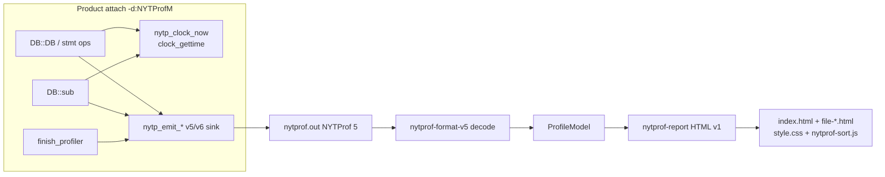
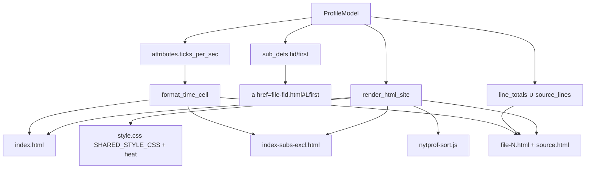

# Complete native report metrics (incl/excl) and operator HTML (DOM/JS v1)

| Field | Value |
|-------|-------|
| **Document title** | Complete native report metrics (incl/excl times) and HTML DOM/JS for Devel::NYTProf modernization |
| **Author** | design-doc-writer (Grok) |
| **Date** | 2026-08-14 |
| **Status** | Draft (revised after review 2026-08-14). **v2 chrome/IA:** see [`docs/OPERATOR_HTML_V2_DESIGN_v0.md`](https://github.com/hilather/nytprof-modernization/blob/main/docs/OPERATOR_HTML_V2_DESIGN_v0.md) and [ADR-0012](https://github.com/hilather/nytprof-modernization/blob/main/docs/adrs/0012-native-operator-html-v2.md). This v1 document remains historical. |
| **Audience** | Senior implementers / coding agents in this repo |
| **Does not supersede** | `docs/PROGRAM_CHARTER.md`, `docs/plan/01_NON_NEGOTIABLES_AND_COMPATIBILITY_CONTRACT.md`, accepted ADRs 0001–0010 (especially **ADR-0003** + Amendment 2026-08-12 **PR-M01 / Q4**), `docs/contracts/R1_RESIDUAL_READINESS_MATRIX_v0.md`, `docs/contracts/REPORT_HTML_RESIDUAL_INVENTORY_v0.md`, `docs/contracts/REPORT_SURFACE_CONTRACT_v0.md`, `docs/contracts/DROP_IN_DOD_v0.md`, `AGENTS.md` |
| **User override (2026-08-14)** | After a Rocky 8 testdrive (`~/Downloads/nytprof-rocky8-demo/html/index.html`) showed **all incl/excl = 0**, **ticks == calls**, empty `file-1.html` source, and MVP-only CSS, the user asked for a **completion program** of live metrics + useful operator HTML. This is an **explicit override of the GA-candidate usefulness bar**, not a silent rewrite of M01/Q4. |
| **Board / program IDs (proposed)** | `METRICS-LIVE-INCL-EXCL`, `METRICS-STMT-ELAPSED`, `METRICS-TICKS-PER-SEC`, `METRICS-SRC-LINE`, `HTML-OP-V1-HEAT-LINKS`, `HTML-OP-V1-SORT-JS`, `ADR-0011-HTML-OP-V1` |

Agents own **tasks**. This document does not freeze v6 wire IDs, flip `collection_default`, flip `engine=auto`, or claim full 6.15 opcode / COMPAT-007 / oracle `nytprofhtml` DOM.

**Successor (2026-08-15):** Native operator HTML **v2** (oracle look/feel/nav, modern JS/CSS, dual-docker lab) is specified in [OPERATOR_HTML_V2_DESIGN_v0.md](https://github.com/hilather/nytprof-modernization/blob/main/docs/OPERATOR_HTML_V2_DESIGN_v0.md) and [ADR-0012](https://github.com/hilather/nytprof-modernization/blob/main/docs/adrs/0012-native-operator-html-v2.md). This v0 design remains the v1 (ADR-0011) live-metrics contract. M01 jquery stays **WAIVE**.

---

## Overview

A live Rocky 8 testdrive (`perl -d:NYTProfM` + product `nytprofhtml` → `nytprof-engine html` → unsigned Rocky 8 `nytprof-cli`) produced a structurally real profile (18 210 `TIME_LINE` events, 986 returns each on `scan_file` / `tokenize` / `classify` / `merge_freq`, call edges present) whose **HTML is not useful**: every inclusive and exclusive time is **0**, statement `ticks` equal visit `calls`, `file-1.html` has an empty source table, subroutine names are not links, and styling is the A01 MVP system-font bordered table. The report crate and model already **render and sum** `incl` / `excl` / `ticks` correctly — they are faithfully displaying zeros and visit counts that the **product collector writes**.

This program has two tracks that must land together enough that a Rocky 8 lab re-run (`scripts/field/rocky8_docker_profile_demo.sh --lab`) shows a useful operator report:

- **Track A — Report metrics (collector + model display scale).** Live attach must write **measured** inclusive/exclusive subroutine times and **elapsed** statement ticks, plus `ticks_per_sec` and (by default) `SRC_LINE` / `SUB_INFO` so existing tables stop being zeros / empty. Do **not** change golden oracle fixtures (`fixtures/v5/default-calls1`) to match a broken writer.
- **Track B — Operator HTML v1 (native report).** Close a **scoped useful subset** of the residual inventory: heat CSS, sub→source links, source pages populated from `line_totals` even before `SRC_LINE`, and small **vanilla** sort JS. This is **not** pixel-identical oracle DOM and **does not ship jquery / tablesorter / floatThead**.

**Waiver honesty (binding):** ADR-0003 Amendment 2026-08-12 (**PR-M01 / Q4**) still **WAIVES** Shared JS (jquery / tablesorter / floatThead) for the **GA-candidate CLOSE gate**. This design does **not** rewrite that amendment in place. Completing operator HTML v1 requires a **new ADR (proposed ADR-0011)** that opens a **new** advertised class (`HTML-OP-V1`) while leaving jquery/tablesorter, Graphviz, treemap, block/sub page modes, and oracle naming **WAIVE**. Until ADR-0011 is accepted, Track B PRs may land as **opt-in / residual-honest MVP depth** (same crate, same flags, docs say “not oracle DOM”) but must not flip inventory rows to “native-ready tablesorter.”

---

## Background & Motivation

### Why this change is needed

The testdrive path is the product operator story: EL8 `perl -d:NYTProfM` writes `NYTProf 5`, `nytprofhtml` dispatches native `nytprof-cli html --out-dir`. Counts already work (G04 attach-MVP: leaf **15** / mid **3** / mid→leaf **15** on `t/workload-calls1.pl`). Times do not. An operator who opens `index.html` reasonably concludes “the profiler is broken.” That is a **D3 tools/report usefulness** failure, not a missing Graphviz page.

### Current state (code, not folklore)

| Layer | What is shipped | What the Rocky 8 report showed |
|-------|-----------------|--------------------------------|
| Product `DB::DB` | `collector/xs/Devel/NYTProfM.pm` `DB` → `DB::emit_time_line(1, $fid, $line \|\| 1)` or `emit_time_block(1, …)` | `ticks == calls` (986/987) — the `1` is a **visit increment**, not elapsed ticks |
| C stmt ops (`blocks=1`) | `product_emit_time_block_for_cop` (`NYTProf.xs` ~511–531) emits `(nytp_ticks)1`. When `PRODUCT_STMT_OPS`, Perl `DB` **returns immediately** | `blocks=1` TIME_BLOCK stays visit-1 unless a follow-up measures it. Lab default is `blocks=0` |
| Slowops PRINT/MATCH | `pp_product_slowop` (`NYTProf.xs` ~690–738) emits `sub_return(..., 0.0, 0.0)` + zero `SUB_CALLERS`. Default `slowops=2` | `CORE::match` / `CORE::print` stay 0 after PR-1; scanner `tokenize` still has a measured Perl `DB::sub` |
| Product `DB::sub` | `@product_sub_stack` holds **plain names**; `$caller = $stack[-1] \|\| 'main::RUNTIME'`; `emit_sub_return($depth, 0.0, 0.0, $called)` and `emit_sub_callers(1, 1, 1, 0.0, …)` | All Perl-sub `incl`/`excl` **0**; caller site hard-coded `fid=1,line=1` |
| Clock | `collector/include/nytp_clock.h` + `collector/src/nytp_clock.c` is a **TEST-003 fake-clock / BASE-003 statement driver** (scripted ticks). There is **no** production `clock_gettime` helper used by `DB::sub` / `DB::DB` | No measured wall/CPU |
| Header attrs | `enable_sink` / `enable_sink_v6` activate the sink; they do **not** emit `ATTRIBUTE ticks_per_sec` (M4 mini harness does, live attach does not) | Report cannot scale ticks → seconds |
| Finalize | `DB::finish_profiler` → `nytp_product_sink_drop()` only. No `write_src_of_files` / `write_sub_line_ranges` analogue | No `SRC_LINE`, no `SUB_INFO` on live profiles |
| Model | `nytprof-model` `ProfileModel` already sums `SUB_RETURN` / `SUB_CALLERS` `incl`/`excl` and A4 `line_totals.ticks` | Faithfully shows zeros / ones |
| HTML | `crates/nytprof-report/src/lib.rs` `render_html_summary` / `render_html_site` / `SHARED_STYLE_CSS`; schemas `docs/schemas/html-*-mvp-v0.md` | MVP tables, zebra/hover, **no** heat, **no** sub→`file-<fid>.html#L<n>` links |
| Source table | `push_source_table` iterates **only** `model.source_lines` | Empty table when no `SRC_LINE`, even if `line_totals` exist |
| Flame | PR-A03 **code + schema shipped** (`html-optional-flame-mvp-v0.md`, `html_optional_flame.rs`, `--flame` default **off**) | Inventory/board text still says A03 **OPEN** — honesty-sync, do not re-implement |
| Waiver | Inventory Shared JS **WAIVE** (PR-M01); ADR-0003 Amendment 2026-08-12 | User now wants useful sort/heat, not jquery |

### Related attach residual (goto / compile-safe start)

**PR-7 landed** (`collector/xs/Devel/NYTProfM.pm`, smoke [`g07_getopt_compile_smoke.sh`](https://github.com/hilather/nytprof-modernization/blob/main/scripts/packaging/g07_getopt_compile_smoke.sh)):

- `$DB::single = 1` is **not** set at `file=` enable. `$^P \|= 0x01\|0x02\|0x20` stay; `INIT` sets `$DB::single` after compile so `use`/`BEGIN` do not run `DB::DB`.
- `DB::sub` uses `goto &$raw` for Exporter / Exporter::Heavy / Getopt:: / `vars::` (and the existing skip set). Do **not** wrap those with `&$raw`.
- Normal workload subs (`main::leaf` / `main::mid` / scanner) still use the hash-stack `&$raw` wrap + `clock_now_ticks`.
- `Time::HiRes` compiles under product `-d:NYTProfM` after PR-7; the live clock remains C `nytp_clock_now` (KD-C).
- Rocky 8 demo still profiles `scripts/field/workloads/minute_text_scanner.pl` (core-only) until ack is retried as a field change.

### Pain points

1. Operator HTML is a lie: ranking by exclusive time is a no-op when every excl is 0.
2. Statement heat is impossible when ticks are visit counts.
3. Empty source pages even when line totals exist (report-side) **and** no `SRC_LINE` (collector-side).
4. Waiver language is honest about jquery but has been read as “do not improve HTML at all.” The user override is **useful operator HTML**, not **oracle clone**.
5. Golden fixtures already have non-zero oracle times. Changing them to match the product writer would be fixture dishonesty (`AGENTS.md`).

---

## Goals & Non-Goals

### Goals

1. **Live measured Perl-sub times.** After `perl -d:NYTProfM` with `NYTPROF file=`, `SUB_RETURN` / `SUB_CALLERS` for **Perl `DB::sub`** frames (`main::leaf`, `main::tokenize`, …) carry **positive** incl/excl such that `excl ≤ incl` and HTML ranking of those **workload** rows is no longer all zeros. **Not claimed in PR-1:** `pp_product_slowop` (`CORE::match` / `CORE::print`) and C stmt-ops remain visit-1 / 0.0 (KD-O).
2. **Live elapsed statement ticks on the Perl `DB::DB` path.** `TIME_LINE` ticks from `DB::emit_attributed_time_line` are **clock deltas** attributed to the **previous** site (BASE-003 / oracle `DB_stmt`), not the constant `1`. `TIME_BLOCK` from `product_emit_time_block_for_cop` is residual until the stmt-ops follow-up.
3. **`ticks_per_sec` ATTRIBUTE** on every product file sink (default **10_000_000** on the `clock_gettime` path, matching 6.15 `TICKS_PER_SEC` when `HAS_CLOCK_GETTIME`). **HTML only** may convert ticks → seconds when the attribute is present (KD-U). Text, CSV, and `report --json` stay integer tick sums.
4. **`SRC_LINE` + `SUB_INFO` at finalize** when `savesrc` is on (**6.15 default is on**: `profile_opts` includes `NYTP_OPTf_SAVESRC`). Set `PL_perldb |= PERLDBf_SAVESRC | PERLDBf_SAVESRC_NOSUBS` like 6.15 (`NYTProf.xs` ~3177–3179) — **not** a guessed `$^P |= 0x400` (that bit is also eval-source / `PERLDBf_SAVESRC_INVALID` on some perls). Walk `product_fid_map` without requiring `HAS_SRC`.
5. **Operator HTML v1:** heat classes on time columns, clickable sub → `file-<fid>.html#L<first>`, source table rows from **union** of `source_lines` and `line_totals`, vanilla column sort on advertised tables. Outdir safety and `--flame` opt-in **unchanged**.
6. **Regression tests** that drive **real** entry points (`perl -d:NYTProfM`, `nytprof-cli html`, Rocky 8 `--lab`). Time assertions use **inequalities / monotonicity / dual-path direction**, not invented tick constants (COMPAT-003).
7. **Docs in the same change:** residual inventory, REPORT_SURFACE, Rocky 8 lab schema, runbook. ADR-0011 for the un-waiver of a **new** class only.

### Non-goals

| Non-goal | Why |
|----------|-----|
| Pixel-identical / byte-identical oracle `nytprofhtml` DOM | Charter + ADR-0003 rejected “close full oracle HTML DOM” |
| Shipping jquery / tablesorter / floatThead / JIT / treemap | Still **WAIVE** (M01/Q4); ADR-0011 does **not** un-waive these |
| Oracle `{safe}-{fid}-line.html` naming | Permanent native `file-<fid>.html` + `source.html` (already WAIVE) |
| Block/sub page modes (`*-block.html` / `*-sub.html`) | Still WAIVE |
| Graphviz `.dot`, `--open`, exact `-d`, `--mergeevals`, oracle footer | Still WAIVE |
| Re-implementing `--flame` | A03 **code is already shipped**; only honesty-sync inventory/board |
| Full 6.15 opcode / `entersub` / XSUB / exception / `leave` / `findcaller` | Residual; not required for lab metrics |
| `goto &$raw` in the **first** metrics PR | Sequenced after metrics; see KD-G |
| Time::HiRes as the clock | Failed under product `-d:NYTProfM` on EL8 |
| Changing `collection_default` or `engine=auto` product defaults | Charter R3/R4; ADR-0005 / ADR-0008 |
| COL-007 C v6 writer completion | OUT-OF-R1 / R2; D1-B EL8 stays v5 |
| Editing golden `fixtures/v5/default-calls1` times to match product | Fixture honesty |
| Putting `crates/` on oracle `PERL5LIB` | Isolation forever |
| Public perf SLOs / “% faster than 6.15” | A09 still WAIVE |
| Profiling ack / Getopt::Long until goto PR | Known residual |
| Measuring C stmt-ops + slowops in PR-1 | Residual **KD-O**; lab `blocks=0` + workload `DB::sub` is enough to un-zero Rocky `main::tokenize` |

---

## Proposed Design

### High-level architecture



The **decode / model / report aggregation path is already correct** for advertised counts and for summing whatever NVs/ticks the stream contains. Track A changes **what the collector writes**. Track B changes **how the report presents** a correct model (links, heat, sort, source-row union, seconds display).

### Track A — Report metrics

#### A.1 Clock source (production, not fake-clock)

**Today:** `nytp_clock.h` is explicitly a **development fake-clock**. Production attach never reads a real clock.

**Ship a production clock next to (not replacing) the fake-clock:**

| Item | Choice |
|------|--------|
| API | `nytp_status nytp_clock_now(nytp_ticks *out)` in `collector/include/nytp_clock.h` + `collector/src/nytp_clock.c` |
| Linux / EL8 / Rocky 8 | `clock_gettime(CLOCK_MONOTONIC, …)` — default, matches 6.15 `HAS_CLOCK_GETTIME` + default `CLOCK_MONOTONIC` intent (wall-independent, does not go backwards across NTP) |
| Scale | `NYTP_TICKS_PER_SEC = 10000000` (100 ns), same as 6.15 `#define TICKS_PER_SEC 10000000` |
| Conversion | `ticks = Δsec * 10_000_000 + Δnsec / 100` |
| `usecputime=1` | **Warn like 6.15, do not croak, do not implement.** 6.15 `enable_profile` (`baseline/6.15/src/NYTProf.xs` ~2979–2980) warns `The NYTProf usecputime option has been removed (try using clock=N if possible)` and continues. Product already accepts the known key and ignores it — keep that plus the warn. Fail-closed stays for **unknown** NYTPROF keys and **invalid** `clock=` ids only. |
| `clock=N` | **Optional after PR-1.** PR-1 default is `CLOCK_MONOTONIC` (enough for DROP_IN “work default clock”). Later: parse `clockid_t` when `HAS_CLOCK_GETTIME`; invalid id fail-closed. Platform matrix residual stays residual. |
| macOS CI | `clock_gettime` exists on modern Darwin; if a host lacks it, `mach_absolute_time` fallback with the same 10 M scale (oracle `#ifdef HAS_MACH_TIME`). Not a Rocky gate. |
| Perl clock | **Do not** call `Time::HiRes`. One XSUB only: `UV DB::clock_now_ticks()` (see below). Statement last-site is **not** computed in Perl (KD-L). |
| Fake-clock | Unchanged. TEST-003 / M4 mini / `nytp_stmt_driver` stay scripted. Production attach must not enable fake-clock. |

**XS surface (binding — do not mix status and ticks on one `int` RETVAL):**

```
# collector/xs/NYTProf.xs — PR-1

UV
clock_now_ticks()
    CODE:
        nytp_ticks ticks = 0;
        nytp_status st = nytp_clock_now(&ticks);
        if (st != NYTP_OK)
            croak("DB::clock_now_ticks: nytp_clock_now status=%d", (int)st);
        /* nytp_ticks is int64_t; UV is wide enough on 64-bit EL8.
         * Negative / > UV_MAX: croak (should not happen for CLOCK_MONOTONIC). */
        if (ticks < 0)
            croak("DB::clock_now_ticks: negative tick reading");
        RETVAL = (UV)ticks;
    OUTPUT:
        RETVAL

int
emit_attributed_time_line(fid, line)
    UV fid
    UV line
    /* XS-held last_abs / last_fid / last_line (KD-L).
     * Seed on first call (no emit). Else emit TIME_LINE(now-last, last_fid, last_line)
     * then update last. now < last → NYTP_ERR_OVERFLOW (do not consume).
     * RETVAL = nytp_status. */

int
flush_last_site()
    /* Emit leftover interval to last site while sink is ACTIVE.
     * No-op if never seeded. Used by finish_profiler before begin_finalize. */
```

**Bound split (KD-L — not “recommended”):**

| Path | PR-1 owner | Why |
|------|------------|-----|
| **Statement last-site** | **XS** (`last_abs`, `last_fid`, `last_line` next to `product_sink`) + `DB::emit_attributed_time_line` / `DB::flush_last_site` | `finish_profiler` is XS (`nytp_product_sink_drop`). PR-3 must flush the same last-site while ACTIVE. Perl lexicals would be invisible to that XS flush. |
| **Sub incl/excl** | **Perl** `DB::sub` + `UV DB::clock_now_ticks()` + hash frames on `@product_sub_stack` (A.3) | Small reviewable `NYTProfM.pm` change; caller names stay strings. |

Do **not** also keep a Perl last-site. Do **not** ship `int clock_now()` whose RETVAL is `nytp_status`. A later PR may move the Perl sub-stack into XS if `light_bench.sh` shows hook overhead dominates (not certification).

**PR-1 does not** call `emit_attributed_time_line` from `pp_product_stmt` / `product_emit_time_block_for_cop` (KD-O).

#### A.2 Statement ticks (BASE-003)

Oracle `DB_stmt` (`baseline/6.15/src/NYTProf.xs` ~1558):

```text
on statement entry:
  now = get_time_of_day()
  elapsed = now - start_time          # previous statement's exclusive interval
  write TIME_LINE/TIME_BLOCK(elapsed, last_fid, last_line, …)
  last_* = current cop
  start_time = now
```

Product today (`NYTProfM.pm` `sub DB`):

```perl
DB::emit_time_line( 1, $fid, $line || 1 );
```

**Change (Perl `DB` only in PR-1):** `sub DB` calls `DB::emit_attributed_time_line($fid, $line || 1)` instead of `emit_time_line(1, …)`. XS emits the **attributed delta** to the **previous** site, seeds on first hit, fail-closed on `now < last` (`NYTP_ERR_OVERFLOW`, already the fake-clock rule).

**Not in PR-1 (KD-O):** `product_emit_time_block_for_cop` still writes `(nytp_ticks)1`. When `install_product_stmt_ops()` succeeds, Perl `DB` returns immediately (`return if $PRODUCT_STMT_OPS`), so A.2 does **not** measure `blocks=1`. Same for `pp_product_slowop` zeros. Follow-up (PR-8) wires those writers to the same XS clock / last-site / excl rule.

**Discount:** 6.15 subtracts statement-profiler overhead from inclusive sub time via `cumulative_overhead_ticks`. Product now does the same for last-site close-to-seed (`product_overhead_ticks` on opcode `incr_*` and wrap `wrap_pop`). That is not a `DISCOUNT` tag; exclusive stays `excl = incl − called_sub_ticks`. Optional later: `DB::emit_discount` around leave/continuation (A3 multiplicity already tested on oracle fixtures). Do **not** invent a new exclusive-time policy.

**Overhead honesty:** Perl `DB::DB` is heavier than 6.15 opcode redirection. Times will be **larger** than oracle on the same script. That is acceptable: COMPAT-003 does not freeze tick strings; tests check **direction** (hot loop ticks ≫ setup ticks; `tokenize` excl > 0 on the lab scanner). Document residual: not 6.15 opcode timing.

#### A.3 Inclusive / exclusive subroutine times

Oracle (`incr_sub_inclusive_time`):

```text
incl_subr_ticks = clock(now) - clock(enter) - overhead_since_enter
excl_subr_ticks = incl_subr_ticks - (cumulative_subr_ticks - initial_subr_ticks)
cumulative_subr_ticks += excl_subr_ticks
```

Product today hard-codes `0.0, 0.0`.

**Perl-stack algorithm (binding). Today `@product_sub_stack` is an array of plain name strings.** PR-1 replaces each frame with a hash. **Capture the caller name before push** or dump/report will show `HASH(0x…)` and break g04 `mid→leaf` identity.

```perl
# After skip checks / goto &$raw skip path (unchanged).
# Caller name MUST be taken from the previous frame's {name}, never
# stringify the hash, never use the post-push top.
my $caller =
    @product_sub_stack ? $product_sub_stack[-1]{name} : 'main::RUNTIME';
my ( undef, $cfile, $cline ) = caller(0);
my $cfid = DB::fid_for_filename($cfile);

push @product_sub_stack, {
    name       => $called,
    t0         => DB::clock_now_ticks(),   # UV ticks, not status
    child_excl => 0,
};

# ... existing &$raw / eval / wantarray ...

my $frame = pop @product_sub_stack;
my $depth = @product_sub_stack + 1;        # after pop, same as today
my $incl  = DB::clock_now_ticks() - $frame->{t0};
$incl = 0 if $incl < 0;                    # fail-soft one sample
my $excl  = $incl - $frame->{child_excl};
$excl = 0 if $excl < 0;
if (@product_sub_stack) {
    $product_sub_stack[-1]{child_excl} += $incl;   # child inclusive
}
DB::emit_sub_return( $depth, $incl, $excl, $called );
DB::emit_sub_callers( $cfid, $cline || 1, 1, $incl, $excl, 0, 0,
    $called, $caller );
```

**Regression (required):** live `t/workload-calls1.pl` dump/report still has caller `main::mid` → called `main::leaf` (count **15**), **not** `HASH(`. Same for Rocky `main::scan_file` → `main::tokenize` (or whatever the stack is) — names must stay identifiers.

**Units (OI-003-02 still open):** 6.15 `NYTP_write_call_return` writes **ticks as NV** for `SUB_RETURN` / `SUB_CALLERS` `incl`/`excl` (not seconds). Product `emit_sub_return` already takes `NV incl, NV excl` and passes them to `nytp_emit_sub_return`. **Write integer ticks as NV** (same as M4 mini `100.0, 40.0`). Do **not** write seconds unless a later COMPAT-003 close says otherwise. Report `format_ticks` already prints integral NVs as integers.

**Caller site:** replace hard-coded `(1, 1)` with `caller(0)` → `DB::fid_for_filename($cfile), $cline || 1` (already done for `calls>=2` `emit_sub_entry`).

**Recursion / reci:** first slice may leave `reci=0`, `rec_depth=0`. Residual vs 6.15 recursive outer-most-incl rule (`called_cv_depth <= 1`). Document it.

**XSUB / exception / `goto`:** still residual (DROP_IN_DOD `calls` row). `eval { &$raw }` already captures exceptions and still emits return/callers before re-die — keep that.

#### A.4 `ticks_per_sec` and other header attributes

Today `enable_sink` / `enable_sink_v6` do `nytp_product_sink_hold(path)` (creates **OPEN**) then **immediately** `nytp_sink_activate` (`NYTProf.xs` ~856–861, ~925). The XS comment already notes: “enable_sink() leaves ACTIVE, so recreate at the same path in OPEN” (for M4). M4 emits ATTRIBUTE in OPEN then activate (`nytp_clock.c` ~357–361). ATTRIBUTE is also legal in ACTIVE (`nytp_sink_can_emit`), but a mid-stream ATTRIBUTE is not a 6.15-style header.

**PR-1 splits `enable_sink` / `enable_sink_v6` (binding order):**

```text
nytp_product_sink_hold(path);          /* OPEN; already implemented */
/* sink must still be OPEN here — do not activate yet */
nytp_emit_attribute(..., "ticks_per_sec", "10000000");
/* clock_id ATTRIBUTE optional — omit in PR-1 (clock=N later) */
nytp_emit_option(..., "calls",  "<n>");
nytp_emit_option(..., "blocks", "<0|1>");
/* savesrc option may wait for PR-3; harmless if emitted early */
nytp_emit_pid_start(..., getpid(), getppid(), 0.0);  /* pair with PID_END in the same PR */
nytp_sink_activate(product_sink);      /* OPEN → ACTIVE */
```

Same order for `enable_sink_v6`. Do **not** emit attrs after activate in PR-1.

**KD-P — PID pair in one PR:** COMPAT-010 (`ProfileModel::stream_incompleteness_reasons`) treats `PID_START` without `PID_END` as `"missing PID_END after PID_START"`; `nytprof-cli verify` fail-closes; Rocky `--lab` requires `^OK:` in `meta/verify.txt`. Today live attach emits **neither**, so verify is green. **PR-1 emits both:** `PID_START` here and `PID_END` in `finish_profiler` after `flush_last_site` (legal in ACTIVE). **Do not** ship `PID_START` in PR-1 and leave `PID_END` for PR-3. PR-3 only *moves* `PID_END` to after `begin_finalize` + SRC/SUB_INFO (still one pair).

`ProfileModel.attributes` already ingests `ATTRIBUTE`. JSON surfaces already expose `attribute_ticks_per_sec` (**JSON-META-FILES-MVP**). Live-attach tests should assert the key is present and equals `10000000` on the default Linux clock (exact **attribute string**, not tick totals). JSON numeric A5 fields stay **ticks**.

#### A.5 `SRC_LINE` / `SUB_INFO` at finalize (PR-3 — implementable)

6.15 `close_output_file` (`baseline/6.15/src/NYTProf.xs` ~1867–1888) writes `write_src_of_files` then `write_sub_line_ranges` then `write_sub_callers` then `PID_END`. Algorithms to **port**, not folklore:

- `write_src_of_files` ~3707–3768 — `GvAV(gv_fetchfile_flags(...))` per fid
- `write_sub_line_ranges` ~3422–3593 — walk `GvHV(PL_DBsub)` via **`parse_DBsub_value`** (~3383) (`filename:first-last`)
- `parse_DBsub_value` prototype ~460

Product `finish_profiler` today is only `nytp_product_sink_drop()` + `product_fid_reset()`. Known files live in a **private** `static HV *product_fid_map` in `NYTProf.xs` (~69, ~105–136). `NEW_FID` flags are **only** `NYTP_FIDf_VIA_STMT` (~131–132). There is no public fid iterator.

**Sink state (`nytp_sink_can_emit`, `collector/src/nytp_sink.c` ~73–95):**

| Kind | OPEN / ACTIVE | FINALIZING |
|------|---------------|------------|
| `TIME_LINE` / `TIME_BLOCK` / `SUB_RETURN` / **`NEW_FID`** | yes | **no** |
| `SRC_LINE` / `SUB_INFO` / `SUB_CALLERS` / `PID_END` | yes | **yes** |

`NEW_FID` is **not** legal in FINALIZING (`nytp_sink_can_emit` default branch). M4 already does `begin_finalize` then SRC/SUB_INFO (`nytp_clock.c` ~414). If PR-3 finalizes **before** the last `TIME_LINE`, that flush fail-closes.

**PR-1 `finish_profiler` (binding, before SRC_LINE exists):**

1. **`flush_last_site()` while ACTIVE**
2. **`nytp_emit_pid_end`** for the pid started at enable (still ACTIVE — allowed)
3. Existing `nytp_product_sink_drop()` / `product_fid_reset()`

This keeps COMPAT-010 / Rocky `verify` `^OK:` green without PR-3.

**PR-3 `finish_profiler` order (binding — inserts finalize metadata before the PR-1 `PID_END`):**

1. **`flush_last_site()` while ACTIVE** — same XS last-site as PR-1 (KD-L). Emits leftover `TIME_LINE` to the last site. No-op if never seeded.
2. **Optional ACTIVE `NEW_FID`s** — only if a future slice must publish a file that never ran a statement. **Default: do not create.** 6.15 does not create here.
3. **`nytp_sink_begin_finalize(product_sink)`** — ACTIVE → FINALIZING. **No `NEW_FID` after this.**
4. **`SRC_LINE` (if `savesrc`, default 1):** walk **`product_fid_map`** in this same XS file (`hv_iterinit` / `hv_iternextsv`). Key = filename, value = fid. For each entry, `src_av = GvAV(gv_fetchfile_flags(name, …))`. Emit `nytp_emit_src_line` for each line. **Do not** require `NYTP_FIDf_HAS_SRC` or `NYTP_FIDf_SAVE_SRC`.
5. **`SUB_INFO` (lookup-only):** walk `GvHV(PL_DBsub)` (`%DB::sub`). Values are `filename:first-last`. **Port or cite `parse_DBsub_value`** (`baseline/6.15/src/NYTProf.xs` ~3383, used at ~3563). Skip illegal `/:[^0]-0$/` rows as 6.15 does (~3460–3463). Map filename → fid with a **no-create** helper (`product_fid_lookup` / `hv_fetch` on `product_fid_map` only). **Do not** call `product_fid_for_filename` — that always `nytp_emit_new_fid` on first-seen names (`NYTProf.xs` ~129–133) and would fail-closed in FINALIZING. If lookup returns 0, **`continue`** (skip that `%DB::sub` row). This matches 6.15 `get_file_id(..., 0)` + skip (`write_sub_line_ranges` ~3579–3584: “no point in writing subs in files we've not profiled”). Then `nytp_emit_sub_info(fid, first, last, name)`.
6. **`PID_END`** (pair already introduced in PR-1).
7. Existing `nytp_product_sink_drop()` / `product_fid_reset()`.

**`PL_perldb` / `$^P` (do not guess 0x400):** when `savesrc=1` at `file=` time, match 6.15 (`NYTProf.xs` ~3177–3179):

```c
PL_perldb |= PERLDBf_SAVESRC | PERLDBf_SAVESRC_NOSUBS;
```

Keep already-set `0x01` / `0x02` / `0x20`. **Do not** `$^P |= 0x400` from perlvar prose — on some perls that bit is eval-source / `PERLDBf_SAVESRC_INVALID`, and it is the High risk already flagged for Getopt compiles.

**`savesrc=0`:** skip file `SRC_LINE` (6.15 still saves `-e` / STDIN / evals — residual OK to skip evals in PR-3).

#### A.6 Attach timing sequence

```mermaid
sequenceDiagram
    participant P as perl -d:NYTProfM
    participant PM as NYTProfM.pm
    participant XS as NYTProf.xs
    participant CLK as nytp_clock_now
    participant S as nytp v5 sink
    P->>PM: load; init_profiler (in-memory)
    P->>PM: NYTPROF file=path
    PM->>XS: enable_sink(path)
    XS->>S: hold OPEN
    XS->>S: ATTRIBUTE ticks_per_sec + OPTION + PID_START
    XS->>S: activate ACTIVE
    Note over XS: PR-1 finish emits PID_END after flush same PR
    Note over XS: PR-3 adds SAVESRC+NOSUBS at file=
    Note over PM: PR-7 INIT sets $DB::single after compile
    P->>PM: DB::DB (statement)
    PM->>XS: emit_attributed_time_line(fid,line)
    XS->>CLK: now
    XS->>S: TIME_LINE(delta, last_fid, last_line)
    P->>PM: DB::sub enter
    PM->>XS: clock_now_ticks UV
    PM->>P: &$raw (later: goto &$raw)
    P->>PM: DB::sub leave
    PM->>XS: clock_now_ticks UV
    PM->>XS: emit_sub_return(depth, incl, excl, name)
    PM->>XS: emit_sub_callers(cfid,cline,1,incl,excl,called,caller_name)
    P->>PM: END
    PM->>XS: finish_profiler
    XS->>S: flush_last_site TIME_LINE still ACTIVE
    Note over XS: PR-3 only after flush: begin_finalize then SRC_LINE SUB_INFO
    Note over XS: SUB_INFO lookup-only no NEW_FID after finalize
    XS->>S: PID_END
    XS->>S: close
```

#### A.7 Model / report display (HTML-only seconds)

`ProfileModel` already sums incl/excl/ticks. Display scale is **HTML-only** (KD-U):

| Surface | PR-2 behavior |
|---------|----------------|
| HTML time cells | `format_time_cell(ticks, ticks_per_sec)` → seconds (6.15 `fmt_time` spirit, not byte-identical). Raw ticks in `title=` |
| Text report | **unchanged** `format_ticks` integer tick sums |
| CSV (`name,returns,incl,excl`) | **unchanged** integer ticks |
| `report --json` A5 fields | **unchanged** integer ticks. May *add* greppable `attribute_ticks_per_sec` already present; do **not** rewrite `subs.*.incl` to seconds |

- Read `attributes["ticks_per_sec"]` (parse unsigned; missing/0 → HTML also shows raw ticks).
- **Do not** store seconds in the model. COMPAT-003: integer ticks on the model path.

Oracle fixtures (`default-calls1`) already have non-zero times and `ticks_per_sec=10000000`. Extend `html_shared_css.rs` / `html_subs_excl.rs` for time-cell **shape** (`title=`, a seconds-ish cell), **not** `g04` JSON numeric fields.

### Track B — Operator HTML v1

#### B.1 What “useful” means (acceptance picture)

A Rocky 8 lab re-run (`--lab`, ~3 s scanner) must show:

| Check | Pass |
|-------|------|
| `html/index.html` `table.subs` | **Workload** `main::tokenize` (and `scan_file` / `classify` / `merge_freq`) have **incl > 0** and **excl > 0**. Do **not** require every incl column (incl. `CORE::match`) to be non-zero (KD-O) |
| Same table | Sub name is an `<a href="file-<fid>.html#L<n>">` when `sub_defs` has that name (`n` from `model.sub_def`, not a fixture constant) |
| `html/file-<fid>.html` | Non-empty `table.source` from **line_totals union** (can pass **before** SRC_LINE). After PR-3, source text fills; before that, `—` placeholders. Workload `TIME_LINE` ticks **not** identically 1-per-call |
| `html/style.css` | Heat classes **`heat-hot` / `heat-high` / `heat-mid` / `heat-low`** (not oracle `c0`–`c3`) |
| Sort | Clicking a numeric `<th>` reorders rows (vanilla JS); no jquery in the tree |
| Outdir | `validate_html_out_dir` still rejects `..` / NUL / empty |
| Flame | Still **off** unless `--flame` |

#### B.2 Residual inventory classification (this program)

Every class from `docs/contracts/REPORT_HTML_RESIDUAL_INVENTORY_v0.md`. **This table does not silently flip ADR-0003 WAIVE rows.** “Implement now” means **native operator v1**, advertised only after ADR-0011 (or as residual-honest MVP depth if ADR-0011 is deferred).

| Artifact class | ADR-0003 now | This program | Rationale |
|----------------|--------------|--------------|-----------|
| Index / home page | closed (MVP) A01 | **Deepen now** | Heat + links + seconds; keep structure markers |
| Full sub index (`index-subs-excl.html`) | closed (MVP) A02 | **Deepen now** | Same heat + links + sort |
| Exclusive-time ranking | closed (MVP) A02 | **Deepen now** | Ranking becomes meaningful once excl ≠ 0 |
| Per-file / line source pages | WAIVE naming | **Deepen now** (keep native names) | Populate rows; `#Ln` anchors; no oracle filenames |
| Block-level report pages | WAIVE page mode | **later / still waive** | Keep A4b table only |
| Sub-level report pages | WAIVE | **still waive** | |
| Shared CSS | closed (MVP) A01 | **Deepen now** | Heat + time columns; still not `get_css()` byte parity |
| Shared JS jquery/tablesorter/floatThead | **WAIVE (M01)** | **still waive** | Do **not** vendor jquery |
| **Native sort JS (new class)** | (does not exist) | **Implement now** (ADR-0011) | Small vanilla `nytprof-sort.js`; new inventory row |
| JIT / treemap / treemap page | WAIVE | **still waive** | |
| Flame SVG + stack inputs | CLOSE A03 (code shipped; docs say OPEN) | **Honesty-sync only** | Keep `--flame` opt-in; flip inventory to closed (MVP) |
| Graphviz `.dot` (all three) | WAIVE | **still waive** | |
| Call-edges table | WAIVE oracle chrome | **Deepen now** (counts already ready) | Heat + sort; not oracle widgets |
| Subroutine returns table | WAIVE oracle chrome | **Deepen now** | Links + heat + sort |
| Source line table (A4) | WAIVE oracle DOM | **Deepen now** | Union source+totals; heat on ticks |
| A4b block_line totals | WAIVE beyond MVP | **later** | Leave table as-is |
| Multi-file site publish | done | **no regress** | Atomic + safety |
| Single-file HTML | N/A | **Deepen** | Inline CSS **and** optional inline sort JS (self-contained) |
| Browser `--open` | WAIVE | **still waive** | |
| Delete `-d` | WAIVE | **still waive** | |
| `--mergeevals` | WAIVE | **still waive** | |
| Footer / branding | WAIVE | **later (cheap)** | Optional one-line native version; not oracle footer |

#### B.3 HTML site generation



#### B.4 CSS (heat + time columns)

Extend `SHARED_STYLE_CSS` in `crates/nytprof-report/src/lib.rs` (single source of truth; multi-file `style.css` + single-file inline stay identical):

- Keep current system font, borders, zebra, hover, `td.num`.
- Add heat classes inspired by oracle `determine_severity` **but computed in Rust**, not copied CSS-from-`get_css()`:

| Class (binding) | Meaning | Suggested color |
|-----------------|---------|-----------------|
| `heat-low` | lowest quartile | cool green-gray |
| `heat-mid` | second quartile | amber |
| `heat-high` | third quartile | orange |
| `heat-hot` | highest quartile | red |

**Not** oracle `c0`–`c3` class names (`c0` is hottest in `nytprofhtml` `determine_severity`). Native v1 uses **quartile rank** within each table on `ticks` or `excl` (no extra IR, not oracle MAD). Tests and `SHARED_STYLE_CSS` use only these four names.

- Source line highlight: `tr.heat-hot` (etc.) / `td.src-line` background from the same class.
- `th[data-sort]` cursor pointer; `th.sort-asc` / `th.sort-desc` indicators via CSS `::after` (no `js/asc.png`).

Do **not** import oracle `style.css` or `js/style-tablesorter.css`.

#### B.5 Sub → source linking

`push_subs_table`, `push_subs_excl_table`, `push_top_exclusive_table`, `push_call_edges_table`, `push_sub_defs_table`:

- If `model.sub_defs.get(name)` → `href="file-{fid}.html#L{first_line}"` (multi-file) or `href="#L{first_line}"` / `#src-{fid}-{line}` (single-file).
- `id="L{line}"` on each source `<tr>`.
- Called/caller names in edges: link when defs exist.
- Always `escape_html` on names; hrefs are constructed from integers + constant prefixes (no raw path in href).

If `sub_defs` is empty (live attach **before** A.5 lands), names stay plain text — Track A PR-3 unblocks links.

#### B.6 Source table union (report-side, can land before SRC_LINE)

Change `push_source_table` to iterate the **sorted union** of:

- lines in `source_lines` for that fid, and
- lines in `line_totals` / `block_line_totals` for that fid.

Missing source text → `—` (em dash, escaped). This alone fixes “empty `file-1.html`” on today’s live profiles that already have `line_totals`.

**PR order (KD-S):** land this union + `#Ln` anchors in the **first report PR (PR-2)**, in parallel with PR-1. Do **not** wait for collector SRC_LINE (PR-3). SUB_INFO-backed `<a href>` stays in PR-4 (depends on PR-3).

#### B.7 Sort JS strategy (KD-J)

| Decision | Vanilla `nytprof-sort.js` (~2–4 KB), no jquery |
|----------|------------------------------------------------|
| Why not jquery/tablesorter | M01/Q4 WAIVE; XSS/supply-chain; large assets; ADR-0003 rejected full DOM close |
| Why not “no JS” | User override: tables must be sortable for a useful operator report |
| Load | Multi-file: sibling `nytprof-sort.js` + `<script src="nytprof-sort.js" defer></script>` on pages with tables. Single-file: inline the same source in one `<script>` (self-contained policy, parallel to CSS). |
| Behavior | Event delegation on `table.sortable thead th[data-sort]`; parse `data-sort-value` (numeric ticks) falling back to cell text; toggle asc/desc; stable-ish by original index. |
| CSP / XSS | No `innerHTML` of profile data; reorder existing `<tr>` nodes only. Script is a static constant in the crate (like `SHARED_STYLE_CSS`). |
| Tests | CLI `--out-dir` writes the file; HTML contains `table.subs sortable` and `data-sort-value`; unit test that the JS file is non-empty and contains a greppable `nytprofSortInit` / `data-sort`. No browser in CI. |

**ADR-0011** adds inventory class **Native sort JS** (not “Shared JS jquery”) as **CLOSE** via the Track B JS PR. jquery row stays **WAIVE**.

#### B.8 Flame / outdir

- `--flame` remains **opt-in**, default off (`HtmlRenderOptions::flame`, `html-optional-flame-mvp-v0.md`).
- Honesty-sync: inventory flame rows → **closed (MVP)** if tests already green; do not rebuild SVG.
- `validate_html_out_dir` / atomic publish: add `nytprof-sort.js` to the same temp-then-rename set. Reject `..` still.

---

## API / Interface Changes

### Collector / XS (new or changed)

| Symbol | Change |
|--------|--------|
| `nytp_clock_now` / `NYTP_TICKS_PER_SEC` | New production clock in `nytp_clock.h` / `nytp_clock.c` |
| `UV DB::clock_now_ticks()` | New XS; croaks on `nytp_clock_now` failure or negative ticks. **Not** `int` status RETVAL |
| `DB::emit_attributed_time_line` / `DB::flush_last_site` | New XS; **XS-held** last-site (KD-L) |
| Perl `DB::DB` | Call `emit_attributed_time_line` (PR-1) |
| C `product_emit_time_block_for_cop` / `pp_product_slowop` | **Unchanged in PR-1** (still visit-1 / 0.0). Follow-up PR-8 |
| `DB::sub` | Hash frames; `$caller = $stack[-1]{name}` **before** push; `UV` ticks; real caller fid/line |
| `enable_sink` / `enable_sink_v6` | **Split:** hold (OPEN) → attrs/options/`PID_START` → activate. **`PID_END` in the same PR** (PR-1 `finish_profiler`) |
| `finish_profiler` | **PR-1:** `flush_last_site` (ACTIVE) → `PID_END` → drop. **PR-3:** insert `begin_finalize` + SRC_LINE + lookup-only SUB_INFO **before** `PID_END`. No `NEW_FID` after finalize |
| `product_fid_lookup` | New no-create helper: `hv_fetch` on `product_fid_map` only; return 0 if missing. **Never** call `product_fid_for_filename` from FINALIZING |
| `PL_perldb` | PR-3: `PERLDBf_SAVESRC \| PERLDBf_SAVESRC_NOSUBS` (not `$^P \|= 0x400`) |
| `savesrc` option | Honor 0/1 (default 1, matching 6.15 `NYTP_OPTf_SAVESRC`) |

**No change** to `nytp_emit_sub_return` / `nytp_emit_time_line` **signatures** — they already accept real ticks/NVs. Tests in `collector/t/test_sink_api.c` already pass non-zero times.

### Report crate

```rust
// crates/nytprof-report/src/lib.rs — proposed additions
pub const SHARED_SORT_JS: &str = "/* nytprof-report vanilla sort (not jquery) */...";
pub const SORT_JS_FILENAME: &str = "nytprof-sort.js";

pub struct HtmlSite {
    // existing fields...
    pub sort_js: String,
    pub sort_js_filename: String,
}

fn format_time_cell(ticks: f64, ticks_per_sec: Option<u64>) -> String; // HTML only
fn heat_class(value: f64, ranks: &HeatScale) -> &'static str; // "heat-hot"|"heat-high"|"heat-mid"|"heat-low"
```

CLI: **no new required flags**. Optional later `--no-sort-js` is unnecessary for v1 (JS is tiny; single-file inlines it). Do **not** add `--jquery`.

### Perl facade / `nytprofhtml`

Already dispatches native (`I03-DIST-SCRIPTS`). No engine default flip. Testdrive RPM already overwrites `/usr/bin/nytprofhtml`.

### Capability JSON

Do **not** add `tablesorter: true`. Optional honest key later: `html_operator_v1: true` only after ADR-0011 + tests. Until then, do not claim new capability keys (stack-merge lesson: only add keys tests assert).

---

## Data Model Changes

| Store | Change | Migration |
|-------|--------|-----------|
| v5/v6 wire | **None.** Same `TIME_LINE` / `SUB_RETURN` / `SUB_CALLERS` / `SRC_LINE` / `ATTRIBUTE` tags | Existing decoders |
| `ProfileModel` | **None required** for sums. Optional helper `fn ticks_per_sec(&self) -> Option<u64>` parsing `attributes` | Pure read |
| Golden fixtures | **Do not change** `fixtures/v5/default-calls1` (already non-zero oracle times + SRC_LINE) | New **live-attach** evidence under `collector/build/` or temp dirs only |
| HTML site files | Add `nytprof-sort.js`; extend `style.css` body | Atomic publish already replaces whole tree |

No schema migration of on-disk profiles. Old product profiles with zero times remain valid; reports will still show zeros (honest).

---

## Key Decisions

| ID | Decision | Rationale |
|----|----------|-----------|
| **KD-W — Waiver language** | Do **not** edit ADR-0003 Amendment 2026-08-12 to pretend M01 never waived jquery. Land **ADR-0011** that (1) records the 2026-08-14 user override, (2) **CLOSE**s a new class **Native operator HTML v1** (heat CSS + vanilla sort + sub→source links + seconds display), (3) **leaves** jquery/tablesorter/floatThead/Graphviz/treemap/block-sub pages **WAIVE**. | ADR-0003 says superseding a WAIVE requires a new ADR. Silent rewrite is forbidden. User asked for useful HTML, not oracle clone. |
| **KD-C — Clock** | Production `clock_gettime(CLOCK_MONOTONIC)` at 10 M ticks/s via C `nytp_clock_now`. **No Time::HiRes.** `usecputime`: **warn like 6.15, do not croak, do not implement.** `clock=N` optional after PR-1. | Matches 6.15 Linux path and 6.15 warn-and-continue; Time::HiRes failed under product `-d:NYTProfM` on EL8; fake-clock stays test-only. |
| **KD-U — Units** | Write **integer ticks as NV** on `SUB_RETURN` / `SUB_CALLERS`. Convert to seconds **only in HTML** (`format_time_cell` + `title=` raw ticks). Text, CSV, and `report --json` stay integer tick sums. | COMPAT-003 / OI-003-02; shipped greppable A5/CSV cells are ticks; rewriting them would break smokes. |
| **KD-L — Last-site** | **XS-held** `last_abs` / `last_fid` / `last_line` from PR-1. Perl `DB` calls `emit_attributed_time_line`; `finish_profiler` calls `flush_last_site` **before** `begin_finalize`. No Perl last-site copy. | PR-3 flush is XS; a Perl-only last-site would be invisible. One owner avoids a second last-site. |
| **KD-P — PID pair** | **PR-1 emits both** `PID_START` (enable) and `PID_END` (`finish_profiler` after flush). PR-3 does not introduce the pair; it only inserts SRC/SUB_INFO before the existing `PID_END`. | COMPAT-010 + Rocky `verify` `^OK:` go red if `PID_START` lands without `PID_END`. Deferring both to PR-3 is the rejected alternative (would leave PR-1 header-only of attrs, also valid, but we want process bookends with the clock slice). |
| **KD-N — No NEW_FID after finalize** | After `begin_finalize`, SUB_INFO uses **lookup-only** `product_fid_lookup`. Skip `%DB::sub` rows with no existing fid. Same as 6.15 `get_file_id(..., 0)` + `continue` (~3579–3584). If a fid must be created, emit `NEW_FID` **while ACTIVE**. | `nytp_sink_can_emit` rejects `NEW_FID` in FINALIZING; `product_fid_for_filename` always creates. |
| **KD-O — Other writers** | PR-1 measures **Perl `DB::DB` + `DB::sub` only**. `product_emit_time_block_for_cop` and `pp_product_slowop` stay visit-1 / 0.0 until PR-8. Rocky / g04 assert **workload** subs (`main::leaf` / `main::tokenize`), not every incl column. | Stmt ops bypass Perl `DB` when installed; scanner regex still has a measured `tokenize` `DB::sub`. Over-claiming “all zeros gone” would fail on `CORE::match`. |
| **KD-E — Exclusive** | `excl = incl − Σ child inclusive` on the Perl hash stack. Capture `$caller = $stack[-1]{name}` **before** push; `$depth` after pop; credit parent with child **incl** after pop. 3-level smoke [`g14_nested_excl_smoke.sh`](https://github.com/hilather/nytprof-modernization/blob/main/scripts/packaging/g14_nested_excl_smoke.sh). | Crediting child *excl* leaked grandchildren into the parent. |
| **KD-G — goto / compile-safe** | **PR-7 landed.** Delay `$DB::single=1` until `INIT`; `goto &$raw` for Exporter / Getopt / `vars`. Do **not** convert the entire hook to goto-only (no leavesub ⇒ lose incl). Rocky demo still uses the core-only scanner until ack is retried. | Host Perl 5.38 reproduced the EL8 `$VERSION` abort; `g07_getopt_compile_smoke.sh` is the real entry point. |
| **KD-J — JS** | Vanilla `nytprof-sort.js` only. **Never** vendor jquery/tablesorter. | User wants sort; M01 still waives jquery; smaller XSS surface; greppable static constant. |
| **KD-H — Heat** | Quartile rank in Rust. CSS class names **`heat-hot` / `heat-high` / `heat-mid` / `heat-low` only** — **not** oracle `c0`–`c3`. | Tests/`SHARED_STYLE_CSS` need one set; `c0` hottest in oracle would confuse greps. |
| **KD-S — Source rows** | Union `source_lines ∪ line_totals` in `push_source_table` in **PR-2** (parallel with PR-1), **before** collector SRC_LINE. | Fixes empty `file-1.html` as soon as reports are touched; SRC_LINE still needed for text. |
| **KD-F — Flame** | Do not re-implement. Honesty-sync A03 as closed (MVP) opt-in. | Code + tests already in tree. |
| **KD-T — Tests** | Live times: inequalities + monotonicity + “not all zero” + “ticks ≠ calls on a known-busy sub.” Counts stay exact 15/3/15 on **oracle fixtures**. Never rewrite goldens. | COMPAT-003; `AGENTS.md` fixture honesty. |
| **KD-D — Defaults** | No `collection_default` / `engine=auto` flip. Testdrive `nytprofhtml` already native. | Charter R3/R4. |
| **KD-A — ADR gate vs implement** | Track A (metrics) needs **no** ADR (collector completeness under existing D1/D3). Track B JS/heat advertisement needs ADR-0011 before inventory says “native-ready sort.” Implementation may proceed behind residual-honest docs if ADR-0011 is queued in the same stack. | Metrics are a bugfix of hardcoded zeros; JS is a waived-class policy change. |

---

## Alternatives Considered

### 1. Clock source

| Alternative | Correctness | Perf | EL8 risk | Verdict |
|-------------|-------------|------|----------|---------|
| **A. C `clock_gettime` (chosen)** | Matches 6.15 Linux | ~ns, no Perl ENTER | Low (glibc on Rocky 8) | **Accept** |
| B. Perl `Time::HiRes::clock_gettime` / `tv_interval` | Fine in isolation | Extra call + load | **Failed** under product `-d:NYTProfM` (Exporter) | **Reject** — `rocky8-profile-ack-d-nytprofm` |
| C. `Time::HiRes` via XS `load_module` after compile-safe start | Possible later | Worse than C | Still a dep | Reject for v1 |
| D. `gettimeofday` only | Can go backwards | Fine | Works | Worse than monotonic |
| E. Fake-clock in production | Deterministic but not “measured” | n/a | n/a | Reject — operator wants real times |

### 2. Where to compute incl/excl

| Alternative | Trade-off | Verdict |
|-------------|-----------|---------|
| **A. Perl `DB::sub` stack + XS clock (chosen v1)** | Small diff in `NYTProfM.pm`; easy to test; hook overhead higher than 6.15 | **Accept v1** |
| B. Full XS `DB::sub` like 6.15 `incr_sub_inclusive_time` | Closer to oracle; larger XS graft | Later if benches show Perl hook dominates |
| C. Derive excl only in the report from statement ticks | Breaks when `DB::DB` misses XSUBs/slowops; not oracle | Reject as sole method |
| D. Leave zeros until opcode attach | Operator report stays useless | Reject — user override |

### 3. JS / DOM

| Alternative | Trade-off | Verdict |
|-------------|-----------|---------|
| **A. Vanilla sort + CSS heat (chosen)** | Useful; tiny; no jquery | **Accept** |
| B. Vendor 6.15 `js/jquery*.js` + tablesorter | Pixel-closer; large; M01 WAIVE; XSS/supply-chain | **Reject** unless a future ADR un-waives |
| C. No JS, CSS-only | Heat possible; no sort | Insufficient given user request |
| D. Full REPORT-001..020 IR + oracle DOM | Years of work; ADR-0003 already rejected for R1 | Reject for this program |

### 4. goto in the same PR as metrics

| Alternative | Trade-off | Verdict |
|-------------|-----------|---------|
| **A. Sequence after metrics (chosen)** | Lab scanner proves times first; ack still residual | **Accept** |
| B. Same PR as metrics | High EL8 compile risk; conflates two residuals | Reject as first slice |
| C. Never do goto | Cannot profile Getopt/Exporter apps | Reject as end state; still a residual |

### 5. Display units

| Alternative | Trade-off | Verdict |
|-------------|-----------|---------|
| **A. Seconds in HTML only, ticks in `title=`; text/CSV/JSON stay ticks (chosen)** | Operator HTML is readable; greppable A5/CSV unchanged | **Accept** |
| B. Seconds in HTML **and** text | Breaks `excl=` greps and COMPAT-003-adjacent display | Reject |
| C. Raw ticks on every surface | Honest but HTML still looks like “986” vs “0.012s” | Worse UX once times are real |
| D. Change model fields to seconds | Violates COMPAT-003 integer ticks | Reject |

### 6. Statement last-site owner

| Alternative | Trade-off | Verdict |
|-------------|-----------|---------|
| **A. XS last-site from PR-1 (chosen)** | `finish_profiler` can `flush_last_site` while ACTIVE; one owner | **Accept** |
| B. Perl lexicals + `END` flush before `finish_profiler` | Faster Perl-only PR-1; PR-3 must re-home or lose the last sample | Reject — Issue 2 fork |
| C. Duplicate last-site in Perl and XS | Drift / double emit | Reject |

---

## Security & Privacy Considerations

| Threat | Mitigation |
|--------|------------|
| XSS via source / sub names | Existing `escape_html` (`& < > " '`). Links built from **integer** fid/line only. Sort JS **must not** `innerHTML` profile strings. |
| JS supply-chain | No third-party CDN/jquery. Script is an in-crate constant reviewed in PRs. |
| Path traversal on `--out-dir` | Existing `validate_html_out_dir` (empty / NUL / `..`). New filename `nytprof-sort.js` is a constant. |
| Clock syscall in hot path | `clock_gettime` is not a secret oracle; no new network. |
| Source in profile (`savesrc` default on) | Same as 6.15: profiles contain source (secrets in comments). `savesrc=0` honored. Document in runbook. |
| `file=` overwrite | Unchanged sink create behavior. |

No new auth surface. HTML remains static offline files.

---

## Observability

| Signal | How |
|--------|-----|
| Load / attach stamps | Existing `$Devel::NYTProfM::PRODUCT_*` |
| New stamp | `$Devel::NYTProfM::PRODUCT_LIVE_CLOCK = 1` when production clock is used (greppable) |
| Dump | `nytprof-cli dump` / `verify` already show events; `report --json` `attribute_ticks_per_sec` |
| HTML | Event counts section unchanged; add optional `ticks_per_sec: 10000000` in the counts list |
| Lab | `scripts/field/rocky8_docker_profile_smoke.sh` extended assertions (see Testing) |
| Metrics | No new daemon. Light bench optional after clock (`tools/bench/light_bench.sh`) — **not** certification |
| Negative knowledge | If a clock approach is abandoned, append `docs/agent-notes/failed-attempts.md` automatically |

---

## Risks

| Risk | Severity | Mitigation |
|------|----------|------------|
| Clock overhead dominates tiny statements | Medium | C `clock_gettime`; later move stmt driver to C; DISCOUNT residual; document “not opcode” |
| `now < last` / backward clock | Low on `CLOCK_MONOTONIC` | Fail closed / clamp one sample; count warnings |
| `excl < 0` from hook overhead | Medium | Clamp to 0; later overhead discount |
| `PERLDBf_SAVESRC` re-breaks EL8 compiles | High | Use 6.15 macros (`PERLDBf_SAVESRC \| PERLDBf_SAVESRC_NOSUBS`), not `$^P \|= 0x400`. Land behind `savesrc` tests on `t/workload-calls1.pl` + lab scanner **before** ack; compile-safe PR still separate |
| Hash-stack caller becomes `HASH(` | High | Capture `$caller = $stack[-1]{name}` before push; g04 asserts `main::mid` → `main::leaf` |
| Perl `DB::sub` `&$raw` still breaks Exporter | Medium (known) | Out of metrics scope; do not claim “profiles any CPAN script” |
| Heat/sort JS XSS | Medium | No `innerHTML`; static JS; review |
| Fixture dishonesty pressure | High | Tests never require live ticks == oracle ticks |
| Inventory/board claim A03 OPEN while code exists | Low | Honesty-sync PR |
| Stack merge drops HTML impl | High (already happened) | `AGENTS.md`: rust-smoke includes `html_optional_flame`, `html_subs_excl`, `html_shared_css` |
| Rocky 8 Perl 5.26 `clock_gettime` | Low | glibc 2.28; CI lab container is `rockylinux:8` |
| Dual-path oracle isolation | High if broken | Never `crates/` on oracle `PERL5LIB` |

---

## Rollout Plan

1. **No product default flip.** `collection_default` stays `v5`. `engine=auto` stays prefer-native-when-present on the Perl facade (already). Rust CLI `auto` residual unchanged.
2. **Testdrive RPM / `nytprofhtml`** already dispatch native. Track A+B ship in module + CLI; next unsigned EL8 testdrive rebuild picks them up.
3. **Acceptance:** `scripts/field/rocky8_docker_profile_smoke.sh` (docker) + host `g04_v5_parity_smoke.sh` + `cargo test -p nytprof-report -p nytprof-cli --test html_shared_css --test html_subs_excl --test html_optional_flame` + new tests.
4. **Staged PRs** (see PR Plan): metrics (PR-1) + HTML source-union/seconds (PR-2, parallel) so tables stop being zeros **and** `file-*.html` has rows; then SRC_LINE (PR-3); heat/links (PR-4); sort JS (PR-5); ADR-0011 as PR-0.
5. **Rollback:** revert a PR; old profiles still decode; HTML without JS still readable (tables remain static).
6. **Capability / docs:** residual honesty until ADR-0011; do not advertise tablesorter.

---

## Testing & Acceptance

### Principles (`AGENTS.md`)

- Drive **real** `perl -d:NYTProfM`, `nytprof-cli html`, `nytprofhtml` dispatch — no stub reimplementation.
- Counts on **oracle fixtures** stay exact **15 / 3 / 15**.
- Live times: **no** hardcoded tick constants. Use `> 0`, `excl <= incl`, “busy sub excl > idle sub excl”, “hot line ticks > 1 × calls” (or `ticks != calls` on a multi-iteration loop).
- Dual-path vs oracle: **direction only** (both rank `leaf`/`tokenize` as hot), never tick equality.

### Existing tests to extend

| Test / smoke | Extension |
|--------------|-----------|
| `scripts/packaging/g04_v5_parity_smoke.sh` | After 15/3/15: **`main::leaf` incl > 0**; `ticks_per_sec` attribute present; caller is still `main::mid` → `main::leaf` (**not** `HASH(`) |
| `t/installed_attach.t` / `t/workload-calls1.pl` | Same inequalities + edge names (RPM `%check`) |
| `crates/nytprof-report` lib tests | Source union (empty `source_lines`); heat class names `heat-hot`…; sub `href` from `model.sub_def` |
| `crates/nytprof-cli/tests/html_shared_css.rs` | `style.css` contains `heat-hot`; still **15/3/15**; HTML time cells may be seconds — **not** JSON |
| `html_subs_excl.rs` | Links + sort markers |
| `scripts/field/rocky8_docker_profile_smoke.sh` | **`main::tokenize`** incl/excl not the all-zero pattern (do not require `CORE::match` > 0); `file-*.html` has `<tr>` source rows after PR-2; `nytprof-sort.js` after PR-5 |
| `docs/schemas/rocky8-docker-profile-lab-mvp-v0.md` | Update contract in the same PR as smoke changes |

### New focused tests (suggested names)

| Test | Entry point | Assert |
|------|-------------|--------|
| `g04_live_times_nonzero` (packaging smoke or prove) | `perl -d:NYTProfM` + `file=` + `t/workload-calls1.pl` | `SUB_RETURN` dump NVs for `main::leaf` **> 0**; `TIME_LINE` ticks **not all 1** on the hot loop |
| `clock_now_monotonic` (collector C or XS) | `nytp_clock_now` twice with a short spin | `t1 >= t0`; delta > 0 after a busy loop |
| `html_source_union_without_src_line` | Construct or load a model with `line_totals` and empty `source_lines` | `table.source` still has rows (report-side; can use a tiny crafted model in unit test **or** a live profile before SRC_LINE PR) |
| `html_sub_links_default_calls1` | `ProfileModel::from_path(fixtures/v5/default-calls1)` | `let d = model.sub_def("main::leaf").unwrap();` then assert `href="file-{d.fid}.html#L{d.first_line}"` — **do not** hard-code `#L3` |
| `html_sort_js_published` | `nytprof-cli html --out-dir` | `nytprof-sort.js` equals `SHARED_SORT_JS`; index has `defer` script tag |

### Gates

- Prefer `./scripts/ci/offline_gate.sh` after non-trivial stacks.
- Minimum local: `cargo test -p nytprof-report --lib`, `cargo test -p nytprof-cli --test html_shared_css --test html_subs_excl --test html_optional_flame`, plus the new attach smoke when CC/XS exist.
- Rocky lab is **not** part of `offline_gate` (docker/yum); keep it in GHA **Rocky 8 Docker lab**.

---

## Open Questions

Only real forks. Everything else is decided above.

1. **ADR-0011 timing vs first Track B PR.** May agents land heat CSS + vanilla JS **behind residual-honest docs** (inventory still says Shared JS WAIVE; new class “not yet advertised”) and accept ADR-0011 in the same stack, or must ADR-0011 merge **first**? **Recommendation:** ADR-0011 as PR-0 of Track B (docs-only, like PR-M01), then implement. Product call only if the user wants jquery after all (this design recommends **no**).

2. **Compile-safe `$DB::single` strategy — decided in PR-7:** delay `$DB::single=1` until `INIT` (not 6.15 `use_db_sub`). Host Perl 5.38 reproduced the EL8 `$VERSION` abort; `g07_getopt_compile_smoke.sh` is green.

No other open product forks: clock, last-site (KD-L), PID pair in PR-1 (KD-P), no `NEW_FID` after finalize (KD-N), `UV clock_now_ticks`, hash-stack caller capture, KD-O residuals, finalize order, HTML-only seconds, `enable_sink` split, `usecputime` warn, source-union PR-2, heat class names, goto sequencing, JS strategy, flame, fixture honesty, and waiver language are decided.

---

## References

| Doc / code | Role |
|------------|------|
| `docs/PROGRAM_CHARTER.md` | Binding mission; no default flips |
| `docs/plan/01_NON_NEGOTIABLES_AND_COMPATIBILITY_CONTRACT.md` | Exact timing semantics (A3) |
| `docs/adrs/0003-r1-full-residual-policy.md` | CLOSE/WAIVE map + **Amendment 2026-08-12 M01** |
| `docs/adrs/0005-r3-engine-auto-default-promotion.md` | Do not flip engine default |
| `docs/contracts/R1_RESIDUAL_READINESS_MATRIX_v0.md` | Full nytprofhtml DOM residual honesty |
| `docs/contracts/REPORT_HTML_RESIDUAL_INVENTORY_v0.md` | Artifact class matrix |
| `docs/contracts/REPORT_SURFACE_CONTRACT_v0.md` | Advertised MVP surfaces |
| `docs/contracts/DROP_IN_DOD_v0.md` | D1/D3; M01/Q4; clock option row |
| `docs/contracts/COMPAT-003_PRECISION_NUMERIC_POLICY.md` | Ticks vs seconds |
| `docs/schemas/html-*-mvp-v0.md` | HTML contracts (do not regress) |
| `docs/schemas/rocky8-docker-profile-lab-mvp-v0.md` | Lab acceptance |
| `docs/agent-notes/failed-attempts.md` | `rocky8-profile-ack-d-nytprofm` |
| `docs/agent-notes/language-semantics.md` | `DB::sub` + `goto` |
| `collector/xs/Devel/NYTProfM.pm` | `DB::DB` / `DB::sub` zeros |
| `collector/xs/NYTProf.xs` | `emit_*` / `enable_sink` / `finish_profiler` |
| `collector/include/nytp_clock.h` | Fake-clock / BASE-003 driver |
| `baseline/6.15/src/NYTProf.xs` | `DB_stmt`, `incr_sub_inclusive_time`, `TICKS_PER_SEC`, `write_src_of_files`, `parse_DBsub_value` ~3383, `write_sub_line_ranges` |
| `collector/src/nytp_sink.c` | `nytp_sink_can_emit` FINALIZING matrix |
| `collector/xs/NYTProf.xs` | `product_fid_map`, `enable_sink` hold+activate, `product_emit_time_block_for_cop`, `pp_product_slowop` |
| `crates/nytprof-report/src/lib.rs` | `SHARED_STYLE_CSS`, `push_*_table` |
| `crates/nytprof-model/src/lib.rs` | `sub_return_totals`, `attributes` |
| `scripts/field/rocky8_docker_profile_demo.sh` | Operator testdrive |
| `AGENTS.md` | Tests, docs, residual honesty, CI watch |

Absolute GitHub anchors for repo-facing citations:

- https://github.com/hilather/nytprof-modernization/blob/main/docs/adrs/0003-r1-full-residual-policy.md
- https://github.com/hilather/nytprof-modernization/blob/main/docs/contracts/REPORT_HTML_RESIDUAL_INVENTORY_v0.md
- https://github.com/hilather/nytprof-modernization/blob/main/docs/contracts/R1_RESIDUAL_READINESS_MATRIX_v0.md
- https://github.com/hilather/nytprof-modernization/blob/main/docs/contracts/REPORT_SURFACE_CONTRACT_v0.md
- https://github.com/hilather/nytprof-modernization/blob/main/AGENTS.md

---

## PR Plan

Each PR is independently reviewable and mergeable. Suggested stack: **PR-1 metrics** (tables stop being zeros) **in parallel with PR-2** (HTML seconds + source-union so `file-*.html` has rows). Then PR-3 SRC_LINE/SUB_INFO, PR-4 heat/links, PR-5 sort JS. Flame is honesty-sync only.

### PR-0 — ADR-0011: Native operator HTML v1 (policy)

- **PR title:** `docs(adr): ADR-0011 native operator HTML v1 (heat/links/vanilla sort)`
- **Files/components:** `docs/adrs/0011-native-operator-html-v1.md` (new); `docs/adrs/README.md`; pointer paragraphs in `REPORT_HTML_RESIDUAL_INVENTORY_v0.md`, `R1_RESIDUAL_READINESS_MATRIX_v0.md`, `FIRST_SLICE_BOARD.md` (new row `ADR-0011-HTML-OP-V1`, **not** rewriting M01 WAIVE text)
- **Dependencies:** none
- **Changes:** Record 2026-08-14 user override; CLOSE new class Native operator HTML v1; jquery/tablesorter remain WAIVE; A03 honesty note. **Docs only.** Can merge in parallel with PR-1.

### PR-1 — Live sub incl/excl + statement elapsed ticks

- **PR title:** `fix(collector): measure live incl/excl and statement elapsed ticks`
- **Files/components:** `collector/include/nytp_clock.h`, `collector/src/nytp_clock.c`, `collector/xs/NYTProf.xs`, `collector/xs/Devel/NYTProfM.pm`, `collector/t/test_fake_clock.c` (clock_now unit if added), `scripts/packaging/g04_v5_parity_smoke.sh`, `t/installed_attach.t` (if present), `docs/schemas/product-xs-attach-mvp-v0.md` / `product-attach-smoke-mvp-v0.md` (honesty: times measured, still not opcode), `docs/agent-notes/` only if an approach is abandoned
- **Dependencies:** none (does not need ADR-0011)
- **Changes:** Production `nytp_clock_now`; **`UV clock_now_ticks()`** (croak on failure); **XS last-site** + `emit_attributed_time_line` / `flush_last_site`; Perl `DB` uses attributed emit (not `ticks=1`); Perl `DB::sub` hash frames with **`$caller = $stack[-1]{name}` before push**; `enable_sink` **hold → attrs/`PID_START` → activate**; **`finish_profiler` emits `PID_END` in this same PR** after flush (KD-P) so `verify` stays `OK:`. **Do not** change `product_emit_time_block_for_cop` or `pp_product_slowop` (KD-O). Tests: 15/3/15; `main::leaf` incl > 0; `main::mid` → `main::leaf` **not** `HASH(`; `TIME_LINE` ticks not identically 1 on the hot loop **from `DB::DB`**; live `verify` still `OK:` (PID pair balanced). `usecputime` warn-only. **No goto.** **No SRC_LINE yet.**

### PR-2 — HTML seconds + source-row union (parallel with PR-1)

- **PR title:** `feat(report): HTML time cells + source-table union`
- **Files/components:** `crates/nytprof-report/src/lib.rs` (`format_time_cell`, `push_source_table`), optional `ProfileModel::ticks_per_sec`, `crates/nytprof-cli/tests/html_shared_css.rs`, `docs/schemas/html-per-file-mvp-v0.md` / `html-shared-css-structure-mvp-v0.md`
- **Dependencies:** none (oracle fixtures already have `ticks_per_sec` + `source_lines`; union also helps live profiles with only `line_totals`)
- **Changes:** **HTML-only** seconds + `title=` raw ticks. Text/CSV/`report --json` **unchanged** integer ticks. `push_source_table` iterates `source_lines ∪ line_totals` (`—` if no text); `id="L<n>"` anchors. **No** heat/links/JS yet. default-calls1 still 15/3/15.

### PR-3 — SRC_LINE / SUB_INFO / last-site flush at finish

- **PR title:** `feat(collector): savesrc + SUB_INFO on product finish_profiler`
- **Files/components:** `collector/xs/NYTProf.xs` (`finish_profiler`, `product_fid_map` walk), `collector/xs/Devel/NYTProfM.pm` (`savesrc` default 1), g04 / installed_attach smokes, `docs/schemas/product-attach-*.md`
- **Dependencies:** PR-1 (XS last-site + **already-balanced** PID pair)
- **Changes:** Insert into `finish_profiler` after flush, **before** existing `PID_END`: `begin_finalize` → walk **`product_fid_map`** for SRC_LINE **without** `HAS_SRC` → **`parse_DBsub_value`** SUB_INFO via **`product_fid_lookup` (no `NEW_FID`)**; skip `%DB::sub` rows with no fid (6.15 `get_file_id(..., 0)` ~3579–3584). `PL_perldb |= PERLDBf_SAVESRC | PERLDBf_SAVESRC_NOSUBS` (not `$^P |= 0x400`). Dump `src_line_events > 0` and `sub_def` for workload. `savesrc=0` skips file source. Still no goto. Verify remains `OK:` (PID pair unchanged).

### PR-4 — HTML sub→source links + heat CSS

- **PR title:** `feat(report): sub source links and heat-hot CSS`
- **Files/components:** `crates/nytprof-report/src/lib.rs` (`push_subs_*`, `SHARED_STYLE_CSS`), `crates/nytprof-cli/tests/html_shared_css.rs`, `html_sub_links_default_calls1` using **`model.sub_def`**, `docs/schemas/html-shared-css-structure-mvp-v0.md`, inventory “Deepen” notes
- **Dependencies:** PR-0 (policy) recommended; PR-2 (anchors exist); PR-3 for **live** `sub_defs` (oracle fixtures already have them)
- **Changes:** Sub names link via `model.sub_def(name)` → `file-{fid}.html#L{first_line}`. Heat classes **`heat-hot|high|mid|low`**. No JS. Outdir safety unchanged. `--flame` unchanged.

### PR-5 — Vanilla sort JS (`nytprof-sort.js`)

- **PR title:** `feat(report): vanilla sortable tables (not jquery)`
- **Files/components:** `crates/nytprof-report/src/lib.rs` (`SHARED_SORT_JS`, `write_html_site`), `crates/nytprof-cli/tests/html_shared_css.rs` (or new `html_sort_js.rs`), `docs/schemas/html-sort-js-mvp-v0.md` (new), inventory **new class** Native sort JS → native advertised after ADR-0011, `html-outdir-safety` (new file in atomic set)
- **Dependencies:** PR-0, PR-4
- **Changes:** Publish/inline vanilla JS; `table.sortable` + `data-sort-value`; no jquery. XSS: reorder DOM nodes only.

### PR-6 — Rocky 8 lab acceptance + honesty sync

- **PR title:** `test(field): Rocky 8 lab asserts nonzero times and HTML v1`
- **Files/components:** `scripts/field/rocky8_docker_profile_smoke.sh`, `docs/schemas/rocky8-docker-profile-lab-mvp-v0.md`, `docs/R1_PREVIEW_OPERATOR_RUNBOOK.md` §7c.3, inventory A03 flame → closed (MVP) if not done in PR-0, `FIRST_SLICE_BOARD.md` rows for METRICS-* / HTML-OP-V1
- **Dependencies:** PR-1 (required for times), PR-2 (source rows), PR-4 (links/heat), PR-5 (sort file), PR-3 (source text)
- **Changes:** Lab grep: **`main::tokenize`** incl/excl not all-zero (not every column); source `<tr>` present; `style.css` has `heat-hot`; `nytprof-sort.js` present. Keep docker SKIP honest. **Not** wired into `offline_gate.sh`.

### PR-7 — `goto &$raw` + compile-safe start (**landed**)

- **PR title:** `fix(collector): DB::sub goto and compile-safe $DB::single`
- **Files/components:** `collector/xs/Devel/NYTProfM.pm`, language-semantics / failed-attempts follow-up rows, [`g07_getopt_compile_smoke.sh`](https://github.com/hilather/nytprof-modernization/blob/main/scripts/packaging/g07_getopt_compile_smoke.sh)
- **Dependencies:** PR-1 green (not combined)
- **Changes:** `goto &$raw` for Exporter / Getopt / `vars` (not the entire hook — workload subs keep the hash-stack wrap). Delay `$DB::single=1` to `INIT` so Getopt::Long / Exporter::Heavy compile. Rocky demo still uses the core-only scanner until ack is retried. **Not** part of “tables stop being zeros.”

### PR-8 — C stmt-ops + slowops times (KD-O follow-up)

- **PR title:** `fix(collector): measure stmt-ops TIME_BLOCK and slowops incl/excl`
- **Files/components:** `collector/xs/NYTProf.xs` (`product_emit_time_block_for_cop`, `pp_product_slowop`), optional `docs/BENCH_NOTES.md`
- **Dependencies:** PR-1 (same clock / last-site / excl rule)
- **Status:** **landed** — same `nytp_clock_now` / last-site clock; `TIME_BLOCK` attributes `now-last` (first hit seeds; overflow skips); slowops `excl = incl`. Evidence: [`di01_blocks_780_smoke.sh`](https://github.com/hilather/nytprof-modernization/blob/main/scripts/packaging/di01_blocks_780_smoke.sh) ticks not identically 1; [`g08_slowops_times_smoke.sh`](https://github.com/hilather/nytprof-modernization/blob/main/scripts/packaging/g08_slowops_times_smoke.sh) CORE: incl/excl not both 0. **Still not** full opcode / `slowops.h`.

### PR-9 (optional) — Overhead discount

- **PR title:** `perf(collector): hook DISCOUNT after live clock`
- **Files/components:** `nytp_clock.c` / XS stmt path, `docs/BENCH_NOTES.md` (engineering only)
- **Dependencies:** PR-1
- **Changes:** Only if `light_bench.sh` shows Perl `DB::DB` clock+emit is too heavy. Record failed attempts if it does not win.

---

**Suggested implementation start:** **PR-1** (live sub incl/excl + statement elapsed ticks) so Rocky / g04 tables stop being zeros. Land PR-0 in parallel. Do not start at jquery or goto.
