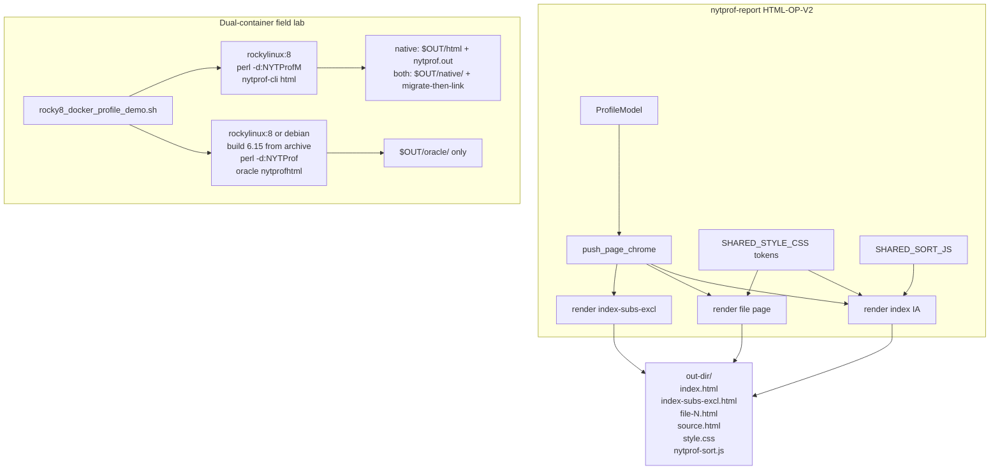
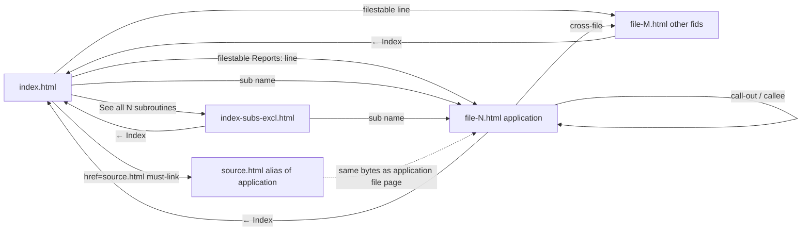

# Native operator HTML v2 — oracle look-and-feel with modern JS/CSS

| Field | Value |
|-------|-------|
| **Document title** | Reimplement Devel::NYTProf 6.15 `nytprofhtml` look, feel, and navigation using modern vanilla JS/CSS |
| **Author** | design-doc-writer (Grok) |
| **Date** | 2026-08-15 |
| **Status** | Draft |
| **Audience** | Senior implementers / coding agents in this repo |
| **Board / program IDs (proposed)** | `HTML-OP-V2-CHROME`, `HTML-OP-V2-NAV-IA`, `HTML-OP-V2-SORT`, `HTML-OP-V2-SOURCE-CALLS`, `HTML-OP-V2-PRIMARY-FID`, `ADR-0012-HTML-OP-V2`, `ROCKY8-DUAL-DOCKER-LAB` |
| **Does not supersede** | [`docs/PROGRAM_CHARTER.md`](https://github.com/hilather/nytprof-modernization/blob/main/docs/PROGRAM_CHARTER.md), [`docs/plan/01_NON_NEGOTIABLES_AND_COMPATIBILITY_CONTRACT.md`](https://github.com/hilather/nytprof-modernization/blob/main/docs/plan/01_NON_NEGOTIABLES_AND_COMPATIBILITY_CONTRACT.md), accepted ADRs 0001–0011 (especially **ADR-0003** Amendment 2026-08-12 **PR-M01 / Q4** and **ADR-0011**), [`docs/contracts/REPORT_HTML_RESIDUAL_INVENTORY_v0.md`](https://github.com/hilather/nytprof-modernization/blob/main/docs/contracts/REPORT_HTML_RESIDUAL_INVENTORY_v0.md), [`AGENTS.md`](https://github.com/hilather/nytprof-modernization/blob/main/AGENTS.md) |
| **Evidence (this pass)** | Fresh oracle 6.15 HTML site generated 2026-08-15 under isolated `PERL5LIB` (never `crates/`): [`/home/mbrewer/Downloads/nytprof-oracle-6.15-scanner/`](/home/mbrewer/Downloads/nytprof-oracle-6.15-scanner/) (**25s** scanner). Compared against native Rocky lab HTML v1: [`/home/mbrewer/Downloads/nytprof-rocky8-demo/`](/home/mbrewer/Downloads/nytprof-rocky8-demo/) (**60s** scanner). Durations differ — look/feel/nav only; do not imply the same numeric profile. |

Agents own **tasks**. This document does not freeze v6 wire IDs, flip `collection_default`, flip `engine=auto`, claim COL-007, un-waive M01 jquery/tablesorter, or claim pixel-identical 2010s `nytprofhtml` DOM.

---

## Overview

A live 6.15 `nytprofhtml` site of the same scanner (`scripts/field/workloads/minute_text_scanner.pl`, 25s, isolated oracle pin) is a **navigable product**: blue gradient header, `← Index` on every inner page, a one-line profile summary, a **top-15** exclusive-sorted subroutine table (Calls / P / F / Exclusive / Inclusive / Subroutine), a “See all N subroutines” link to `index-subs-excl.html`, a **files table** with a `line` report link per source file, and per-file pages that combine a file summary, a per-file sub table, and a six-column source table (`#line` / `#pkg__sub` anchors; call-in/out only from **usable** sites).

The current native operator HTML v1 site (ADR-0011) is **useful but not the same product**: system-ui tables, no header chrome, a bare `← Back to index` paragraph, event-count lists, name-sorted sub tables, a `<ul>` of files, `source.html` pointing at `warnings.pm` (fid 1) instead of the scanner, source columns `line/calls/ticks/source` only, first-click sort ascending, and no call-site annotations. Operators who know 6.15 reports do not feel at home.

This program **re-skins and re-navigates** the existing native multi-file site (`nytprof-report` `render_html_site` / `nytprof-cli html --out-dir`) so the **information architecture and interaction** match 6.15, implemented with CSS custom properties and the already-shipped vanilla `nytprof-sort.js` (extended, not replaced). **jquery, jquery.tablesorter, and floatThead stay WAIVE.** Dual-container Rocky lab is updated so implementers and CI can regenerate **both** reports side-by-side under `~/Downloads/`.

---

## Background & Motivation

### Why this change is needed

ADR-0011 closed a usefulness gap (zeros, empty source, no heat, no sort). The user now wants the **familiar 6.15 report navigation** with a modern, maintainable front end. That is a new advertised class (HTML-OP-V2), not a silent rewrite of M01 and not a claim of oracle DOM parity.

### Evidence produced for this design (not memory)

**Oracle pin confirmed.** Host pin at `baseline/6.15/install` is complete:

| Item | Path |
|------|------|
| `nytprofhtml` | `baseline/6.15/install/bin/nytprofhtml` |
| `Devel/NYTProf.pm` + `NYTProf.so` | `baseline/6.15/install/lib/perl5/x86_64-linux-gnu-thread-multi/` |
| Isolation helper | `tools/oracle/env.sh` (PERL5LIB from `baseline/6.15/oracle-perl5lib.txt` + optional `test-deps`; asserts module under `install/`) |
| Runtime dep | `File::Which` present in `baseline/6.15/test-deps` |

**Oracle generation (this pass):**

```sh
# repo root; isolated pin only — no crates/ on PERL5LIB
source tools/oracle/env.sh
case ":${PERL5LIB-}:" in *"/crates/"*) echo ERROR; exit 1;; esac

OUT=/home/mbrewer/Downloads/nytprof-oracle-6.15-scanner
NYTPROF="file=${OUT}/nytprof.out" \
  perl -d:NYTProf "$OUT/app/minute_text_scanner.pl" "$OUT/corpus" 25
nytprofhtml -o "$OUT/html" -f "$OUT/nytprof.out"
```

| Result | Value |
|--------|-------|
| Profile | `NYTProf 5`, 5.0 MiB, rc=0, 25s wall |
| Scanner stdout | `passes=1267 files=2 vocab=25` |
| HTML | rc=0, 3s, **26 files** |
| `index.html` | “Performance Profile Index”; 9.37s of 24.9s; 48220 statements; 20302 sub calls; 3 source files |
| Top excl | `main::CORE:match` 4.72s (50.4%); `main::classify` 3.65s; `main::tokenize` 129ms excl / 4.85s incl |
| Per-file | `minute_text_scanner-pl-1-line.html`, `warnings-pm-2-line.html`, `strict-pm-3-line.html` |
| Also emitted | `index-subs-excl.html`, `style.css`, `js/jquery-min.js`, `js/jquery.tablesorter.min.js`, `js/style-tablesorter.css`, `js/asc.png`/`bg.png`/`desc.png`, `js/jit/*`, `all_stacks_by_time.{calls,svg}`, `packages-callgraph.dot`, `subs-callgraph.dot` |
| Not emitted | `subs-treemap-excl.html` (no `JSON::MaybeXS` on this host); `*-block.html` / `*-sub.html` (line-only profile); **`js/jquery.floatThead.min.js` is referenced in every page `<head>` but is not copied into the site** (404) |

**Native comparison target:** `/home/mbrewer/Downloads/nytprof-rocky8-demo/` (2026-08-15, 60s scanner, re-rendered with in-tree `nytprof-dump`): `html/{index.html,index-subs-excl.html,file-1.html,file-2.html,file-3.html,source.html,style.css,nytprof-sort.js}`. `scan_file` ~58.6s incl, `tokenize` ~39.6s, `CORE:match` ~38.6s.

### Pain points (from the two trees)

1. **Chrome.** Oracle is instantly recognizable (blue header, white title, run/report timestamps, `← Index`). Native is an unbranded document with `<h1>` / `<h2>`.
2. **Index IA.** Oracle: summary → (flame) → **top-15 exclusive subs** → “See all N” → **files table**. Native: event counts → all subs by **name** → sub-defs → call-edges → top exclusive → file **list**. First screen does not match.
3. **Wrong primary file.** Native `source.html` is `warnings.pm` (fid 1). `primary_workload_fid` in `crates/nytprof-report/src/lib.rs` only special-cases the string `"workload"` / `workload.pl`, then falls back to the **minimum fid with `source_lines`**. The scanner is `minute_text_scanner.pl` (fid 3). Oracle’s application page is `minute_text_scanner-pl-1-line.html`.
4. **Source table is a different tool.** Oracle: Line / Statements / Time on line / Calls / Time in subs / Code, plus gray `# spent …` call-in/out blocks linking to callee lines and opcode stubs (`#main__CORE_match`). Native: Line / calls / ticks / source, row heat only, no call annotations, `#L{n}` only.
5. **Sort UX.** Oracle **file** and **excl-index** pages JS-init `#subs_table` with `sortList: [[3,1]]` (Exclusive desc). The **index** `#subs_table` is already emitted exclusive-desc and top-15; index `ready()` only inits `#filestable`. Native first click is **ascending**; no default sort; `data-sort-value` is raw ticks (good) but headers have no initial `sort-desc`.
6. **Time units.** Oracle: `4.72s`, `129ms`, `49µs`, `500ns` via `Util.pm` `fmt_time` (`title="% of profiler_active"`). Native: `38.617636s` with `title="{ticks} ticks"`.
7. **Heat.** Oracle colors **cells** with `c0`–`c3` (`#ffb3b3`…`#B4ffB4`, MAD from median). Native colors **rows** with `heat-hot`–`heat-low` (quartile). v1 is already red-hot (`#e06060`) / green-low (`#dce6dc`) — palette and **cell vs row** differ; unused native source lines are wrongly painted (`heat-mid` on comments).
8. **Lab only exercises native.** `scripts/field/rocky8_docker_profile_demo.sh` installs testdrive RPM + `perl -d:NYTProfM`. There is no isolated 6.15 oracle container path, so the comparison this design required is not repeatable in CI.

---

## Goals & Non-Goals

### Goals

1. **Navigation feels like 6.15** on the multi-file site: header chrome, `← Index`, index = summary + top-N exclusive subs + “See all N” + files table, per-file = summary + per-file subs + source table, exclusive index page, sub→source links, `#L{n}` and opcode-style fragment IDs.
2. **Look-and-feel inspired by oracle, implemented with modern CSS** (custom properties, one `style.css`, no stacked-div header gradient, no jquery). Color-safe red/orange/yellow/green heat, blue header, monospace sub names, gray call annotations.
3. **Sort UX match without tablesorter:** default Exclusive Time desc, first click on numeric columns desc, visual `sort-asc`/`sort-desc`, `data-sort-value` remains raw ticks/counts.
4. **Source pages grow toward oracle usefulness:** six-column table with Calls / Time-in-subs as **`—`** until usable sites exist; compact time units; call-in/out only after attach stops stubbing `(1,1)`.
5. **Primary alias is the profiled application**, not `warnings.pm`.
6. **Dual-container field lab** (`--engine native|oracle|both`) writes inspectable reports. Layout is **KD-LAYOUT** (native `$OUT/html` unchanged; oracle `$OUT/oracle/`; both `$OUT/{native,oracle}/` plus native aliases). Honest docker SKIP. Not in `offline_gate`.
7. **Tests drive real entry points** (`nytprof-cli html`, Rocky smoke). Docs/schema/ADR updated in the same change set as behavior.
8. **M01 stays WAIVE.** Capability JSON must not grow `tablesorter: true`.

### Non-goals

| Non-goal | Why |
|----------|-----|
| Vendor jquery / jquery.tablesorter / floatThead / JIT | ADR-0003 M01/Q4; floatThead is referenced by 6.15 but **not shipped** in the generated site |
| Pixel-perfect / byte-identical oracle DOM | Charter + ADR-0011 already rejected clone |
| Oracle `{safe}-{fid}-line.html` filenames | Inventory **WAIVE**; keep `file-<fid>.html` + `source.html` |
| Block/sub page modes (`*-block.html` / `*-sub.html`) | Still **WAIVE**; “line view” chrome may be static text |
| Graphviz `.dot`, treemap | Still **WAIVE** (flame default-on superseded 2026-08-15 — see KD-FLAME) |
| `--open`, exact `-d`, `--mergeevals`, oracle footer branding | Still **WAIVE** (footer may say NYTProfM / native v2 without cloning Tim Bunce blurb) |
| Flip `collection_default` or claim COL-007 / v6 writer | Binding |
| Fix product opcode / discount math so native `tokenize` excl matches 6.15 | Collector residual (see Honesty); look/feel must not invent times |
| Put `crates/` on oracle `PERL5LIB` | Isolation forever |
| Join `offline_gate.sh` | Docker + yum + image pull |
| Public perf claims / 60s in CI | Lab stays ~3s |

---

## Key Decisions

| ID | Decision | Rationale |
|----|----------|-----------|
| **KD-V2** | Advertise a **new** class **Native operator HTML v2** via **ADR-0012**. Do **not** un-waive M01 or rewrite ADR-0011. | Same pattern as ADR-0011: new class, old WAIVE intact. |
| **KD-CHROME** | Every multi-file page uses a shared **semantic header** (`div.header` / `.siteTitle` / `.siteSubtitle` / `.header_back`) implemented with **one CSS linear-gradient**, not the live 6.15 stacked-div gradient (51 layers, 0%…100%). Tests must **not** assert a layer count. | Feels like 6.15; stacked `div`s are the worst part of `get_page_header`. |
| **KD-IA** | Index first screen **must** be: chrome → `div.index_summary` → (optional flame) → **top-15** `table#subs_table` (server-side exclusive-desc) → `div.table_footer` “See all N” → `table#filestable` → greppable `href="source.html"`. Native extras (event counts, call-edges, sub-defs) **must remain on the index** **below** the files table (plain sections, not optional `<details>`). | Navigation feel is IA. Rocky smoke and v1 tests grep `time_line_events` on `index.html`. |
| **KD-NAMES** | Keep native filenames (`file-<fid>.html`, `source.html`, `index-subs-excl.html`, `style.css`, `nytprof-sort.js`). Do not emit oracle `{safe}-{fid}-line.html`. | Inventory WAIVE; existing tests and links. |
| **KD-PRIMARY** | `source.html` / “primary” file is the **application script**: prefer `attributes["application"]` basename, else a non-`@INC` `.pl` with the most exclusive time, else existing `"workload"` heuristic, else min fid. | Fixes the live Rocky site pointing `source.html` at `warnings.pm`. |
| **KD-HEAT** | Keep advertised `heat-hot\|high\|mid\|low` class names only (v1 tests; schema “not oracle `c0`–`c3`”). **Retune CSS values** toward the oracle palette (`#ffb3b3`…`#B4ffB4`). Apply heat on **numeric cells**. Unused/zero source rows have **no** heat class. **Do not emit** `.c0`–`.c3` class names. v1 is already red-hot — this is a palette/granularity change, not an invert. | v1 contract + oracle look. Quartile stays; MAD residual. |
| **KD-TIME** | HTML-only compact units copy 6.15 `fmt_time` **six branches** (`Util.pm` 183–194). `title=` is `{ticks} ticks` unless `profiler_active` actually exists (then may append `%`). Text/CSV/JSON stay integer ticks. | COMPAT-003: display only. Match live `4.72s` / `129ms` / `49µs` / `500ns`. |
| **KD-SORT** | Extend `SHARED_SORT_JS` / `nytprof-sort.js`. No new JS file. First click on `data-sort="num"` is **desc**. Honor `th[data-sort-default="desc"]` on Exclusive Time for **excl-index and file** `#subs_table` and for `#filestable`. Index `#subs_table` is **emitted** exclusive-desc + truncated — do **not** JS-re-sort it on load. Never jquery. | Live 6.15 index `ready()` only inits `#filestable`; `sortList: [[3,1]]` is file/excl pages. |
| **KD-COLS** | Index/excl/per-file sub tables become **Calls, P, F, Exclusive Time, Inclusive Time, Subroutine**. `returns` maps to Calls. v2a **P** = distinct caller **names** (or `CallEdgeTotal.sites` when that is closer — document which). **F** = distinct caller fids from `sub_defs`. Neither is oracle “Places” (distinct call **sites**; live `CORE:print` is P=2 from two RUNTIME lines, name-count P=1). | Navigation columns. Approximate P/F until a non-stub site map exists. |
| **KD-CALLS** | Six-column Calls / Time-in-subs stay **`—`** until a site is **usable**. A site is unusable if `(fid,line)==(1,1)` **unless** that caller’s `sub_def` actually starts at fid 1 line 1. If all non-opcode sites collapse to stub `(1,1)`, omit `.calls` entirely. Do **not** advertise oracle-like call-in/out on product attach while `emit_sub_callers(1,1,…)` remains. PR-7 is **optional** until attach stops stubbing. | Product writer hard-codes `(1,1)`; fid 1 on Rocky is `warnings.pm`. |
| **KD-JS** | One script, `nytprof-sort.js`. Optional tiny `nytprof-nav.js` is **rejected** unless sort file exceeds ~8 KB; prefer extending sort + CSS-only chrome. | Smaller, one CSP surface. |
| **KD-FLAME** | Flame remains **opt-in `--flame`** (A03). When on, embed under `div.flamegraph` **between** summary and `#subs_table` (oracle order). Default-off. | Do not match 6.15 default-on flame. **Superseded 2026-08-15:** user direction flips the CLI to oracle parity — flame **on by default**, `--no-flame` opts out (library `HtmlRenderOptions::default()` unchanged). See `html-optional-flame-mvp-v0.md` amendment. |
| **KD-LAYOUT** | Frozen host output (closes OQ-1). `--engine native`: unchanged `$OUT/html` + `$OUT/nytprof.out` + `$OUT/meta`. `--engine oracle`: `$OUT/oracle/{nytprof.out,html,meta}` only — **never** overwrite native `html/`. `--engine both`: `$OUT/{native,oracle}/` then **migrate-then-link** so `$OUT/html` and `$OUT/meta` become **symlinks** to `native/html` and `native/meta` (plus `ln -sfn` for the `nytprof.out` **file**). Raw `ln -sfn native/html $OUT/html` is **not** sufficient when `$OUT/html` is an existing directory (GNU `ln -sfn` nests `$OUT/html/html`). | Today’s smoke hard-requires `$PACK/nytprof.out`, `$PACK/html/index.html`, `$PACK/meta/timings.txt`. Pre-KD-LAYOUT trees (`~/Downloads/nytprof-rocky8-demo`) have real dirs. |
| **KD-DOCKER** | Two containers, one host wrapper: `--engine native\|oracle\|both` (operator default `native`; smoke `--both`). Oracle container **builds 6.15 from the committed archive** into `/opt/nytprof-oracle`. Bind-mount **only** the archive tarball, the scanner script, shared corpus, and optional vendor `File::Which` — **never the repo root**. Construct `PERL5LIB` as a literal `/opt/nytprof-oracle/...` inside the container. **Do not** inherit host `PERL5LIB`. **Do not** `source tools/oracle/env.sh` in docker. Fail closed if `PERL5LIB` contains `crates` **or** `baseline/6.15/install`. Cache `/opt/nytprof-oracle` in a named volume (or derived image tagged by archive SHA). Native still rebuilds XS inside Rocky from an explicit `/src` mount on the **native** container only. | Host pin `.so` is glibc-incompatible with Rocky; repo-root mount is the copy-paste isolation failure mode. |
| **KD-SKIP** | Honest `SKIP:` when docker/image unavailable. Oracle compile failure → `SKIP` oracle half (do not fake `index.html`). Not in `offline_gate`. GHA `rocky8-docker-lab` timeout **≥45** minutes, or split oracle/native jobs. | Cold `yum` + two XS compiles routinely exceed 20–35 minutes. |

---

## Proposed Design

### High-level architecture



### Comparison matrix (grounded)

| Concern | Oracle 6.15 (this pass) | Native HTML v1 (Rocky demo) | v2 target |
|---------|-------------------------|-----------------------------|-----------|
| Doctype | XHTML 1.0 Transitional | HTML5 | HTML5 |
| Header | stacked-div blue gradient (51 layers 0%…100% on the live site); `Performance Profile Index`; app path; run/report times | none | CSS gradient chrome; same copy roles; **do not** assert layer count |
| Back nav | `div.header_back` `&larr; Index` (white, on header) | `<p><a>← Back to index</a></p>` | `header_back`; tests accept `&larr; Index` **or** `← Index` |
| Index summary | “Profile of … for 9.37s (of 24.9s), executing 48220 statements and 20302 subroutine calls in 3 source files.” | Event-count `<ul>` | `div.index_summary` + event counts **must** stay on index **below** files table |
| Subs table | `#subs_table` Calls, P, F, Excl, Incl, Subroutine; top **15**; **emitted** excl desc; live caption `Subroutines` | `.subs` name, returns, incl, excl; **all** rows; name sort | Oracle columns + top 15 **server-side** excl desc; full list on excl page; caption `Subroutines` or `Top 15 Subroutines` |
| Excl index | `index-subs-excl.html`; same table; 45 rows this run | same filename; name/returns/incl/excl | Keep filename; v2 columns + chrome |
| Files | `#filestable` Stmts, Exclusive Time, Reports (`line` link), Source File + tfoot totals | `<ul class="source-files">` + `p.source-link` | Files **table** with `line` → `file-<fid>.html` **and** greppable `href="source.html"` |
| File page | summary table + per-file `#subs_table` + 6-col source + opcode stub rows | heading + 4-col source | summary + per-file subs + 6-col source; Calls / Time-in-subs = `—` until usable sites |
| Anchors | `<a name="{line}">` and `name="main__CORE_match"` | `id="L{line}"` | Keep `id="L{n}"` (HTML5); **add** `id="{pkg}__{sub}"` for opcode/xsub stubs |
| Call annotations | `.calls` / `.calls_in` / `.calls_out` | none | Only from **non-stub** sites (KD-CALLS); product Rocky stays `—` while attach emits `(1,1)` |
| Heat | cell `c0`–`c3` `#ffb3b3`…`#B4ffB4` | row `heat-*` (already red-hot `#e06060`) | cell `heat-*` retuned to oracle **colors**; **no** `.c0`–`.c3` classes; unused rows uncolored |
| Time | `4.72s` / `129ms` / `49µs` / `title="%"` | `38.617636s` / `title=ticks` | exact `fmt_time` six-branch + ticks title |
| Sort | tablesorter + missing floatThead; index `#subs_table` **not** JS-inited | `nytprof-sort.js` first-click asc | extended vanilla; first-click desc; JS default-sort on excl/file + `#filestable` only |
| Flame | default on (`all_stacks_by_time.svg`) | ~~opt-in `--flame`~~ → **default on, `--no-flame` opt-out (2026-08-15 amendment)** | CLI now matches oracle default; place like oracle |
| Graphviz / treemap / jit | present / skipped / copied | absent | residual |
| jquery | shipped + referenced | forbidden | forbidden |
| `source.html` | n/a (oracle has no alias) | **warnings.pm** | **scanner / application** |

### Site map and link graph (nav contract)



**Filenames (must / may):**

| File | Must match oracle name? | Native name | Notes |
|------|-------------------------|-------------|-------|
| Index | yes | `index.html` | |
| Exclusive sub index | yes | `index-subs-excl.html` | already `INDEX_SUBS_EXCL_FILENAME` |
| Per-file | **no** (WAIVE) | `file-<fid>.html` | do not add `{safe}-{fid}-line.html` aliases in v2 |
| Primary alias | n/a | `source.html` | **must** be application fid (KD-PRIMARY) |
| CSS | yes | `style.css` | body changes; name stays |
| Sort JS | no | `nytprof-sort.js` | native-only |
| Flame SVG / folded | when `--flame` | `all_stacks_by_time.svg` + `.folded` | already A03 |
| `js/*` jquery | no | **must not exist** | smoke greps |

**Heading / copy that must feel the same (not byte-identical):**

| Page | `siteTitle` | Back link | Other required copy |
|------|-------------|-----------|---------------------|
| Index | `Performance Profile Index` | none (`skip_link_to_index`) | `For {application}`; `Run on …` / `Reported on …`; `div.index_summary`; caption **`Subroutines`** (live 6.15; `Top 15 Subroutines` also accepted); `See all N subroutines`; caption `Source Code Files`; **`href="source.html"`** |
| Excl index | `Performance Profile Subroutine Index` | `← Index` → `index.html` | same sub table, all rows |
| File page | `NYTProf Performance Profile` | `← Index` | subtitle includes `« line view »` as **static** selected mode (block/sub modes residual); file summary Filename + Statements |
| Titles `<title>` | may differ | | Keep greppable `NYTProf`; may include basename |

**Native extras that may differ (keep, demote):**

- Event counts (`time_line_events`, …) — **must** remain greppable on `index.html` (not optional `<details>`)
- Full call-edges table
- Subroutine definitions table (`sub-defs`) when `sub_defs` is non-empty
- A4b block-line totals table when present
- Single-file stdout / `-o report.html` (native-only convenience): apply the **same CSS tokens** and compact time; chrome is best-effort (no back link)

**Must-link (index):** `index-subs-excl.html` (“See all N”), every eligible `file-<fid>.html` via `#filestable` Reports/`line`, and **`href="source.html"`** (native-only primary alias; extra column, extra cell, or one-line `p.source-link` under the files table).

### CSS architecture

Keep one `SHARED_STYLE_CSS` published as `style.css` (multi-file) / inlined (single-file). Rewrite the constant as **layered tokens + components**. Do not add a second stylesheet.

**2026-08-15 visual refresh (CSS-only):** the constant was restyled in place — carded tables with hairline separators and sticky `thead th`, pill `← Index`, accent-bar `.index_summary`, `tr:target` line highlight, sort-affordance `⇅` hints, and a `prefers-color-scheme: dark` block that re-tunes the same tokens (heat included). **No selector, class, ID, or markup changed**; token names below are stable, values are the current light theme. Extra presentation tokens (`--nyt-surface`, `--nyt-row-hover`, `--nyt-target`, `--nyt-th-fg`, `--nyt-radius`, `--nyt-shadow`) may evolve without contract churn.

```css
:root {
  --nyt-font: system-ui, "Segoe UI", sans-serif;   /* + -apple-system/Roboto fallbacks */
  --nyt-mono: ui-monospace, "SF Mono", Menlo, Consolas, monospace;
  --nyt-fg: #1f2328;
  --nyt-bg: #f6f8fa;        /* page; tables/cards sit on --nyt-surface #fff */
  --nyt-link: #0563c1;      /* near-oracle blue */
  --nyt-link-visited: #6d00e6;
  --nyt-link-hover: #c00;
  --nyt-header-top: rgb(17, 136, 255);
  --nyt-header-bot: rgb(0, 68, 187);
  --nyt-header-fg: #fff;
  --nyt-th: #eef1f4;        /* softer than oracle #ddd */
  --nyt-th-border: #d0d7de;
  --nyt-td-border: #d8dee4;
  --nyt-caption: #eef1f4;
  --nyt-footer: #d0d7de;
  --nyt-calls: #57606a;
  /* oracle get_css() c0–c3 (color-safe web palette) — light theme */
  --nyt-c0: #ffb3b3; /* hottest */
  --nyt-c1: #ffd9b4;
  --nyt-c2: #ffffb4;
  --nyt-c3: #b4ffb4; /* coolest */
  /* dark theme: same tokens overridden inside @media (prefers-color-scheme: dark) */
}
```

**Class map (oracle → native v2):**

| Oracle | Native v2 | Notes |
|--------|-----------|-------|
| `.header` `.headerForeground` `.siteTitle` `.siteSubtitle` `.header_back` | **keep names** | implement gradient on `.header` |
| `.body_content` `.footer` `.index_summary` `.table_footer` `.file_summary` | keep | |
| `.sub_name` `.s` `.n` `.h` `.index` | keep | |
| `.c0` `.c1` `.c2` `.c3` | **do not emit** these class names | CSS **variables** `--nyt-c0`…`--nyt-c3` only; greps stay `heat-*` vs oracle `c0` |
| `heat-hot` | `var(--nyt-c0)` (`#ffb3b3`) | v1 already red-hot (`#e06060`); retune toward oracle red, do **not** invert |
| `heat-high` | `var(--nyt-c1)` | |
| `heat-mid` | `var(--nyt-c2)` | |
| `heat-low` | `var(--nyt-c3)` | only if value > 0 and scale.spread |
| `.calls` `.calls_in` `.calls_out` | keep | |
| `.mode_btn` `.mode_btn_selected` | keep | static “line view” |
| `.flamegraph` | keep + existing `section.flame` | |
| `table.tablesorter` | `table.sortable` | already |
| `th.tablesorter-headerAsc` | `th.sort-asc` | CSS `::after` triangles already shipped; retune to match `asc.png`/`desc.png` affordance |
| `tr:hover` | keep light hover | oracle uses `.calls:hover` gray |

**Do not copy** the stacked absolutely positioned gradient `div`s from `get_page_header` (`baseline/6.15/src/bin/nytprofhtml` ~1755–1805; **51** layers on the live site). Tests must not assert a layer count. Replace with:

```css
.header {
  background: linear-gradient(135deg, var(--nyt-header-top), var(--nyt-header-bot));
  color: var(--nyt-header-fg);
  padding: 1.15rem 1.5rem 1.35rem;
  box-shadow: 0 2px 12px rgba(0, 32, 96, .3);
}
```

(Still **one** `linear-gradient` — direction refreshed to 135deg, fixed 7.5rem min-height dropped for a slimmer bar, 2026-08-15.)

**Density:** oracle `th,td` padding `0 0.4em`; `th` `font-size: 0.8em`; `tr` `vertical-align: top`; source `.s` monospace pre. As of the 2026-08-15 refresh, native uses `.45em .75em` with **hairline-only horizontal separators** (no vertical grid): scanning ease now comes from whitespace + row hover instead of the oracle's 1px box grid, and tabular-nums + right-aligned numerics keep the dense numeric read.

### Sort JS (`nytprof-sort.js`)

File: `crates/nytprof-report/src/lib.rs` `SHARED_SORT_JS` (today ~80 lines). Extend in place.

**Behavioral contract (v2):**

1. Bind every `table` with `th[data-sort]` (unchanged).
2. **Default sort (JS):** on init, if a `th` has `data-sort-default="desc"` or `"asc"`, apply that sort once. Use this on `#filestable`, exclusive-index `#subs_table` / `.subs-excl`, and **per-file** `#subs_table`. **Do not** put `data-sort-default` on the **index** `#subs_table` — that table is already emitted exclusive-desc and truncated (live 6.15 index `ready()` only inits `#filestable`).
3. **First click** on `data-sort="num"`: descending. First click on `data-sort="text"`: ascending. Toggle thereafter.
4. Compare via `data-sort-value` (raw ticks / counts) — **do not parse displayed `ms`/`µs`**. This is better than oracle’s `fmt_time` parser (which `console.log`s on mismatch).
5. Stable tie-break on original row index (already `_nytprofOrig`).
6. Toggle `sort-asc` / `sort-desc` on the active `th`; clear others.
7. Optional: `aria-sort="ascending|descending|none"` on headers for a11y (modernization allowed).
8. Still **no** `innerHTML` assignment from profile data; still **no** jquery / tablesorter strings.

**Markup:**

```html
<th data-sort="num" data-sort-default="desc">Exclusive<br>Time</th>
```

Reject adding `js/asc.png` assets; CSS triangles stay.

### Time formatting

Replace `format_seconds` with `format_compact_secs` that copies 6.15 `fmt_time` (`baseline/6.15/src/lib/Devel/NYTProf/Util.pm` lines 183–194; `$width` empty). Negative values recurse as `-{fmt_time(-sec)}`. Ignore `NYTPROF_FMT_TIME` (oracle env override; not a native contract).

| Condition (`sec`) | `sprintf` (`$width` empty → `%.0f…` / `%.*f…`) | Example |
|-------------------|--------------------------------------------------|---------|
| undefined | do not call (no cell) | — |
| `sec < 0` | `'-' + fmt_time(-sec)` | |
| `sec == 0` | `"%.0fs"` | `0s` |
| `sec < 1e-6` | `"%.0fns", sec * 1e9` | `500ns` |
| `sec < 1e-3` | `"%.0fµs", sec * 1e6` | `49µs` |
| `sec < 1` | `"%.*fms", 3 - length(int(sec*1e3)), sec*1e3` | `129ms` |
| `sec < 100` | `"%.*fs", 3 - length(int(sec)), sec` | `4.72s` |
| else (`≥ 100`) | `"%.0fs", sec` | `150s` |

These are the empty-width forms of Util.pm `"%$width.0fs"` / `"%$width.*fms"` (lines 189–194). **Do not** transcribe as `"%s.0fs"` — that is a string conversion plus the literal `.0fs`. Implement the Perl (or this table), not a guessed Rust format.

Unit-test at least: `0`, `500e-9`, `49e-6`, `0.129`, `4.72`, `150`.

Keep `title="{raw} ticks"`. Append `; {pct}%` **only** when `attributes["profiler_active"]` is present and parseable. **Do not** change text/CSV/`report --json`.

Existing CLI test `html_operator_v1_cli_default_calls1` only requires a seconds-ish cell (`s` or `.`) plus `title=`. Compact units still satisfy that.

### Heat

Keep `HeatScale` quartiles (already tested). Changes:

1. Color **cells** (`td.num.heat-hot`) for Calls / Excl / Incl independently (oracle colors each column from its own MAD; we use per-column quartiles).
2. Do **not** paint zero / empty / `—` cells.
3. Source unused / zero-tick lines: **no** heat class on the `<tr>` or cells (update `html-per-file-mvp-v0.md`, which today says heat on each source row).
4. CSS **values** retune toward oracle `#ffb3b3`…`#B4ffB4` via `--nyt-c0`…`--nyt-c3`. **Do not** emit `.c0`–`.c3` class names.
5. Sub tables may keep a single excl-based `tr.heat-*` **and** cell classes. v1 is already red-hot — do not describe this as an invert.

MAD (`calc_mad_from_objects` in `nytprofhtml`) stays residual.

### Index implementation (code touch points)

`crates/nytprof-report/src/lib.rs`:

| Today | v2 |
|-------|----|
| `push_html_doc_start` → `<body>` | add `push_page_chrome(...)` before body content |
| `push_event_counts` first | `push_index_summary` first; **keep** `push_event_counts` **after** `#filestable` (required, not `<details>`) |
| `push_subs_table` all rows, 4 cols, name sort | `push_subs_table_v2`: 6 cols, **server-side** excl desc, `max_subs=15` on index only |
| `push_source_file_links` `<ul>` | `push_files_table` `#filestable` + `href="source.html"` |
| extras immediately | extras (event counts, call-edges, `sub-defs`) **after** files table |

`push_index_summary` text:

```text
Profile of {application} for {stmt_secs}s (of {wall_secs}s), executing {stmt_count} statements and {sub_calls} subroutine calls in {file_count} source files.
```

**Allowed derivations (do not invent wall):**

| Clause | Source |
|--------|--------|
| `{application}` | `attributes["application"]` basename; else primary-fid basename |
| `{stmt_secs}` | `attributes["profiler_active"]` if present and parseable as seconds; **else** `Σ line_totals.ticks / ticks_per_sec` when `ticks_per_sec` > 0 |
| `{wall_secs}` | only a real **duration** attribute (`profiler_duration` or equivalent). **`application` is a path, not a duration** — never treat it as wall. **Omit** the `(of …s)` clause if no duration attribute exists. Do **not** use `time()` or `basetime` as wall. |
| `{stmt_count}` | **Σ `line_totals.calls`** (same number as `#filestable` tfoot Stmts). Live oracle “executing 48220 statements” is 48182+38+0, not a raw event counter. `TIME_LINE` and `TIME_BLOCK` both increment `line_totals.calls`. Keep `time_line_events` only in the event-counts list (still greppable). |
| `{sub_calls}` | sum of `sub_return_totals.returns` (or `call_edges` counts if that is what we document) |
| `{file_count}` | `files.len()` |

Tests assert `Profile of` + application/workload basename + statement/sub/file counts — **not** a golden `9.37s (of 24.9s)`.

Top-N: constant `INDEX_TOP_SUBS: usize = 15` (oracle `$max_subs = 15`). Footer only if `sub_return_totals.len() > 15`. **default-calls1 has ~10 `SUB_RETURN` names**, so top-15 still includes `main::leaf` / `main::mid` **15/3 on the index**. Do not panic; still update **column/class** asserts (see supersession table).

P/F without a new model field (v2a):

- **P (approx)** = number of `call_edges` keys whose `called == name` (distinct caller **names**). Alternative: `CallEdgeTotal.sites` summed for those edges (merged `SUB_CALLERS` record count). Pick **one** in the v2 schema and document it. Neither equals oracle **Places** (distinct `(fid,line)` sites). Live oracle `main::CORE:print` is P=2 (two RUNTIME lines); name-count P is 1.
- **F (approx)** = number of distinct `sub_defs[caller].fid` among those callers; `1` if unknown.

v2b upgrades P to distinct usable `(fid,line)` sites only if attach stops stubbing `(1,1)`.

#### v1 → v2 marker supersession (PR-4 must edit these)

| Keep (must remain greppable) | Replace in the same PR |
|------------------------------|------------------------|
| `time_line_events` on `index.html` | Event-counts block **moves below** `#filestable` (keep `<h2>Event counts</h2>`) |
| `main::leaf` / `main::mid` cells **15** / **3** on **index** (default-calls1, ≤15 names) | `table.subs` → `table#subs_table` (plus `sortable`); columns name/returns/incl/excl → Calls / P / F / Exclusive / Inclusive / Subroutine |
| `heat-hot` (and siblings) in CSS + on time cells/rows | unused source rows: **drop** row heat |
| `nytprof-sort.js`, `defer`, no `jquery` / `tablesorter` | first-click desc + `data-sort-default` on excl/file/`#filestable` only |
| `href="source.html"` | `ul.source-files` → `#filestable`; keep `p.source-link` **or** equivalent `href="source.html"` |
| `id="L` on source rows | source columns grow in PR-6 |
| `Subroutine definitions` / `table.sub-defs` when defs exist | may move below files table; do not delete |

**Tests PR-4 must update** (do not leave `html_operator_v1.rs` asserting `class="subs"` after the markup change):

- `crates/nytprof-cli/tests/html_operator_v1.rs` (`class="subs"`, 15/3 **on index**)
- `crates/nytprof-cli/tests/html_shared_css.rs`
- `crates/nytprof-cli/tests/html_optional_flame.rs`
- `crates/nytprof-cli/tests/html_subs_excl.rs` (header / table class if shared)
- `crates/nytprof-report/src/lib.rs` `html_site_default_calls1_render_html_site` (`time_line_events`, `href="source.html"`, `Subroutine definitions`)
- New `crates/nytprof-cli/tests/html_operator_v2.rs` (IA markers)
- Rocky smoke: still greps `time_line_events` on `$PACK/html/index.html` (aliases under `--both`)

Subroutine cell: keep full `main::tokenize` as link text (native today). Optional oracle split (`main::` gray + `tokenize` link) is **nice-to-have**, not required for nav. Opcode hint `(opcode)` when name contains `CORE:` is in-scope (cheap, matches this scanner report).

### File page implementation

`render_file_page` today: title, back `<p>`, one source table.

v2:

1. Chrome + `← Index`.
2. `table.file_summary`: Filename, Statements (`Executed {sum_calls} statements in {secs}`).
3. Per-fid `#subs_table` (subs whose `sub_defs.fid == fid`, plus names that only appear as `CORE:` in that file if we have edges). Same 6 columns, no top-N cap (oracle shows all subs **in the file**).
4. Source table columns:

| Column | Model source | Sort |
|--------|--------------|------|
| Line | line number; `id="L{n}"` | num |
| Statements | `line_totals.calls` (A4) | num |
| Time on line | `line_totals.ticks` via `format_time_cell` | num |
| Calls | sum of **usable** outgoing `call_sites` on this line; else **`—`** (never `0` / `0s`) | num (`data-sort-value=""` or omit) |
| Time in subs | sum of **usable** outgoing incl on this line; else **`—`** (never `0` / `0s`) | num |
| Code | escaped source; `.s` | text |

5. After source lines, emit **opcode stub rows** for `CORE:` / xsub names that have edges in this fid but no `sub_defs` line: `id="{sanitized}"` e.g. `main__CORE_match` (oracle `name="main__CORE_match"`). Link from the sub table uses the same fragment.

**Calls / Time in subs honesty (schema, PR-6):** populate those two columns **only** from retained, **non-stub** `call_sites` (see KD-CALLS). On current product attach they stay `—` except slowops whose `CopLINE` is a real non-`(1,1)` site. **Do not** demo-claim six-column usefulness on Rocky until attach sites exist. Oracle leaves those cells **blank** when there is no outgoing call (live `minute_text_scanner-pl-1-line.html` lines 10–16); native v1 already uses `—` for unused lines — keep `—`, never `0`.

**`sub_href`:** keep `file-{fid}.html#L{first}`. For names without `sub_def`, use `#` + sanitized id on the application file when we emit a stub.

### Call-in / call-out (v2b, optional)

Today `ProfileModel` `SUB_CALLERS` handler (`crates/nytprof-model/src/lib.rs` ~272–294) **drops args 0–1 (`fid`, `line`)** and merges into `(caller, called)`.

Product attach (`collector/xs/Devel/NYTProfM.pm`) emits `DB::emit_sub_callers(1, 1, 1, $incl, $excl, 0.0, 0, $called, $caller)` for every Perl-to-Perl return. Slowops (`collector/xs/NYTProf.xs`) pass real `CopLINE` fid/line. A Rocky scanner `call_sites` map will therefore **not** be empty — it will mix real opcode sites with a flood of `(fid=1,line=1)` stubs. On the live native site fid 1 is `warnings.pm`. Linking `main::scan_file` to `file-1.html#L1` is worse than no annotations.

Add (additive, default-empty) **only if PR-7 lands**:

```rust
/// Site-level SUB_CALLERS rows. Not a replacement for call_edges.
pub struct CallSite {
    pub fid: u32,
    pub line: u32,
    pub count: u64,
    pub incl: f64,
    pub excl: f64,
}
pub call_sites: HashMap<(String, String, u32, u32), CallSite>, // (caller, called, fid, line)
```

**Usable site rule (normative):**

```
usable(site) iff
  (site.fid, site.line) != (1, 1)
  OR caller_sub_def.first_line == 1 AND caller_sub_def.fid == 1
```

If a site’s fid is 1 and the caller/callee `sub_def.fid` is not 1, treat as stub. If **all** non-opcode sites collapse to `(1,1)`, omit every `.calls` block and leave Calls / Time-in-subs as `—`.

Emit annotations as escaped text inside `.calls` (not `innerHTML` from JS) **only for usable sites**. Wording may be shorter than 6.15; **must** include: callee or caller name, count, compact time, link to the other line. Hover styles from oracle `.calls:hover`.

**Surface / size (AGENTS.md bound allocations):**

| Surface | `call_sites`? |
|---------|----------------|
| `ProfileModel` ingest + HTML | yes (PR-7) |
| `models_semantically_equal` / A7 | **no** — keep comparing `call_edges` only |
| Perl `JsonlData`, FFI, capability JSON | **no** unless those schemas get an explicit bump (out of this program) |
| `Serialize` of the model | omit or skip if a snapshot would grow; default **off** equality/JSON |

Cap or **fail-closed** before allocating an absurd site map (e.g. reject / drop sites when count exceeds a documented bound such as 1e6 unique keys). `CallEdgeTotal.sites` already counts merged records — enough for v2a P approximation.

PR-7 is **optional / may slip** while attach still stubs `(1,1)`. Do not advertise “oracle-like call-in/out” on product profiles until attach stops stubbing. Keep attach `1,1` as a **collector residual**.

### Primary fid algorithm

Replace `primary_workload_fid` (`lib.rs` ~1700):

```
1. If attributes["application"] is a path, take its basename.
   If any model.files value ends with that basename (or equals the path), use that fid.
2. Else among files whose basename ends with .pl and whose path does not contain
   "/perl/" or "site_perl" or "vendor_perl" or "/usr/share/perl" or "/usr/lib",
   pick the fid with the largest sum of line_totals.ticks.
3. Else existing "workload" / workload.pl heuristic.
4. Else min fid with source_lines, else 1.
```

Regression: default-calls1 must still pick `workload.pl`. New test: a synthetic model with `warnings.pm` fid 1 and `minute_text_scanner.pl` fid 3 + `application` attribute must pick 3. Rocky smoke asserts `source.html` contains `sub tokenize` / `minute_text_scanner`.

### Dual-container docker lab

**Scripts:** extend `scripts/field/rocky8_docker_profile_demo.sh` + `rocky8_docker_profile_smoke.sh`. Do **not** create a third unrelated entry point unless the demo file becomes unreadable — then split `rocky8_docker_profile_oracle.sh` sourced by the same wrapper.

**CLI:**

```text
rocky8_docker_profile_demo.sh [--out DIR] [--lab] [--seconds N]
  [--engine native|oracle|both]
```

| Flag | Default (operator) | Smoke |
|------|--------------------|-------|
| `--engine` | `native` | `both` |
| `--out` | `~/Downloads/nytprof-rocky8-demo` | temp dir |

#### Frozen host layout (KD-LAYOUT; OQ-1 closed)

| `--engine` | Writes | Must not |
|------------|--------|----------|
| `native` | **Unchanged today:** `$OUT/nytprof.out`, `$OUT/html/`, `$OUT/meta/`, `$OUT/app/`, `$OUT/corpus/` | — |
| `oracle` | `$OUT/oracle/{nytprof.out,html,meta}` only | Overwrite `$OUT/html` or `$OUT/nytprof.out` with 6.15 |
| `both` | `$OUT/native/` (full native tree) **and** `$OUT/oracle/` **and** migrate-then-link so `$OUT/html` → `native/html`, `$OUT/meta` → `native/meta`, `$OUT/nytprof.out` → `native/nytprof.out` | Leave smoke’s `$PACK/html/index.html` / `$PACK/nytprof.out` / `$PACK/meta/timings.txt` missing; nest a symlink *inside* an old `$OUT/html` directory |

**Migrate-then-link (normative for `--engine both`):** `--both` on a pre-KD-LAYOUT `$OUT` (e.g. `~/Downloads/nytprof-rocky8-demo` with real `html/` and `meta/` directories) is a **migration**, not a raw `ln`. GNU `ln -sfn native/html $OUT/html` does **not** replace a directory; it creates `$OUT/html/html → native/html`. `-n` only stops dereferencing an existing *symlink-to-dir*. `$OUT/nytprof.out` is a file, so `ln -sfn` is fine there after the file is under `native/`.

```text
# After native artifacts exist under $OUT/native/{html,meta,nytprof.out}:
mkdir -p "$OUT/native"

# html: real dir → move into native, then link; leftover dir → remove if native already has html
if [[ -L "$OUT/html" ]]; then
  ln -sfn native/html "$OUT/html"
elif [[ -d "$OUT/html" ]]; then
  if [[ ! -e "$OUT/native/html" ]]; then
    mv "$OUT/html" "$OUT/native/html"
  else
    rm -rf "$OUT/html"
  fi
  ln -sfn native/html "$OUT/html"
elif [[ ! -e "$OUT/html" ]]; then
  ln -sfn native/html "$OUT/html"
fi

# meta: same migrate-then-link as html
# nytprof.out: if a regular file and native/nytprof.out missing, mv then ln -sfn
```

Smoke when `--engine both` **must** assert `[[ -L $PACK/html ]]` (and `[[ -L $PACK/meta ]]` if the meta alias is created) **and** `$PACK/html/index.html` still resolves.

Shared seed/corpus may live at `$OUT/corpus` (native) and be copied into the oracle container; `NOTES.txt` + `open-report.sh` at `$OUT/` list **both** report paths when `--both`.

Update the smoke path table **in the same PR as the flag** (PR-8). Existing asserts against `$PACK/html/index.html` keep working via the aliases.

**Native container (unchanged honesty):** `rockylinux:8`, testdrive RPM, in-tree `xs-nytprof` rebuild (no host `.so`). This container **may** bind-mount the repo root at `/src:ro` (needs `crates/` / `collector/` to rebuild XS). `perl -d:NYTProfM`, host-side re-render with in-tree `nytprof-cli html`.

**Oracle container (isolation is load-bearing):**

Bind-mounts (**only** these; never the repo root):

| Host path | Container |
|-----------|-----------|
| `baseline/6.15/archives/Devel-NYTProf-6.15.tar.gz` | `/src/Devel-NYTProf-6.15.tar.gz:ro` |
| `scripts/field/workloads/minute_text_scanner.pl` | `/src/minute_text_scanner.pl:ro` |
| optional `tools/oracle/vendor/File-Which` (or a single `.pm`) | `/src/vendor/:ro` |
| `$OUT/oracle` | `/out:rw` |
| named volume `nytprof-oracle-prefix-<archive-sha>` | `/opt/nytprof-oracle` (cache) |

```mermaid
sequenceDiagram
  participant H as Host wrapper
  participant C as Oracle container
  H->>C: mount archive + scanner + vendor only
  H->>C: mount $OUT/oracle:/out
  H->>C: named volume /opt/nytprof-oracle
  C->>C: unset PERL5LIB; do not source tools/oracle/env.sh
  C->>C: yum/apt perl gcc make perl-devel zlib (+ perl-File-Which if present)
  alt prefix cache miss
    C->>C: tar xf archive; perl Makefile.PL INSTALL_BASE=/opt/nytprof-oracle && make && make install
  end
  C->>C: PERL5LIB=/opt/nytprof-oracle/lib/perl5:/opt/nytprof-oracle/lib/perl5/$arch
  Note over C: fail closed if PERL5LIB contains crates or baseline/6.15/install
  C->>C: NYTPROF=file=/out/nytprof.out perl -d:NYTProf scanner corpus N
  C->>C: nytprofhtml -o /out/html -f /out/nytprof.out
```

**Forbidden in the oracle container:**

- Bind-mounting the repo root (`/src` with `crates/`)
- `source tools/oracle/env.sh` (prepends host `baseline/6.15/install/.../x86_64-linux-gnu-thread-multi`)
- Inheriting host `PERL5LIB` (docker `-e PERL5LIB=…` from the host wrapper)
- Copying `baseline/6.15/install` `.so` into Rocky

**Fail closed** (non-zero, log to `oracle/meta/environment.txt`) if:

- `PERL5LIB` contains `crates` **or** `baseline/6.15/install`
- `Devel/NYTProf.pm` is not under `/opt/nytprof-oracle`
- `nytprofhtml` is not the prefix `bin/`

Isolation checks: dump `PERL5LIB`; locate `NYTProf.pm`; `NYTProf 5` prefix; oracle `index.html` contains `Performance Profile Index` and **may** contain `jquery`; native **must not** contain `jquery` / `tablesorter`.

`File::Which`: prefer Rocky AppStream `perl-File-Which` if the package exists; else vendor a tiny copy under `tools/oracle/vendor/` (commit in PR-8). Do not require network `cpanm` on the smoke path. Record Rocky-vs-debian as a **failed-attempts** row only after a real `make` log.

Image: default `rockylinux:8` for **both**. Escape hatch: `NYTPROF_ORACLE_IMAGE=debian:bookworm-slim` (same isolated prefix, same mount rules). If 6.15 `make` fails: **`SKIP` the oracle half** — never write a fake `index.html`.

**Smoke assertions (`--lab --seconds 3 --engine both`):**

Always (no docker): existing host scanner checks + `bash -n` + `--help` shows `--engine`.

When docker works:

| Side | Assert |
|------|--------|
| native (via `$PACK/html` aliases) | existing v1 asserts (NYTProf 5, `time_line_events`, `main::tokenize`, `heat-hot`, `nytprof-sort.js` no jquery, `id="L`, `profiled_scanner_rc=0`) **plus** v2 nav: `class="header"` or `Performance Profile Index`, `index-subs-excl.html` link, `#filestable` or `Source Code Files`, `href="source.html"`, `source.html` contains `tokenize` |
| oracle (`$PACK/oracle/`) | `html/index.html` exists; contains `Performance Profile Index`; `index-subs-excl.html` exists; a `*-line.html` or scanner-named file contains `sub tokenize`; `nytprof.out` is `NYTProf 5`; `meta/environment.txt` has no `crates/` and no `baseline/6.15/install` on `PERL5LIB` |
| both | `NOTES.txt` mentions both paths; `[[ -L $PACK/html ]]` and `$PACK/html/index.html` exists; `[[ -L $PACK/meta ]]` if the meta alias is used |

**GHA:** keep `.github/workflows/ci-matrix.yml` job `rocky8-docker-lab` calling the smoke (now `--both`). Bump `timeout-minutes` from 20 to **≥45**, **or** split `rocky8-docker-lab` (native) + `rocky8-oracle-html-lab` (oracle) each ≥25. Cache the oracle prefix volume / derived image by archive SHA. Still `SKIP` without docker. **Not** a matrix row; **not** `offline_gate`.

**Makefile:** `make rocky8-docker-lab-smoke` stays the same entry.

### Tests

Drive **real** `nytprof-cli html` / `nytprof-dump html` (package already uses `CARGO_BIN_EXE_nytprof_dump`).

| Test file | Asserts |
|-----------|---------|
| Existing `html_operator_v1.rs` | **PR-4 updates** `class="subs"` → `#subs_table`; keep 15/3 **on index**, `heat-hot`, `nytprof-sort.js`, no jquery, `id="L`, sub_def href |
| Existing `html_shared_css.rs` / `html_optional_flame.rs` / `html_subs_excl.rs` | **PR-4 updates** markers that move; keep CSS identity / flame / excl filename |
| Report crate `html_site_default_calls1_render_html_site` | **PR-4 updates** if it assumes event-counts-first or `ul.source-files`; keep `time_line_events`, `href="source.html"`, `Subroutine definitions` |
| **New** `crates/nytprof-cli/tests/html_operator_v2.rs` | default-calls1 `--out-dir`: `class="header"`, `&larr; Index` **or** `← Index` on file + excl pages, `#subs_table` + Exclusive/Inclusive headers, `See all` or `index-subs-excl.html`, `#filestable`, `href="source.html"`, `style.css` has `--nyt-header-top` or `#ffb3b3` (**not** a `c0` class), sort JS first-click desc, **no** `jquery` / `tablesorter`, `source.html` contains `workload`. Do **not** assert a 50/51-div header or golden `9.37s (of 24.9s)`. |
| Report crate unit tests | `primary_workload_fid` application/scanner case; `format_compact_secs` six-branch vectors; chrome helper escaping; unused source rows have no `heat-*` |
| Rocky smoke | nav contract above; `$PACK/html` still works under `--both` via aliases |

Do **not** golden-compare oracle HTML bytes. Do **not** edit `fixtures/v5/default-calls1`.

### Docs / ADR / board (same change sets)

| Doc | Update |
|-----|--------|
| **New** `docs/adrs/0012-native-operator-html-v2.md` | Accept HTML-OP-V2; M01 remains WAIVE; not DOM parity |
| `docs/contracts/REPORT_HTML_RESIDUAL_INVENTORY_v0.md` | New row: native chrome/nav/files-table/source-cols **partial→advertised v2**; jquery still WAIVE; note floatThead 404 on real 6.15 sites |
| `docs/schemas/html-shared-css-structure-mvp-v0.md` | Tokens, header classes, cell `heat-*` (no `.c0`–`.c3` classes), oracle **colors** |
| `docs/schemas/html-sort-js-mvp-v0.md` | default sort + first-click desc |
| `docs/schemas/html-multifile-mvp-v0.md` / `html-per-file-mvp-v0.md` / `html-subs-excl-index-mvp-v0.md` | IA, files table, 6-col source, chrome |
| **New** `docs/schemas/html-operator-v2-mvp-v0.md` | This contract, compact |
| `docs/schemas/rocky8-docker-profile-lab-mvp-v0.md` | `--engine`, dual dirs, oracle isolation, smoke table |
| `docs/R1_PREVIEW_OPERATOR_RUNBOOK.md` §7c.3 | How to open both reports |
| `docs/FIRST_SLICE_BOARD.md` | New rows HTML-OP-V2-* / ROCKY8-DUAL-DOCKER-LAB; do **not** mark M01 closed |
| `docs/OPERATOR_HTML_AND_LIVE_METRICS_v0.md` | Pointer to v2; v1 remains historical |
| `docs/contracts/R1_RESIDUAL_READINESS_MATRIX_v0.md` | Residual honesty: still no jquery DOM |
| Capability docs | no `tablesorter` key |

Absolute HTTPS links in README/runbook/release notes.

---

## API / Interface Changes

### Library (`nytprof-report`)

No crate rename. Additive helpers; `render_html_site` / `write_html_site` signatures **unchanged**.

```rust
pub const INDEX_TOP_SUBS: usize = 15;

fn push_page_chrome(
    out: &mut String,
    title: &str,
    subtitle: &str,
    profile: &ProfileModel,
    link_to_index: bool,
);

fn push_index_summary(out: &mut String, model: &ProfileModel);
fn push_files_table(out: &mut String, model: &ProfileModel, eligible: &[u32], ...);
fn format_compact_secs(secs: f64) -> String; // used by format_time_cell
fn primary_workload_fid(model: &ProfileModel) -> u32; // behavior change
```

`SHARED_STYLE_CSS` and `SHARED_SORT_JS` **text change** (same constants). Tests that `assert_eq!(disk_css, SHARED_STYLE_CSS)` still hold.

### CLI

`nytprof-cli html` flags unchanged (`--out-dir`, `--flame`, `-o`). No `--oracle-theme` flag — v2 **is** the multi-file theme.

### Field lab

```text
--engine native|oracle|both
```

Env: `NYTPROF_DEMO_ENGINE`, `NYTPROF_ORACLE_IMAGE` (optional override).

### Capability JSON

Unchanged. **Forbidden:** `tablesorter: true`.

---

## Data Model Changes

| Change | When | Migration |
|--------|------|-----------|
| None for v2a chrome/IA/sort/time/primary-fid | PR-2..6 | decode unchanged |
| `ProfileModel.call_sites` | PR-7 (optional) | Additive `HashMap`; `call_edges` **unchanged**; **off** `models_semantically_equal`, JsonlData, FFI, capability JSON; cap/fail-closed on huge maps |
| Product `SUB_CALLERS` fid/line | collector residual (`emit_sub_callers(1,1,…)`) | HTML treats `(1,1)` as unusable unless `sub_def` really starts there; omit `.calls` rather than link to `warnings.pm` |

No fixture golden edits. No v5/v6 wire change.

---

## Alternatives Considered

| Alternative | Trade-off | Verdict |
|-------------|-----------|---------|
| **A. Vendor jquery + tablesorter** to “just match” | Fastest visual clone; re-opens M01 XSS/supply surface; floatThead is already broken upstream | **Rejected** (binding) |
| **B. Pixel-clone `get_css()` + stacked-div header + XHTML** | Feels identical in a 2010 browser; unmaintainable; a11y/CSP worse | **Rejected**; chrome semantics kept, implementation modernized |
| **C. New SPA (React/Vite) over JSON report** | Modern, but **breaks** static `file://` navigation operators rely on; not “feels like nytprofhtml” | **Rejected** for this program |
| **D. This design: semantic clone + vanilla JS/CSS** | More PRs; navigation match; no new deps | **Accepted** |
| **E. Single Rocky container for both engines** | Simpler wrapper; PERL5LIB mix-up risk; host vs product XS confusion | **Rejected** as default; two containers (KD-DOCKER) |
| **F. Host-only oracle (no docker) for the lab** | What this design pass did; not repeatable on Mac/CI without the pin | **Accepted as developer path**; docker still required for the smoke’s oracle half when docker works |
| **G. Emit oracle filenames as extra aliases** | More files, link rot either way | **Rejected** (naming WAIVE) |

---

## Security & Privacy Considerations

| Threat | Mitigation |
|--------|------------|
| XSS via source lines / sub names | Keep `escape_html` on all text; call annotations built in Rust, not JS `innerHTML` |
| jquery CVE surface | Do not ship `js/jquery-min.js` |
| Path traversal in `--out-dir` | Existing `validate_html_out_dir` unchanged |
| Oracle container reading `crates/` | **Do not mount the repo root** into the oracle container. Fail closed if `PERL5LIB` contains `crates` **or** `baseline/6.15/install`. Do not inherit host `PERL5LIB`. Do not `source tools/oracle/env.sh` in docker. |
| `file://` links in oracle (`file:///home/...`) | Native should **not** emit `file://` hrefs to local source (oracle does). Use path as text. |
| Profile path / application path leakage in HTML | Same as today; local tool |

---

## Observability

- `nytprof-cli html` stderr already lists written files; include `style.css` / `nytprof-sort.js` (already) and do not log every fid twice.
- Lab `meta/environment.txt` + `meta/timings.txt`: add `engine=`, `oracle_html_rc=`, `native_html_rc=`, `perl5lib_has_crates=0`.
- No metrics daemon. Failures: non-zero demo exit; smoke `ERROR:` vs `SKIP:`.

---

## Rollout Plan

1. Land ADR-0012 (policy) before or with the first chrome PR.
2. Incremental PRs (see PR Plan) so each is reviewable and keeps `offline_gate` green.
3. No feature flag: multi-file HTML **becomes** v2. Rollback = revert the PR.
4. Testdrive RPM CLI may lag; Rocky smoke already re-renders with in-tree `nytprof-cli` — keep that.
5. Do not flip collection default. Do not retag to claim “oracle HTML parity.”

---

## Risks

| Risk | Severity | Mitigation |
|------|----------|------------|
| v1 tests over-fit row heat / 4-col headers | Medium | Keep `heat-hot` in CSS; update assertions in the same PR that changes markup; keep 15/3 greppable |
| `primary_workload_fid` change breaks default-calls1 | High | Dedicated test on fixture **before** Rocky-only heuristic |
| Compact time breaks a test looking for `.6` decimal seconds | Low | v1 test is loose (`s` or `.`); add compact-unit unit tests |
| Call-site map scope creep | Medium | Split v2a vs optional PR-7; stub `(1,1)` never becomes a link |
| Oracle docker build of 6.15 fails on Rocky (missing `Test::More` / compiler) | Medium | Log + `SKIP` oracle half; debian image override; never fake an oracle `index.html`; failed-attempts row only after a real `make` log |
| Dual lab doubles CI time | High | Cache `/opt/nytprof-oracle` by archive SHA; timeout **≥45** or split jobs; 3s profiles |
| Product times still disagree with 6.15 (tokenize excl) | Low for this program | Document as collector residual; do not “fix” by rescaling HTML |
| Stack merge drops chrome again | Medium | rust-smoke includes `html_operator_v2`; AGENTS.md already warns about this class of merge |

---

## Open Questions

1. ~~**Should `--engine both` keep writing `$OUT/html` as a native alias?**~~ **Closed (KD-LAYOUT):** migrate-then-link so `$OUT/html` and `$OUT/meta` become **symlinks** to `native/` (raw `ln -sfn` does not replace existing directories).
2. **P approximation formula for v2a:** distinct caller names vs sum of `CallEdgeTotal.sites`? Recommendation: **distinct caller names** in the first schema cut (simpler); document vs oracle Places. Not a product blocker.
3. **Oracle image default:** Rocky-from-archive vs `debian:bookworm-slim`? Recommendation: try Rocky first in the lab PR; fall back to debian via env if `make` is red, and record a failed-attempts row if Rocky is abandoned (**after** a real `make` log).
4. **Single-file HTML (`html -o`):** full chrome or CSS-only? Recommendation: CSS tokens + compact time; skip files table / top-15 IA (single document is not a site).
5. **`Reported on` timestamp** is generation time (oracle uses `localtime(time)`). Accept clock-dependent copy; do not snapshot it in tests.

---

## Honest residuals (do not mark done)

| Residual | Disposition |
|----------|-------------|
| jquery / tablesorter / floatThead | **WAIVE** (M01). Do not close M01. |
| Graphviz `.dot`, JIT/treemap | **WAIVE** |
| Block/sub page modes | **WAIVE** (static “line view” only) |
| `nytprofcalls` multi-frame SVG / `flamegraph_subattr.txt` | residual (flame itself default-on since 2026-08-15) |
| Oracle filenames `{safe}-{fid}-line.html` | **WAIVE** |
| MAD heat (vs quartile) | residual |
| Pixel-identical stacked-div header / XHTML | residual; tests must not assert layer count |
| Product opcode coverage & `DISCOUNT` (native `tokenize` excl ≈ match time) | collector residual; **not** HTML-OP-V2 |
| Product `SUB_CALLERS` fid/line hardcoded `(1,1)` for Perl-to-Perl | attach residual; HTML **omits** `.calls` / leaves Calls columns `—`; do not paper over |
| `usecputime`, full 6.15 `entersub` | residual |
| COL-007 C v6 writer | not this program |
| `collection_default=v5` | unchanged |

---

## References

- Oracle site generated for this design: `/home/mbrewer/Downloads/nytprof-oracle-6.15-scanner/` (`html/index.html`, `index-subs-excl.html`, `minute_text_scanner-pl-1-line.html`, `style.css`)
- Native site: `/home/mbrewer/Downloads/nytprof-rocky8-demo/html/`
- Oracle emitter: `baseline/6.15/src/bin/nytprofhtml` (`get_html_header`, `get_page_header`, `get_css`, `subroutine_table`, `output_index_page`, `$max_subs = 15`)
- Native emitter: `crates/nytprof-report/src/lib.rs` (`SHARED_STYLE_CSS`, `SHARED_SORT_JS`, `render_html_site`, `format_time_cell`, `heat_class`, `sub_href`, `primary_workload_fid`)
- Isolation: `tools/oracle/env.sh`, `baseline/6.15/README.md`
- Policy: [ADR-0011](https://github.com/hilather/nytprof-modernization/blob/main/docs/adrs/0011-native-operator-html-v1.md), [ADR-0003](https://github.com/hilather/nytprof-modernization/blob/main/docs/adrs/0003-r1-full-residual-policy.md), [REPORT_HTML_RESIDUAL_INVENTORY_v0.md](https://github.com/hilather/nytprof-modernization/blob/main/docs/contracts/REPORT_HTML_RESIDUAL_INVENTORY_v0.md)
- Lab: `scripts/field/rocky8_docker_profile_demo.sh`, `docs/schemas/rocky8-docker-profile-lab-mvp-v0.md`
- Workload: `scripts/field/workloads/minute_text_scanner.pl`

---

## PR Plan

Each PR is independently reviewable and must keep `./scripts/ci/offline_gate.sh` (or the focused rust-smoke package list) green. Tests drive real `html` CLI. Docs land with behavior.

### PR-1 — ADR-0012 + HTML-OP-V2 schema + board honesty

- **PR title:** `docs: ADR-0012 native operator HTML v2 (chrome/nav; M01 still WAIVE)`
- **Files/components:** `docs/adrs/0012-native-operator-html-v2.md` (new); `docs/schemas/html-operator-v2-mvp-v0.md` (new); `docs/FIRST_SLICE_BOARD.md`; `docs/contracts/REPORT_HTML_RESIDUAL_INVENTORY_v0.md` (forward pointer only); `docs/OPERATOR_HTML_AND_LIVE_METRICS_v0.md` (pointer)
- **Dependencies:** none
- **Description:** Policy only. States KD-* above. Explicitly does **not** un-waive jquery/tablesorter. Records oracle evidence paths. No crate changes.

### PR-2 — Primary application fid + `source.html` alias fix

- **PR title:** `fix(report): pick application fid for source.html (not warnings.pm)`
- **Files/components:** `crates/nytprof-report/src/lib.rs` (`primary_workload_fid`); unit tests in the same crate; `crates/nytprof-cli/tests/html_operator_v1.rs` or new `html_primary_fid.rs`; `docs/schemas/html-per-file-mvp-v0.md`
- **Dependencies:** none (can land before chrome)
- **Description:** Implement KD-PRIMARY. default-calls1 still selects `workload.pl`. Synthetic/scanner-shaped model selects the `.pl` application. Rocky smoke later asserts `tokenize` in `source.html`.

### PR-3 — Shared chrome + CSS tokens (look)

- **PR title:** `feat(html): operator v2 chrome and oracle-inspired CSS tokens`
- **Files/components:** `crates/nytprof-report/src/lib.rs` (`SHARED_STYLE_CSS`, `push_html_doc_start`, `push_page_chrome`); `crates/nytprof-cli/tests/html_shared_css.rs`; `crates/nytprof-cli/tests/html_operator_v2.rs` (start); `docs/schemas/html-shared-css-structure-mvp-v0.md`
- **Dependencies:** PR-1 recommended; PR-2 independent
- **Description:** Header/footer/back-link on all multi-file pages. CSS variables; oracle palette mapped onto `heat-*`; tighter table density. No jquery. Existing heat class names remain greppable.

### PR-4 — Index / excl / files navigation IA

- **PR title:** `feat(html): oracle-shaped index IA (top-15 subs, files table, See all N)`
- **Files/components:** `crates/nytprof-report/src/lib.rs` (`push_subs_table`, `push_files_table`, `push_index_summary`, `INDEX_TOP_SUBS`, excl page chrome); `docs/schemas/html-multifile-mvp-v0.md`, `html-shared-css-structure-mvp-v0.md`, `html-subs-excl-index-mvp-v0.md`, `html-operator-v2-mvp-v0.md`; **tests that this PR must edit:** `crates/nytprof-cli/tests/html_operator_v1.rs`, `html_shared_css.rs`, `html_optional_flame.rs`, `html_subs_excl.rs`; report-crate `html_site_default_calls1_render_html_site`; new `html_operator_v2.rs`
- **Dependencies:** PR-3 (chrome classes)
- **Description:** Implement KD-IA / KD-COLS (approximate P/F; document vs oracle Places). Emit index `#subs_table` exclusive-desc + top-15 (default-calls1 still has leaf/mid 15/3 **on the index**). Keep `time_line_events` + `sub-defs` + `href="source.html"` on the index (event counts **below** files table, not `<details>`). Apply the v1→v2 supersession table. Do not leave `html_operator_v1.rs` asserting `class="subs"`.

### PR-5 — Sort UX + compact time units

- **PR title:** `feat(html): default exclusive-desc sort and compact time units`
- **Files/components:** `SHARED_SORT_JS`; `format_time_cell` / `format_compact_secs`; `docs/schemas/html-sort-js-mvp-v0.md`; `html_operator_v1.rs` (still passes); `html_operator_v2.rs`
- **Dependencies:** PR-4
- **Description:** `data-sort-default="desc"` on excl-index / file `#subs_table` and `#filestable` **only** (not index `#subs_table`). First-click numeric desc. `format_compact_secs` copies `Util.pm` `fmt_time` six branches; unit-test 0 / 500ns / 49µs / 129ms / 4.72s / 150s. Sort still uses raw `data-sort-value` ticks.

### PR-6 — Source page: six columns + opcode stubs

- **PR title:** `feat(html): oracle-like source columns and CORE: fragment stubs`
- **Files/components:** `render_file_page` / `push_source_table`; `sub_href`; `docs/schemas/html-per-file-mvp-v0.md` (heat-on-each-row → unused rows uncolored; Calls/`Time in subs` = `—`); CLI tests
- **Dependencies:** PR-3, PR-4
- **Description:** Line / Statements / Time on line / Calls / Time in subs / Code. **Calls / Time in subs render `—`, never `0`**, until usable non-stub sites exist. Opcode stub rows with `id="main__CORE_match"`-style fragments. Unused lines uncolored. Do not claim six-column usefulness on Rocky product profiles in this PR.

### PR-7 — Model `call_sites` + source call-in/out annotations (optional)

- **PR title:** `feat(model,html): retain SUB_CALLERS sites and render call-in/out`
- **Files/components:** `crates/nytprof-model/src/lib.rs` (`CallSite`, ingest, **not** equality/JsonlData/FFI); model tests on default-calls1 (counts derived from the fixture); report `.calls` / `.calls_in` / `.calls_out` **only for usable sites**; `html_operator_v2.rs`
- **Dependencies:** PR-6
- **Description:** Stop dropping `SUB_CALLERS` fid/line. Treat `(1,1)` as unusable unless `sub_def` starts there. If all non-opcode sites are stubs, omit `.calls` and keep Calls columns as `—`. Cap/fail-closed on huge maps. **May slip** while attach still emits `emit_sub_callers(1,1,…)`. `call_edges` totals unchanged.

### PR-8 — Dual-container Rocky lab (`--engine both`)

- **PR title:** `feat(lab): dual docker oracle 6.15 + native HTML reports`
- **Files/components:** `scripts/field/rocky8_docker_profile_demo.sh`; `scripts/field/rocky8_docker_profile_smoke.sh`; `docs/schemas/rocky8-docker-profile-lab-mvp-v0.md`; `docs/R1_PREVIEW_OPERATOR_RUNBOOK.md`; `.github/workflows/ci-matrix.yml` (timeout **≥45** or split jobs; still not offline_gate); `Makefile.PL` help text if usage changes; optional `tools/oracle/vendor/` File::Which
- **Dependencies:** PR-4 at least (so native nav contract is real); oracle half does not need report PRs
- **Description:** `--engine native|oracle|both` with **KD-LAYOUT** (native unchanged; oracle `$OUT/oracle/`; both = migrate-then-link, not raw `ln -sfn` onto existing dirs). Smoke: `[[ -L $PACK/html ]]` when `--both`. Oracle container: archive+scanner mounts only, literal `PERL5LIB`, no `env.sh`, fail closed on `crates` or `baseline/6.15/install`, cache `/opt/nytprof-oracle` by archive SHA, `SKIP` oracle half on compile fail. Honest `SKIP` without docker.

### PR-9 — Honesty sync (inventory, matrix, runbook leftovers)

- **PR title:** `docs: HTML-OP-V2 residual honesty after chrome/nav/lab`
- **Files/components:** residual inventory artifact rows; `R1_RESIDUAL_READINESS_MATRIX_v0.md`; `FIRST_SLICE_BOARD.md` status flips **only** for landed v2 rows; capability docs remain `tablesorter`-free
- **Dependencies:** PR-3..8 as landed
- **Description:** No silent “M01 closed.” Record any abandoned Rocky-oracle-build vs debian fallback in `docs/agent-notes/failed-attempts.md`.

**Suggested merge order:** PR-1 → PR-2 → PR-3 → PR-4 → PR-5 → PR-6 → PR-8 → PR-9. **PR-7 is optional** and should slip while product attach still stubs `(1,1)`. PR-2 and PR-8 (oracle half) can overlap with chrome work. v2a (chrome + IA + `—` call columns) is the navigation win without PR-7.

---

## Oracle generation appendix (this pass)

```text
Date:           2026-08-15T10:19:43Z
Command:        source tools/oracle/env.sh
                NYTPROF=file=... perl -d:NYTProf minute_text_scanner.pl corpus 25
                nytprofhtml -o html -f nytprof.out
PERL5LIB:       baseline/6.15/test-deps/lib/perl5 + baseline/6.15/install/lib/perl5 +
                .../x86_64-linux-gnu-thread-multi  (no crates/)
nytprofhtml:    baseline/6.15/install/bin/nytprofhtml  (6.15)
Output:         /home/mbrewer/Downloads/nytprof-oracle-6.15-scanner/
Profile:        5.0M NYTProf 5, 25s wall, rc=0
HTML:           26 files, 3s, rc=0
Top exclusive:  CORE:match 4.72s, classify 3.65s, tokenize 129ms excl / 4.85s incl
Native contrast:/home/mbrewer/Downloads/nytprof-rocky8-demo/ (60s, HTML v1)
Note:           25s vs 60s — look/feel/nav only; numbers are not the same profile
```
