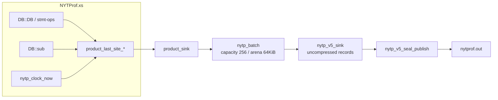
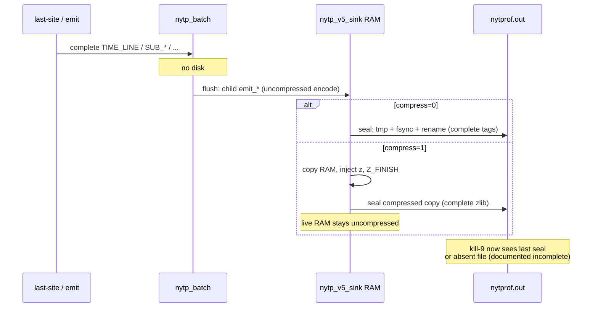
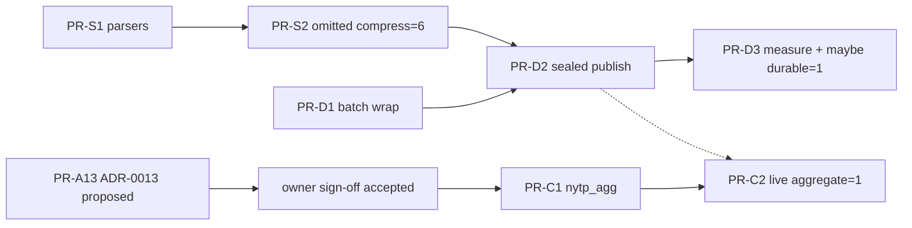

# Profile size and durability (zlib default, sealed v5 flush, in-memory aggregates)

| Field | Value |
|-------|--------|
| **Document title** | Profile size + durability — items 1–3 (6.15-compatible zlib, crash-safe complete-record flush, coalesced checkpoints) |
| **Author** | design-doc-writer (Grok) |
| **Date** | 2026-08-15 |
| **Status** | Approved design; S1/S2/D1/D2 landed; D3 keeps `durable` default **0**; item 3 (`aggregate=1`) still ADR-0013 `proposed` |
| **Repo** | [hilather/nytprof-modernization](https://github.com/hilather/nytprof-modernization) |
| **Does not supersede** | [PROGRAM_CHARTER.md](https://github.com/hilather/nytprof-modernization/blob/main/docs/PROGRAM_CHARTER.md), [01_NON_NEGOTIABLES_AND_COMPATIBILITY_CONTRACT.md](https://github.com/hilather/nytprof-modernization/blob/main/docs/plan/01_NON_NEGOTIABLES_AND_COMPATIBILITY_CONTRACT.md), [AGENTS.md](https://github.com/hilather/nytprof-modernization/blob/main/AGENTS.md), accepted ADRs 0001–0012, [ADR-0008](https://github.com/hilather/nytprof-modernization/blob/main/docs/adrs/0008-r4-v6-output-default-promotion.md) (R4 flip not executed) |
| **New ADR** | **ADR-0013** (charter / plan-01 **exception**; lands `proposed` only in PR-A13 as `docs/adrs/0013-v5-coalesced-checkpoints.md`). Related queue id **ADR-Q027**. Implementation (C1/C2) waits on **project-owner sign-off** and status `accepted` — not the same PR as first acceptance |
| **collection_default** | **v5** (unchanged; not an R4 flip; not COL-007 product-default) |

This document designs three tracks that share one product attach path (`perl -d:NYTProfM` → D1-B `libnytp_sink_v5.a` + `-lz` only). After approval, **PR-S1**, **PR-D1**, and **PR-A13** (docs-only) may start in parallel. Item 3 code (C1/C2) must not merge in the same PR as ADR acceptance.

---

## Overview

Inspectable operator `nytprof.out` files are still a **per-statement NYTProf 5 event stream**. A field (not-in-repo) 25s apples-to-apples run of [`scripts/field/compare_oracle_native_reports.sh`](https://github.com/hilather/nytprof-modernization/blob/main/scripts/field/compare_oracle_native_reports.sh) observed native near **4.2 MB** and oracle near **5.1 MB**; a Rocky demo was near **11 MB**. Those figures are **engineering observations, not fixtures or gates** — they are not recorded in [`docs/BENCH_NOTES.md`](https://github.com/hilather/nytprof-modernization/blob/main/docs/BENCH_NOTES.md). They are the same order of magnitude because both writers emit one `TIME_LINE` / `TIME_BLOCK` per last-site interval. They are also **not** a fair compress comparison: product attach defaults `compress=0` ([`collector/xs/Devel/NYTProfM.pm`](https://github.com/hilather/nytprof-modernization/blob/main/collector/xs/Devel/NYTProfM.pm) `_product_int_opt(..., 'compress', 0)`), while 6.15 defaults zlib **level 6** when `HAS_ZLIB`. The compare script currently passes only `file=` on both sides.

Operators want three things, in increasing semantic cost:

1. **Smaller 6.15-compatible `nytprof.out`** — turn on the same zlib (`z` + `windowBits=15`, level 6) 6.15 already uses. Fix every parser that dies on `z`. Keep `compress=0` as an explicit opt-out. Do **not** put zstd on v5 `z`.
2. **Durability without changing v5 event multiplicity** — wrap the product sink in the existing `nytp_batch` (COL-004/005), flush **only after complete records**, and publish a decoder-ready prefix (or a documented incomplete). A mid-deflate `Z_NO_FLUSH` snapshot is **not** a profile.
3. **A real size win** — in-memory `(fid,line)` and call-edge aggregates with periodic **sealed** checkpoints. That **drops statement/call events and replaces the ordered stream with aggregates**, which charter non-negotiables #2–#4 and plan 01 A2/A4 **forbid**. It is a **charter exception** (ADR-0013 + **ADR-Q027** + **project-owner sign-off**), not a routine representation tweak. Reports keep line/sub/edge **totals**; they lose per-hit sequence and line **hit counts** become checkpoint multiplicity.

```mermaid
flowchart TB
  subgraph today ["Today (D1-B product attach)"]
    H1["DB::DB / stmt-ops / DB::sub"] --> LS1["XS last-site clock"]
    LS1 --> E1["nytp_emit_time_line / time_block per interval"]
    E1 --> V1["nytp_v5_sink in-RAM buffer"]
    V1 --> C1["close: optional z + Z_FINISH + fwrite"]
    C1 --> F1["nytprof.out or nothing on kill"]
  end

  subgraph proposed ["Proposed (three layers, independently shippable)"]
    H2["same hooks"] --> LS2["same last-site clock"]
    LS2 --> AGG{"aggregate=1?<br/>ADR-0013"}
    AGG -->|no item 3| B2["nytp_batch complete events"]
    AGG -->|yes| M2["in-memory line + edge maps"]
    M2 --> B2
    B2 --> V2["nytp_v5_sink uncompressed records"]
    V2 --> S2["sealed publish: tmp + fsync + rename"]
    S2 --> Z2["compress≠0: z + Z_FINISH copy at seal"]
    Z2 --> F2["nytprof.out last sealed snapshot<br/>durable flush+close == idempotent seal"]
  end
```



---

## Background & Motivation

### Current product writer

Product attach is D1-B: [`collector/xs/NYTProf.xs`](https://github.com/hilather/nytprof-modernization/blob/main/collector/xs/NYTProf.xs) holds one `nytp_v5_sink` via `nytp_product_sink_hold()` → `nytp_v5_sink_create(path)`. Statement time is **XS last-site** (`product_last_abs`, `product_last_site_*`, KD-L / PR-8). Each closed interval calls `nytp_emit_time_line` / `nytp_emit_time_block` on that sink. `finish_profiler` flushes the last site, `begin_finalize`s, emits `SRC_LINE` / `SUB_INFO`, then `PID_END`, then `nytp_sink_close`.

[`nytp_v5_sink`](https://github.com/hilather/nytprof-modernization/blob/main/collector/src/nytp_sink_v5.c) accumulates the entire wire in RAM. `write_to_path()` does `fopen(path, "wb")` + `fwrite` of the whole buffer. That happens on `nytp_sink_flush` / `close`, **not** on each emit. A `kill -9` / `POSIX::_exit` mid-run typically leaves **no usable file** (header lives only in the buffer). `sigexit=1` TERM/INT/HUP/PIPE already calls `finish_profiler()`; `_exit` and mid-deflate-in-child remain residual.

`START_DEFLATE` is wired (G03e / DI-09): `compress=1` → `DB::emit_start_deflate()` → tag `z` then `deflateInit2(..., windowBits=15, ..., default level 6)`. Mid-stream `v5_flush` while deflating **does not** call `Z_FINISH`. Schema and header comments already say that snapshot is **not decoder-ready**.

The Rust v5 salvage path ([`crates/nytprof-format-v5/src/reader.rs`](https://github.com/hilather/nytprof-modernization/blob/main/crates/nytprof-format-v5/src/reader.rs)) treats the deflate unit as **all-or-nothing**: inflate + full body decode, or discard from `z` and keep only the pre-`z` prefix. `nytprof-cli salvage` documents the same. COMPAT-010 is **read-side**. It does not make the writer crash-safe.

### Why files are still megabytes

Both 6.15 and NYTProfM emit one `+` / `*` per last-site interval. A packed `TIME_LINE` is roughly 5–13 bytes. A 25s scanner is hundreds of thousands of such records. zlib level 6 typically buys a several-fold reduction on that stream; **coalescing** unique `(fid,line)` buys one to three orders of magnitude, because reports already sum ticks into `LineTotal` ([`ProfileModel::accumulate`](https://github.com/hilather/nytprof-modernization/blob/main/crates/nytprof-model/src/lib.rs): `entry.calls += 1; entry.ticks += ticks`).

### Why `%check` forced `compress=0`

[`t/installed_attach.t`](https://github.com/hilather/nytprof-modernization/blob/main/t/installed_attach.t) `scan_profile()` **dies** on tag `z` (`START_DEFLATE not supported`). [`docs/ROCKY8_DEPLOYMENT_REMAINING_v0.md`](https://github.com/hilather/nytprof-modernization/blob/main/docs/ROCKY8_DEPLOYMENT_REMAINING_v0.md) therefore required default compress off so `perl-NYTProfM.spec` `%check` stayed green. That was a **parser** limitation, not a zlib packaging problem: D1-B already `Requires: zlib` and links `-lz`. DI-09 already proves `compress=1` + shipped dump/verify inflate.

### What already exists and must be reused

| Piece | Status | Honesty |
|-------|--------|---------|
| `nytp_batch` / `nytp_batch_sink_create` / `nytp_fast_emit_time_line` | Landed COL-004/005 | **C unit tests only** (`collector/t/test_batch_fast.c`). **Not** live XS hooks. |
| `nytp_v5_sink` zlib | Landed COL-006 / G03e | `windowBits=15`, default level 6. Mid-deflate flush residual documented. |
| Product `compress=1` | Landed | Opt-in only; default 0. |
| `sigexit=1` | Landed DI-08 | TERM flush; `_exit` residual. |
| Reader salvage / COMPAT-010 | Landed | Read-side; torn zlib body is discarded, never claimed OK. |
| COL-007 C v6 writer | Landed as opt-in | **Not** product collection default. `format=v6` fail-closed on D1-B. |
| `MAX_CALL_SITES = 250_000` | Model fail-closed | Precedent for item 3 map caps. |

---

## Goals & Non-Goals

### Goals

| # | Goal | Success look |
|---|------|----------------|
| 1 | 6.15-compatible size | Omitted `compress` ⇒ zlib **level 6** (6.15 `HAS_ZLIB` default). `compress=0` still disables. `compress=1..9` is that zlib level (6.15 integer-as-level). `%check` / `t/installed_attach.t` treat `z` as first-class. Same scanner pair measured with the **same** compress setting. |
| 2 | Durability, still v5 events | Product sink is `nytp_batch` → `nytp_v5_sink`. Flush pending events on high-water; **seal** on timer + dirty-bytes (not every 4096 events), signals / exit / fork-prepare, **only after complete records**. Kill after N events yields a verify-able sealed prefix **or** a documented incomplete. Never `OK:` on a torn zlib body. Last-site exclusive attribution unchanged (g09 / tokenize shape). `durable` defaults **off** until D3 measures seal cost. |
| 3 | Real size win | Opt-in `aggregate=1` **only after** ADR-0013 is `accepted` with **project-owner sign-off** (charter exception / ADR-Q027): in-memory `(fid,line)` + call-edge maps; periodic sealed checkpoints emit **coalesced** v5 `TIME_LINE` / `TIME_BLOCK` / `SUB_CALLERS`. Fail-closed on oversize maps. `collection_default` stays `v5`. |

### Non-goals

| Non-goal | Residual / owner |
|----------|------------------|
| zstd / lz4 as v5 `z` replacement | Forbidden. zstd framed chunks only on a new v6/checkpoint path (not this default). |
| Flip `collection_default` to v6 / execute ADR-0008 | R4; out of scope. |
| COL-007 as product writer / `format=v6` on D1-B | Fail-closed remains. |
| Byte-identical `nytprof.out` vs 6.15 | Never required (COL-006 residual). |
| Dual_path `compare_jsonl` equality under `aggregate=1` | Charter exception (ADR-0013 / ADR-Q027) explicitly waives dump multiplicity; default attach stays exact. |
| Certified public perf / size SLOs | Light `BENCH_NOTES.md` rows only; not BENCH-* certification. |
| Full 6.15 opcode / `entersub` / `slowops.h` | DI-03 residual. |
| `POSIX::_exit` flush | DI-08 residual (stay fail-closed / empty). |
| Mid-deflate continue-in-child | KD-R16 / DI-06 residual. |
| Automatic salvage as default verify | Forbidden (COMPAT-010). |
| Declaring KD-D4 a closed BASE-003 / plan 05 §5.3 timing ADR | Batch schema residual still names a **dedicated timing ADR**. `durable=1` as product default is a default timing change (ARCH-008). D3 measures; if g09/di01 wobble, stop. |
| Putting `crates/` on oracle `PERL5LIB` | Never. |

---

## Binding constraints (must honor)

- [AGENTS.md](https://github.com/hilather/nytprof-modernization/blob/main/AGENTS.md): every fix lands with a regression test that drives the **real** entry (`perl -d:NYTProfM`, `nytp_emit_*`, `%check`). Keep `./scripts/ci/offline_gate.sh` green. Fixture honesty. No silent capability claims.
- [Charter](https://github.com/hilather/nytprof-modernization/blob/main/docs/PROGRAM_CHARTER.md) non-negotiables **#2–#4** (verbatim):
  2. *No dropped statement, block, call, source, process, or metadata events.*
  3. *No pre-aggregation that replaces the ordered event stream.*
  4. *Preserve event order, timing semantics, **counts**, call relationships, source association, fork/process boundaries, and configuration modes.*
- [Plan 01](https://github.com/hilather/nytprof-modernization/blob/main/docs/plan/01_NON_NEGOTIABLES_AND_COMPATIBILITY_CONTRACT.md) header: a violation **must not merge** without an approved ADR **and explicit project-owner sign-off**; default disposition is **rejection**. A2: decode must restore **exact multiplicity and order**. A4 lists *“replacing ordered events with only line/subroutine aggregates”* as **out of scope**.
- [Plan 05](https://github.com/hilather/nytprof-modernization/blob/main/docs/plan/05_COLLECTOR_AND_C_XS_TASKS.md) §1–§2 is **unconditional** (there is **no** “unless an ADR freezes a new representation” clause): *“The collector remains exact. It must produce the same logical events as 6.15… The only permitted reductions are representational and operational overhead **that does not remove information**.”* §5.3: do not move a clock read around a flush without a **dedicated timing ADR** and oracle test. §6 v5 sink: *same zlib option behavior* (integer `compress` is the zlib level; see KD-S1).
- **Item 3 is a charter / plan-01 exception**, not a routine COL representation tweak. Vehicle = ADR-0013 + **ADR-Q027** + **project-owner sign-off**. Opt-in `aggregate=0` default is **necessary but not sufficient**. [ARCH-008](https://github.com/hilather/nytprof-modernization/blob/main/docs/governance/ARCH-008_ADR_PROCESS.md): agents must not settle this inside implementation patches alone. PR-A13 is docs-only.
- Product attach D1-B: `libnytp_sink_v5.a`, **`-lz` only**.
- 6.15 v5 after `z` is **zlib** `windowBits=15`, default level 6. Mid-stream zlib flush is an unfinished snapshot.
- Apples-to-apples: same scanner, seconds, corpus, **same compress setting**.
- Absolute HTTPS links in README / docs / release notes.
- Light [agent-notes](https://github.com/hilather/nytprof-modernization/blob/main/docs/agent-notes/failed-attempts.md) rows for abandoned approaches (zstd-on-v5, `Z_SYNC_FLUSH` as “durable”, concatenated zlib members as 6.15-readable).

---

## Key Decisions

| ID | Decision | Rationale |
|----|----------|-----------|
| **KD-S1** | Omitted `compress` ⇒ zlib **level 6**. `compress=0` off. `compress=1..9` is that **zlib level** (6.15 integer-as-level / plan 05 §6). `create_ex(path, 0)` when omitted (sink default 6); `create_ex(path, N)` for `N=1..9`. Emit `OPTION compress=` with the **actual** deflate level. | 6.15 passes the integer to `deflateInit2`; `compress=1` is level **1**, not “on at 6.” Today’s NYTProfM `$compress ? 1 : 0` + `create` (level 0 ⇒ 6) is a divergence. Passing user `1` into `create_ex` must yield level 1. |
| **KD-S2** | **Never** put zstd/lz4 on v5 tag `z`. | 6.15 and `nytprof-format-v5` inflate zlib (`0x78` CMF). zstd would silently brick old tools. |
| **KD-S3** | Fix `%check` / `installed_attach.t` **before** flipping the default (separate PR). Nested `z` after inflate is fail-closed. | Rocky remaining-work already recorded this failure mode. Native format-v5 rejects duplicate `START_DEFLATE`. |
| **KD-D1** | Product sink becomes `nytp_batch_sink_create(v5, …)` with a retained `product_v5` child pointer. | Batch exists and is tested; XS still needs `nytp_v5_sink_path` / `is_deflating` / `fork_child_reinit`. |
| **KD-D2** | Durability path **never claims** a live zlib stream is decoder-ready. In-memory records stay **uncompressed**. Seal writes a `z` + `Z_FINISH` **copy**. | `Z_SYNC_FLUSH` and concatenated zlib members are not 6.15/native decoder-ready (all-or-nothing inflate). |
| **KD-D3** | Sealed publish is `path.tmp` + `fsync` + `rename` over `nytprof.out`. Between seals, tail events live in RAM (batch and/or maps). | Today's `fopen("wb")` is not crash-atomic. Last sealed file is the durability unit. |
| **KD-D4** | Periodic seal **reuses** the last-site `now` (no extra `clock_now` on the common path). Seal **does not** emit leftover last-site time. I/O duration is discounted with that `now` plus **one** post-seal `clock_now` (`product_last_abs += dt`), or `DISCOUNT` if evidence requires it (OQ-6). This does **not** close BASE-003. | Plan 05 invariant 4 / §5.3 and the batch MVP residual still name a dedicated timing ADR. Extra hook reads are a new clock-placement choice. |
| **KD-D5** | NYTPROF `durable=0` is close-only (today). **Default `durable=0` until D2 seal exists; stay 0 through D2; flip to 1 only in D3** after 25s-scanner seal-cost + g09/di01 are green. | KD-D5 is not a D1 flip. Default-on `durable` is a default timing + I/O change (ARCH-008). |
| **KD-D6** | When `durable=1`, **both `v5_flush` and `v5_close` are `nytp_v5_seal_publish` and are idempotent**. Never `write_to_path` of live uncompressed RAM. After a successful seal at the current live length, a later flush/close is a no-op write. | Today `nytp_fork_prepare` (`flush_before_fork=1`) → `nytp_sink_flush(root)` → batch drain + **child `v5_flush`** → `write_to_path` (`fopen("wb")`). Redefining only `v5_close` still lets fork (and any other public flush) overwrite a sealed zlib file. `nytp_fork_prepare`’s existing flush **is** the parent seal — no second protocol. |
| **KD-D7** | D2 default seal trigger = **timer using last-site `now` (1 s) and only if dirty uncompressed bytes since last seal ≥ 256 KiB**. No 4096-event full-buffer recompress. High-water still drains the **batch** (encode only; no implicit `fwrite`). | 300k events / 4096 ≈ 73 full-buffer deflates in 25 s plus timer seals is a different overhead class than one zlib pass at close. |
| **KD-D8** | `header_end` is a **cursor recorded at enable** (after uncompressed header tags). Sealed copies insert `z` at that offset; they do **not** rediscover “last pre-body tag.” Product split: `PID_START` + `OPTION compress=` sit **before** `header_end` (uncompressed). | Scanning at seal time is ambiguous once `NEW_FID` / `TIME_*` follow. 6.15 puts `PID_START` **inside** zlib after options; we keep **today’s product** split (PID_START then `z`) so enable/di09 stay one layout. |
| **KD-D9** | `nytp_v5_sink_fork_child_reinit` **must** reset seal cursors: `header_end = len` (rewritten `NYTProf 5 0\n` only), `len_at_last_seal = 0`, `last_seal_ok = 0`. | Parent `header_end` (e.g. 80) left on a 12-byte child buffer makes the next `seal_publish` read `buf[0, header_end)` **past `len`**. Stale `last_seal_ok` can skip the first child seal. |
| **KD-D10** | XS contract (do not invent a second one): `DB::enable_sink(path, compress_level=0, durable=0)`. Perl parses NYTPROF and passes the integers; **C does not re-parse `NYTPROF`**. `nytp_product_sink_hold(path, compress_level, durable)` matches. Test-only `DB::durable_seal_now()` forces one seal (D2 kill smoke). | Today `enable_sink(path)` only. S2 needs `create_ex` level; D1/D2 need `durable`. Two PRs must not invent two signatures. |
| **KD-C0** | Item 3 is a **charter / plan-01 exception** (not “plan 05 already allows an ADR”). Requires ADR-0013 + **ADR-Q027** + **project-owner sign-off**. A13 docs-only `proposed`; accept **before** C2, not inside C1. | Charter #2–#4 and plan 01 A2/A4 forbid dropping events / replacing the ordered stream. Opt-in default is not enough. |
| **KD-C1** | Item 3 checkpoint format = **coalesced v5 records in the same `nytprof.out`**, not a sidecar and not v6/zstd. | 6.15 and native already read `+` / `*` / `c`. No new decoder. `collection_default` stays v5. |
| **KD-C2** | Item 3 is **opt-in** (`aggregate=1`). Default remains per-interval events. Necessary, not sufficient, for the exception. | Dump/JSONL multiplicity and A4 `LineTotal.calls` change. Must not surprise dual_path or 15/3/15 hit-count tests. |
| **KD-C3** | Coalesced `TIME_LINE` is **one `+` per `(fid,line)` per window** with **summed ticks**. Line **calls/hits** become window count, not statement hits. Ticks/seconds stay correct. | v5 `+` has no count field. Emitting N events would erase the size win. |
| **KD-C4** | Call edges coalesce into `SUB_CALLERS` (`count`/`incl`/`excl` summed; **`max_rec_depth`**). `SUB_RETURN` / `SUB_ENTRY` stay live unless a later ADR says otherwise. | `c` already has a count field; reports use it. Model keeps max rec_depth. |
| **KD-C5** | Map caps fail-closed: `NYTP_AGG_MAX_LINE_SITES = 250_000` (same order as `MAX_CALL_SITES`), `NYTP_AGG_MAX_EDGES = 250_000`. | Bounded collector; no silent drop. |
| **KD-C6** | ADR-0013 **does not** flip R4 / `collection_default`. | Exception is a v5 writer mode, not a format promotion. |
| **KD-C7** | After `emit_dirty`, **zero** `ticks`/`hits`/`count`/`incl`/`excl`/`reci` but **keep the slot**. Never “clear dirty bit, keep cumulative.” | Cumulative-per-seal double-counts when readers sum `+`/`c`. Closed decision, not an implementer choice. |
| **KD-X1** | Week-1 parallel: **S1**, **D1**, **A13**. **D2 after S2.** Item 3 **code** waits on A13 `accepted` + owner sign-off (not A13 merge alone). | S2 and D2 both touch `enable_sink` / `emit_start_deflate`; they are not independently mergeable. |

---

## Proposed Design

### Current vs target attach stack



`product_sink` remains the pointer every `nytp_emit_*` uses. Fork, finalize, and tests that call `nytp_v5_sink_*` use `product_v5` (the child).

---

### Item 1 — Size, 6.15-compatible (zlib)

#### Default and option grammar

In [`collector/xs/Devel/NYTProfM.pm`](https://github.com/hilather/nytprof-modernization/blob/main/collector/xs/Devel/NYTProfM.pm):

```perl
# Today (diverges from 6.15):
my $compress = _product_int_opt( $opts, 'compress', 0 );
$Devel::NYTProfM::PRODUCT_COMPRESS = $compress ? 1 : 0;  # any nonzero → enable at sink default 6

# Target (6.15 integer-as-level; plan 05 §6):
#   omitted              → enable, create_ex(path, 0) → deflate level 6
#   compress=0           → off; no z
#   compress=1..9        → enable, create_ex(path, N) → deflate level N
#   other                → fail-closed
# PRODUCT_COMPRESS_LEVEL = actual level (0 = off; 6 when omitted).
```

XS `enable_sink` must call `nytp_v5_sink_create_ex(path, level)` with **that** integer (`0` only when omitted, so the sink applies `NYTP_V5_DEFAULT_COMPRESS`; never map user `1` to `0` or `6`). `nytp_sink_v5.c` already does `level = compress_level > 0 ? compress_level : 6` — passing `1` **is** zlib level 1.

Emit `OPTION compress=<actual deflate level>` **before** `header_end` (6 when omitted, `N` when the user wrote `N`, `0` when off). Do **not** write `compress=1` if the file is level 6.

D1-B stays `-lz` only. If a future no-zlib build appears, fail-closed at `emit_start_deflate` / seal (already `NYTP_ERR_IO` on `deflateInit2` failure) rather than silently writing uncompressed while advertising compress.

##### Composition with `durable` (S2 vs D2)

S2 **only** flips the omitted-`compress` default, extends `enable_sink(path, compress_level=0, durable=0)` (**KD-D10**), and wires `create_ex` + `OPTION compress=`. It **keeps** today’s `if (PRODUCT_COMPRESS && !$durable) { emit_start_deflate() }` (because `durable` is still 0).

D2 **after S2** implements: `durable=1` **does not** call `emit_start_deflate` at enable; `z` appears only inside `nytp_v5_seal_publish`. `durable=0` keeps immediate `emit_start_deflate`. Update [`di09_options_subset_smoke.sh`](https://github.com/hilather/nytprof-modernization/blob/main/scripts/packaging/di09_options_subset_smoke.sh) in the **same PR that first stops calling `emit_start_deflate` on the default path** (D3, when `durable` defaults on): assert `z` on the **file**, not a live Perl `emit_start_deflate` grep as the sole proof. Until then, di09’s grep of the `.pm` remains valid.

#### Parser / `%check` (must land first)

[`t/installed_attach.t`](https://github.com/hilather/nytprof-modernization/blob/main/t/installed_attach.t) and [`t/nytprof_v5_tag_table.inc`](https://github.com/hilather/nytprof-modernization/blob/main/t/nytprof_v5_tag_table.inc):

1. On tag `z`, slurp the remainder and inflate with **`Compress::Raw::Zlib`** (`WindowBits => 15`). **Fail closed on oversize before allocating** the inflated SV (cap e.g. 64 MiB; `MAX_STR` 1 MiB is per-string only).
2. Parse the inflated body with the existing tag table **with `z` forbidden** (nested `START_DEFLATE` → die). Native `nytprof-format-v5` already rejects a second `z` inside the inflated body.
3. Fail closed on inflate error (do **not** claim 15/3/15 on a torn body).
4. RPM: add `BuildRequires: perl(Compress::Raw::Zlib)` for `%check`. EL8 AppStream provides `perl-Compress-Raw-Zlib`. Runtime `Requires:` is optional (operators do not run `%check`).
5. If `Compress::Raw::Zlib` is absent in a host prove, **fail** with a clear "need Compress::Raw::Zlib to parse zlib profiles" — do not skip, because after S2 the default file **is** zlib.

Do **not** shell out to `nytprof-cli` in `%check`: the module RPM `%check` is attach-only and must stay cargo-free.

DI-09 already covers explicit `compress=1` + CLI dump/verify. Keep it. Add a default-attach assertion (no `compress=` in `NYTPROF`) that the file contains `z` and zlib CMF `0x78`.

Any other in-tree raw tag walker that dies on `z` must be updated in the same S1 PR (grep `START_DEFLATE not supported` / `tag eq 'z'`).

#### Measurement (engineering, not certification)

Extend [`scripts/field/compare_oracle_native_reports.sh`](https://github.com/hilather/nytprof-modernization/blob/main/scripts/field/compare_oracle_native_reports.sh):

- After S2, **omitting** `compress=` on **both** sides already matches (6.15 default 6, NYTProfM omitted → 6). Still add `--compress N` applied to **both** `NYTPROF` strings for explicit pairs.
- Record `stat` sizes of `oracle/nytprof.out` and `native/nytprof.out` in `COMPARE.txt`.
- Do **not** disable compress on only one side.

Append a light row to [`docs/BENCH_NOTES.md`](https://github.com/hilather/nytprof-modernization/blob/main/docs/BENCH_NOTES.md): command, host class, both sizes, `claim: none`. Same scanner, same `--seconds`, same corpus.

Expected **direction** (not a gate): after S2, native compressed size should drop well below the field-observed ~4.2 MB **uncompressed** native file. The field-observed oracle ~5.1 MB is already compressed; do not treat 4.2 vs 5.1 as a compress win. Those sizes are **not in-repo**.

#### Residuals (item 1)

- Mid-deflate-in-child still residual.
- Product still does fewer/more `TIME_LINE` events than 6.15 opcode attach — size will not match byte-for-byte even at the same compress level.
- Light harness is not BENCH certification.

---

### Item 2 — Durability, still v5 events

#### Wrap the product sink

Today:

```c
/* nytp_product_sink_hold — today */
product_sink = nytp_v5_sink_create(path);
```

Target (**KD-D10** — one signature from S2/D1 onward):

```c
/* Perl: DB::enable_sink($path, $compress_level, $durable)
 *   compress_level: 0 = omitted → sink default 6; 1..9 = zlib level
 *   durable:        0/1 from NYTPROF (Perl parsed; C does not re-parse)
 */
static nytp_status nytp_product_sink_hold(const char *path,
                                         int compress_level, int durable);

static nytp_sink *product_sink;     /* public emit target (batch or v5) */
static nytp_sink *product_v5;       /* wire child; never NULL when product_sink is */

product_v5 = nytp_v5_sink_create_ex(path, compress_level);
if (durable) {
    product_sink = nytp_batch_sink_create(
        product_v5,
        NYTP_PRODUCT_BATCH_CAPACITY,  /* 256 */
        NYTP_PRODUCT_BATCH_ARENA,     /* 65536 */
        NYTP_PRODUCT_BATCH_HIGHWATER, /* 256 */
        /* owns_child */ 1);
} else {
    product_sink = product_v5;
}
```

Statement hot path should use `nytp_fast_emit_time_line` / `_time_block` when `nytp_batch_sink_batch(product_sink)` is non-NULL (already in [`nytp_batch.h`](https://github.com/hilather/nytprof-modernization/blob/main/collector/include/nytp_batch.h)). Metadata / `SUB_*` stay on `nytp_emit_*` (batch sink vtable copies strings into the arena).

**Unwrap points** that today assume `product_sink` is v5:

| Call site | Must use |
|-----------|----------|
| `nytp_v5_sink_path` / `rebind_path` / `detach_path` | `product_v5` |
| `nytp_v5_sink_is_deflating` / `is_v5` | `product_v5` |
| `nytp_v5_sink_fork_child_reinit` | `product_v5` after `nytp_fork_resume_child` |
| `nytp_product_sink_reopen_open` (M4 mini) | recreate both layers |
| `DB::is_deflating` | child |

`nytp_batch` already preflushes on `notify_begin_fork` and discards on `notify_end_fork_child` (COL-015). Keep that. Do not invent a second fork protocol.

After `product_emit_header_and_pid_start` **and** `OPTION compress=` (S2), record `vi->header_end = vi->len`. All later emits append after that cursor. Sealed zlib copies insert `z` at `header_end` and deflate `buf[header_end .. len)`.

**Fork residual (durable) + cursor reset (KD-D9):** `nytp_v5_sink_fork_child_reinit` (must use `product_v5`) wipes the child buffer to `NYTProf 5 0\n` and does **not** re-emit `PID_START` / options. In the **same** function it **must** set:

```c
vi->header_end = vi->len;      /* 12-byte "NYTProf 5 0\n" only */
vi->len_at_last_seal = 0;
vi->last_seal_ok = 0;
```

If those cursors stay at the parent’s values, the next child `seal_publish` reads `buf[0, header_end)` **past `len`** (overflow / garbage `z` insert), or `last_seal_ok && len == len_at_last_seal` skips a needed first child seal.

A parent seal on `fork_prepare` is the existing `nytp_sink_flush` (KD-D6: that flush **is** `seal_publish`; do not add a second seal call). The child’s first file until more work is **header-only** (COMPAT-010 incomplete; missing `PID_START`). Do **not** claim fork+durable is 6.15-complete. No new mid-deflate-in-child claim (KD-R16).

**C unit (D2):** parent records `header_end > 12`, `fork_child_reinit`, child’s `header_end == wire_len` (12) and `seal_publish` does not read past `len`.

#### Flush triggers (complete records only)

| Trigger | Where | What happens |
|---------|--------|----------------|
| High-water / capacity | `nytp_batch_append_*` | Pending complete events → child **encode only** (`nytp_batch_flush` / fast path). **No** implicit `fwrite` / seal. |
| Timer + dirty bytes | stmt / `DB::sub` hook: compare **already-read last-site `now`** to `product_last_seal_abs`; period **1 s** (10M ticks) **and** `live_len - len_at_last_seal ≥ 256 KiB` | batch drain + `nytp_v5_seal_publish` |
| `sigexit` / `finish_profiler` | existing handler | last-site → batch → finalize records → **`v5_close` == seal** (KD-D6) |
| `nytp_fork_prepare` | existing `flush_before_fork=1` → `nytp_sink_flush(root)` | batch drain + **child `v5_flush` == `seal_publish`** (parent snapshot). **Do not** add a second seal after flush. |
| `durable=0` | no seals | today's close-only `write_to_path` / live `z`; `v5_flush` mid-deflate residual unchanged |

There is **no** default “every 4096 events, recompress the whole buffer.” Worst-case CPU if we had: ~300k `TIME_LINE`s / 4096 ≈ 73 full-buffer deflates in 25 s plus ~25 timer seals, each later pass compressing a growing ~4 MB buffer **on the statement hook**. That is a different class than 6.15’s one zlib pass at close; it can change work-per-wall-second (AGENTS.md apples-to-apples) and is the g09 exclusive-time risk.

Timer **must not** allocate or `fwrite` from a POSIX signal handler. `sigexit` already calls Perl `finish_profiler` (same as today; not async-signal-safe; residual). Periodic seal is a check against the **last-site `now`**, not a second `clock_now` and not `SIGALRM`.

#### Decoder-ready vs residual (the honest split)



| On-disk bytes | 6.15 / native verify | Salvage | What we may print |
|---------------|----------------------|---------|-------------------|
| Complete uncompressed tags, no `z` | Prefix decodes; COMPAT-010 may fail on missing `PID_END` / no statements | Longest complete tag prefix | `INCOMPLETE:` if no `PID_END`; never `OK:` unless stream-complete |
| Sealed `z` + `Z_FINISH` of those tags | Inflate + decode; same completeness rules | Full deflate unit kept | Same |
| Mid-deflate `Z_NO_FLUSH` snapshot | Inflate fails | Discard from `z` | **Must not** `OK:`. Residual only if `durable=0` and someone `kill`s during close |
| Torn last tag (partial write) | Fail closed / salvage prefix | Drop torn tail | Incomplete |

**Chosen durable algorithm (KD-D2 / KD-D3 / KD-D6 / KD-D8):**

1. Live encode is **always uncompressed** in the v5 RAM buffer when `durable=1`. Do **not** call `emit_start_deflate` at `enable_sink` when `durable=1`.
2. At enable, after header + `ATTRIBUTE` / `OPTION compress=` / `COMMENT` / `PID_START`, set `header_end = len`. **Do not** rediscover the split at seal time.
3. `nytp_v5_seal_publish(sink)`:
   - If `compress==0`: write RAM buffer to `path.tmp`, `fsync`, `rename` → `path`.
   - If `compress!=0`: build a **copy** `prefix = buf[0, header_end)` + `z` + `deflateInit2(actual_level, windowBits=15)` + `Z_FINISH(buf[header_end, len))`. Write that copy to `path.tmp`, `fsync`, `rename`. Live RAM is unchanged (still uncompressed, no live `zs`).
   - Set `len_at_last_seal = len`, `last_seal_ok = 1`.
4. Next seal is skipped unless `len - len_at_last_seal ≥ 256 KiB` **and** last-site `now - product_last_seal_abs ≥ 1 s` (except process-end / fork-prepare / `sigexit`, which always seal if dirty).
5. **When `durable=1`, both `v5_flush` and `v5_close` are `seal_publish` and are idempotent (KD-D6):** if `last_seal_ok && len == len_at_last_seal`, return `NYTP_OK` without `write_to_path`. If live bytes grew (finalize `SRC_LINE` / `SUB_INFO` / `PID_END`, or emits since last seal), seal once more then no-op further flush/close at that length.
6. `nytp_product_sink_drop` / `finish_profiler`: last-site flush → finalize → `nytp_sink_close` (durable ⇒ seal). `nytp_fork_prepare` → existing `nytp_sink_flush(root)` (durable ⇒ same seal). **Neither** path may `write_to_path` the live uncompressed buffer.
7. `durable=0`: keep today's immediate `emit_start_deflate` + `v5_flush` / `v5_close` → `write_to_path` (mid-deflate flush residual unchanged; document, do not claim durable).

`write_to_path` remains for `durable=0` and C unit tests. It is **not** the product flush **or** close path when `durable=1`.

**C units (D2):** (a) seal compressed → `nytp_sink_close` → on-disk still `NYTProf 5` + `z` + inflates to `PID_END`. (b) seal compressed → `nytp_sink_flush` → on-disk still contains `z` and inflates (fork-prepare path).

**Rejected as “decoder-ready”** (record in agent-notes when abandoned in implementation):

- `Z_SYNC_FLUSH` / `Z_FULL_FLUSH` of a single live stream — no Adler32 trailer; salvage discards the unit.
- Concatenated zlib members after one `z` — native/6.15 inflate once to `Z_STREAM_END` and stop.
- Claiming COMPAT-010 salvage of a torn zlib body as a successful profile.

#### Last-site clock (must not break exclusive time)

Last-site is independent of the batch:

```
clock_now (the existing last-site read)
  → emit elapsed to previous site
  → reseed last_*
  → maybe batch high-water encode (no disk)
  → if (now - last_seal_abs >= 1s && dirty >= 256KiB) seal
```

**Rule (KD-D4):** **reuse** the last-site `now` for the 1 s check — **no extra `nytp_clock_now` on the common path**. If a seal runs, take **one** post-seal `clock_now` and discount:

```c
/* `now` already read for last-site attribution */
if (durable && product_has_last_site
    && now - product_last_seal_abs >= NYTP_TICKS_PER_SEC
    && (vi->len - vi->len_at_last_seal) >= 262144u) {
    nytp_status st = nytp_v5_seal_publish(product_v5);
    nytp_ticks t1 = 0;
    if (nytp_clock_now(&t1) == NYTP_OK && t1 > now)
        product_last_abs += (t1 - now); /* discount I/O; do not emit TIME_LINE */
    product_last_seal_abs = now;        /* or t1; pick one and test g09 */
}
```

Do **not** move the last-site **read** to the other side of flush. Do **not** flush last-site on a periodic seal (that would close the open interval early and steal time from the next statement). Only `finish_profiler` / process-end flushes last-site.

This is **not** a closed BASE-003 / plan 05 §5.3 decision. The batch schema residual still lists “Flush / compression discount timing vs BASE-003 → dedicated timing ADR.” Shipping `durable=1` as the **product default** is a default timing change (ARCH-008). **Do not flip `durable` default on until g09 + di01 ticks are green** on the 25s scanner with the seal trigger above. If those gates wobble, stop for that timing ADR — do not treat KD-D4 as having closed it.

Emit `DISCOUNT` only if evidence requires the tag (OQ-6); prefer `last_abs += dt` so item-2 dump multiplicity stays stable.

#### Tests (drive real attach)

New smoke `scripts/packaging/di_durable_kill_smoke.sh`, plus dest `.so` prove. **Do not** claim `t/workload-calls1.pl` (or any “tiny loop”) mid-run seals: that file is kilobytes and finishes in well under 1 s, so the production trigger (1 s **and** ≥256 KiB dirty) **never fires**. Process-end / `sigexit` tests stay on the always-seal-if-dirty path (they do not need the timer).

**Hittable mid-run seal (pick one; both are allowed):**

- **(preferred)** Test-only `DB::durable_seal_now()` (D2 XSUB → `nytp_v5_seal_publish` if `durable=1`). Smoke child: real `-d:NYTProfM`, emit some `TIME_LINE`s (workload-calls1 or a few statements), call `DB::durable_seal_now()`, then `sleep` until the parent `kill -9`s. Parent polls `DB::durable_seals()` or file size.
- **(optional extra)** A dedicated loop that runs ≥1 s **and** writes ≥256 KiB of uncompressed tags — only if we also want to exercise production thresholds. Not a substitute for `durable_seal_now()` (CI must not depend on wall-clock + size).

Then:

1. Child as above with `NYTPROF=file=…:durable=1` (and a compress pair).
2. After **at least one forced seal**, `kill -9` the child.
3. **`compress=0:durable=1`:** dump/salvage yields complete tags; verify is **non-zero** incompleteness (`missing PID_END`) unless we sealed a finalize (we should not on kill). Assert `TIME_LINE >= 1` on the prefix.
4. **`compress=1:durable=1`:** file is a **complete** zlib unit (`dump` inflates). Salvage does **not** discard a torn `z` on this path. **C units:** seal → close still zlib+`PID_END`; seal → **flush** still zlib (issue 1).
5. **`durable=0:compress=1` + kill during run:** missing or torn zlib; never `OK:`.
6. g09 / di01 still green **before** flipping default `durable=1`.
7. `make -C collector test` still green.

Do **not** reimplement the writer in the test.

#### Memory honesty (item 2)

Item 2 does **not** shrink RAM. The v5 sink still holds the full uncompressed stream (field-observed demos ~4–11 MB uncompressed). Batch adds ~256 × `sizeof(nytp_event)` + 64 KiB ≈ 90 KiB. Item 3 is the memory win.

---

### Item 3 — Real size win (aggregates + sealed checkpoints)

This track **drops statement events and replaces the ordered stream with aggregates**. That is **charter #2–#4 / plan 01 A2/A4 out of scope**, not “plan 05 already allows an ADR.” It ships only after:

1. **PR-A13** lands ADR-0013 + ADR-Q027 as **`proposed`** (docs only; Evidence section complete).
2. **Project-owner sign-off** flips ADR-0013 to **`accepted`** (its own docs PR or a sign-off commit — **not** inside C1).
3. **PR-C1 / PR-C2** implement behind `aggregate=0` default.

[ARCH-008](https://github.com/hilather/nytprof-modernization/blob/main/docs/governance/ARCH-008_ADR_PROCESS.md): agents must not settle this inside implementation patches alone. Opt-in default is **necessary but not sufficient**.

#### What is lost / kept

| Kept | Lost |
|------|------|
| Sum of ticks per `(fid,line)` / `(fid,block_line)` (A4 / A4b **ticks**) | Per-hit `TIME_LINE` sequence and interleaving with `SUB_ENTRY` |
| Sum of `SUB_CALLERS` count / incl / excl / reci | Per-return `c` multiplicity |
| `SUB_RETURN` A5 sub totals (still live) | Line **calls** (`LineTotal.calls`) = statement hits. Becomes **number of windows that site appeared in** |
| `NEW_FID` / `SRC_LINE` / `SUB_INFO` / PID pair | Ability to reconstruct exact statement order for a flame-from-events (native flame already uses edges) |
| 6.15 and native **readers** (same tags) | dual_path `compare_jsonl` vs 6.15 on `aggregate=1` |

HTML "Executed N statements" (`time_line_events`) will drop from O(hits) to O(sites × windows). Docs and ADR must say so. Do **not** retune golden 780-call fixtures to pass under `aggregate=1`; those tests run with default `aggregate=0`.

#### In-memory maps

New module `collector/include/nytp_agg.h` + `collector/src/nytp_agg.c` (C, no Rust on the hot path):

```c
#define NYTP_AGG_MAX_LINE_SITES 250000u
#define NYTP_AGG_MAX_EDGES      250000u

typedef struct nytp_agg_line {
    nytp_fid fid;
    nytp_line line;
    nytp_line block_line; /* 0 if TIME_LINE */
    nytp_line sub_line;
    int is_block;
    uint64_t hits;        /* in-RAM only; not a v5 field */
    nytp_ticks ticks;
} nytp_agg_line;

typedef struct nytp_agg_edge {
    nytp_fid fid;
    nytp_line line;
    uint32_t count;          /* zeroed after emit_dirty */
    double incl, excl, reci; /* zeroed after emit_dirty */
    uint32_t max_rec_depth;  /* max in this window; emit then zero with the other fields */
    /* caller / called interned into a bounded string arena */
} nytp_agg_edge;
```

Lookup: open-addressed tables keyed by `(fid,line,is_block,block_line)` and `(fid,line,caller,called)`. On insert past cap → `NYTP_ERR_OVERFLOW`, sticky-fail the sink (same class as ticks > I32). No silent eviction.

`hits` is retained for optional `COMMENT` / `ATTRIBUTE nytprof.agg.hits_dropped=1` diagnostics, **not** reconstituted as N wire events.

#### Emit path when `aggregate=1`

```
last-site elapsed ready
    → nytp_agg_add_line(...)          /* no wire yet */
SUB_CALLERS from DB::sub
    → nytp_agg_add_edge(...)          /* no wire yet */
SUB_ENTRY / SUB_RETURN / NEW_FID / ATTR / OPTION / PID_*
    → nytp_emit_* through batch       /* live, small */
checkpoint / finish
    → for each dirty line: nytp_emit_time_line|time_block(sum_ticks, ...)
    → for each dirty edge: nytp_emit_sub_callers(count, incl, excl, reci, max_rec_depth)
    → zero ticks/hits/count/incl/excl/reci/max_rec_depth; keep the slot (KD-C7)
    → if durable=1: nytp_batch_flush + nytp_v5_seal_publish
    → if durable=0: encode only; disk write at process close
```

**Window policy (closed):** emit **dirty-delta** since last checkpoint (one `+`/`*` per dirty site). After `emit_dirty`, **zero** `ticks`/`hits`/`count`/`incl`/`excl`/`reci` / `max_rec_depth` but **keep the hash slot** (no free). Do **not** “clear a dirty bit and keep cumulative ticks” — the next emit would repeat the total and readers that sum `+`/`c` would **double-count**. C unit test: add 10, emit, add 5, emit → two records **10 then 5**, never 15 then 20. Same for edge `count`/`incl`/`excl`. `rec_depth` on the wire is **`max_rec_depth`** in the window (`ProfileModel::accumulate` keeps max).

**Periodic item-3 checkpoint does not close the open last-site interval** (same rule as KD-D4). Only `finish_profiler` flushes last-site **into the map** (not directly to wire), then `emit_dirty`, then finalize `SRC_LINE` / `SUB_INFO` / `PID_END`, then seal-or-close.

**`aggregate=1:durable=0`:** maps + **single** `emit_dirty` at process end. Valid. No mid-run seal. C2 may land this path even if D2 is late; periodic checkpoints require D2.

#### Checkpoint format choice (KD-C1)

**Chosen:** complete v5-compatible records in the same `nytprof.out`.

A 6.15 `nytprofhtml` or native `nytprof-cli report` of a sealed `aggregate=1` file sees fewer `+` tags with larger ticks. Line **time** is right. Line **calls** are understated. That is the ADR trade.

**Rejected:** versioned sidecar (`nytprof.out.ckpt`) as the product path — two files to copy, old tools ignore the sidecar, operators still want one `nytprof.out`. Allowed later as a debug dump, not the ship vehicle.

**Rejected:** v6/zstd chunks as this default — would flip collection off v5 or create a hybrid wire. zstd framed chunks remain legal only on an explicit v6/checkpoint path after a **different** ADR.

Write `ATTRIBUTE nytprof.aggregate=1` and `OPTION aggregate=1` so dump/report can explain hit-count shape. Unknown to 6.15 as extra attributes (6.15 keeps unknown attributes).

#### Bounds and cost

| Map | Cap | Approx RAM at cap |
|-----|-----|-------------------|
| Line sites | 250k | ~250k × 40 B ≈ 10 MB |
| Edges | 250k | ~250k × (32 B + interned names) ≈ 10–20 MB |

Fail closed before those allocations grow without bound. A 25s scanner is tens to hundreds of unique lines — maps stay tiny; **this** is the size win (kilobytes of `+` instead of megabytes).

Hot path: hash lookup + add ticks. No malloc after create (pre-size tables; grow by doubling up to cap, then fail). Statement path still must not call general `malloc` on the common hit (plan 05 §2.2). First-seen site may allocate until cap.

#### Tests (item 3)

1. **C unit:** add ticks twice to the same `(fid,line)` → one emit of summed ticks; add 10, emit, add 5, emit → records **10 then 5**; cap overflow sticky-fails; ASAN clean.
2. **Live attach** (`perl -d:NYTProfM`, `NYTPROF=...:aggregate=1`): workload-calls1 still has leaf/mid **returns** 15/3. Mid→leaf edge **count field** sums to 15 — parse `SUB_CALLERS.count` (or `nytprof-cli dump` / report JSON). **Do not reuse** `t/installed_attach.t` `scan_profile`: it `skip_u32`s `count` and does `$edge += 1` **per `c` tag**, so one coalesced `c` with `count=15` would read as **edge=1**. `t/installed_attach.t` / `%check` stay `aggregate=0` **forever**. di01 `line_calls=780` is **TIME_BLOCK event occupancy**, not ticks — same trap; never run di01 with `aggregate=1` as that bar.
3. **Hits honesty:** A4 `line_totals.calls` on the hot loop is **not** asserted equal to the per-event run; a comment in the test cites ADR-0013 / charter exception.
4. **Kill after a checkpoint** (`aggregate=1:durable=1`): sealed file inflates/decodes; ticks prefix ≤ final; no torn zlib `OK:`.
5. **Fail-closed cap:** test hook or a tight `NYTP_AGG_MAX_*` rebuild that inserts past cap → attach fails, no silent continue.
6. **Default off:** existing 15/3/15, di01 780, g09 unchanged when `aggregate` omitted.
7. **capability:** do **not** claim a new `collection_default`. Optional new keys (`aggregate_checkpoints`) only if tests assert them; otherwise omit (no silent claim).

#### Interaction with items 1–2

Tracks compose (item 3 periodic checkpoints need D2; `aggregate=1:durable=0` is finish-only):

| NYTPROF | Wire multiplicity | On-disk size (direction) | Crash artifact |
|---------|-------------------|--------------------------|----------------|
| default after S2 (`durable=0`) | per-interval + live `z` | smaller than field ~4.2 MB uncompressed native | none / torn zlib (residual) |
| `durable=1` after D3 flip | per-interval + zlib **seal** | same class as S2 at clean exit | last sealed zlib snapshot |
| `compress=0:durable=1` | per-interval uncompressed | ~field uncompressed | last sealed uncompressed prefix |
| `aggregate=1:durable=1` | coalesced + zlib seal | **much** smaller | last sealed coalesced snapshot |
| `aggregate=1:compress=0:durable=1` | coalesced uncompressed | small | last sealed coalesced tags |
| `aggregate=1:durable=0` | coalesced once at **finish** | small at clean exit | none / torn (same as today) |
| `durable=0` (no aggregate) | today's close-only | (compress per S2) | none / torn (residual) |

---

## API / Interface Changes

### NYTPROF options (product parser)

Add to `%PRODUCT_NYTPROF_KNOWN`:

| Key | Default | Meaning |
|-----|---------|---------|
| `compress` | omitted → **level 6** (after S2) | 0 off; **1..9 = zlib level** (6.15); omitted = 6 |
| `durable` | **0** until D3 flip | 0 = close-only (live `z` if compress); 1 = sealed publish, delay `z` |
| `aggregate` | **0** | 1 = ADR-0013 maps + coalesced emit (after owner-accepted ADR) |

Unknown keys still croak. `format=v6` still fail-closed on D1-B.

### XS `enable_sink` contract (KD-D10) — S2 and D1/D2 share this

Today: `int enable_sink(path)` then Perl `emit_start_deflate()` if `$PRODUCT_COMPRESS`.

**From S2 onward, one signature** (Perl passes integers it already parsed; C does **not** read `$ENV{NYTPROF}`):

```perl
# collector/xs/NYTProf.xs
int
enable_sink(path, compress_level = 0, durable = 0)
    const char *path
    int compress_level    /* 0 = omitted → create_ex default 6; 1..9 = zlib level */
    int durable           /* 0/1 */

# collector/xs/Devel/NYTProfM.pm (after parse)
my $level = exists $opts->{compress} ? 0 + $opts->{compress} : 0;  # 0 = omitted
my $durable = _product_int_opt($opts, 'durable', 0);
# S2: $level is real; $durable is 0 until D2/D3 Perl starts passing 1
enable_sink($path, $level, $durable);
if ($Devel::NYTProfM::PRODUCT_COMPRESS && !$durable) {
    emit_start_deflate();   # durable=0 only (composition rule)
}
```

| PR | What Perl passes | What C does |
|----|------------------|-------------|
| **S2** | `($path, $level, 0)` | `create_ex(path, $level)`; no batch unless D1 already wrapped with `durable==0` |
| **D1** | still `($path, $level_or_0, 0)` | `hold(path, level, durable)`; wrap batch only if `durable` |
| **D2** | `($path, $level, $PRODUCT_DURABLE)` | delay `z` when `durable==1`; flush/close = seal |

Do **not** add `DB::set_product_writer_opts` as a second required call before hold (easy to forget). Optional later, not the contract.

### C surfaces (new or extended)

```c
/* nytp_sink_v5.h — sealed publish (item 2) */
nytp_status nytp_v5_seal_publish(nytp_sink *sink);
/* Durable path: write a decoder-ready snapshot (uncompressed tags, or
 * prefix[0, header_end) + z + Z_FINISH(copy of remainder)) via
 * tmp+fsync+rename. Live buffer stays uncompressed. Idempotent if
 * len == len_at_last_seal && last_seal_ok.
 * When durable=1, v5_flush AND v5_close == this function (must NOT
 * write_to_path the live uncompressed buffer). nytp_fork_prepare's
 * nytp_sink_flush is therefore the parent seal.
 * If a live deflate stream is active (durable=0 path), return NYTP_ERR_STATE.
 *
 * fork_child_reinit: header_end = len; len_at_last_seal = 0; last_seal_ok = 0. */

/* nytp_agg.h — item 3 */
nytp_agg *nytp_agg_create(size_t max_lines, size_t max_edges);
nytp_status nytp_agg_add_line(nytp_agg *, nytp_ticks, nytp_fid, nytp_line,
                              int is_block, nytp_line block_line, nytp_line sub_line);
nytp_status nytp_agg_add_edge(nytp_agg *, nytp_fid, nytp_line,
                              uint32_t count, double incl, double excl, double reci,
                              uint32_t rec_depth,
                              nytp_string_view called, nytp_string_view caller);
/* Emit dirty maps through sink ops (not public wrappers — preserve seq). */
nytp_status nytp_agg_emit_dirty(nytp_agg *, nytp_sink *sink);
void nytp_agg_destroy(nytp_agg *);
```

XS additions (test/operator, not required on the hot path):

- `DB::enable_sink(path, compress_level=0, durable=0)` — **KD-D10** (replaces path-only).
- `DB::durable_seals()` → UV counter (tests).
- `DB::durable_seal_now()` → force one `nytp_v5_seal_publish` when `durable=1` (D2 kill smoke; not a production hook).
- `DB::is_deflating()` already exists; on the durable path it stays **0** (live stream is uncompressed).

### Capability JSON

Do **not** drop `collection_default` / `v6_decode` / `convert` / `merge` / `repack` / `salvage`. `collection_default` remains `"v5"`.

Do **not** add `v6_collect` default claims. Optional later: `compress_default: 6` only if `capability_selftest` is updated in the same PR.

---

## Data Model Changes

No v5 tag changes. No v6 wire changes. No golden fixture rewrites for default attach.

Item 3 introduces **writer-side aggregation** of existing tags:

| Tag | Default | `aggregate=1` |
|-----|---------|----------------|
| `+` TIME_LINE | one per last-site interval | one per dirty `(fid,line)` per window; ticks = sum |
| `*` TIME_BLOCK | one per interval | one per dirty `(fid,line,block_line,sub_line)` per window |
| `c` SUB_CALLERS | one per return (`count=1`) | one per dirty edge per window; count/incl/excl summed |
| `<` `>` | live | live |
| `@` `S` `s` `P` `p` `:` `!` `#` | unchanged | unchanged |
| `z` | after `PID_START` if compress (today’s product; 6.15 puts `z` **before** `PID_START`) | `durable=0`: same live `z` after `header_end`. `durable=1`: only inside a **sealed copy** at `header_end` (PID_START stays uncompressed) |

`ProfileModel` needs **no** schema change. A4 `calls` semantics become "timing-event count", which is already how `accumulate` works — the writer just emits fewer events.

Migration: old uncompressed / per-event files remain readable. New compressed defaults are readable by 6.15 and native once `z` parsers are fixed (S1). Operators with scripts that `grep` raw `+` tags must inflate first — document in the runbook.

---

## Alternatives Considered

### Item 1

| Alternative | Correctness / compat | Size | Reliability | Why |
|-------------|----------------------|------|-------------|-----|
| **A. Omitted = zlib 6; `1..9` = that level** (chosen) | 6.15 integer-as-level; plan 05 §6 | Several-fold vs today's native `compress=0` | `%check` needs inflate | Same `deflateInit2` integer 6.15 uses; `OPTION compress=` is truthful |
| B. Keep `compress=0` default | Status quo | No default win | `%check` stays dumb | Rejected: operators asked for size; parser is the real blocker |
| C. zstd on v5 `z` | Breaks 6.15 + format-v5 | Better ratio | High | **Forbidden** |
| D. Wait for v6/COL-007 default | R4 | Best long-term | Unrelated | Rejected as the *first* size fix; R4 not executed |
| E. Product `compress=1` means “on at level 6” (today’s NYTProfM) | Diverges from 6.15; `create_ex(path, 1)` is a footgun | Same as A if omitted=6 | High confusion | **Rejected**: 6.15 POD “Using level 1 still gives you a significant reduction”; passing `1` to `create_ex` must be level 1 |

### Item 2

| Alternative | Decoder-ready mid-run? | 6.15? | Why |
|-------------|------------------------|-------|-----|
| **A. Uncompressed RAM + sealed z-copy** (chosen) | Yes (last seal) | Yes on seal/close | Honest; reuses salvage rules |
| B. Live zlib + `Z_SYNC_FLUSH` | **No** | No | Trailer missing; salvage drops unit |
| C. Concatenated zlib members | Only if we teach every decoder to loop | **No** for 6.15 | Abandoned; note in agent-notes |
| D. Sidecar only | Sidecar maybe | Main file stale | Worse UX |
| E. `durable=0` only (document kill) | No | N/A | Does not meet the ask |

### Item 3

| Alternative | Dump equality | Size | Reader work | Why |
|-------------|---------------|------|-------------|-----|
| **A. Coalesced v5 in-file** (chosen, **charter exception**) | **Breaks** multiplicity (ADR-0013 + owner sign-off) | Large win | None | 6.15 already sums `+`/`c`; still requires plan-01 exception |
| B. Emit N `TIME_LINE`s to keep hits | Preserves hits | **No win** | None | Rejected |
| C. v6 TIME_LINE_RUN default | New format | Win | Need v6 collect | Would fight `collection_default=v5` |
| D. Checkpoint sidecar + zstd | Breaks single-file | Win | New decoder | Rejected as product path |
| E. Do nothing until R4 | Preserves 6.15 dump | No v5 win | — | Rejected; operators need v5 size now |

---

## Security & Privacy Considerations

| Threat | Severity | Mitigation |
|--------|----------|------------|
| Decompression bomb on `%check` inflate | Med | Fail-closed inflated-body cap (e.g. 64 MiB) **before** allocating the SV. `MAX_STR` 1 MiB is per-string only. Nested `z` after inflate is fail-closed. Same spirit as format-v5 / SEC-004. |
| Oversize aggregate maps | Med | Fail-closed at 250k (KD-C5). No silent drop. |
| Torn file claimed healthy | High | Never `OK:` on inflate failure; COMPAT-010 unchanged. Tests include kill-after-seal **and** durable=0 torn-zlib. |
| tmp+rename races / leftover `nytprof.out.tmp` | Low | `O_EXCL` or unlink-before-create in the profile directory; destroy unlinks tmp. |
| Signal handler I/O | Med | Periodic seal not from a signal. `sigexit` stays today's Perl handler (known residual). |
| Path injection via `file=` | Existing | Unchanged; still operator-controlled. |
| PII in profiles | Existing | Source lines / paths still written when `savesrc=1`; aggregation does not add fields. |

No new network surface. No auth changes.

---

## Observability

Reuse and extend `nytp_batch_metrics` (COL-016 direction):

| Counter | Source |
|---------|--------|
| `appends` / `flushes` / `high_water_flushes` | existing batch |
| `product_seals` | new; `DB::durable_seals` |
| `seal_bytes_written` | new |
| `seal_ns` (engineering) | new; also the discount interval |
| `agg_line_sites` / `agg_edges` / `agg_overflows` | item 3 |

Optional `NYTPROF=trace=1` (already a known key): log seal count + bytes to stderr. Default: **no** extra stderr (do not change default output).

Alerting: none in-process. Operator signal is file size + `nytprof-cli verify`.

Capability / runbook: document omitted `compress` → zlib 6; `durable` default **0** until D3; `aggregate=0`.

---

## Rollout Plan



| Stage | Flag default | Rollback |
|-------|--------------|----------|
| After S1 | `compress=0` still | Revert parser only |
| After S2 | omitted `compress` → zlib 6; `durable=0` (live `z` at enable) | `NYTPROF=compress=0` or revert default |
| After D2 | `durable=0` still (API exists; opt-in `durable=1`) | leave off |
| After D3 **if** measured | `durable=1` | `durable=0` |
| After C2 | `aggregate=0` | leave off; or `aggregate=0` explicit |
| Broken `%check` | — | revert S2 first; S1 stays |

Staged operator message:

1. "Default profiles are zlib-6 like 6.15 (`compress=1` is zlib **level 1**, same as 6.15); set `compress=0` if a raw tag scraper is not updated."
2. "Killed jobs leave the last sealed snapshot (often missing `PID_END`) — use `nytprof-cli salvage` / `NYTPROF_ALLOW_INCOMPLETE=1`, never assume torn zlib is OK."
3. "`aggregate=1` is experimental (ADR-0013): times stay; statement hit counts do not."

Feature flags are NYTPROF options, not compile flags. D1-B RPM does not need a rebuild to opt out.

---

## Risks

| Risk | Severity | Mitigation |
|------|----------|------------|
| `%check` red if S2 lands without S1 | High | Hard PR order; S2 checklist greps `scan_profile` for inflate |
| `Compress::Raw::Zlib` missing in mock | Med | Explicit `BuildRequires`; k01 / mock README |
| Seal deflate O(n) on the hook | High | **No** 4096-event full recompress. Timer + **≥256 KiB dirty**. Do not default `durable=1` until 25s scanner seals/sec × bytes is measured and g09/di01 stay green |
| Exclusive-time drift from extra clock reads / seal discount | High | Reuse last-site `now`; one post-seal read. g09 + di01 gates; **stop for the existing timing ADR** if they wobble (KD-D4 does not close BASE-003) |
| `v5_close` **or `v5_flush` / fork_prepare** overwrites sealed zlib with live RAM | High | KD-D6: durable **flush and close** are idempotent `seal_publish`. Unit: seal → flush still zlib |
| Child seal after fork reads past `len` | High | KD-D9: reinit resets `header_end` / `len_at_last_seal` / `last_seal_ok` |
| S2∥D2 fights over `emit_start_deflate` | High | **D2 after S2**; composition rule; di09 file-`z` when default delays `z` |
| Item 3 silently on | High | Default 0; unknown if we typo `agregate` (fail-closed unknown key) |
| Dual_path red because someone enables aggregate in default tests | High | Never set `aggregate=1` in offline_gate default env |
| `write_to_path` rewrite vs seal copy double memory | Low | Field ~11 MB × 2 is fine; fail-closed if `buf_reserve` OOM |
| Fork + durable child file | Med | Document residual: child `nytprof.out.<pid>` after kill-before-work is header-only / missing `PID_START`. No 6.15-complete claim. No new mid-deflate-in-child claim |

---

## Testing strategy (quality bar)

Every behavioral PR:

1. Drives `perl -d:NYTProfM` or the real C emit/seal entry.
2. Fails before the fix (parser dies on `z`; kill leaves empty/torn; etc.).
3. Does not edit golden fixtures to hide multiplicity changes.
4. Leaves `./scripts/ci/offline_gate.sh` green.
5. After non-trivial C: `make -C collector test` + sanitizer bins already in the collector Makefile.

Suggested focused commands before push:

```sh
make -C collector test
# after S1/S2:
perl -Icollector/build/xs-nytprof t/installed_attach.t
./scripts/packaging/di09_options_subset_smoke.sh
# after D-track:
./scripts/packaging/di_durable_kill_smoke.sh
./scripts/packaging/g09_tokenize_excl_smoke.sh
# after C-track:
# live aggregate=1 tick-sum / returns 15/3/15 smoke (new)
./scripts/ci/offline_gate.sh
```

---

## Documentation updates (same change set as each PR)

| Doc | When |
|-----|------|
| [docs/ROCKY8_DEPLOYMENT_REMAINING_v0.md](https://github.com/hilather/nytprof-modernization/blob/main/docs/ROCKY8_DEPLOYMENT_REMAINING_v0.md) | S1/S2: remove “keep default compress off / parser dies on `z`” |
| [docs/schemas/collector-v5-wire-mvp-v0.md](https://github.com/hilather/nytprof-modernization/blob/main/docs/schemas/collector-v5-wire-mvp-v0.md) | D2: sealed publish vs mid-deflate residual |
| [docs/schemas/collector-batch-fast-mvp-v0.md](https://github.com/hilather/nytprof-modernization/blob/main/docs/schemas/collector-batch-fast-mvp-v0.md) | D1: live XS hooks no longer a residual for product attach |
| [docs/adrs/0013-v5-coalesced-checkpoints.md](https://github.com/hilather/nytprof-modernization/blob/main/docs/adrs/0013-v5-coalesced-checkpoints.md) + [docs/adrs/README.md](https://github.com/hilather/nytprof-modernization/blob/main/docs/adrs/README.md) + [docs/plan/18_OPEN_QUESTIONS_AND_ADR_QUEUE.md](https://github.com/hilather/nytprof-modernization/blob/main/docs/plan/18_OPEN_QUESTIONS_AND_ADR_QUEUE.md) (**ADR-Q027**) | A13 (`proposed` only) |
| [docs/R1_PREVIEW_OPERATOR_RUNBOOK.md](https://github.com/hilather/nytprof-modernization/blob/main/docs/R1_PREVIEW_OPERATOR_RUNBOOK.md) / [docs/MIGRATION_DROP_IN_v0.md](https://github.com/hilather/nytprof-modernization/blob/main/docs/MIGRATION_DROP_IN_v0.md) | S2/D2/C2 operator flags |
| [docs/FIRST_SLICE_BOARD.md](https://github.com/hilather/nytprof-modernization/blob/main/docs/FIRST_SLICE_BOARD.md) | new rows: `COMPRESS-DEFAULT-ZLIB`, `DURABLE-V5-SEAL`, `ADR-0013-COALESCE`, `AGGREGATE-CHECKPOINTS` |
| [docs/BENCH_NOTES.md](https://github.com/hilather/nytprof-modernization/blob/main/docs/BENCH_NOTES.md) | paired sizes; `claim: none` |
| [docs/agent-notes/failed-attempts.md](https://github.com/hilather/nytprof-modernization/blob/main/docs/agent-notes/failed-attempts.md) | if B/C/D alternatives are prototyped and dropped |
| Release notes for the next tag | all three themes + residuals |

Absolute HTTPS links only in those files.

---

## Open Questions

| ID | Question | Default if unanswered | Who |
|----|----------|------------------------|-----|
| OQ-1 | Seal period / count? | **Closed for D2 default:** timer via last-site `now` (1 s) **and** dirty uncompressed ≥ 256 KiB. No 4096-event full recompress. Revisit only with 25s-scanner measurements. | D3 |
| OQ-2 | `compress=1` = zlib 1 or “on at 6”? | **Closed (KD-S1):** 6.15 integer-as-level. Omitted = 6; `1` = 1. | — |
| OQ-3 | Emit `ATTRIBUTE nytprof.aggregate.hits=<n>` per site? | **No** (bloat). Global `nytprof.aggregate=1` only. | ADR-0013 |
| OQ-4 | Cap 250k vs 64k? | 250k to match `MAX_CALL_SITES` | — |
| OQ-5 | Should `finish_profiler` on `sigexit` write a **complete** PID_END (stream-complete verify) even on TERM? | **Yes** (already does). Kill -9 cannot. | already decided |
| OQ-6 | Discount via `product_last_abs += dt` vs emit `DISCOUNT` tag? | Prefer `last_abs += dt` so dump multiplicity stays stable on item 2. Emit `DISCOUNT` only if oracle comparison needs the tag. | D3 + evidence |
| OQ-7 | Who is the plan-01 **project owner** for ADR-0013 sign-off? | Compatibility lead **cannot** self-accept a charter exception. Name the owner in ADR-Q027. | maintainer |

No open question blocks S1, D1, or A13 (`proposed`). C1/C2 wait on OQ-7 + accepted ADR-0013.

---

## ADR-0013 draft (copy to `docs/adrs/0013-v5-coalesced-checkpoints.md`)

```markdown
# ADR-0013 — In-memory v5 coalesced checkpoints (fid,line + call edges)

- **Status:** proposed   # A13 only. accepted **only** after project-owner
                         # sign-off, **before** C2, **not** inside C1
- **Date:** 2026-08-15
- **Owners/approvers:** project owner (plan 01 sign-off; named in ADR-Q027).
  Compatibility lead + collector owner **review**; they cannot self-accept
  a charter exception.
- **Related ADR-Q:** [ADR-Q027](https://github.com/hilather/nytprof-modernization/blob/main/docs/plan/18_OPEN_QUESTIONS_AND_ADR_QUEUE.md)
  (not R4 / ADR-Q025)
- **Related tasks/risks/gates:** charter #2–#4; plan 01 A2/A4; COMPAT-001
  multiplicity; COL-005/006 wrap; TEST attach smokes; **not** COL-007;
  **not** ADR-0008 flip
- **Decision scope/version:** product NYTPROF `aggregate=1` writer
  representation inside **NYTProf 5**. Does **not** change
  `collection_default`. Does **not** replace v5 `z` with zstd.

## Context

Default NYTProfM collection writes one TIME_LINE/TIME_BLOCK per last-site
interval. Operator files stay megabytes (same order as 6.15). Reports
already sum ticks and SUB_CALLERS. Operators want a size win **without**
flipping R4 to v6.

This is **not** a routine COL “new representation.” It **violates**:

- Charter #2 no dropped statement/call events
- Charter #3 no pre-aggregation that replaces the ordered event stream
- Charter #4 preserve counts
- Plan 01 A2 exact multiplicity on decode
- Plan 01 A4 “replacing ordered events with only line/subroutine
  aggregates” is **out of scope**
- Plan 05 §1–§2 (unconditional exactness; permitted reductions must
  **not** remove information)

Plan 01 header: must not merge without an approved ADR **and explicit
project-owner sign-off**. Default disposition is **rejection**.
ARCH-008: agents must not settle this inside implementation patches.

## Evidence

- Charter non-negotiables #2–#4:
  https://github.com/hilather/nytprof-modernization/blob/main/docs/PROGRAM_CHARTER.md
- Plan 01 A2/A4 + owner-sign-off header:
  https://github.com/hilather/nytprof-modernization/blob/main/docs/plan/01_NON_NEGOTIABLES_AND_COMPATIBILITY_CONTRACT.md
- Plan 05 §1–§2 (no “unless ADR” escape):
  https://github.com/hilather/nytprof-modernization/blob/main/docs/plan/05_COLLECTOR_AND_C_XS_TASKS.md
- A4 `LineTotal.calls += 1` per TIME_LINE/TIME_BLOCK:
  `crates/nytprof-model/src/lib.rs` ~255–268
- di01 bar is **TIME_BLOCK event occupancy 780**, not ticks:
  `scripts/packaging/di01_blocks_780_smoke.sh`
- `%check` 15/3/15 is **per-tag** (`scan_profile` increments edge once
  per `c`, skipping the count field): `t/installed_attach.t`
- Product last-site still emits one `+`/`*` per closed interval:
  `collector/xs/NYTProf.xs` `product_emit_last_site_elapsed`
- Field (not-in-repo) 25s scanner files remain megabytes of per-interval
  tags; not a BENCH gate

## Decision

1. NYTPROF `aggregate=0` (default): per-interval v5 events (today).
   Charter still holds on the default path.
2. NYTPROF `aggregate=1` (**exception**, owner-accepted): in-memory maps
   `(fid,line[,block]) → {ticks,hits}` and
   `(fid,line,caller,called) → {count,incl,excl,reci,max_rec_depth}`
   with fail-closed caps of 250_000 each. Checkpoints and process end
   emit **coalesced** v5 TIME_LINE / TIME_BLOCK / SUB_CALLERS **dirty
   deltas**. After emit, **zero** those accumulators; keep the slot.
   SUB_ENTRY / SUB_RETURN stay live.
3. Checkpoint container is the **same** `nytprof.out` (complete v5 tags;
   zlib only as item-2 sealed `z` + Z_FINISH copy). Not a sidecar. Not v6.
4. `collection_default` remains `v5`. format=v6 on D1-B remains fail-closed.
5. Opt-in is **not** a substitute for this ADR + owner sign-off.

## Exactness and compatibility consequences

- TIME_LINE / TIME_BLOCK **event counts** drop; **tick sums** per location
  remain. A4 `LineTotal.calls` becomes window occupancy, not statement hits.
- SUB_CALLERS **count/incl/excl** remain; per-return `c` multiplicity drops.
- dual_path compare_jsonl vs 6.15 is **not** required under `aggregate=1`.
- Unmodified 6.15 tools **read** the file; they will show lower statement
  call counts and correct seconds (within COMPAT-003).
- Golden per-hit fixtures (`t/installed_attach.t`, di01 780) stay on
  `aggregate=0` forever.

## Alternatives considered

| Alternative | Why rejected |
|-------------|--------------|
| Treat as ordinary ADR under plan 05 “unless ADR” | That clause **does not exist**; plan 05 is unconditional |
| N TIME_LINE copies to keep hits | No size win |
| v6 TIME_LINE_RUN as product default | Conflicts with collection_default=v5 / R4 |
| Sidecar + zstd | Two files; old tools blind |
| Silent default-on coalescing | Breaks 15/3/15-style hit tests and dual_path |
| Accept ADR in the first implementation PR | Violates ARCH-008 and plan 01 |

## Implementation and testing requirements

- PR-A13: this file + ADR-Q027 + README index; **no code**; status
  `proposed`.
- Separate sign-off: status `accepted` + named project owner.
- Live `perl -d:NYTProfM` tests: returns 15/3; **parse `c` count** for
  edge 15 (do not reuse `scan_profile`); tick sums match aggregate=0;
  TIME_LINE multiplicity strictly smaller; add 10 / emit / add 5 / emit
  → 10 then 5; cap overflow fails closed; kill-after-seal is not a torn
  zlib OK.
- Docs: runbook, ROCKY remaining, FIRST_SLICE_BOARD, BENCH_NOTES (no cert).

## Migration, rollout, and rollback

Opt-in `aggregate=1` after acceptance. Rollback: omit the option
(default 0). Files already produced remain valid v5.

## Revisit triggers

Need for accurate statement hit counts on the v5 wire; R4 v6 default;
any reader that double-counts dirty-window emits (should not, if
zero-after-emit is implemented); owner withdraws the exception.
```

### ADR-Q027 (copy into `docs/plan/18_OPEN_QUESTIONS_AND_ADR_QUEUE.md` in PR-A13)

```markdown
### ADR-Q027 - v5 in-process coalesced checkpoints (charter exception)

- **Status:** open (proposed vehicle: ADR-0013)
- **Blocks:** item-3 implementation (PR-C1 / PR-C2)
- **Question:** May NYTProfM, under explicit `aggregate=1`, replace the
  ordered per-interval TIME_LINE / TIME_BLOCK / per-return SUB_CALLERS
  stream with in-memory maps and coalesced v5 records, violating charter
  #2–#4 and plan 01 A2/A4?
- **Evidence required:** charter + plan 01 cites; model `LineTotal.calls`
  increment; di01 780 occupancy; installed_attach per-tag edge count;
  field file sizes (engineering only); owner identity for sign-off.
- **Recommended direction:** allow **only** as an opt-in exception with
  default `aggregate=0`; dirty-delta emit; same-file v5 tags; no R4 flip.
- **Decision must specify:** project-owner name, lost counts vs kept
  totals, fail-closed caps, test bars that stay on `aggregate=0`.
```

---

## References

- [AGENTS.md](https://github.com/hilather/nytprof-modernization/blob/main/AGENTS.md)
- [docs/PROGRAM_CHARTER.md](https://github.com/hilather/nytprof-modernization/blob/main/docs/PROGRAM_CHARTER.md) non-negotiables #2–#4
- [docs/plan/01_NON_NEGOTIABLES_AND_COMPATIBILITY_CONTRACT.md](https://github.com/hilather/nytprof-modernization/blob/main/docs/plan/01_NON_NEGOTIABLES_AND_COMPATIBILITY_CONTRACT.md) A2/A4 + owner sign-off
- [docs/plan/05_COLLECTOR_AND_C_XS_TASKS.md](https://github.com/hilather/nytprof-modernization/blob/main/docs/plan/05_COLLECTOR_AND_C_XS_TASKS.md) §1–§2 exactness; §5 buffering/flush; §6 zlib option
- [docs/schemas/collector-v5-wire-mvp-v0.md](https://github.com/hilather/nytprof-modernization/blob/main/docs/schemas/collector-v5-wire-mvp-v0.md)
- [docs/schemas/collector-batch-fast-mvp-v0.md](https://github.com/hilather/nytprof-modernization/blob/main/docs/schemas/collector-batch-fast-mvp-v0.md)
- [docs/contracts/COMPAT-010_INCOMPLETE_STREAM.md](https://github.com/hilather/nytprof-modernization/blob/main/docs/contracts/COMPAT-010_INCOMPLETE_STREAM.md)
- [docs/schemas/merge-repack-salvage-mvp-v0.md](https://github.com/hilather/nytprof-modernization/blob/main/docs/schemas/merge-repack-salvage-mvp-v0.md)
- [docs/ROCKY8_DEPLOYMENT_REMAINING_v0.md](https://github.com/hilather/nytprof-modernization/blob/main/docs/ROCKY8_DEPLOYMENT_REMAINING_v0.md)
- [docs/adrs/README.md](https://github.com/hilather/nytprof-modernization/blob/main/docs/adrs/README.md) (next number **0013**)
- [docs/plan/18_OPEN_QUESTIONS_AND_ADR_QUEUE.md](https://github.com/hilather/nytprof-modernization/blob/main/docs/plan/18_OPEN_QUESTIONS_AND_ADR_QUEUE.md) (next queue id **ADR-Q027**)
- [docs/adrs/0008-r4-v6-output-default-promotion.md](https://github.com/hilather/nytprof-modernization/blob/main/docs/adrs/0008-r4-v6-output-default-promotion.md)
- [docs/governance/ARCH-008_ADR_PROCESS.md](https://github.com/hilather/nytprof-modernization/blob/main/docs/governance/ARCH-008_ADR_PROCESS.md)
- [docs/plan/templates/ADR_TEMPLATE.md](https://github.com/hilather/nytprof-modernization/blob/main/docs/plan/templates/ADR_TEMPLATE.md)
- [scripts/field/compare_oracle_native_reports.sh](https://github.com/hilather/nytprof-modernization/blob/main/scripts/field/compare_oracle_native_reports.sh)
- Sources: [`collector/xs/NYTProf.xs`](https://github.com/hilather/nytprof-modernization/blob/main/collector/xs/NYTProf.xs), [`collector/xs/Devel/NYTProfM.pm`](https://github.com/hilather/nytprof-modernization/blob/main/collector/xs/Devel/NYTProfM.pm), [`collector/include/nytp_sink_v5.h`](https://github.com/hilather/nytprof-modernization/blob/main/collector/include/nytp_sink_v5.h), [`collector/src/nytp_sink_v5.c`](https://github.com/hilather/nytprof-modernization/blob/main/collector/src/nytp_sink_v5.c), [`collector/include/nytp_batch.h`](https://github.com/hilather/nytprof-modernization/blob/main/collector/include/nytp_batch.h), [`t/installed_attach.t`](https://github.com/hilather/nytprof-modernization/blob/main/t/installed_attach.t)

---

## PR Plan

Independently reviewable, mergeable slices. **Start after approval:** PR-S1, PR-D1, and PR-A13 in parallel. **D2 after S2** (shared `enable_sink` / `emit_start_deflate` contract). Item 3 **code** waits on ADR-0013 **`accepted`** + project-owner sign-off, not on A13 `proposed` alone.

##### Composition rule (copy into S2 and D2 PR bodies)

`durable=0` (product default until D3): `enable_sink` still calls `emit_start_deflate` when compress ≠ 0 (today’s path; S2 only changes the omitted default + `create_ex` level).  
`durable=1`: **do not** call `emit_start_deflate` at enable; `z` is inserted only in `nytp_v5_seal_publish` at `header_end`.  
S2 must **not** change that enable-path branch. D2 implements the `durable=1` delay. Update di09 in the PR that first makes the **default** path skip `emit_start_deflate` (D3): assert `z` on the **file**, not a `.pm` grep of a live `emit_start_deflate` call as the sole proof.

### Item 1 — zlib default (6.15-compatible)

#### PR-S1 — `%check` / attach parser inflate `z`

- **Title:** `t: inflate START_DEFLATE in installed_attach (zlib first-class)`
- **Files/components:** `t/installed_attach.t`, `t/nytprof_v5_tag_table.inc`, `packaging/rpm/perl-NYTProfM.spec` (`BuildRequires: perl(Compress::Raw::Zlib)`), `docs/ROCKY8_DEPLOYMENT_REMAINING_v0.md` (parser residual → fixed; **do not** flip default here)
- **Dependencies:** none
- **Changes:** On tag `z`, inflate `windowBits=15` with a fail-closed inflated-body cap **before** allocating. Parse the body with `z` **forbidden**. Keep product default `compress=0`. Regression: `compress=1` via real `-d:NYTProfM` still asserts 15/3/15 **without** `nytprof-cli`.

#### PR-S2 — Omitted `compress` ⇒ zlib 6 (6.15 integer-as-level)

- **Title:** `collector: default omitted compress=zlib-6; 1..9 is the zlib level`
- **Files/components:** `collector/xs/Devel/NYTProfM.pm`, `collector/xs/NYTProf.xs` (`create_ex` + `OPTION compress=<actual>` **before** `header_end`), `scripts/packaging/di09_options_subset_smoke.sh` (default-on **file** contains `z`; keep `.pm` grep until D3), `scripts/field/compare_oracle_native_reports.sh` (`--compress N` on **both** sides + sizes in `COMPARE.txt`; omit = both default 6), `docs/R1_PREVIEW_OPERATOR_RUNBOOK.md`, `docs/MIGRATION_DROP_IN_v0.md`, `docs/BENCH_NOTES.md`, `docs/FIRST_SLICE_BOARD.md`, `docs/ROCKY8_DEPLOYMENT_REMAINING_v0.md`
- **Dependencies:** **PR-S1**
- **Changes:** Extend XS to `enable_sink(path, compress_level=0, durable=0)` (**KD-D10**; `durable` still passed as 0). Omitted → `create_ex(path, 0)` (level 6). `compress=0` opt-out. `compress=1..9` → `create_ex(path, N)`. **Do not** change `emit_start_deflate` at enable. Record engineering sizes (`claim: none`). No zstd. `collection_default` unchanged.

### Item 2 — Durability (still v5 events)

#### PR-D1 — Wrap product sink in `nytp_batch`

- **Title:** `collector: product attach emits through nytp_batch`
- **Files/components:** `collector/xs/NYTProf.xs` (`product_v5` + `nytp_batch_sink_create`), `collector/xs/Devel/NYTProfM.pm` (`durable` option, **default 0**), `collector/t/test_batch_fast.c` (unchanged semantics), `docs/schemas/collector-batch-fast-mvp-v0.md`
- **Dependencies:** none (parallel with S1)
- **Changes:** `nytp_product_sink_hold(path, compress_level, durable)` + same `enable_sink(path, compress_level=0, durable=0)` signature as S2 (if D1 lands first, add the extra args with defaults so S2 only starts passing `$level`). Hold batch → v5 when `durable`. Unwrap v5 APIs. Fast-path `nytp_fast_emit_time_line` / `_time_block`. Tests: dest attach still 15/3/15; `make -C collector test`. **Do not** claim crash-safety. **Do not** flip `durable` default.

#### PR-D2 — Sealed publish of complete records

- **Title:** `collector: sealed v5 publish (tmp+fsync+rename; close==seal)`
- **Files/components:** `collector/include/nytp_sink_v5.h`, `collector/src/nytp_sink_v5.c` (`nytp_v5_seal_publish`, `header_end`, idempotent `v5_close` when durable), `collector/xs/NYTProf.xs` (timer+dirty-bytes seal using last-site `now`; delay live `z` **only** when `durable=1`), `collector/t/test_v5_wire.c` (seal → close still zlib+`PID_END`; mid-deflate residual), `scripts/packaging/di_durable_kill_smoke.sh` (`durable=1` explicit), `docs/schemas/collector-v5-wire-mvp-v0.md`
- **Dependencies:** **PR-D1** and **PR-S2** (composition: S2 still live-`z` at enable; D2 adds the delay-`z` branch)
- **Changes:** Implement KD-D2/D3/D6–D10. **Default `durable` stays 0.** Perl starts passing `$PRODUCT_DURABLE` into `enable_sink`. `v5_flush` **and** `v5_close` are seal when durable. `fork_child_reinit` resets `header_end` / `len_at_last_seal` / `last_seal_ok`. Kill smoke uses **`DB::durable_seal_now()`** (not workload-calls1 vs 256 KiB). Live RAM uncompressed; `write_to_path` is not the durable flush **or** close path.

#### PR-D3 — Discount, measure, maybe flip `durable=1`

- **Title:** `collector: durable seal discounts I/O; flip default only if measured`
- **Files/components:** `collector/xs/NYTProf.xs` (`product_last_abs += dt` from last-site `now` + one post-seal read), `scripts/packaging/g09_tokenize_excl_smoke.sh`, `scripts/packaging/di01_blocks_780_smoke.sh`, `scripts/packaging/di08_sigexit_smoke.sh`, `scripts/packaging/di09_options_subset_smoke.sh` (if default now delays `z`: assert file `z`, drop sole `.pm` grep), `docs/BENCH_NOTES.md` (seals/sec × bytes on 25s scanner; `claim: none`), residual matrix / runbook
- **Dependencies:** **PR-D2**
- **Changes:** KD-D4. Periodic seal does **not** flush last-site. `sigexit` still `finish_profiler` (PID_END). `_exit` residual unchanged. Flip default `durable=1` **only if** g09+di01 stay green **and** seal cost is not a second zlib-per-hook class. If gates wobble, **stop for the existing timing ADR** (do not treat KD-D4 as BASE-003 closed).

### Item 3 — Aggregates (charter exception)

#### PR-A13 — ADR-0013 + ADR-Q027 (`proposed` only)

- **Title:** `docs: ADR-0013 / ADR-Q027 v5 coalesced checkpoints (proposed)`
- **Files/components:** `docs/adrs/0013-v5-coalesced-checkpoints.md`, `docs/adrs/README.md`, `docs/plan/18_OPEN_QUESTIONS_AND_ADR_QUEUE.md` (**ADR-Q027**), `docs/FIRST_SLICE_BOARD.md` (row `ADR-0013-COALESCE`)
- **Dependencies:** none
- **Changes:** Land the ADR + queue row from this design. Status **`proposed`**. **No code. No accept. No C1/C2 in this PR.** Does not flip `collection_default`.

#### PR-A13b — Owner sign-off (`accepted`)

- **Title:** `docs: accept ADR-0013 (project-owner sign-off)`
- **Files/components:** ADR-0013 status, ADR-Q027 status, named owner
- **Dependencies:** **PR-A13** + human owner
- **Changes:** Status `accepted` only. Still **no collector code**.

#### PR-C1 — `nytp_agg` maps (flag off)

- **Title:** `collector: nytp_agg line/edge maps with fail-closed caps`
- **Files/components:** `collector/include/nytp_agg.h`, `collector/src/nytp_agg.c`, `collector/t/test_agg.c` (add 10, emit, add 5, emit → 10 then 5), collector Makefile test list
- **Dependencies:** **PR-A13b** (`accepted`), not A13 alone
- **Changes:** Maps + `emit_dirty` (zero-after-emit, `max_rec_depth`) into a counting or v5 sink. No XS hookup required. Caps 250k. ASAN/unit tests.

#### PR-C2 — Live `aggregate=1` checkpoints

- **Title:** `collector: aggregate=1 coalesced TIME_LINE / SUB_CALLERS`
- **Files/components:** `collector/xs/NYTProf.xs`, `collector/xs/Devel/NYTProfM.pm`, new `scripts/packaging/di_aggregate_smoke.sh` (parse `c` **count**; do not call `scan_profile`), runbook / board / BENCH_NOTES
- **Dependencies:** **PR-A13b**, **PR-C1**; **PR-D2** for periodic seals (`aggregate=1:durable=0` finish-only is allowed without D2)
- **Changes:** Wire last-site / `emit_sub_callers` into maps when `aggregate=1`. Periodic checkpoint does **not** flush last-site. Live test: returns 15/3; edge **count** 15; tick sums match `aggregate=0`; `TIME_LINE` count smaller; `%check` / di01 stay `aggregate=0`. Default remains `aggregate=0`.

#### PR-C3 — Operator honesty (if anything left)

- **Title:** `docs: aggregate=1 residuals + paired size note`
- **Files/components:** `docs/BENCH_NOTES.md`, `docs/R1_PREVIEW_OPERATOR_RUNBOOK.md`, `docs/contracts/R1_RESIDUAL_READINESS_MATRIX_v0.md` (if a residual row is required), release notes draft
- **Dependencies:** **PR-C2**
- **Changes:** Record engineering size vs S2-only (same scanner/seconds/corpus/compress). Hit-count residual explicit. No capability claim that dump equals 6.15 under `aggregate=1`.

### Suggested first-week parallel assignment

| Owner | First PR |
|-------|----------|
| Perl/`%check` | PR-S1 |
| C sink | PR-D1 |
| Docs/compat | PR-A13 (`proposed` + ADR-Q027) |

After those three merge: **S2**, then **D2** (not S2∥D2). C1 waits on **A13b**. D3 and C2 follow their tracks.
