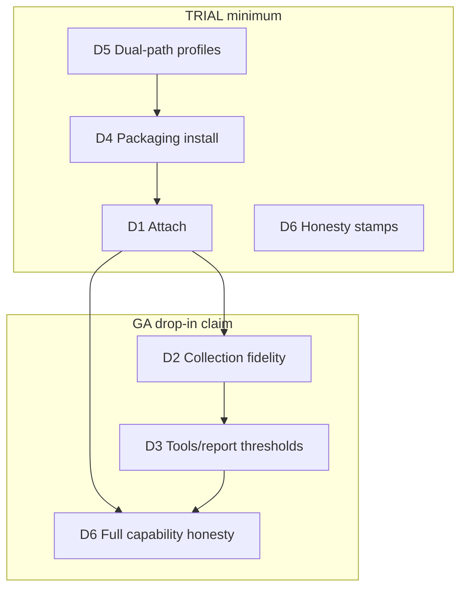
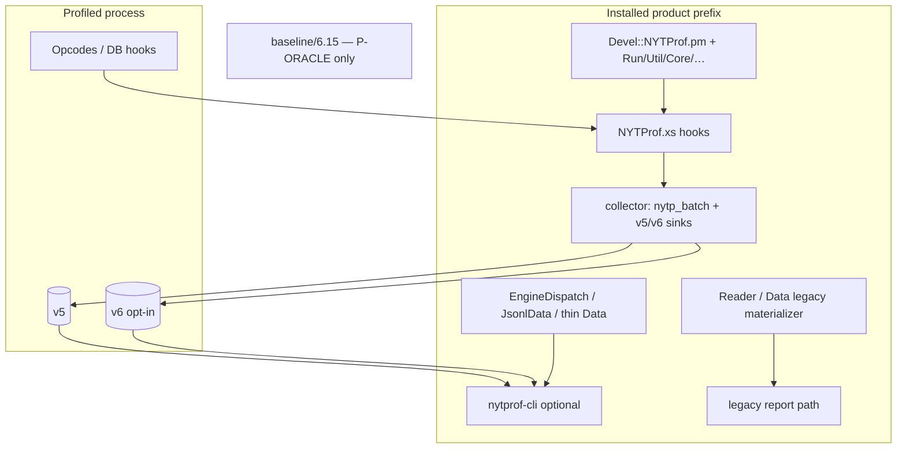
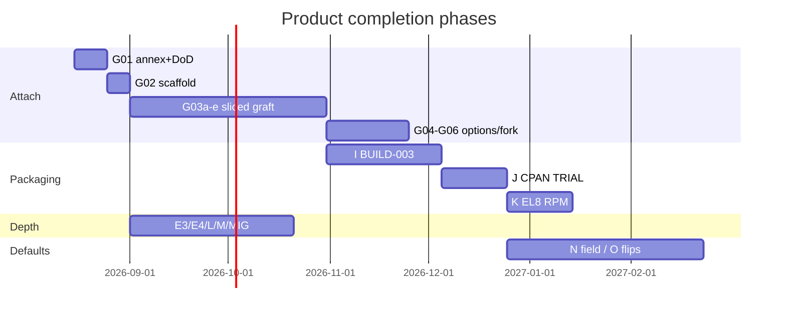
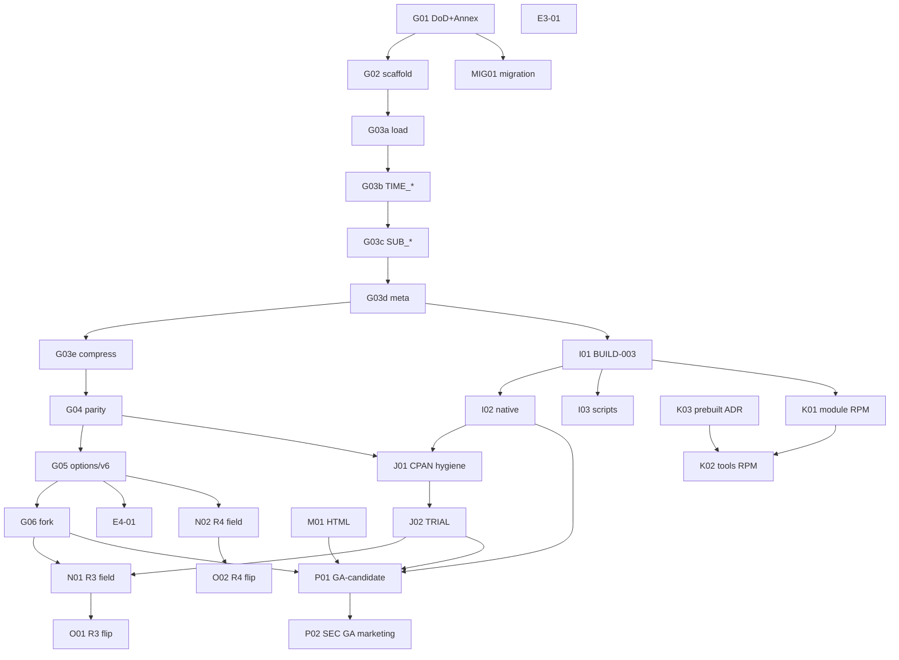

<!--
Status: approved rev 4 (product answers frozen)
Board: PR-G01 docs-landed
Does not supersede: charter / ADRs 0001–0009 / residual matrix
Source: copied from the design-skill rev 4 (2026-08-12)
-->

**Status:** approved rev 4 (product answers frozen)  
**Board:** PR-G01 docs-landed  
**Does not supersede:** charter / ADRs 0001–0009 / residual matrix  
**Source:** copied from the design-skill rev 4 (2026-08-12)

# Design: Product Completion — Full Drop-In Replacement + Packaging Horizon

| Field | Value |
|-------|-------|
| **Document title** | Product Completion: Drop-In Devel::NYTProf Replacement & Packaging Strategy |
| **Author** | Program / systems architecture (agent-assisted) |
| **Date** | 2026-08-12 |
| **Status** | Draft (rev 4 — user product decisions frozen) |
| **PLAN_ID context** | `8c9b1a63` residual stack largely integrated (design `3b62e8dc`); this design is the **product-completion / drop-in + packaging** horizon **beyond R2-stable** |
| **Baseline tag** | R2-stable / `v0.2.5` (CI-green tag path) |
| **Does not supersede** | [`docs/PROGRAM_CHARTER.md`](https://github.com/hilather/nytprof-modernization/blob/main/docs/PROGRAM_CHARTER.md), accepted ADRs 0001–0009, residual matrix, dual-equality readiness |
| **Rev 4 changelog** | User-final: **KD-17** CPAN name `Devel::NYTProf` (coordinated); **KD-16** product version **≥ 7.00**; **KD-13/K03** EL8 tools = **signed CI prebuilts** (not rustup-in-mock); **M01/Q4** tablesorter/shared JS **WAIVE** for GA-candidate (doc residual, not CLOSE) |

---

## Overview

R2-stable (`v0.2.x`, honesty cut PR-C05) delivers a strong **offline** modernization: native v5/v6 dump/report/HTML/CSV/export, convert/merge/repack/salvage, C v6 EVENT writer (COL-007) with wire freeze (ADR-0006), dual-equality MVP (E4 product CLI on dual-sink pairs), COL-015 fork protocol MVP, security offline package, multi-OS CI MVP, and dual-path packaging policy. Collection, however, still depends on the **pinned oracle / CPAN-style XS** (`perl -d:NYTProf` requires real `Devel::NYTProf` on `@INC`). The root `Makefile.PL` is a **candidate packaging facade** only (`BUILD-MAKEMAKER-OPT` / partial BUILD-003-depth) — not a shippable CPAN dist or RPM of the full product. Repo reality: `collector/xs/` is empty; `perl/lib/Devel/NYTProf/` is facade-only (no debugger entry); oracle surface is ~7k lines of XS plus ~3.5k pure-Perl.

This design defines **“full drop-in replacement”** in measurable DoD terms; freezes a **Graft Implementation Annex** (write-site → `nytp_emit_*` map, clock/discount, FileHandle cutover, build sketch); freezes **three isolation profiles** so dual-path does not regress RSK-009 after product XS lands; chooses **CPAN primary + Rocky/EL8 RPM companion** with migration mechanics; freezes **namespace/versioning recommendations** so KD-2 is not blocked by pure vagueness; and provides a **re-sliced PR Plan** (G03a–G03e, renamed depth PRs, hard K03→K02). R3/R4 remain field-gated; R5 never auto-retires.

**One-line product thesis:** Ship a MakeMaker-built **XS + pure-Perl** module that attaches as `-d:NYTProf`, writes v5 by default (v6 opt-in via C writer), dual-paths optional native CLI tools, publish **CPAN first** with an **EL8/Rocky RPM companion**.

---

## Background & Motivation

### Current state (R2-stable / v0.2.x)

| Area | Status | Evidence |
|------|--------|----------|
| Offline native tools | **Ready** | `crates/nytprof-cli` → `nytprof-cli` / `nytprof-dump` |
| CLI E5 v6 | **Opt-in read** | Magic auto-detect; `v6_decode`/`v6_report` true; **`collection_default: v5`** |
| COL-007 C v6 writer | **Product E3-EVENT** | `collector/src/nytp_sink_v6.c`, `fixtures/v6/from-c/**`, offline_gate step 11 |
| Wire freeze / C baseline | **Done** | ADR-0006 / ADR-0007; COL-008 deferred |
| E4 dual equality | **MVP product CLI** | Dual-sink pairs; full oracle TEST-008 residual |
| COL-015 fork | **Protocol MVP** | `nytp_fork_*`; not full TEST-018 |
| Dual-path packaging | **Policy + facade** | `docs/BUILD_SUPPORT_POLICY.md`; `Makefile.PL` (`NAME => NYTProf::Modernization::PackagingEntry`, `not_full_xs_cpan=1`) |
| Multi-OS CI | **MVP** | linux-x86_64 + macos-arm64 |
| Collection attach | **Oracle / external XS** | No product `-d:NYTProf` from this tree |
| Collector overlay | **Scaffold + writers** | `collector/` B0-A; **`collector/xs/` empty** (`.gitkeep` only) |
| Perl facade | **Report/query only** | `perl/lib/Devel/NYTProf/{Data,ReadStream,JsonlData,EngineDispatch,LegacyBridge,JsonlReadStream}.pm` — **no** `Devel/NYTProf.pm` |
| Oracle XS surface | **Pin only** | `baseline/6.15/src/NYTProf.xs` ≈5442 lines; `FileHandle.xs` ≈1565 lines |

SoT for residuals: residual matrix + [`collector/README.md`](https://github.com/hilather/nytprof-modernization/blob/main/collector/README.md) (“Not hooked into live Perl opcode profiler yet”). PLAN_ID `8c9b1a63` is program handoff context (not re-verified as a git object).

### Pain points

1. CLI/prefix install does not make `perl -d:NYTProf` work.
2. Dual install stories (Cargo tools vs MakeMaker Perl) not unified.
3. Rocky 8: old system rustc; stock `perl-Devel-NYTProf` already on fleets — need Obsoletes/Provides/upgrade story.
4. Residual honesty forbids silent CPAN-upload / full DOM / public perf / R3–R4 flip claims.

---

## Goals & Non-Goals

### Goals

1. Measurable drop-in DoD (D1–D6) with **options residual matrix** and attach tiers.
2. Product collection: live `-d:NYTProf` via grafted XS + semantic sink → v5 default / v6 opt-in.
3. Full BUILD-003 dual-build; Cargo-absent **product** collection remains green (RSK-009).
4. Packaging: CPAN primary + EL8 RPM companion with migration annex.
5. Residual schedule with re-sliced PRs implementers can land green.
6. R3/R4 honesty; R5 no retirement.
7. **Namespace + versioning final** before Stage 2 TRIAL: `Devel::NYTProf` **≥ 7.00** (KD-16/17).

### Non-Goals

| Non-goal | Rationale |
|----------|-----------|
| Day-one R3/R4 runtime flips | ADR-0005 / ADR-0008 |
| Any R5 component retirement | ADR-0009 |
| COL-008 as baseline | ADR-0007 |
| Full oracle HTML DOM / Graphviz / treemap / tablesorter-as-default | ADR-0003 WAIVE/CLOSE map |
| Public P1–P4 SLOs | Waived until certified BENCH |
| Windows / multi-Perl full BUILD-006 in first GA | Depth after attach green |
| Full COMPAT-007 bless-array Data on day-one GA | **API drop-in residual** (tier limit; see pure-Perl ownership) |

---

## Definition of Done — “Full Drop-In Replacement”

Drop-in is **not** “CLI-only RPM.” A CLI-only package is a **tools companion**.

### DoD dimensions (gates, not a single serial chain)

D1–D6 are **independent hard gates** for the GA claim. TRIAL may ship with a **subset** (see marketing tiers). Packaging (D4) and dual-path (D5) **must gate TRIAL**, not only GA.



#### D1 — Collection attach (hard gate)

| Check | Pass criteria | Evidence |
|-------|---------------|----------|
| Debugger load | `perl -I$PREFIX/lib -I$PREFIX/lib/perl5 -d:NYTProf -e '…'` exits 0 with **product** install on `@INC` | `scripts/packaging/product_attach_smoke.sh` |
| Module identity | `require Devel::NYTProf` path under product prefix/site — **not** `baseline/6.15/install` | Path asserts in smoke |
| Stamp | Install stamp `product_xs_attach=1` (and/or `$Devel::NYTProf::PRODUCT_XS_ATTACH`); optional `v6_collect=0|1` | Asserted **without cargo** |
| Options | Per **options residual matrix** below, scoped by **packaging flavor** (D1-A / D1-B) | Matrix in DROP_IN_DOD + tests |
| v6 opt-in | **Flavor-dependent** — see D1 packaging flavors | Fixture + smoke or fail-closed |
| Default format | Runtime + capability `collection_default: v5` until R4 | capability + stamp |

##### D1 packaging flavors (reconciles KD-21 vs `format=v6`)

| Flavor ID | Typical artifact | Linked sinks | D1 bar | `format=v6` behavior |
|-----------|------------------|--------------|--------|----------------------|
| **D1-A — full product** | CPAN dual-flavor / source build with `NYTPROF_V6_COLLECT=1` (default for **advertised-options GA** on CPAN); EL8 **`--with v6_collect`** rebuild | v5 + v6 (`-lz -lzstd -llz4`) | Full advertised-options matrix including v6 opt-in → `NYTPROF6` | **work** (G05) |
| **D1-B — v5-only module** | **Default** Rocky/EL8 `perl-Devel-NYTProf` RPM (KD-21); optional CPAN `NYTPROF_V6_COLLECT=0` | **v5 only** (`-lz`; selective OBJECT / `libnytp_sink_v5.a`) | D1 **minus** v6 collection; all other advertised-options rows | **fail-closed**: croak/clear error *“format=v6 requires v6-enabled build (install v6_collect package or rebuild with --with v6_collect)”* — never silent ignore or partial write |

| Claim language | Requires |
|----------------|----------|
| “Drop-in collection (advertised options) on CPAN” | **D1-A** green |
| “Drop-in collection on Rocky 8 default RPM” | **D1-B** green (K01 `%check`); **not** automatic full D1-A |
| “Drop-in including Rocky 8 **with** `format=v6`” | K01 **v6_collect** subpackage/rebuild green (**D1-A** on EL8) **or** residual honesty that default RPM is D1-B only |

Residual matrix ID: **`PRODUCT-V6-COLLECT-EL8`** — open while default EL8 module is D1-B; flips when `--with v6_collect` path ships and is checked, or when claim permanently documents D1-B-only Rocky default.

**PR-K01 `%check`:** exercise **D1-B** only (attach + `format=v5` + fail-closed `format=v6`). Do **not** require v6 file production for default K01 green. **PR-P01:** K01 green ≠ full D1-A; Rocky “full advertised-options” needs explicit v6_collect evidence.

##### D1 options residual matrix (vs 6.15 `options[]` in `NYTProf.xs`)

Sources: `baseline/6.15/src/NYTProf.xs` options table (~lines 249–283) + string options (`file`, `start`, `addpid`, `end`, `sigexit`, …).

| Option | 6.15 role | Attach-MVP (G03a–G03e) | Advertised drop-in GA | Residual / note |
|--------|-----------|------------------------|----------------------|-----------------|
| `file` | output path | **work** | work | |
| `start` | when to start | **work** (begin/no) | work | full start modes residual if not ported |
| `end` | end/finish modes | fail-closed or work subset | work subset documented | OI-003-04 lifecycle residual |
| `compress` / level | zlib after header | **work** (G03e) | work | mid-deflate fork residual |
| `stmts` | statement profiling | **work** (G03b) | work | |
| `blocks` | TIME_BLOCK | **work** (G03b) | work | |
| `subs` | sub profiling | **work** (G03c) | work | |
| `calls` | 0/1/2 entry-return | **work** 0/1/2 on primary fixtures | work | XSUB/goto/exception residual OI-003-03 |
| `leave` | leave correction | residual or work | work if green else residual | |
| `slowops` | slow op profiling | residual | residual or work | fail-closed if unsupported |
| `usecputime` | removed in 6.15 | fail-closed / warn like 6.15 | same | 6.15 warns removed |
| `clock` | clock_id | work default clock | work | platform matrix residual |
| `trace` | debug trace | work or residual | residual OK | |
| `findcaller` | caller resolution | residual | residual | |
| `forkdepth` | generations | **work** subset (G06) | work subset | full TEST-018 residual |
| `addpid` | pid in filename | **work** (G06) | work | |
| `nameevals` / `nameanonsubs` | naming | residual | residual or work | |
| `evals` | eval profiling | residual | residual | |
| `sigexit` / posix exit | signal end | residual | residual | COL-015 honesty |
| `perldb` / embed options | debugger interaction | residual | residual | |
| **`format`** | **new product** | `v5` default; `v6` per **D1-A/D1-B**; `dual` **reject** | **D1-A:** v6 work; **D1-B:** v6 fail-closed | not a 6.15 option; see packaging flavors |
| unknown option | — | **fail-closed** (croak/warn+abort configure) | fail-closed | prefer over silent ignore |

**Attach tiers:**

| Tier | Required options working | Claim language |
|------|--------------------------|----------------|
| **Minimal attach** | `file`, `stmts`, default calls/subs enough for smoke script | “attach preview” |
| **Advertised-options attach** | All GA “work” rows green; residual rows listed | “drop-in collection on advertised options” |
| **Full 6.15 options** | Every 6.15 option work | Not required for first GA |

#### D2 — Collection fidelity

| Check | Pass criteria |
|-------|---------------|
| **Stream equality (mini)** | Product-collected v5 on TEST-003 mini / M4-mini shaped stream: canonical dump structural equality after normalize (COL-006 bar) |
| **Aggregate equality (primary)** | On default-calls1 / calls2-default / blocks-calls1 **shaped** product workloads: leaf **15** / mid **3** / mid→leaf **15**; blocks line5 **780**; discount **818** where applicable — until **complete TEST-003** residual closes |
| E4 scaled | Dual-sink or sequential v5+v6 product: E4 product CLI green |
| Fork MVP | COL-015 product hooks; full TEST-018 residual honesty |
| Fail-closed | COMPAT-010 incomplete never OK |

**Honesty:** Aggregates alone can hide ordering/discount/deflate bugs — mini stream equality is **mandatory** before advertised-options attach; full fixture stream equality remains residual until TEST-003 complete.

#### D3 — Tools / report thresholds

| Surface | Drop-in threshold | Residual honesty |
|---------|-------------------|------------------|
| dump / verify / report | Semantic counts exact | COMPAT-003 ticks |
| html multi-file | CSS + excl + optional flame MVP | Not oracle DOM/JS/tablesorter/Graphviz/treemap |
| csv / folded / callgrind | Semantic leaf/mid/edge | Not full `nytprofcg` bytes |
| convert / merge / salvage | Capability true; strict convert | Lossy convert; full nytprofmerge aggregate-sum residual |
| Perl Data/ReadStream | Thin product path for advertised queries | **API drop-in residual:** COMPAT-007 bless-array; pure-XS decode |

#### D4 — Packaging installability

| Form | Pass |
|------|------|
| CPAN source | `perl Makefile.PL && make && make test && make install` — **no Cargo** for collection + legacy report |
| Optional native | `NYTPROF_NATIVE=1|auto` installs CLI when cargo/prebuilt present |
| RPM EL8 | Module package attach smoke in mock; tools package separate |
| Clean env | No repo `baseline/` or `crates/` required on product `PERL5LIB` |

#### D5 — Dual-path: three isolation profiles (frozen)

| Profile ID | Name | `PERL5LIB` / load path | Cargo? | Purpose |
|------------|------|------------------------|--------|---------|
| **P-ORACLE** | Oracle differential | `baseline/6.15/install` (+ optional `test-deps`) **only** | Never | Fixtures, dump compare, oracle `t` subset |
| **P-PRODUCT-LEGACY** | Product legacy-only | Product install prefix (`site`/`prefix/lib`) — **XS + pure-Perl** | **Never** | **RSK-009 product collection proof** |
| **P-PRODUCT-DUAL** | Product dual-path | Product prefix + discoverable `nytprof-cli` | Optional | Accelerated report/convert |

**Rules:**

1. Never put `crates/`, product install, or `collector/` on **P-ORACLE** `PERL5LIB`.
2. Never use P-ORACLE as the ship/install path (ADR-0004).
3. `legacy_only_smoke.sh` **remains P-ORACLE**; new `product_legacy_smoke.sh` proves **P-PRODUCT-LEGACY** attach without cargo.
4. “Legacy-only” in **operator packaging docs** after BUILD-003 means **P-PRODUCT-LEGACY**, not “install the oracle pin.”
5. Update `docs/BUILD_SUPPORT_POLICY.md` in PR-G01 / PR-I01 — not as afterthought.

#### D6 — Capability / stamp honesty

| Mechanism | When cargo absent | When native present |
|-----------|-------------------|---------------------|
| Install stamp `product_xs_attach=1` | **Required** when D1 green | Required |
| `$Devel::NYTProf::PRODUCT_XS_ATTACH` or `->VERSION` metadata | **Required** | Required |
| `nytprof-cli capability --json` | N/A / skip | Must not claim `collection_default: v6` pre-R4; optional key `product_xs_attach: true` when probes product tree |
| Forbidden claims | full SEC-002, public P1–P4, full BUILD-006 multi-Perl/Windows, full oracle E4, COL-008 baseline, R5 retirement | same |

### Marketing tiers (honest names)

| Tier | What operator gets | Claim language |
|------|-------------------|----------------|
| **Tools-only** | CLI RPM/prefix | “Native NYTProf tools” — **not** drop-in |
| **Attach-preview / TRIAL** | D1 + D4 + D5 + D6a; API/tools residuals listed | “Drop-in collection **preview** on advertised options” |
| **Collection drop-in (GA-candidate)** | D1–D2 + D4–D6 scoped by flavor (**D1-A** CPAN / **D1-B** Rocky default); D3 tools MVP; **API residual** explicit | “Drop-in **collection** on advertised tiers/options/**flavor**” — **not** “full API DOM parity”; Rocky default without v6 called out |
| **Full dual-path drop-in (GA)** | Collection drop-in + D3 thresholds + native optional | Same + accelerated tools; still list HTML JS / COMPAT-007 / merge / EL8 v6 residual |
| **Post-R4** | + `collection_default: v6` on eligible tiers | Only after ADR-0008 flip checklist |

**Do not** market “Full dual-path drop-in” without listing day-one residuals operators hit (API Data shapes, HTML JS, stream-concat merge, lossy convert).

### Residual matrix row IDs (PR-G01 must land)

| Board / residual ID | Meaning | Flips when |
|---------------------|---------|------------|
| `DROP-IN-DOD-V0` | Contract `docs/contracts/DROP_IN_DOD_v0.md` | G01 lands |
| `PRODUCT-XS-ATTACH-MVP` | Live `-d:NYTProf` product | G03a–G03e + G04 green |
| `PRODUCT-LEGACY-SMOKE` | P-PRODUCT-LEGACY without cargo | I01 product_legacy_smoke green (not S2 dual_path) |
| `PRODUCT-OPTIONS-MATRIX` | Options residual matrix | G01 doc; G05 tests landed |
| `PRODUCT-V6-COLLECT-EL8` | EL8 default RPM v6 collection | D1-A on EL8 via `--with v6_collect` **or** claim documents D1-B-only Rocky default |
| `BUILD-003-FULL` | `full_build003=1` | I01–I02 |
| `CPAN-TRIAL-READY` | Dist hygiene as `Devel::NYTProf` ≥ 7.00 | J01 + KD-16/17 final |
| `EL8-RPM-MODULE` | Module RPM attach in mock | K01 |
| `EL8-RPM-TOOLS` | Tools RPM after prebuilt ADR | K03 then K02 |
| `API-DATA-COMPAT007` | Bless-array residual | explicit residual until PERL-005 |

---

## Proposed Design

### Architecture target



### Component boundaries

| Component | Location | Product role |
|-----------|----------|--------------|
| Semantic sink + writers | `collector/include`, `collector/src` | Linked into product XS (`libnytp_sink.a` / OBJECT) |
| XS glue | `collector/xs/` (+ packaging root objects) | Debugger attach → `nytp_emit_*` |
| Graft pure-Perl | product `lib/Devel/NYTProf/*` from 6.15 provenance | Public CPAN surface for collection + legacy report |
| Modernization facade | `perl/lib/Devel/NYTProf/{EngineDispatch,JsonlData,…}` | Installed under **distinct** names or co-exist per ownership table |
| Native tools | `crates/nytprof-*` | Optional offline |
| Oracle pin | `baseline/6.15/` | **P-ORACLE only** |

---

## Annex A — Graft Implementation Annex (binding for Phase G)

> Lands as binding content in PR-G01 (`docs/contracts/DROP_IN_DOD_v0.md` + `docs/schemas/product-xs-graft-annex-v0.md`). Engineers implement G03a–G03e from this annex, not from overview prose alone.

### A.1 Provenance, license, security backports

| Item | Rule |
|------|------|
| Pin identity | Graft source = Devel::NYTProf **6.15** at `baseline/6.15/archives/` + oracle-commit metadata |
| License | Artistic-1.0-Perl OR GPL-1.0-or-later (match workspace `Cargo.toml` / upstream) |
| Import method | **Copy** into `collector/xs/` and product `lib/` with modernization delta commits — **not** edit `baseline/6.15/src` as SoT (ADR-0004 rejects B0-B) |
| Provenance stamp | `docs/graft/PROVENANCE.md`: pin SHA, date, list of files copied, list of deltas |
| Security backports | Track upstream 6.15.x / security fixes; cherry-pick into graft tree; never rewrite pin archives |
| `make dist` | **Exclude** `baseline/`, `target/`, `prefix/`, large `collector/build/` — J01 enforces MANIFEST |

### A.2 File inventory (copy vs rewrite vs defer)

| Path (oracle) | Product destination | Disposition |
|---------------|---------------------|-------------|
| `NYTProf.xs` (~5442) | `collector/xs/NYTProf.xs` | **Copy + rewrite write sites** → sink (phased G03a–e) |
| `FileHandle.xs` (~1565) | `collector/xs/FileHandle.xs` initially **or** omit | **Transition:** keep for Perl FileHandle API / read path; **production v5 write path becomes sink-only** after G03e (see A.4) |
| `lib/Devel/NYTProf.pm` | product `lib/Devel/NYTProf.pm` | Copy (debugger entry) |
| `lib/Devel/NYTProf/{Core,Run,Util,Constants,FileHandle,FileInfo,SubInfo,SubCallInfo,Reader,Apache,Test}.pm` | product `lib/…` | Copy; Apache = residual load (Open Q / ownership table) |
| `lib/Devel/NYTProf/Data.pm` / `ReadStream.pm` | See **Annex B** ownership | Do **not** blindly overwrite facade strategy |
| `bin/nytprofhtml` etc. | product `bin/` | Copy wrappers; may dispatch to native via EngineDispatch later |
| `collector/src/nytp_*.c` | link into XS | Already modernization SoT |
| `collector/t/*` | stay unit tests | Not product attach |

### A.3 Write-site → `nytp_emit_*` map

Oracle call sites in `NYTProf.xs` (via `NYTP_write_*` in `FileHandle.xs` / `FileHandle.c`) map to sink API in `collector/include/nytp_sink.h`:

| Oracle write site (approx.) | Logical event | Sink API | Phase |
|-----------------------------|---------------|----------|-------|
| `NYTP_write_header` + attributes | header / ATTRIBUTE | `nytp_emit_attribute` (+ v5 sink create writes `NYTProf 5 0\n`) | **G03d** |
| `NYTP_write_option_*` | OPTION | `nytp_emit_option` | **G03d** |
| `NYTP_write_comment` | comment | `nytp_emit_comment` | G03d optional (wrapper not required) |
| `NYTP_start_deflate_write_tag_comment` | START_DEFLATE | `nytp_emit_start_deflate` | G03e |
| `NYTP_write_process_start` | PID_START | `nytp_emit_pid_start` | **G03d** |
| `NYTP_write_process_end` | PID_END | `nytp_emit_pid_end` | **G03d** |
| `NYTP_write_new_fid` | NEW_FID | `nytp_emit_new_fid` | **G03d** |
| `NYTP_write_time_line` (~1588) | TIME_LINE | `nytp_emit_time_line` / `nytp_fast_emit_time_line` | **G03b** |
| `NYTP_write_time_block` (~1584) | TIME_BLOCK | `nytp_emit_time_block` / fast | **G03b** |
| `NYTP_write_discount` (~1710) | DISCOUNT | `nytp_emit_discount` | **G03b** (with clock gate) |
| `NYTP_write_call_entry` (~2621) | SUB_ENTRY | `nytp_emit_sub_entry` | **G03c** |
| `NYTP_write_call_return` (~2259) | SUB_RETURN | `nytp_emit_sub_return` | **G03c** |
| `NYTP_write_sub_info` (~3591) | SUB_INFO | `nytp_emit_sub_info` | **G03d** finalize |
| `NYTP_write_sub_callers` (~3667) | SUB_CALLERS | `nytp_emit_sub_callers` | G03d optional (wrapper not required) |
| `NYTP_write_src_line` (~3756) | SRC_LINE | `nytp_emit_src_line` | **G03d** finalize |
| `NYTP_write_sawampersand` | attribute | `nytp_emit_attribute` | residual / G03d |
| Fork re-init paths (~1905+) | lifecycle | `nytp_fork_prepare` / `resume_*` (COL-015) | G06 |

**Batching:** Prefer `nytp_batch` facade already used in `collector/t/test_batch_fast.c` so statement path stays no-malloc after create (COL-004/005). Hooks call `nytp_emit_*` / `nytp_fast_emit_*` only — **no** per-event Rust/FFI (charter).

### A.4 FileHandle.xs vs sink-only cutover

| Stage | v5 production write path | FileHandle.xs role |
|-------|--------------------------|--------------------|
| **G03a** | none / null sink | Optional link for symbols only |
| **G03b–G03d** | **Single path: `nytp_sink_v5`** via emit map | **Not** dual-writing profile bytes. Keep FileHandle.xs **only** if still needed for pure-Perl `Devel::NYTProf::FileHandle` or reader-side; do not leave two profile writers |
| **G03e** | v5 sink + deflate | Compress via `nytp_emit_start_deflate` (COL-006) |
| **Rejected long-term** | Dual write FileHandle **and** sink for same event | Dual maintenance + RSK-001; COL-001 acceptance is adapt every write site |

**Preferred end state:** production v5 I/O = `collector/src/nytp_sink_v5.c` only. FileHandle.xs may remain for **read**/legacy Perl API wrappers if required by pure-Perl modules; product collection must not depend on `NYTP_write_time_*` for the hot path after G03b.

### A.5 Clock / discount non-negotiables (first-class gate)

From [`baseline/inventories/timing-lifecycle-notes.md`](https://github.com/hilather/nytprof-modernization/blob/main/baseline/inventories/timing-lifecycle-notes.md) (BASE-003):

1. **Do not move clock reads** around flushes without timing ADR + oracle test.
2. **DISCOUNT** placement must match 6.15 relative to internal work / flush (RSK-001).
3. **Fake-clock first:** `collector` fake-clock harness + TEST-003 mini green **before** claiming G03b complete.
4. Gate order: **fake-clock mini stream equality → primary aggregate fixtures → full TEST-003 residual**.
5. I32 tick overflow: sink already fails closed on overflow (`NYTP_ERR_OVERFLOW`); preserve 6.15 projection semantics (OI-003-01 residual honesty until frozen).

### A.6 Build sketch (MakeMaker / collector) — selective link **mandatory** for v5-only

**Repo today (`collector/Makefile`):** default `libnytp_sink.a` archives **all** of `nytp_sink_v5.o`, `nytp_sink_v6.o`, `nytp_sink_dual.o`, batch/clock/fork, and `LDLIBS = -lz -lzstd -llz4`. That archive is **dev/test-only** for the full collector unit suite — **not** a valid product v5-only link for KD-21 / D1-B.

| Artifact | Contents | Use |
|----------|----------|-----|
| `libnytp_sink.a` (current default) | v5 + v6 + dual + all objects; needs zstd/lz4 | **Dev/test only** (`make -C collector test`) — **forbidden** as sole MYEXTLIB for D1-B / default EL8 module |
| **`libnytp_sink_v5.a`** (required product target) | `nytp_sink.o`, `nytp_sink_v5.o`, `nytp_sink_counting.o` (if needed), `nytp_batch.o`, `nytp_clock.o`, `nytp_fork.o` — **no** `nytp_sink_v6.o` / `nytp_sink_dual.o`; link **`-lz` only** | **Mandatory** for D1-B and default EL8 module RPM |
| Selective `OBJECT=` in MakeMaker | Same object set as `libnytp_sink_v5.a` | Equivalent to static lib; acceptable alternative |
| Full product (D1-A) | v5 objects + `nytp_sink_v6.o` (+ dual only if test build); `-lz -lzstd -llz4` | CPAN default advertised-options / EL8 `--with v6_collect` |

```text
# Product MakeMaker — D1-B / EL8 default (KD-21) — REQUIRED shape
INC = -Icollector/include
# Prefer dedicated archive (PR-G02 must land target):
#   make -C collector libnytp_sink_v5.a
MYEXTLIB = collector/build/libnytp_sink_v5.a
LIBS = -lz
# DO NOT: MYEXTLIB = collector/build/libnytp_sink.a   # pulls v6/dual + zstd/lz4

# Equivalent selective OBJECT (if no static lib yet):
# OBJECT = …/NYTProf.o nytp_sink.o nytp_sink_v5.o nytp_batch.o nytp_clock.o nytp_fork.o
# (omit nytp_sink_v6.o nytp_sink_dual.o)

# D1-A / v6_collect:
# MYEXTLIB includes v6 objects OR full libnytp_sink.a intentionally
# LIBS = -lz -lzstd -llz4
```

| Build flavor | Codecs linked | Module RPM on EL8 |
|--------------|---------------|-------------------|
| **v5-default product (D1-B)** | **zlib only** (`-lz`) via **`libnytp_sink_v5.a` / selective OBJECT** | **No** zstd/lz4 BuildRequires |
| **v6 collection enabled (D1-A)** | zlib + zstd + lz4 | Add `libzstd-devel`, `lz4-devel` (EPEL if needed) or `--with v6_collect` |

**PR-G02 obligation:** land `make -C collector libnytp_sink_v5.a` (or document enforced selective OBJECT list in product Makefile) so implementers cannot “short path” through full `libnytp_sink.a` for product attach.

### A.7 Optional: oracle test subset on product install

| Smoke | Behavior |
|-------|----------|
| `scripts/packaging/product_oracle_t_subset.sh` | Run a **documented subset** of `baseline/6.15/src/t/*.t` under **P-PRODUCT-LEGACY** `PERL5LIB` |
| Isolation | Assert no `baseline/6.15/install` preferred over product; no `crates/` |
| Honesty | Full oracle suite residual; subset expands over time |

### A.8 Interim alternative (see Alternatives A7)

**A7 accepted as optional fast path only if G03b slips:** ship G03a + legacy FileHandle v5 writes **without** sink cutover for earliest `-d:NYTProf`, then cut over write sites in G03b+. Default plan remains **sink cutover by G03b** to avoid dual-writer debt; A7 is contingency, not preferred.

---

## Annex B — Pure-Perl package ownership

| Package | Lines (approx.) | Source of truth for product | Strategy |
|---------|-----------------|----------------------------|----------|
| `Devel::NYTProf` | — | **6.15 graft** | Product debugger entry |
| `Devel::NYTProf::Core` | 166 | 6.15 graft | Bootstrap XS load |
| `Devel::NYTProf::Run` | 107 | 6.15 graft | |
| `Devel::NYTProf::Util` | 284 | 6.15 graft | |
| `Devel::NYTProf::Constants` | 44 | 6.15 graft | |
| `Devel::NYTProf::FileHandle` | 19 | 6.15 graft | |
| `Devel::NYTProf::FileInfo` | 615 | 6.15 graft | |
| `Devel::NYTProf::SubInfo` | 413 | 6.15 graft | |
| `Devel::NYTProf::SubCallInfo` | 26 | 6.15 graft | |
| `Devel::NYTProf::Reader` | 596 | 6.15 graft | Legacy HTML/report path |
| `Devel::NYTProf::Apache` | 255 | 6.15 graft **residual** | Not first GA tier (Open Q); ship file but document untested **or** omit from MANIFEST until tested |
| `Devel::NYTProf::Test` | 15 | 6.15 graft / optional | Dev only |
| `Devel::NYTProf::Data` | oracle 798 / facade 347 | **Hybrid** | **Default = 6.15 legacy materializer** for drop-in report scripts; optional native backend via `engine=native` / thin bridge **without** claiming COMPAT-007 until PERL-005 |
| `Devel::NYTProf::ReadStream` | oracle 227 / facade 241 | **Hybrid** | Legacy stream callbacks default; thin native-cli-jsonl remains available for product tests |
| `Devel::NYTProf::JsonlData` | 963 | **modernization** | Keep; not a 6.15 package |
| `Devel::NYTProf::JsonlReadStream` | 332 | **modernization** | Keep |
| `Devel::NYTProf::EngineDispatch` | 1203 | **modernization** | Keep; install as product report dispatcher |
| `Devel::NYTProf::LegacyBridge` | 500 | **modernization** | Keep; P-ORACLE / force-legacy bridge |

**Collision rule:** One CPAN dist — **one** `Data.pm`. Strategy: ship **legacy Data as default** (API drop-in for `nytprofhtml` / scripts); integrate facade query methods or document `JsonlData` as separate package path. Do **not** replace legacy Data with thin Jsonl-only Data and call it API drop-in.

**Install layout:**

```text
$PREFIX/lib/perl5/Devel/NYTProf.pm
$PREFIX/lib/perl5/Devel/NYTProf/{Core,Run,Util,Reader,Data,ReadStream,...}.pm
$PREFIX/lib/perl5/Devel/NYTProf/{EngineDispatch,JsonlData,JsonlReadStream,LegacyBridge}.pm
$PREFIX/lib/perl5/auto/Devel/NYTProf/NYTProf.so
$PREFIX/bin/{nytprofhtml,nytprofcsv,...,nytprof-engine}
$PREFIX/bin/nytprof-cli   # only if dual-path native installed
```

**Tier limit:** Collection drop-in ≠ full API drop-in. COMPAT-007 residual is an **API drop-in residual** called out in marketing tiers.

---

## Annex C — EL8 / Rocky packaging

### C.1 Package names and relations

| RPM | Contents | Drop-in? |
|-----|----------|----------|
| `perl-Devel-NYTProf` | XS + pure-Perl + legacy scripts | **Yes** (collection + legacy tools) |
| `nytprof-cli` | Native CLI binaries | **No** — tools companion |
| Optional | `perl-Devel-NYTProf-tools` meta Requires both | Convenience |

**Relations (recommended):**

```text
# perl-Devel-NYTProf  (same package name as distro)
Name:      perl-Devel-NYTProf
Provides:  perl(Devel::NYTProf) = %{version}
# Same NEVRA name: replacement is driven by Epoch/Version/Release ONLY.
# Do NOT self-Obsoletes: perl-Devel-NYTProf < %{version}  — confuses solvers.

# Obsoletes only for *other* names / aliases being retired, e.g.:
# Obsoletes: perl-Devel-NYTProf-modern < 1.0
# Obsoletes: nytprof-modernization-perl < 1.0

# Optional v6 collection subpackage or rebuild flavor:
# perl-Devel-NYTProf+v6_collect / --with v6_collect  (D1-A on EL8)

# nytprof-cli
Recommends: perl-Devel-NYTProf
# or Suggests: if weak deps preferred on EL8
```

### C.2 Version / Epoch vs stock 6.15

Stock Rocky/EPEL may ship **6.14/6.15**. Historical engineering tags (`v0.2.x`) must not become product `$VERSION`; **KD-16 final** requires product/RPM version **≥ 7.00** so EVR sorts above 6.15.

| Policy | Rule |
|--------|------|
| **Decided (KD-16)** | Product `$VERSION` / RPM Version **≥ 7.00** so **EVR upgrade** replaces distro 6.15 — **no self-Obsoletes**; no `0.3.x` product `$VERSION` for CPAN/RPM drop-in path |
| **Obsoletes** | Only when **retiring a different package name** (transitional alias). Never rely on self-Obsoletes for same-name upgrades |
| Downgrade | `dnf downgrade perl-Devel-NYTProf` back to distro 6.15; profile files remain v5-readable |

### C.3 BuildRequires matrix

| Package | BuildRequires | Runtime |
|---------|---------------|---------|
| **Module** (v5-only `.so`) | `gcc`, `perl-devel` / `perl-generators`, `zlib-devel`, make | `perl-libs`, `zlib` |
| **Module** (v6 collection linked) | + `libzstd-devel`, `lz4-devel` (EPEL if needed) | + `libzstd`, `lz4` |
| **Tools** | **Signed CI prebuilt** `nytprof-cli` artifacts (KD-13 final; K03 ADR documents verify/install) — **not** system EL8 rustc; rustup not required in mock `%build` | none Perl |

**Default module RPM = D1-B / v5-only link** (`libnytp_sink_v5.a`, `-lz` only) unless product explicitly enables v6 at build time (`--with v6_collect` → D1-A).

### C.4 `%check`

```text
# mock/EL8 %check (default module package = D1-B) — no network, no cargo
export PERL5LIB=%{buildroot}%{perl_vendorlib}:...
# product_attach_smoke --flavor=d1-b  (or env PRODUCT_D1_FLAVOR=B)
# product_legacy_smoke (P-PRODUCT-LEGACY)
# assert: format=v5 profiles OK; format=v6 fails closed (non-zero + message)
# do NOT require NYTPROF6 production on default K01
```

Optional `%check` for `--with v6_collect` rebuild: D1-A including `format=v6` → `NYTPROF6`.

Tools package `%check`: `nytprof-cli capability` / verify on bundled tiny fixture if prebuilt path.

### C.5 AppStream / Perl streams

Rocky 8: base Perl **5.26** vs AppStream **5.32** modules. First RPM targets **one advertised stream** (document which); multi-stream residual. Open Q3 becomes: pick default stream in K01 README.

### C.6 Migration (REL-002-style)

PR-MIG01 delivers `docs/MIGRATION_DROP_IN_v0.md`:

- Install: CPAN vs `dnf install perl-Devel-NYTProf`
- Coexistence with stock package (**EVR/Epoch upgrade**, not self-Obsoletes)
- Default Rocky RPM is **D1-B** (`format=v6` fail-closed); how to get D1-A on EL8
- `NYTPROF` options changes (`format=v6` new; flavor-gated)
- Tools: `nytprofhtml` (legacy) vs `nytprof-cli html` / `nytprof-engine`
- Rollback: package downgrade; `format=v5`; `engine=legacy`
- Profile compatibility: v5 files readable by old and new tools

### C.7 GA claim vs Rocky

| GA marketing | Requirement |
|--------------|-------------|
| “Drop-in on Linux source/CPAN tiers” (D1-A) | CPAN/product source path; K01 optional |
| “Drop-in including Rocky 8 **default** RPM” | **K01 green = D1-B** (not full D1-A) |
| “Drop-in including Rocky 8 **with format=v6**” | K01 **v6_collect** path green (D1-A on EL8) |
| Tools on Rocky | K03 (signed prebuilt ADR) **then** K02; tools never alone = drop-in |

PR-P01: K01 green proves **D1-B Rocky companion** unless claim text says otherwise; do not equate K01 with full advertised-options D1-A.

---

## Dual-path packaging architecture (post-attach)

```text
Makefile.PL  (BUILD-003 product entry — after I01)
  │
  ├─ always: XS + pure-Perl → P-PRODUCT-LEGACY attach
  │     NYTPROF_NATIVE=0  (default CPAN smoke)
  │
  ├─ optional: cargo/prebuilt → nytprof-cli  (P-PRODUCT-DUAL)
  │
  └─ P-ORACLE unchanged for differential scripts
```

Stamps when BUILD-003 product lands:

```text
full_build003=1
product_xs_attach=1
collection_default=v5
v6_collect=0|1          # D1-B vs D1-A link flavor
packaging_depth=BUILD-003-full
not_full_xs_cpan=0
```

### Smoke migration schedule (do not red offline_gate early)

| Phase | When | `dual_path_smoke.sh` behavior | New product smokes |
|-------|------|------------------------------|--------------------|
| **S0 — today / until product installable** | Pre-G03a / pre-I01 | **Unchanged:** always runs **P-ORACLE** via `legacy_only_smoke.sh`, then optional native if cargo | G01 adds `product_attach_smoke.sh` + `product_legacy_smoke.sh` as **honest skip** or fail-not-yet (documented); **must not** rewrite dual_path primary half yet |
| **S1 — documented profiles** | PR-G01 | Still S0 runtime behavior; BUILD_SUPPORT_POLICY describes three profiles | Skeletons only |
| **S2 — product installable** | After G03a+I01 (product prefix installs XS) | Primary half **switches** to **P-PRODUCT-LEGACY** (`product_legacy_smoke` / install+attach); still chains **P-ORACLE** `legacy_only_smoke` as separate required step (oracle never dropped) | `product_*` exit 0 on product path |
| **S3 — offline_gate expand** | With S2 | offline_gate: product steps required when product build available; **honest skip** when product XS not built (CC/MakeMaker product path absent) | Same |

**Hard rule:** Do **not** change `dual_path_smoke.sh` to require product XS before S2. `legacy_only_smoke.sh` remains **P-ORACLE forever**.

Smokes (steady state after S2):

| Script | Profile |
|--------|---------|
| `legacy_only_smoke.sh` | **P-ORACLE** (forever) |
| `product_legacy_smoke.sh` | **P-PRODUCT-LEGACY** (RSK-009; skip until S2) |
| `product_attach_smoke.sh` | D1 flavor A or B (`PRODUCT_D1_FLAVOR`) |
| `dual_path_smoke.sh` | **S0–S1:** oracle + optional native; **S2+:** product legacy + oracle + optional native |
| `offline_gate.sh` | Add product steps only with honest skips until S2 |

---

## Packaging strategy: CPAN primary + RPM companion

| Audience | Channel |
|----------|---------|
| General Perl / CPAN Testers | **CPAN** (product truth for version + dual-path) |
| Rocky 8 fleets | **RPM projection** of same sources |
| Report farms | Tools RPM / static CLI |

KD-2 remains: CPAN primary. **KD-16/17 final:** ship as **`Devel::NYTProf` ≥ 7.00** (coordinated namespace + version).

---

## Residuals → phases (naming aligned with PRs)

| Phase | Name | PR IDs |
|-------|------|--------|
| **G** | Product XS attach (sliced) | G01–G06, G03a–e |
| **I** | BUILD-003 dual-build | I01–I03 |
| **J** | CPAN TRIAL | J01–J02 |
| **K** | EL8 RPM | K03 → K01/K02 |
| **E3/E4** | Dual-equality depth | **PR-E3-01**, **PR-E4-01** (not H*) |
| **L** | Tools depth convert/merge | L01–L02 |
| **M** | HTML residual | M01 |
| **MIG** | Migration docs | MIG01 |
| **N/O** | Field / flips | N01–N02, O01–O02 |
| **P** | Readiness cuts | P01 candidate, P02 SEC |



Calendar for G03 re-estimated **after G03b green** (stream mini equality), not fixed 45d mega-PR.

---

## API / Interface Changes

| Surface | Change |
|---------|--------|
| `Devel::NYTProf` | Product module ships |
| `NYTPROF` | `format=v5|v6` product; reject `dual`; unknown options fail-closed |
| Install stamps | `product_xs_attach=1` |
| capability JSON | optional `product_xs_attach`; keep `collection_default` |
| MakeMaker | `NAME => 'Devel::NYTProf'`; version per KD-16 |

---

## Data Model / Wire Changes

No v6 wire ID changes (ADR-0006). Product XS must emit COL-006-compatible v5. New fixtures under `fixtures/v5/product-attach/**` — never mutate oracle archives.

---

## Alternatives Considered

### A1 — CLI-only RPM as product → **Reject** (no collection)

### A2 — RPM-primary → **Reject** (ecosystem expects CPAN)

### A3 — Full hook rewrite without graft → **Reject** (RSK-001)

### A4 — Mandatory Rust install → **Reject** (RSK-009)

### A5 — CPAN primary + RPM companion → **Accept**

### A6 — Wait for COL-008 → **Reject** (ADR-0007 C baseline)

### A7 — v5-first graft **without** sink cutover (interim)

| Dimension | Assessment |
|-----------|------------|
| Speed to first `-d:NYTProf` | Higher — keep `NYTP_write_*` initially |
| RSK-001 | Lower blast radius short-term |
| Dual maintenance | **High** if FileHandle + sink both write |
| v6 path | Blocked until emit map exists |
| **Decision** | **Contingency only** if G03b blocked; **preferred plan is sink-only writes by G03b** (Annex A.4). Do not plan long-term dual writers. |

---

## Security & Privacy

| Threat | Mitigation |
|--------|------------|
| Malicious profiles | Fail-closed decode; SEC-FUZZ offline; SEC-002 residual |
| HTML out-dir | Existing outdir safety + atomic publish |
| Supply chain | CPAN checksums; RPM signatures; Cargo.lock when native built |
| **System-wide install perms** | Profile default path mode `0600` / user-owned; document not writing world-writable dirs; Rocky package file modes per Fedora packaging guidelines |
| **setuid/setgid** | Module must not be installed setuid; profiles must not follow untrusted symlinks for output (document residual if not yet coded) |
| Signal/crash | COL-015 honesty; incomplete fail-closed; no claim full signal matrix |
| Capability overclaim | Stamps + residual matrix IDs |
| Oracle contamination | Three profiles |

---

## Observability

Build stamps; engine diagnostics; capability JSON; product_xs_attach stamp; CI offline_gate + matrix; field scripts local-only. No public SLO metrics until BENCH cert.

---

## Rollout Plan

| Stage | Content | Versioning gate |
|-------|---------|-----------------|
| 0 | G01–G03e attach in-repo | no CPAN |
| 1 | BUILD-003 I01–I02 | no CPAN |
| 2 | CPAN **TRIAL** | **KD-16/17 final** (`Devel::NYTProf` ≥ 7.00) |
| 3 | EL8 RPM module (+ tools after K03) | Epoch/version policy |
| 4 | **GA-candidate cut** (P01) — not auto “GA marketing” until SEC checklist | |
| 5 | R3/R4 field → flips optional | |

### Rollback

| Change | Rollback |
|--------|----------|
| Product XS bug | Prior CPAN/TRIAL; `format=v5` |
| Native CLI | omit tools RPM / `engine=legacy` |
| **RPM fleet** | `dnf downgrade perl-Devel-NYTProf` to distro 6.15; v5 files remain valid |
| R3/R4 flips | force-legacy / `format=v5` escapes |

---

## Risks

| Risk | Sev | Mitigation |
|------|-----|------------|
| Timing/discount mismatch | Crit | Annex A.5; fake-clock before G03b done |
| Mega-PR G03 | High | G03a–e slices |
| Data.pm collision | High | Annex B hybrid default legacy |
| RSK-009 dual-path redefine | High | Three profiles; product_legacy_smoke |
| Version sort below 6.15 | Mitigated | **KD-16 final:** product **≥ 7.00** |
| EL8 zstd BR on v5-only | Med | v5-only default link (D1-B) |
| Namespace / PAUSE coordination | Med (ops) | **KD-17 final:** coordinated `Devel::NYTProf`; track PAUSE rights as release ops residual, not product-name ambiguity |
| Stack assemble drops code | Med | AGENTS.md smoke list before tag |

---

## Open Questions

### Resolved (user-final — rev 4)

| ID | Decision | Binding KD / PR |
|----|----------|-----------------|
| **Q1** | CPAN namespace = coordinated **`Devel::NYTProf`** (not transitional name) | **KD-17 final**; PR-J01/J02 |
| **Q9** | Product version **≥ 7.00** (not 0.3.x product version for drop-in) | **KD-16 final**; PR-J01/J02; Annex C.2 |
| **Q-prebuilt** | EL8 tools RPM uses **signed CI prebuilt** artifacts (not rustup-in-mock as primary) | **KD-13 final**; **PR-K03** ADR documents verify/sign/install; hard-gates K02 |
| **Q4** | Shared JS / tablesorter = **WAIVE** for GA-candidate (MVP HTML honesty) | **PR-M01** = WAIVE documentation residual (not CLOSE implementation) |

### Still open (non-blocking or residual ops)

| ID | Question | Blocking? | Note |
|----|----------|-----------|------|
| Q3 | Min Perl / Rocky stream 5.26 vs 5.32? | Blocks K01 stream choice only | Advertise one stream first (document in K01) |
| Q5 | Lossy convert / full merge for GA? | No | Residual OK for collection GA-candidate |
| Q6 | E3-mixed block v6 collection GA? | Affects P01 multi-kind claim | **EVENT-only honesty** unless PR-E3-01 green |
| Q7 | Apache first GA? | No | Residual; ownership table |
| Q8 | SEC-012 before non-TRIAL? | Affects GA marketing | **P01 = GA-candidate**; SEC-012 before **GA marketing** (P02) |
| Q-PAUSE | Operational PAUSE rights timing for coordinated name | Release ops | Name is decided (Q1); coordinate upload rights as release task, not rename debate |

---

## Key Decisions

| # | Decision | Rationale |
|---|----------|-----------|
| **KD-1** | Drop-in = D1–D6; not CLI-only | Operator expectation |
| **KD-2** | CPAN primary + RPM companion; Stage 2 uses **KD-16/17 final** identity | Ecosystem + Rocky |
| **KD-3** | Hook graft + semantic sink; sink-only v5 writes by G03b | COL-001 + A.4 |
| **KD-4** | C writer baseline; COL-008 deferred | ADR-0007 |
| **KD-5** | `collection_default: v5` until R4 flip | ADR-0008 |
| **KD-6** | No day-one R3 flip | ADR-0005 |
| **KD-7** | No R5 retirement in drop-in | ADR-0009 |
| **KD-8** | Dual-path never broken; **P-PRODUCT-LEGACY** is RSK-009 proof | COMPAT-011 |
| **KD-9** | Oracle pin differential-only | ADR-0004 |
| **KD-10** | HTML MVP + honesty, not full DOM; tablesorter/shared JS **WAIVE** for GA-candidate (Q4) | ADR-0003 + user-final |
| **KD-11** | Public perf waived | PR-C04 |
| **KD-12** | Split RPM module vs CLI | Prevent tools-only drop-in claim |
| **KD-13** | **EL8 tools distribution (final):** **signed CI prebuilt** `nytprof-cli` artifacts for tools RPM; not system EL8 rustc; rustup not primary mock path | User-final Q-prebuilt |
| **KD-14** | No product `format=dual` | OQ-4 |
| **KD-15** | First public = TRIAL before GA-candidate | Risk control |
| **KD-16** | **Versioning (final):** product `$VERSION` / RPM Version **≥ 7.00**; no 0.3.x product version for drop-in CPAN/RPM path | User-final Q9; sort above stock 6.15 |
| **KD-17** | **Namespace (final):** coordinated **`Devel::NYTProf`** on CPAN (not transitional package name) | User-final Q1 |
| **KD-18** | **Options tier for “drop-in”:** advertised-options attach (matrix GA “work” rows), not full 6.15 matrix | Measurable GA |
| **KD-19** | **GA claim scopes:** “Rocky 8 **default** RPM” = K01 **D1-B**; “Rocky + format=v6” needs v6_collect (D1-A); else exclude Rocky binary | Rocky honesty vs D1 flavors |
| **KD-20** | **Data default = legacy materializer**; native/Jsonl optional; COMPAT-007 residual explicit | Annex B |
| **KD-21** | **Default EL8/module RPM = D1-B v5-only link** (`libnytp_sink_v5.a` / selective OBJECT, `-lz` only); `format=v6` **fail-closed** on that artifact; D1-A via CPAN default advertised build and/or EL8 `--with v6_collect` | EL8 BR simplicity **without** breaking D1 flavor model |
| **KD-22** | **K03 (prebuilt ADR) hard-gates K02** | No tools RPM without policy |
| **KD-23** | **P01 is GA-candidate cut**, not final GA marketing; SEC-012 checklist before GA marketing | Align Q8 |
| **KD-24** | **Product must not link full `libnytp_sink.a` for D1-B**; G02 lands `libnytp_sink_v5.a` (or enforced selective OBJECT) | Current archive is test-only (v6/dual + zstd/lz4) |
| **KD-25** | **`dual_path_smoke` stays oracle-primary until S2** (product installable); never rewrite offline_gate packaging half before G03a/I01 | Avoid red gate during G01 doc-only |

---

## References

| Doc | Role |
|-----|------|
| `docs/PROGRAM_CHARTER.md` | R0–R5 |
| `docs/contracts/R1_RESIDUAL_READINESS_MATRIX_v0.md` | Residuals |
| `docs/contracts/DUAL_EQUALITY_READINESS_v0.md` | E1–E5 |
| `docs/RELEASE_NOTES_R2_STABLE.md` | Current scope |
| `docs/BUILD_SUPPORT_POLICY.md` | Dual-path (extend with three profiles) |
| `docs/PACKAGING_SPIKE.md` | Spike |
| `docs/adrs/0003`–`0009` | Policy ADRs |
| `docs/plan/05_COLLECTOR_AND_C_XS_TASKS.md` | Collector |
| `docs/plan/07_PERL_API_AND_XS_COMPATIBILITY_TASKS.md` | Perl API |
| `docs/plan/12_BUILD_PACKAGING_CI_AND_RELEASE_TASKS.md` | BUILD-* |
| `docs/plan/19_ROLLOUT_RELEASE_AND_MIGRATION_TASKS.md` | REL-* |
| `baseline/inventories/timing-lifecycle-notes.md` | BASE-003 |
| `collector/include/nytp_sink.h` | Emit API |
| `baseline/6.15/src/NYTProf.xs`, `FileHandle.xs` | Graft source |
| `Makefile.PL` | Current facade |
| `AGENTS.md` | Quality + CI watch |

---

## PR Plan

Each PR independently reviewable; offline_gate green; residual matrix rows flip only with evidence.

### PR-G01 — Drop-in DoD contract + Graft Annex + dual-path profiles + options matrix

- **Title:** `docs: DROP_IN_DOD_v0 + graft annex + isolation profiles (no XS)`
- **Files:** `docs/contracts/DROP_IN_DOD_v0.md`, `docs/schemas/product-xs-graft-annex-v0.md`, residual matrix rows (`DROP-IN-DOD-V0`, `PRODUCT-V6-COLLECT-EL8`, …), `docs/BUILD_SUPPORT_POLICY.md` (three profiles + smoke phases S0–S3), `scripts/packaging/product_attach_smoke.sh` (fail/skip until attach; flavor flag stub), `product_legacy_smoke.sh` skeleton
- **Dependencies:** none
- **Description:** Binding annex A–C, D1-A/D1-B flavors, options matrix, residual IDs, dual-path freeze, **smoke migration S0–S3**. **Must not** rewrite `dual_path_smoke.sh` primary half (stays P-ORACLE until S2). No silent capability claims.

### PR-G02 — XS scaffold + **`libnytp_sink_v5.a`** / selective OBJECT (mandatory)

- **Title:** `collector: XS scaffold + libnytp_sink_v5.a (v5-only product link)`
- **Files:** `collector/xs/`, `collector/Makefile` (`libnytp_sink_v5.a` target; full `libnytp_sink.a` remains test), schema `product-xs-attach-mvp-v0.md` stub
- **Dependencies:** G01
- **Description:** Bootstrap XS that loads; **product link path uses v5-only archive or selective OBJECT** (KD-24). Full archive remains for `make test` only. Not full debugger profile yet.

### PR-G03a — Bootstrap `-d:NYTProf` load, no profile emit

- **Title:** `collector: product -d:NYTProf loads Devel::NYTProf (null/no-op sink)`
- **Files:** graft `Devel::NYTProf.pm` + minimal XS init, attach smoke green for load-only
- **Dependencies:** G02
- **Description:** Module identity + stamp path; no TIME_* required.

### PR-G03b — TIME_LINE / TIME_BLOCK / DISCOUNT → v5 sink

- **Title:** `collector: statement path nytp_emit_time_* + discount via COL-006`
- **Files:** `NYTProf.xs` write-site replacements, batch/fast path, fake-clock mini stream equality tests
- **Dependencies:** G03a
- **Description:** **Clock/discount gate**; mini stream equality mandatory; sink-only writes (no dual FileHandle writer).

### PR-G03c — SUB_ENTRY / SUB_RETURN (+ callers path as needed)

- **Title:** `collector: sub entry/return emit path (calls=0/1/2 fixtures)`
- **Files:** XS call hooks → `nytp_emit_sub_*`, product fixtures
- **Dependencies:** G03b
- **Description:** Primary call semantics; attach smoke dump/verify.

### PR-G03d — Attributes/options/new_fid/src/sub_info/pid finalize

- **Title:** `collector: metadata + finalize emits to v5 sink`
- **Files:** header/option/fid/src/sub_info/pid emit map
- **Dependencies:** G03c
- **Description:** Complete readable v5 files for primary shaped workloads.

### PR-G03e — Deflate / compress via `nytp_emit_start_deflate`

- **Title:** `collector: product compress= path through v5 sink deflate`
- **Files:** G03e compress wiring, tests compressed product profiles
- **Dependencies:** G03d
- **Description:** zlib-only path; mid-deflate fork residual documented.

### PR-G04 — Primary-fixture aggregate + attach parity gate

- **Title:** `test: product-attach parity default-calls1-shaped + residual matrix flip`
- **Files:** `product_v5_parity_smoke.sh`, fixtures, `PRODUCT-XS-ATTACH-MVP` flip when green
- **Dependencies:** G03e (or G03d if compress residual deferred with honesty)
- **Description:** Aggregates + prior mini stream; real `-d:NYTProf` entry.

### PR-G05 — Options matrix tests + `format=v6` product opt-in (D1-A) + fail-closed (D1-B)

- **Title:** `collector: options residual tests + format=v6 gated by v6_collect link`
- **Files:** option parser, fail-closed unknown, v6 file magic when D1-A linked, fail-closed when D1-B, capability default v5, stamp `v6_collect=`
- **Dependencies:** G04
- **Description:** D1-A: `format=v6` works; D1-B: fail-closed with rebuild message; reject `dual`.

### PR-G06 — COL-015 product fork/addpid wiring

- **Title:** `collector: nytp_fork_* in product XS hooks`
- **Files:** fork hooks, addpid/forkdepth subset, residual TEST-018 honesty
- **Dependencies:** G05
- **Description:** Product option wiring; mid-deflate continue-in-child residual.

### PR-E3-01 — E3-mixed multi-kind C fixtures MVP

- **Title:** `collector: E3-mixed SOURCE/INDEX/SUMMARY C fixtures`
- **Files:** `fixtures/v6/from-c/**`, `e3_c_*`, offline_gate step 11
- **Dependencies:** none hard on G (parallel); **required for multi-kind v6 collection claim**
- **Description:** EVENT path already done; mixed residual close slice.

### PR-E4-01 — Full oracle E4 dual pairs slice 1

- **Title:** `test: E4 oracle dual pair fixtures + equality slice`
- **Files:** `fixtures/e4/`, e4 smoke, dual-equality readiness
- **Dependencies:** G05 recommended for product generation path
- **Description:** Beyond scaled dual-sink; multi-PR residual OK.

### PR-I01 — BUILD-003 MakeMaker product dual-build (legacy half)

- **Title:** `build: Makefile.PL builds product XS+Perl without Cargo`
- **Files:** root `Makefile.PL`, MANIFEST, stamps, `BUILD_SUPPORT_POLICY.md`, `product_legacy_smoke`
- **Dependencies:** G03d minimum (installable attach)
- **Description:** Real `Devel::NYTProf` dist; `NYTPROF_NATIVE=0` default; `full_build003` progression.

### PR-I02 — Optional native CLI via MakeMaker

- **Title:** `build: NYTPROF_NATIVE auto/1 installs nytprof-cli`
- **Files:** Makefile postamble, install_native integration
- **Dependencies:** I01
- **Description:** Cargo optional; fail closed when `=1` missing.

### PR-I03 — Dist scripts + engine dispatch install

- **Title:** `build: ship nytprofhtml/csv/… + EngineDispatch in dist`
- **Files:** `bin/`, pure-Perl install set per Annex B
- **Dependencies:** I01
- **Description:** Familiar script names; legacy without cargo.

### PR-MIG01 — Operator migration guide (REL-002-style)

- **Title:** `docs: MIGRATION_DROP_IN_v0 (CPAN/RPM/options/rollback)`
- **Files:** `docs/MIGRATION_DROP_IN_v0.md`, runbook links
- **Dependencies:** G01 (can parallel I01)
- **Description:** Install paths, Obsoletes story, tools rename, downgrade.

### PR-J01 — CPAN dist hygiene + versioning/namespace checklist

- **Title:** `release: CPAN TRIAL hygiene; Devel::NYTProf ≥ 7.00 (KD-16/17 final)`
- **Files:** META/MANIFEST (`NAME => Devel::NYTProf`, `$VERSION` ≥ 7.00), exclude baseline/target, Changes, residual `CPAN-TRIAL-READY`
- **Dependencies:** I02, G04; **KD-16/17 final** (already decided — enforce in dist metadata)
- **Description:** `make dist` uploadable as coordinated **`Devel::NYTProf` ≥ 7.00**; PAUSE coordination is release ops, not a rename fork.

### PR-J02 — CPAN TRIAL notes + version bump

- **Title:** `release: TRIAL notes for Devel::NYTProf ≥ 7.00 drop-in collection preview`
- **Files:** RELEASE_NOTES, matrix, runbook
- **Dependencies:** J01, offline_gate, CI watch
- **Description:** Attach-preview language under final name/version; residuals listed (incl. tablesorter WAIVE).

### PR-K03 — Signed CI prebuilt CLI policy ADR (ADR-Q016) — **before tools RPM**

- **Title:** `docs(adr): signed CI prebuilt nytprof-cli for EL8 tools RPM`
- **Files:** `docs/adrs/00xx-prebuilt-native-cli.md`, BUILD policy
- **Dependencies:** none (start early)
- **Description:** **Direction final (KD-13):** signed CI artifacts primary for EL8 `nytprof-cli` RPM; document signature verify, artifact layout, MSRV of builders, no rustup-in-mock requirement. **Hard gate for K02.**

### PR-K01 — EL8 RPM module package

- **Title:** `packaging: EL8 perl-Devel-NYTProf RPM (D1-B zlib v5-only default)`
- **Files:** `packaging/rpm/perl-Devel-NYTProf.spec`, Provides + Epoch/Version (no self-Obsoletes), `%check` D1-B attach + format=v6 fail-closed, BR matrix zlib-only; optional `--with v6_collect` notes
- **Dependencies:** I01; MIG01 recommended
- **Description:** No cargo; mock **D1-B** attach smoke (not full D1-A); AppStream stream documented.

### PR-K02 — EL8 RPM nytprof-cli tools companion

- **Title:** `packaging: EL8 nytprof-cli RPM (policy from K03)`
- **Files:** `packaging/rpm/nytprof-cli.spec`, Recommends module
- **Dependencies:** **K03 (hard)**, K01 docs matrix
- **Description:** Tools never claim drop-in alone.

### PR-L01 — Optional lossy convert

- **Title:** `cli: optional --allow-lossy convert + limits docs`
- **Dependencies:** none hard
- **Description:** Strict remains default.

### PR-L02 — Merge aggregate-sum parity slice

- **Title:** `cli: merge aggregate-sum parity slice vs nytprofmerge`
- **Dependencies:** none hard

### PR-M01 — HTML shared JS/tablesorter **WAIVE** documentation

- **Title:** `docs: WAIVE shared JS/tablesorter for GA-candidate (Q4 final)`
- **Files:** residual matrix, REPORT_HTML inventory / ADR-0003 follow-on honesty, runbook, schemas as needed
- **Dependencies:** none
- **Description:** **User-final WAIVE** — not a CLOSE implementation PR. Flip residual rows to WAIVE with explicit residual honesty; no tablesorter/jquery product requirement for GA-candidate.

### PR-N01 — R3 field evidence pack

- **Title:** `field: R3 field-window reports`
- **Dependencies:** J02+ **and** G06 recommended for production-like attach; multi-site only when product usable
- **Description:** No runtime flip.

### PR-N02 — R4 field evidence pack

- **Title:** `field: R4 field-window reports`
- **Dependencies:** G05+ stable v6 product collection; convert tools
- **Description:** No runtime flip.

### PR-O01 / PR-O02 — R3 / R4 flip execution (gated)

- **Dependencies:** N01/N02 **Promote** + offline_gate
- **Description:** Checklist-only merges.

### PR-P01 — GA-candidate readiness cut (D1–D6 honesty)

- **Title:** `release: GA-candidate drop-in cut (not final GA marketing)`
- **Files:** matrix, RELEASE_NOTES, capability, runbook
- **Dependencies:** G06, I02, J02, M01; **K01 if claim includes Rocky default RPM (= D1-B only)**; separate evidence if claiming Rocky `format=v6` (D1-A); **PR-E3-01 if claiming multi-kind v6 collection else EVENT-only honesty**
- **Description:** Collection drop-in on advertised tiers/flavors; K01 ≠ full D1-A; list API/HTML/merge/`PRODUCT-V6-COLLECT-EL8` residuals; **not** SEC-012 complete GA marketing.

### PR-P02 — SEC-012 checklist + SEC-002 job MVP

- **Title:** `security: SEC-002 continuous MVP + SEC-012 review checklist`
- **Dependencies:** can parallel P01; **required before GA marketing**
- **Description:** Align Stage 4 marketing with security review.

---

### PR dependency overview



---

*End of design document (rev 4). Horizon: product-completion beyond R2-stable (`v0.2.5`); does not authorize R3/R4 runtime flips or R5 retirement. User-final: `Devel::NYTProf` ≥ 7.00, signed CI prebuilts for EL8 tools, tablesorter WAIVE.*
