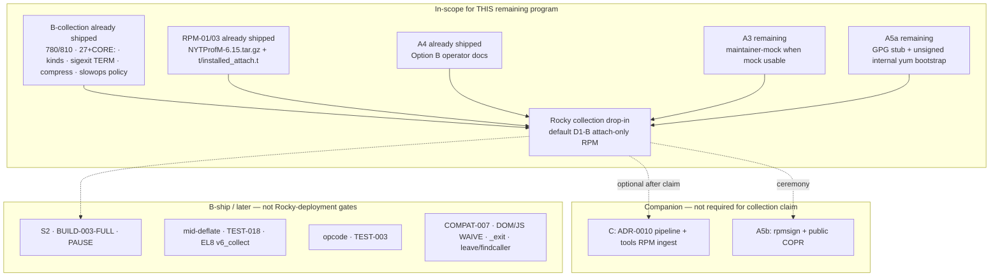
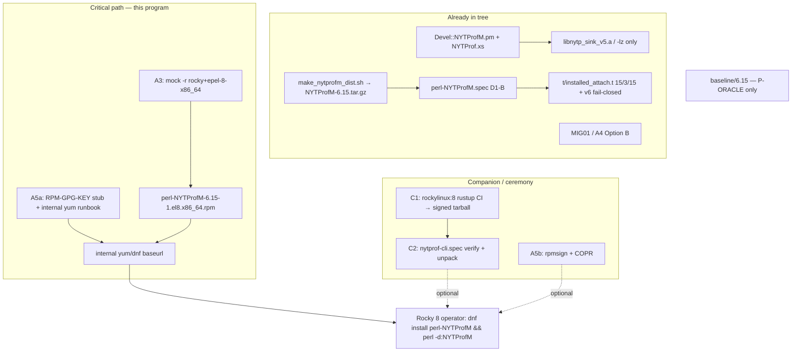
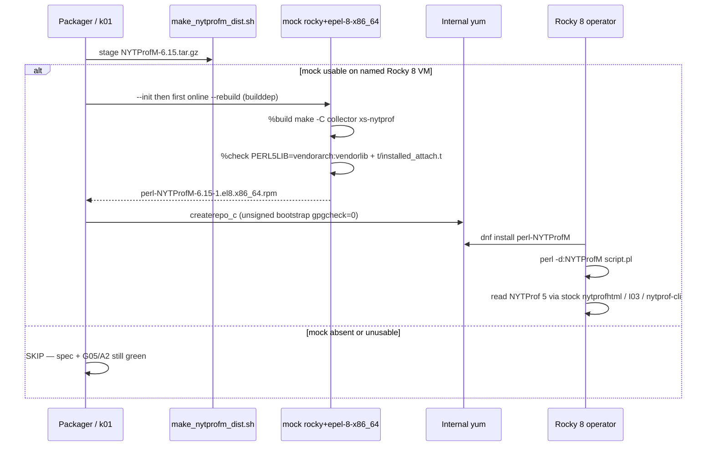

# Remaining Rocky 8 / EL8 deployment — collection drop-in after A0–A4 / B1–B5

| Field | Value |
|-------|-------|
| **Document title** | Remaining work to finish Rocky 8 / EL8 **deployment** of NYTProfM as a **drop-in collection replacement** (D1-B module RPM + operator path) |
| **Author** | design-doc-writer (Grok) |
| **Date** | 2026-08-13 |
| **Status** | Draft (remaining-work delta) |
| **Baseline commit** | `main` @ `236d81e` (`docs: Option B operator identity (MIG01 / S0-S3 / RPM-08)`) |
| **Does not supersede** | [`docs/PROGRAM_CHARTER.md`](https://github.com/hilather/nytprof-modernization/blob/main/docs/PROGRAM_CHARTER.md), [`docs/plan/01_NON_NEGOTIABLES_AND_COMPATIBILITY_CONTRACT.md`](https://github.com/hilather/nytprof-modernization/blob/main/docs/plan/01_NON_NEGOTIABLES_AND_COMPATIBILITY_CONTRACT.md), accepted ADRs 0001–0010, [`docs/contracts/DROP_IN_DOD_v0.md`](https://github.com/hilather/nytprof-modernization/blob/main/docs/contracts/DROP_IN_DOD_v0.md), [`docs/contracts/R1_RESIDUAL_READINESS_MATRIX_v0.md`](https://github.com/hilather/nytprof-modernization/blob/main/docs/contracts/R1_RESIDUAL_READINESS_MATRIX_v0.md), [`AGENTS.md`](https://github.com/hilather/nytprof-modernization/blob/main/AGENTS.md) |
| **Historical + still-binding KDs** | [`docs/DROP_IN_RPM_COMPLETION_v0.md`](https://github.com/hilather/nytprof-modernization/blob/main/docs/DROP_IN_RPM_COMPLETION_v0.md) (rev 4). **Do not rewrite that file in place.** This document is the remaining-work plan after attach-preview, B-collection, Option B identity, and A4 operator docs landed. |
| **User override (2026-08-13)** | **KD-R2 superseded:** `perl-NYTProfM` **does** ship I03 `nytprofhtml` / `nytprof-engine` and overwrites stock `/usr/bin` names on clash. Signing/COPR still not required (test-drive). |
| **Board rows** | `EL8-RPM-MODULE` (spec MVP; **not** mock-certified), `EL8-RPM-TOOLS` (spec MVP; pipeline residual), `DROP-IN-REMAINING` (collection integers landed; publish/mock residual), `NS-NYTPROFM-IDENTITY` (done), `DROP-IN-RPM-COMPLETION` (docs rev 4; A3/A5 residual) |

Agents own **tasks**. This document does not override fixtures, ADRs, the charter, or the frozen KDs in the completion design (KD-1 through KD-36, M01/Q4).

---

## Overview

Collection and identity work that used to block a Rocky operator story is **already in the tree**. `perl -d:NYTProfM` writes `NYTProf 5` via product XS. B-collection bars are green on git smokes: `blocks=1` TIME_BLOCK + resolved-fid line5 **780** / block_line **810**; `calls=2` **27** `SUB_ENTRY` + `CORE:print` / `CORE:match`; product-defined M4-mini projected kinds; `sigexit=1` TERM flush; `compress=1` START_DEFLATE; `slowops=0/1/2` policy. Option B names (`NYTProfM` / `Devel::NYTProfM` **6.15** / `perl -d:NYTProfM` / RPM `perl-NYTProfM`) and A4 operator docs are landed. Source0 exists: [`scripts/packaging/make_nytprofm_dist.sh`](https://github.com/hilather/nytprof-modernization/blob/main/scripts/packaging/make_nytprofm_dist.sh) stages `NYTProfM-6.15.tar.gz`. [`packaging/rpm/perl-NYTProfM.spec`](https://github.com/hilather/nytprof-modernization/blob/main/packaging/rpm/perl-NYTProfM.spec) `%check` already drives [`t/installed_attach.t`](https://github.com/hilather/nytprof-modernization/blob/main/t/installed_attach.t) on the installed tree.

What is **not** landed is the **Rocky deployment** half of “drop-in replacement”: a maintainer-mock-certified D1-B module RPM, honest internal-yum operator path, and (separately) the ADR-0010 signed tools pipeline. On this design host (`236d81e`, 2026-08-13) `mock`, `rpmbuild`, `rpmspec`, `rpmsign`, `copr-cli`, `createrepo_c`, `dnf`, `yum`, and `rpm` are **absent**. `gpg` is present. There is **no** `packaging/rpm/RPM-GPG-KEY-nytprofm` and **no** publish workflow. [`k01_el8_module_rpm_smoke.sh`](https://github.com/hilather/nytprof-modernization/blob/main/scripts/packaging/k01_el8_module_rpm_smoke.sh) therefore honest-SKIPs mock and **does not invoke mock even if it were present**.

This remaining program finishes **Rocky collection drop-in on default D1-B**: B-collection (shipped) + installable / **maintainer-mock-certified** module RPM + Option B docs kept honest as the RPM/repo land. Tools RPM is a **companion** (“native NYTProf tools on EL8”), not part of the collection claim. Public COPR / live `rpmsign` are **A5b ceremony** (KD-34). S2, `BUILD-003-FULL`, and PAUSE are **B-ship residuals**, not Rocky-deployment gates. Opcode, COMPAT-007, DOM/JS, `POSIX::_exit` flush, mid-deflate-in-child, `leave`, and `findcaller` stay listed residuals and **do not block** the Rocky collection-drop-in claim.

---

## Background & Motivation

### Binding historical design (do not re-litigate)

Rev 4 of [`docs/DROP_IN_RPM_COMPLETION_v0.md`](https://github.com/hilather/nytprof-modernization/blob/main/docs/DROP_IN_RPM_COMPLETION_v0.md) still owns the frozen KDs (KD-1…KD-36, M01/Q4) and the original A/B/C/D/E milestone map. That file’s **body** still describes a world where DI-01/02/04/08/09 and A0–A2/A4 were future work. Those PRs have since merged. **Do not** rewrite rev 4 as if they never happened. Cite it for KDs; execute the remaining PRs named here.

Rev-4 [`docs/PRODUCT_COMPLETION_DROP_IN_v0.md`](https://github.com/hilather/nytprof-modernization/blob/main/docs/PRODUCT_COMPLETION_DROP_IN_v0.md) is historical; identity is superseded by Option B (banner already present). Frozen KD-16/17 ≥ 7.00 text in that file stays historical.

### What is already shipped (verify, do not redesign)

| Surface | Evidence in tree | Honesty |
|---------|------------------|---------|
| Live attach | `collector/xs/Devel/NYTProfM.pm` + `collector/xs/NYTProf.xs`; `g04_v5_parity_smoke.sh` | Perl `DB::DB` / `DB::sub` + thin PRINT/MATCH; **not** full 6.15 opcode |
| DI-01 | `scripts/packaging/di01_blocks_780_smoke.sh` | TIME_BLOCK + resolved-fid **780** / **810** |
| DI-02 | `scripts/packaging/di02_calls2_sub_entry_smoke.sh` | `SUB_ENTRY` **27** + `CORE:print` / `CORE:match` |
| DI-04 | `scripts/packaging/di04_mini_kinds_smoke.sh` | Product-defined projected kinds; **not** raw `compare_jsonl` |
| DI-08 | `scripts/packaging/di08_sigexit_smoke.sh` | TERM flush; **`_exit` residual** (verify fail-closed / empty) |
| DI-09 subset | `scripts/packaging/di09_options_subset_smoke.sh` | `compress=1` START_DEFLATE; `slowops=0/1/2` policy |
| RPM-01 | `make_nytprofm_dist.sh` + `rpm01_make_dist_smoke.sh` | Real `NYTProfM-6.15.tar.gz`; no `baseline/` / `crates/` |
| RPM-03 | `perl-NYTProfM.spec` `%check` = `t/installed_attach.t` | Installed-tree 15/3/15 + `format=v6` fail-closed |
| A2 host proof | `a2_installed_attach_smoke.sh` | Prefix install + same test; not an EL8 chroot |
| A4 / RPM-08 | `a4_option_b_docs_smoke.sh` | MIG01 / BUILD S0–S3 / board / annex C / ADR-0010 Recommends |
| Identity | Option B; no `Provides: perl(Devel::NYTProf)` | Operators switch |
| Specs | `perl-NYTProfM.spec` D1-B default; `nytprof-cli.spec` Recommends module, Version **6.15** | Tools ingest still commented / residual |
| Dual-path | `dual_path_smoke.sh` | **Oracle-primary** until explicit S2 |
| Capability | `collection_default` | **v5** until R4 / ADR-0008 |

### Pain points that still block “`dnf install` on Rocky 8”

1. **No maintainer-mock certification (A3).** k01 greps the spec, runs G05 on the **git** tree, and `SKIP`s when `mock` is absent. It never calls `mock -r rocky+epel-8-x86_64`. Board `EL8-RPM-MODULE` is **done (MVP)** / **not mock-certified**.
2. **No GPG asset and no yum runbook you can follow without inventing a key (A5a).** `packaging/rpm/` contains only the two specs and a README. README `%check` prose is **stale** (still says G05 / `product_legacy_smoke.sh`; spec already uses `t/installed_attach.t`).
3. **No public or internal repo ceremony (A5b).** `copr-cli` / `rpmsign` / `createrepo_c` are absent here. KD-34: this does **not** block the A / Rocky-collection claim.
4. **Tools RPM cannot be mock-ingested (C).** ADR-0010 is **policy only**. `nytprof-cli.spec` `%prep` tests that Source0–2 exist but leaves `sha256sum` / `gpg --verify` **commented**. `%check` still looks for repo `fixtures/v5/default-calls1/nytprof.out` (not a bundled tiny-v5.out). No `.github/workflows/publish-nytprof-cli-prebuilt.yml`.
5. **Operator-facing leftovers outside A4’s grep set.** [`docs/RELEASE_NOTES_GA_CANDIDATE_v0.md`](https://github.com/hilather/nytprof-modernization/blob/main/docs/RELEASE_NOTES_GA_CANDIDATE_v0.md) still teaches `Devel::NYTProf` ≥ 7.00 and `perl-Devel-NYTProf.spec`. Residual-matrix `EL8-RPM-MODULE` still cites `perl-Devel-NYTProf.spec`. Living [`DROP_IN_DOD_v0.md`](https://github.com/hilather/nytprof-modernization/blob/main/docs/contracts/DROP_IN_DOD_v0.md) header still says “Do **not** claim collection drop-in … EL8 RPM” and the D1-B row still names `perl-Devel-NYTProf`. MIG01 still says Rocky is “spec MVP / not mock-certified” and that “legacy scripts live in the module package.”
6. **k01 NOT-YET lines are stale.** It still prints `NOT-YET: EL8-RPM-TOOLS / K02 nytprof-cli spec` even though K02 landed.
7. **Spec layout + BRs are not mock-ready.** `.so` is under `%{perl_vendorlib}`; ParseXS/Embed are not explicit BRs.

### Host capability (this workspace, 2026-08-13)

| Tool | Status |
|------|--------|
| `mock` / `rpmbuild` / `rpmspec` / `rpmsign` / `rpm` | **ABSENT** |
| `copr-cli` / `createrepo_c` / `dnf` / `yum` | **ABSENT** |
| `gpg` | **present** (`/usr/bin/gpg`) |
| `packaging/rpm/RPM-GPG-KEY-nytprofm` | **not in tree** |
| GHA mock / publish job | **not in** `.github/workflows/` (only `ci-matrix.yml`, `sec002-fuzz-mvp.yml`) |

Any smoke that needs mock/rpmbuild **must** honest-SKIP on this class of host. A red k01 on a mock-less CI runner is a design bug.

**Named claim-stamp environment (not this workspace):** a packager **Rocky 8 x86_64 VM** (or equivalent) with `mock` + `mock-core-configs` providing `rocky+epel-8-x86_64`, the operator in group `mock`, and working systemd-nspawn. That host — not GHA, not this laptop — is the prerequisite for the claim-stamp commit.

### Binding constraints (do not violate)

- Dual_path stays **oracle-primary** until an explicit **S2** PR. Never rewrite `dual_path_smoke.sh` primary half in A3/A5/C.
- `collection_default` stays **v5** until R4 / ADR-0008.
- Never put `crates/` on oracle `PERL5LIB`.
- Tests drive real CLI / `-d:NYTProfM` / specs / docs / dump/report. No reimplementation stubs.
- Option B identity. EL8 default module is **D1-B** (v5-only, zlib, no cargo). D1-A is `--with v6_collect`.
- EL8 tools ingest is **ADR-0010 signed CI prebuilts** (not rustup-in-mock, not system EL8 rustc).
- Do not flip `BUILD-003-FULL` without a dedicated PR; no COL-008; no product `format=dual`; no opcode as first remaining increment.
- User-final OQs already decided (KD-36): PAUSE TRIAL `6.15_01`; RPM Version **6.15**; **internal yum first**. GPG holder is **`hilather`** (KD-R15); live key still waits for A5b/C1. Mid-deflate-in-child is **residual** (KD-R16).
- Milestone A / Rocky-collection claim does **not** require public COPR / live `rpmsign` (KD-34).
- Docs in the same change; absolute HTTPS links in README / docs / release notes.
- Every bug fix lands with a regression test that fails before and passes after.

---

## Goals & Non-Goals

### Goals (this remaining program)

1. Define and land the **Rocky 8 collection drop-in claim bar** (next section) without over-claiming D1-A, tools-alone, or full 6.15 opcode.
2. **A3:** when mock is **usable** (binary + group + cfg + successful `--init`), k01 **runs** `a3_el8_mock_module.sh` against real Source0 + `perl-NYTProfM.spec`; `%check` is `t/installed_attach.t` with `PERL5LIB` = buildroot **vendorarch:vendorlib**; `NYTProfM.so` lives in `%{perl_vendorarch}`; `readelf`/`ldd` has no libzstd/liblz4. When mock is absent **or unusable**, honest **SKIP** (does not fail k01 / offline_gate).
3. **A5a:** check in a **stub** `RPM-GPG-KEY-nytprofm` plus an **unsigned internal bootstrap** yum runbook (`gpgcheck=0` is temporary, not production policy). No invented live key. No COPR project. No `rpmsign` of a live RPM.
4. Keep Option B docs **honest** as A4b → A3 → A5a land sequentially (DROP_IN_DOD header + D1-B name, P01 leftover + `p01_ga_candidate_smoke.sh`, residual-matrix spec path, MIG01 attach-only / report-path honesty, packaging README `%check` + mock SKIP, k01 NOT-YET lines).
5. Sequence **milestone C** (ADR-0010 pipeline + k02 mock ingest) as the path to “native tools on EL8,” not as a collection-drop-in gate.
6. Leave S2 / `BUILD-003-FULL` / PAUSE / opcode / mid-deflate / EL8 v6 / COMPAT-007 on their existing residual tracks.

### Non-goals (this remaining program)

| Non-goal | Residual / later PR |
|----------|---------------------|
| Full 6.15 opcode / `goto` / full `slowops.h` / leave-correction | DI-03 / milestone E — **not** required for the Rocky D1-B claim |
| Full TEST-003 `compare_jsonl` | DI-05 / E |
| Mid-deflate continue-in-child | DI-06 / D |
| Full TEST-018 | DI-07 / D |
| `POSIX::_exit` flush | DI-08 residual (already documented; smoke asserts fail-closed / empty) |
| `leave` / `findcaller` / evals | DI-09 residual / DI-03 |
| S2 dual_path flip | DI-10 / B-ship |
| `BUILD-003-FULL` (`full_build003=1`) | DI-11 / dedicated PR |
| PAUSE upload of `6.15_01` | DI-12 / B-ship |
| COMPAT-007 bless-array Data | DI-13 — first-GA residual |
| Full nytprofmerge option parity | DI-14 |
| Oracle HTML DOM / jquery / tablesorter | DI-15 — **WAIVED** (M01/Q4) |
| Public COPR + live `rpmsign` | A5b ceremony (KD-34) |
| EL8 `--with v6_collect` mock | RPM-09 / D — default Rocky stays D1-B |
| AppStream Perl 5.32 | RPM-10 |
| Independent SEC-012 sign-off | RPM-11 — blocks **GA marketing**, not Rocky collection |
| GHA mock job / “CI-mock certified” | Not required; do not invent a privileged mock runner in this increment |
| rustup-in-mock / system EL8 rustc / ubuntu-latest as official EL8 tools input | Forbidden (KD-13, KD-28) |
| `Provides: perl(Devel::NYTProf)` | Option B |
| Linking full `libnytp_sink.a` on D1-B | KD-24 |
| Product `format=dual` / COL-008 / R3 / R4 | Frozen non-flips |

---

## Claim bar — what “Rocky 8 deployment drop-in replacement” means

This is the only language operators, release notes, and the board may use after the critical-path PRs land.



### In-scope vs later (binding)

| # | Operator-visible item | This remaining program? | Evidence / gate |
|---|----------------------|-------------------------|-----------------|
| 1 | Installable D1-B module RPM from a real Source0; `%check` on installed files | **Already landed** (RPM-01 / RPM-03). Remaining work is **A3 proving that same contract inside mock**. | `make_nytprofm_dist.sh`; spec `%check` → `t/installed_attach.t` |
| 2 | Maintainer-mock certified when mock is **usable** (A3) | **Yes — critical path** | k01 **runs** mock when usable; SKIP when absent or unusable; board links a mock log from a **named packager Rocky 8 VM** before the **claim** |
| 3 | Option B operator docs (A4) | **Done.** Keep honest as A4b → A3 → A5a land (DROP_IN_DOD header, P01 leftover + p01 smoke, MIG01 attach-only, README `%check`). | `a4_option_b_docs_smoke.sh` stays green |
| 4 | Tools RPM (milestone C / ADR-0010) | **Companion.** Required for “**native tools on EL8**.” **Not** required for the **collection** drop-in claim. Module RPM does **not** ship I03 scripts. | C1 publish/verify + C2 mock ingest |
| 5 | S2 / `BUILD-003-FULL` / PAUSE | **B-ship residuals.** Not required for Rocky *deployment* of D1-B collection. | Dedicated PRs only |
| 6 | `POSIX::_exit`, mid-deflate-in-child, `leave`/`findcaller`, DI-03 opcode | **Do not block** the Rocky collection claim if listed honestly. | DROP_IN_DOD + MIG01 honesty table |

**Recommended position (verified against DROP_IN_DOD marketing tiers, completion-design milestone B-collection, and the current board):** Rocky **collection drop-in** on default **D1-B** is **B-collection + installable / maintainer-mock-certified attach-only module RPM + Option B docs that name how to read the profile**. Tools RPM is companion. Public COPR is A5b ceremony. Opcode / COMPAT-007 / DOM are later or waived.

**Living DROP_IN_DOD vs this delta (KD-R11):** today’s [`docs/contracts/DROP_IN_DOD_v0.md`](https://github.com/hilather/nytprof-modernization/blob/main/docs/contracts/DROP_IN_DOD_v0.md) header still says “Do **not** claim collection drop-in, CPAN-TRIAL, EL8 RPM,” G03a prose still uses `perl -d:NYTProf`, and the D1-B flavor row still names `perl-Devel-NYTProf`. **PR-A4b** is a **narrow honesty pass** on that living contract (header + D1-B package name + Option B debugger name in the explicit-honesty paragraph). Frozen KD-16/17 history is **not** rewritten. After A4b, claim language SoT is **this delta + MIG01 + the updated DoD header**. Do not cite the pre-A4b header as forbidding the Rocky D1-B claim this program authorizes.

The DoD marketing tier **Collection drop-in (GA-candidate)** remains: D1–D2 + D4–D6 scoped by flavor (**D1-B** Rocky default), D3 tools MVP with residual honesty — **not** “full API DOM parity”; Rocky default without v6 called out. On Rocky, D3 is **not** shipped inside `perl-NYTProfM` (attach-only `%files`).

D2 on Rocky default is **already** evidenced by git smokes DI-01/02/04. Mock `%check` does **not** re-run 780/27 (cargo-free tag parser; no `fixtures/`; no `nytprof-cli`). First A3 mock certifies **installed attach 15/3/15 + v6 fail-closed + D1-B link** of the **current** B-collection tree. 780/27 remain git smokes unless a later opt-in `%check` env is added (not this increment).

### What operators may say vs must not say

| After these PRs green… | Operators / notes **may** say | **Must not** say |
|------------------------|-------------------------------|------------------|
| **A3 + A5a** (and shipped B-collection + A4 + A4b) | “`dnf install perl-NYTProfM` (from the packager’s **unsigned internal bootstrap** yum, or later a signed repo) then `perl -d:NYTProfM` is drop-in **collection attach** on **advertised options that are green**, on the **D1-B** Rocky 8 default RPM (Perl 5.26). The module RPM is **attach-only** (`.pm` + `.so`); it does **not** ship `nytprofhtml` / `nytprof-engine`.” “Maintainer-mock certified” **iff** a mock log from the **named packager Rocky 8 VM** is linked from the board. `format=v6` fail-closes with the exact v6_collect string. To **read** `NYTProf 5`: stock `nytprofhtml` if `perl-Devel-NYTProf` remains installed; source I03 prefix; or `nytprof-cli` after C. | “Full drop-in.” “API drop-in.” “DOM/JS parity.” “The module RPM includes legacy scripts / I03.” “Default Rocky writes `NYTPROF6`.” “Provides stock `perl(Devel::NYTProf)`.” “CI-mock certified” (no GHA mock job). “Public COPR.” “Tools-alone drop-in.” “S2.” “PAUSE.” “`BUILD-003-FULL`.” “`_exit` flushes.” “mid-deflate-in-child.” “full opcode.” “`gpgcheck=0` is the production policy.” |
| **+ C1/C2** | Previous **plus** “native NYTProf tools on EL8” (`dnf install nytprof-cli`). | Tools-alone collection / `-d:NYTProfM` from the tools RPM. |
| **+ A5b** | Previous **plus** public COPR / `rpm -K` pgp ok. | Still not full drop-in. |
| **+ B-ship PR** | Only the sentence that PR actually landed (S2 / MakeMaker XS / PAUSE TRIAL `6.15_01`). | Collection integers (those are B-collection). |

### D1–D6 mapping for this claim

| DoD | Rocky collection claim needs | Status after critical path |
|-----|------------------------------|----------------------------|
| **D1** Attach | Product `perl -d:NYTProfM` from **installed** D1-B RPM | A2/A3 `%check` + live G05 15/3/15 |
| **D2** Fidelity | Advertised-options integers on **git** smokes (780/27/kinds) | Already shipped; not re-asserted inside mock `%check` |
| **D3** Tools / report | Optional companion / stock `nytprofhtml` / source I03; HTML JS **WAIVE**; COMPAT-007 residual | **Not** inside `perl-NYTProfM` `%files`; not a collection **gate** |
| **D4** Install | Real Source0 + EL8 mock installability; no `baseline/` / `crates/` on product `PERL5LIB` | RPM-01 done; A3 is the mock half |
| **D5** Dual-path | Three profiles **documented**; dual_path stays oracle-primary | S2 **not** required to install the RPM |
| **D6** Honesty | Capability `collection_default: v5`; no `Provides` stock; residuals named | A4 + honesty updates in A3/A5a |

---

## Proposed Design

### Architecture (shipped vs remaining)



### Component map (do not invent new trees)

| Component | Path | Remaining change |
|-----------|------|------------------|
| Module spec | `packaging/rpm/perl-NYTProfM.spec` | A3: **`.so` → `%{perl_vendorarch}`**; `.pm` stays `%{perl_vendorlib}`; `%check` `PERL5LIB` = vendorarch:vendorlib; explicit ParseXS/Embed BRs; `readelf`/`ldd` D1-B assert. Keep `%build` = `make -C collector xs-nytprof`. Keep `%check` = `t/installed_attach.t`. A3 does **not** install I03 scripts. |
| Dist staging | `scripts/packaging/make_nytprofm_dist.sh` | Unchanged inventory. A3 **drives** it as Source0. |
| Installed `%check` | `t/installed_attach.t` + `t/nytprof_v5_tag_table.inc` + `t/workload-calls1.pl` | Unchanged bar (15/3/15 + v6 fail-closed). Parser **dies** on `START_DEFLATE` (`z`) — default attach must stay `compress` off. Do **not** default-on compress in the same PR as A3. |
| k01 | `scripts/packaging/k01_el8_module_rpm_smoke.sh` | **Invoke** mock runner when mock is **usable**; SKIP when absent or unusable; drop stale K02 NOT-YET; print maintainer-mock vs CI-mock honesty. |
| Mock runner | `scripts/packaging/a3_el8_mock_module.sh` (**new**) | Contract below: `--init` then **one online `--rebuild`** (BRs from BaseOS+AppStream); optional later `--offline`; exit 0/1/2; log copy. |
| Tools spec | `packaging/rpm/nytprof-cli.spec` | Unchanged until C2 (uncomment verify; bundled tiny-v5.out). |
| Verify script | `scripts/packaging/verify_nytprof_cli_prebuilt.sh` (**new**, C1) | Fail-closed GPG + SHA256; fail if key file is the A5a **stub**. |
| GPG stub | `packaging/rpm/RPM-GPG-KEY-nytprofm` (**new**, A5a) | Clearly marked **not a live key**. |
| Publish workflow | `.github/workflows/publish-nytprof-cli-prebuilt.yml` (**new**, C1) | `rockylinux:8` + rustup (CI only). |
| Operator docs | `docs/MIGRATION_DROP_IN_v0.md`, `packaging/rpm/README.md`, P01 notes, residual matrix EL8 row | Honesty only; no identity rename. |
| Dual-path | `scripts/packaging/dual_path_smoke.sh` | **Untouched.** |
| Isolation | Never `crates/` on P-ORACLE | Unchanged. |

### A3 — Maintainer-mock D1-B module RPM (critical path)

#### Install layout (KD-R12) — decide vendorarch now; do not discover in mock

Shipped spec today installs the ELF `.so` under `%{perl_vendorlib}/auto/Devel/NYTProfM/` (EL8 typically `/usr/share/perl5/vendor_perl`). A2’s prefix smoke co-locates `.pm` + `.so` under one `PERL5LIB` tree and **does not** prove the RPM layout.

**Decision (b):** put `NYTProfM.so` in **`%{perl_vendorarch}`**; keep `.pm` / `Core.pm` in **`%{perl_vendorlib}`**. `%check` must set both buildroot dirs.

| Path | EL8 typical | Files |
|------|-------------|-------|
| `%{perl_vendorlib}` | `/usr/share/perl5/vendor_perl` | `Devel/NYTProfM.pm`, `Devel/NYTProfM/Core.pm` |
| `%{perl_vendorarch}` | `/usr/lib64/perl5/vendor_perl` | `auto/Devel/NYTProfM/NYTProfM.so` |

**Why vendorarch for the `.so` (not “keep vendorlib and hope DynaLoader walks `@INC`”):** EL8 `perl-generators`, debuginfo extraction, and file classification expect ELF under `lib64` vendorarch. Shipping an `.so` under `/usr/share/perl5` is the first-mock surprise the current spec is walking into. After `dnf install`, system `@INC` contains **both** vendorarch and vendorlib; DynaLoader walks `@INC` for `auto/Devel/NYTProfM/NYTProfM.so` and finds vendorarch. **`%check` must not hide a post-install miss:**

```spec
%install
instlib=%{buildroot}%{perl_vendorlib}
instarch=%{buildroot}%{perl_vendorarch}
mkdir -p ${instlib}/Devel/NYTProfM ${instarch}/auto/Devel/NYTProfM
install -m 644 ${src}/Devel/NYTProfM.pm ${instlib}/Devel/NYTProfM.pm
install -m 644 ${src}/Devel/NYTProfM/Core.pm ${instlib}/Devel/NYTProfM/Core.pm
install -m 755 ${src}/auto/Devel/NYTProfM/NYTProfM.so \
  ${instarch}/auto/Devel/NYTProfM/NYTProfM.so

%check
export PERL5LIB=%{buildroot}%{perl_vendorarch}:%{buildroot}%{perl_vendorlib}
%{__perl} t/installed_attach.t
# D1-B NEEDED: no libzstd / liblz4
readelf -d %{buildroot}%{perl_vendorarch}/auto/Devel/NYTProfM/NYTProfM.so \
  | grep -E 'NEEDED.*lib(zstd|lz4)' && exit 1 || true

%files
%license Changes
%{perl_vendorlib}/Devel/NYTProfM.pm
%{perl_vendorlib}/Devel/NYTProfM/
%{perl_vendorarch}/auto/Devel/NYTProfM/
```

Write these paths into `docs/schemas/el8-module-rpm-mvp-v0.md` in the same PR. Do **not** leave layout as “fail the PR if mock is surprised.”

#### BuildRequires (explicit; BaseOS + AppStream only)

`collector/Makefile` `xs-nytprof` runs `perl -MExtUtils::ParseXS=process_file` and `perl -MExtUtils::Embed -e ccopts`. Do **not** assume `perl-devel` on Rocky 8 Perl 5.26 pulls those modules. A3 **adds** (AppStream, **not** EPEL):

```spec
BuildRequires:  gcc
BuildRequires:  make
BuildRequires:  perl-devel
BuildRequires:  perl-generators
BuildRequires:  perl(ExtUtils::ParseXS)
BuildRequires:  perl(ExtUtils::Embed)
BuildRequires:  zlib-devel
BuildRequires:  binutils
```

EPEL on the `+epel` chroot is **available**, not required. Do **not** add EPEL-only BRs to default D1-B. If ParseXS/Embed are missing in the chroot, mock `%build` **fails** (red). Do not weaken `%check`.

#### Chroot name

`rocky+epel-8-x86_64` (completion-design RPM-02 / mock-core-configs). Override: `NYTPROF_MOCK_ROOT`. Fallback if that cfg is missing: `rocky-8-x86_64`, printed in the smoke and README.

#### Mock runner contract (`scripts/packaging/a3_el8_mock_module.sh`)

**Invocation (k01 after spec + G05 asserts):**

```text
NYTPROF_MOCK_ROOT=rocky+epel-8-x86_64   # optional; default that value
NYTPROF_MOCK_LOGDIR=<dir>               # optional; default $ROOT/var/mock-a3/
./scripts/packaging/a3_el8_mock_module.sh
```

**Usable mock (all required).** If any check fails, print `SKIP: <reason>` and **exit 0** (do not fail k01 / `make k01-el8-module-rpm-smoke`):

1. `command -v mock`
2. `/etc/mock/${ROOT}.cfg` exists, else try `rocky-8-x86_64`; if neither cfg exists → SKIP
3. Caller can talk to mock: `id -nG` contains `mock`, **or** `mock --help` runs, **or** a probe `mock -r "$ROOT" --quiet --shell /bin/true` is not an auth/group/nspawn failure. Treat “not in mock group”, missing systemd-nspawn, and “cannot set up user namespace” as **SKIP**, not red.
4. `mock -r "$ROOT" --init` succeeds. First `--init` **may** use the network. If `--init` cannot start the chroot → **SKIP** with the init error excerpt (unusable environment), **not** red.

**When usable (init succeeded), the runner is allowed to go red:**

```text
./scripts/packaging/make_nytprofm_dist.sh "$WORKDIR/sources"
# Source0 name NYTProfM-6.15.tar.gz must sit in --sources
mock -r "$ROOT" --buildsrpm \
     --spec packaging/rpm/perl-NYTProfM.spec \
     --sources "$WORKDIR/sources"
# First rebuild is ONLINE: --init only bootstraps @buildsys-build.
# dnf builddep during --rebuild installs D1-B BRs (perl-devel, zlib-devel,
# perl(ExtUtils::ParseXS), perl(ExtUtils::Embed), binutils, …).
# Equivalent: mock --install of that explicit BR list, then --offline --rebuild.
mock -r "$ROOT" --rebuild \
     "$RESULTDIR"/perl-NYTProfM-6.15-1.*.src.rpm
```

**Network policy (binding):**

| Step | Network | Why |
|------|---------|-----|
| `--init` | **Online** (may). If it cannot start → **SKIP**, not red | Bootstrap `@buildsys-build` only |
| **First** `--rebuild` after a cold chroot | **Online** (required) | `dnf builddep` pulls D1-B BRs. `--offline` here **cannot** install them and would false-red k01 |
| Online traffic allowed | Rocky **BaseOS + AppStream** only (the chroot’s configured repos) | No crates.io, no rustup, no EPEL-only packages on default D1-B |
| Later rebuilds (optional) | `NYTPROF_MOCK_OFFLINE=1` → `--offline --rebuild` **iff** the yum cache already holds the BR RPMs | Speeds a warm chroot; **not** the first-run default |

Do not fetch crates.io. Timeout: `NYTPROF_MOCK_TIMEOUT` default **45m** (`timeout` around mock, or mock’s own timeout if documented). Kill → exit 1 with `ERROR: mock timed out`.

**Exit codes:**

| Code | Meaning |
|------|---------|
| **0** | Green rebuild **or** honest SKIP (absent / unusable mock). Print `OK:` or `SKIP:` |
| **1** | Usable mock: `%build` / `%check` / layout / D1-B NEEDED / cargo-invoke assert failed |
| **2** | Misuse (unknown argv, `crates/` on `PERL5LIB`) |

**Log copy (always, when mock wrote them):** copy `root.log` + `build.log` (+ the `.spec` is **not** grepped for cargo) to `${NYTPROF_MOCK_LOGDIR:-$ROOT/var/mock-a3/}`. Print the destination. Do **not** check logs into git. **PR-A3 adds `/var/mock-a3/` to [`.gitignore`](https://github.com/hilather/nytprof-modernization/blob/main/.gitignore)** (today: `/tmp/` and `*.log` only — no `var/`). `*.log` must not be the only ignore: an untracked `var/mock-a3/` directory is still easy to `git add` by mistake.

#### Cargo grep (do not false-red on spec comments)

The shipped spec **comments** contain `cargo` / `rustc` / `rustup`. Mock result dirs copy the `.spec`. **Never** `grep -E 'cargo|rustc|rustup' result/*`.

Binding regexes in k01 / `a3_el8_mock_module.sh` (print them in the smoke):

```text
# root.log — package *install* of a Rust toolchain (yum/dnf transaction lines)
# RED if either matches:
#   (^|[[:space:]])(Installing|Upgrading|Installed)[[:space:]].*(^|[[:space:]])(cargo|rustc|rustup)(-|[[:space:]]|$)
#   (^|[[:space:]])(cargo|rustc|rustup)-[0-9]

# build.log — invoked commands (not comments, not the copied spec)
# RED if a non-comment line invokes the tools:
#   grep -E '^(Executing|Building|make|[[:space:]]*/usr/bin/)' build.log \
#     | grep -E '(^|[[:space:]/=])(cargo|rustc|rustup)([[:space:]]|$)'
```

Do **not** grep `build.log` for the words inside `# Never invoke cargo/rustc` comment lines. Prefer `grep -v '^#'` / skip lines that are clearly spec-echo comments.

#### `%check` behavioral contract (must not regress)

`t/installed_attach.t` must:

1. Refuse `@INC` / loaded `.pm` paths containing `collector/build`.
2. `perl -d:NYTProfM` `t/workload-calls1.pl` with `NYTPROF=file=…` (default, no `blocks`/`compress`).
3. Cargo-free scan: magic `NYTProf 5`; count `SUB_RETURN` `main::leaf` **15**, `main::mid` **3**, `SUB_CALLERS` mid→leaf **15**; skip other known tags by the copied COMPAT-001 layout; **fail closed** on unknown tag or oversize string.
4. Second invocation `format=v6` must croak text containing `v6_collect` and must not write a `NYTPROF6` file.

Parser **dies** on `START_DEFLATE` (`z`) — default attach must stay `compress` off. Do **not** default-on compress in the same PR as A3. A3 does **not** grow `%install` of I03 scripts (attach-only RPM).

**A3 additions (same PR):**

| Assert | How |
|--------|-----|
| D1-B link | `readelf -d` on **vendorarch** `NYTProfM.so` must **not** `NEEDED` `libzstd` / `liblz4`. `BuildRequires: binutils`. |
| Source0 identity | Mock `%setup -n NYTProfM-6.15` succeeds — proof RPM-01 is ingestible, not only host-unpacked. |
| No cargo invoke | Regexes above on `root.log` / `build.log` only |
| Network | `--init` may net; **first `--rebuild` is online** (BaseOS+AppStream `builddep` only); later rebuilds may `--offline` |

**k01 behavior (binding):**

| Host | k01 result | Claim language |
|------|------------|----------------|
| No `mock` (this workspace; typical GHA ubuntu-latest) | `SKIP: mock not installed — not maintainer-mock certified`; exit 0 if spec + G05 still pass | Must **not** flip board |
| `mock` on PATH but **unusable** (not in `mock` group, no cfg after fallback, `--init` cannot start, no nspawn) | `SKIP: mock unusable (<reason>)`; exit 0 | Must **not** flip board |
| Usable mock (init succeeded) | **Run** rebuild; **red (exit 1)** if `%build`/`%check`/layout/NEEDED/cargo-invoke fails | After a green log from the **named packager host** is linked, claim **maintainer-mock certified** |
| Host `rpmbuild` only (no mock) | **SKIP mock** — not EL8 certification | Not certified |

Do **not** add a GHA mock job in this increment (privileged, slow, not required by KD-34). Offline_gate / rust-smoke stay mock-free.

**Named claim-stamp host (KD-R13):** a **packager Rocky 8 x86_64 VM** (or equivalent bare metal) with `mock` + `mock-core-configs` providing `rocky+epel-8-x86_64`, the operator in group `mock`, and working systemd-nspawn. This workspace and GHA ubuntu-latest **cannot** flip the claim. Critical-path PRs may merge here with k01 SKIP; the claim-stamp commit waits for that VM’s logs.

**First mock vs historical PR-B9:** B-collection already landed. The **first** successful A3 mock on the named host certifies the current tree’s installed 15/3/15. A later “re-mock after attach changes” (old PR-B9) is only needed if DI-* attach PRs land **after** the first mock log. Do not block A3 on a second mock.

**Logs:** `${NYTPROF_MOCK_LOGDIR:-$ROOT/var/mock-a3/}` plus a board `EL8-RPM-MODULE` “maintainer-mock log” cell (gist / internal path). Do **not** check a fake log into git.

### A5a — GPG stub + internal yum runbook (engineering, not ceremony)

**Do not invent a live OpenPGP key.** Check in:

```text
packaging/rpm/RPM-GPG-KEY-nytprofm
```

Content is a **stub**: ASCII comment (and optionally a clearly fake non-key block) stating `NOT A LIVE KEY — A5a stub. Intended holder: GitHub repo owner hilather (KD-R15). Replace only when A5b/C1 checks in a real pubkey.` Do **not** invent a live key in A5a. C1 `verify_nytprof_cli_prebuilt.sh` **must fail-closed** if this file is still the stub and a real signature is presented, **or** refuse to verify until the file contains a real `BEGIN PGP PUBLIC KEY BLOCK`. Prefer: verify script exits 2 with `STUB KEY` if the file matches a sentinel string (`NYTPROFM-GPG-STUB`).

Operator runbook (MIG01 + `packaging/rpm/README.md`), **internal yum first** (KD-36). Title the block exactly:

```text
# Unsigned internal bootstrap — NOT a production policy (A5a).
# gpgcheck=0 is temporary until A5b replaces RPM-GPG-KEY-nytprofm
# with a live key held by hilather (KD-R15). Do not leave this as the fleet default.
# packager, after a green A3 mock, on a host with createrepo_c:
mkdir -p /srv/nytprofm/el8/x86_64
cp perl-NYTProfM-6.15-1.el8.x86_64.rpm /srv/nytprofm/el8/x86_64/
createrepo_c /srv/nytprofm/el8

# /etc/yum.repos.d/nytprofm.repo  (internal bootstrap only)
[nytprofm]
name=NYTProfM internal EL8 (unsigned bootstrap)
baseurl=https://internal.example.invalid/nytprofm/el8
enabled=1
gpgcheck=0
# After A5b live key (KD-R9):
# gpgcheck=1
# gpgkey=file:///etc/pki/rpm-gpg/RPM-GPG-KEY-nytprofm

sudo dnf install perl-NYTProfM
# attach-only: writes NYTProf 5; does NOT install nytprofhtml / nytprof-engine
NYTPROF=file=/tmp/nytprof.out perl -d:NYTProfM script.pl

# Read the profile (pick one; none ship in perl-NYTProfM):
#   nytprofhtml /tmp/nytprof.out          # if stock perl-Devel-NYTProf remains
#   nytprof-engine query …                # source I03 prefix, not the RPM
#   nytprof-cli report --json …           # after milestone C
```

Rollback remains `dnf remove perl-NYTProfM` (stock `perl-Devel-NYTProf` untouched).

A5a smoke (`scripts/packaging/a5a_gpg_stub_runbook_smoke.sh`):

- Stub file exists and contains the sentinel `NYTPROFM-GPG-STUB`.
- README / MIG01 contain `dnf install perl-NYTProfM`, the exact phrase **unsigned internal bootstrap**, `gpgcheck=0` marked temporary, and **do not** present a fake COPR enable line as if the project exists.
- README / MIG01 say the module RPM is **attach-only** and name the three read paths (stock `nytprofhtml` / source I03 / `nytprof-cli` after C).
- `a4_option_b_docs_smoke.sh` still green.

### Docs honesty (split across sequential PRs — do not edit the same sections in parallel)

| File | PR | Remaining honesty |
|------|----|-------------------|
| `docs/RELEASE_NOTES_GA_CANDIDATE_v0.md` | **A4b** | Option B leftover: `perl-NYTProfM` / `-d:NYTProfM` / 6.15 as **product** names. Stock `Devel::NYTProf` / `7.00` only as explicit “not the product.” |
| `scripts/packaging/p01_ga_candidate_smoke.sh` | **A4b** | Required needles become Option B (`Devel::NYTProfM`, `6.15`, `perl-NYTProfM`, `-d:NYTProfM`). Keep stock `Devel::NYTProf` / `7.00` only if still present as “not the product.” |
| `docs/contracts/R1_RESIDUAL_READINESS_MATRIX_v0.md` | **A4b** | `EL8-RPM-MODULE` cites `perl-NYTProfM.spec`. |
| `docs/contracts/DROP_IN_DOD_v0.md` | **A4b** | Narrow honesty: header no longer forbids “collection drop-in / EL8 RPM” without qualifier; D1-B flavor row name `perl-NYTProfM`; explicit-honesty G03a line uses `-d:NYTProfM`. Add a one-line banner: claim language for Rocky D1-B is this remaining-work delta + MIG01. **Do not** rewrite frozen KD-16/17 history. |
| `scripts/packaging/a4_option_b_docs_smoke.sh` | **A4b** | Extend to grep P01 product-recipe leftovers (not historical rev-4 KD quotes). |
| `packaging/rpm/README.md` | **A3** | `%check` is `t/installed_attach.t`; vendorarch `.so`; mock chroot + SKIP contract. **Do not** add yum/GPG recipe here (that is A5a). |
| `docs/schemas/el8-module-rpm-mvp-v0.md` | **A3** | vendorlib vs vendorarch paths; ParseXS/Embed BRs. |
| `k01_el8_module_rpm_smoke.sh` | **A3** | Drop `NOT-YET: EL8-RPM-TOOLS / K02`. Keep NOT-YET for mock-certified / D1-A default / S2 / BUILD-003-FULL. |
| `docs/MIGRATION_DROP_IN_v0.md` | **A5a** (plus claim-stamp later) | Qualify “Collection + legacy scripts live in the module package” — **false for the RPM**. Module RPM is attach-only; name the three read paths. Internal yum **unsigned bootstrap** snippet. Until a mock log exists, Rocky row stays “not mock-certified.” |
| `docs/FIRST_SLICE_BOARD.md` | **Claim-stamp only** | Flip `EL8-RPM-MODULE` to **maintainer-mock certified** when the named host’s log is linked. A3 lands the runner, not a fake log. |

Do **not** rewrite `docs/DROP_IN_RPM_COMPLETION_v0.md` or frozen rev-4 KD bodies.

### Milestone C — tools companion (not a collection gate)

Implements ADR-0010 (KD-27/KD-28 already decided in the completion design). Not collection-critical. Specify these four items **before** anyone starts C1:

| Item | Binding choice |
|------|----------------|
| **Trigger** | Workflow `on: workflow_dispatch` (manual) **and** `release: types: [published]` for tags `v*`. Default PR CI does **not** publish. No `ubuntu-latest` rust-smoke artifact promotion. |
| **Builder** | Job `container: rockylinux:8`. Install: `dnf install -y gcc make perl zlib-devel` then official rustup (`curl https://sh.rustup.rs -sSf \| sh -s -- -y --default-toolchain stable`). `source "$HOME/.cargo/env"`. Record `rustc --version` in `manifest.json`. **Forbidden** in mock. |
| **Build flags** | `cargo build -p nytprof-cli --release` only. There is **no** workspace package `nytprof-dump` — [`crates/nytprof-cli/Cargo.toml`](https://github.com/hilather/nytprof-modernization/blob/main/crates/nytprof-cli/Cargo.toml) has a single `[[bin]]` named `nytprof-dump`. Same as [`install_native.sh`](https://github.com/hilather/nytprof-modernization/blob/main/scripts/packaging/install_native.sh): `strip target/release/nytprof-dump`, then `cp` that binary to **both** `nytprof-cli` and `nytprof-dump` in the tarball. Do **not** pass `-p nytprof-dump`. Do not invent MSRV (ADR-Q017 still open). |
| **Keys** | **Intended holder / GitHub Release signer:** repo owner **`hilather`** (KD-R15). **Production:** Actions secret `NYTPROF_RELEASE_GPG_KEY` (+ optional passphrase secret) owned by that identity when A5b/C1 start. Public half replaces the A5a stub in `packaging/rpm/RPM-GPG-KEY-nytprofm` **only when a real pubkey is in the tree**. **Testdata:** `scripts/packaging/testdata/test-rpm-gpg/` (throwaway keypair, not the stub production file). Verify script: if production key file still contains `NYTPROFM-GPG-STUB`, refuse live verify (exit 2). Do not commit a production private key. Do **not** invent a live key in A5a. |
| **tiny-v5 provenance** | Generate `scripts/packaging/testdata/tiny-v5.out` by a **checked-in recipe** (`scripts/packaging/make_tiny_v5.sh`): cargo-free emit or a **few-KB** live `-d:NYTProfM` on a 5-line sleeper/`-e` (not `fixtures/v5/default-calls1/`, not oracle pin). Must start with `NYTProf 5`. Regen comment in the file/script. Bundle that file inside the prebuilt tarball as `share/nytprof-cli/tiny-v5.out`. |
| **EL8 run check** | On the **same** `rockylinux:8` job, after strip: `ldd nytprof-cli` must not show `not found`; `./nytprof-cli capability --json` must emit `collection_default` = `v5`; `./nytprof-cli report --json share/nytprof-cli/tiny-v5.out` must exit 0. Reject promoting an ubuntu-latest binary. |
| **Sign / layout** | **GPG detached over `SHA256SUMS`** is official ingest; cosign optional extra. Layout: `nytprof-cli-6.15-linux-x86_64.tar.gz` + `SHA256SUMS` + `SHA256SUMS.sig` + `manifest.json` (version `6.15`, git SHA, triple `linux-x86_64`, `rustc --version`). |
| **Verify** | `scripts/packaging/verify_nytprof_cli_prebuilt.sh`: `sha256sum -c`; `gpg --verify` against **live** key (not stub); `manifest.json` version + triple; **no unsigned fallback** |
| **Regression** | `rpm04_verify_failclosed_smoke.sh` tampers one SHA256SUMS byte (real verify fails); stub-key case fails; testdata key can pass a local verify |
| **C2** | Uncomment spec verify; `%check` uses bundled tiny-v5.out, **not** repo `fixtures/` |

C1 **hard-gates** C2. **Live GitHub Release publish** waits for a **real `hilather` pubkey** in `packaging/rpm/RPM-GPG-KEY-nytprofm` (A5a stays a stub). C1 may still land the workflow + verify script + tamper test + testdata key. Do **not** start C1 implementation in this docs edit.

### Sequence (operator + packager)



### Risks

| Risk | Sev | Mitigation |
|------|-----|------------|
| k01 grows a hard mock dependency and turns GHA / this host red | **High** | SKIP when mock absent **or unusable** (group / nspawn / `--init`); red only after successful `--init` |
| Host `rpmbuild` mistaken for EL8 cert | **High** | Only `mock -r rocky+epel-8-x86_64` (or documented fallback) on the **named Rocky 8 VM** counts |
| Ubuntu rust-smoke binary used as EL8 tools input | **High** | C1 builder is `rockylinux:8` + in-job `ldd` / `capability` / tiny report; KD-28 |
| Stub GPG key treated as live | **High** | Sentinel `NYTPROFM-GPG-STUB`; verify script refuses stub |
| `gpgcheck=0` left as fleet default | **Med** | Runbook titled **unsigned internal bootstrap — not a production policy** |
| `%check` breaks if default `compress=1` | **Med** | Parser dies on `z`; keep default compress off; do not mix compress-default into A3 |
| `.so` under vendorlib surprises `perl-generators` / debuginfo | **High** | KD-R12: `.so` in **vendorarch**; `%check` PERL5LIB = vendorarch:vendorlib |
| Naive cargo grep reds on spec comments | **High** | Grep `root.log` installs + `build.log` invoke lines only |
| Claim never flips because no mock host is named | **Med** | KD-R13 packager Rocky 8 VM is a claim-stamp prerequisite |
| Operator thinks the module RPM includes I03 scripts | **High** | MIG01/A5a attach-only + three read paths |
| Over-claim “full drop-in” after first mock | **High** | Claim table above; MIG01 honesty table stays |
| Parallel A3/A5a stack-assemble drops README/MIG01 | **Med** | Sequential A4b → A3 → A5a; non-overlapping file ownership |

---

## API / Interface Changes

No debugger name, `$VERSION`, or v5 wire change.

| Surface | Change |
|---------|--------|
| `k01_el8_module_rpm_smoke.sh` | Runs mock when **usable**; SKIP when absent or unusable |
| `perl-NYTProfM.spec` | `.so` in `%{perl_vendorarch}`; `%check` PERL5LIB = vendorarch:vendorlib; ParseXS/Embed BRs; `readelf` D1-B NEEDED |
| `dnf install perl-NYTProfM` | Documented **unsigned internal bootstrap** yum (A5a); still not public COPR until A5b; attach-only |
| `nytprof-cli.spec` `%prep` | Unchanged until C2 (then real `verify_nytprof_cli_prebuilt.sh`) |
| `dual_path_smoke.sh` | Unchanged |
| capability JSON | Unchanged (`collection_default: v5`) |
| RPM NEVRA | Still `perl-NYTProfM-6.15-*`, `nytprof-cli-6.15-*` |

---

## Data Model Changes

None. No v6 wire ID changes (ADR-0006). `collection_default` remains **v5**. Product `format=dual` remains rejected. Oracle fixtures stay immutable. No new goldens required for A3 (installed parser derives 15/3/15 from live attach). C1 may add a **tiny** bundled v5 under the prebuilt tarball / `scripts/packaging/testdata/tiny-v5.out` — not a copy of `fixtures/v5/default-calls1/`.

---

## Alternatives Considered

### 1. Require tools RPM (C) before the Rocky collection claim

| | Require C | Companion (accepted) |
|--|-----------|----------------------|
| DROP_IN_DOD | Tools-only is explicitly **not** drop-in; D3 is dump/report thresholds with residual honesty | Collection is the **module** (D1/D4) |
| Operator | Cannot say “native tools on EL8” until C | Can **attach** with `perl -d:NYTProfM`. To **read** `NYTProf 5`: stock `nytprofhtml` if `perl-Devel-NYTProf` remains; **source** I03 prefix (not the RPM); or `nytprof-cli` after C. The module RPM is attach-only. |
| Cost | Blocks on a live `hilather` key in the tree + rustup-in-CI ceremony | Unblocks Rocky collection now |

**Decision:** tools stay companion. Disagreeing would contradict KD-1 / ADR-0010 §6.

### 2. Treat host `rpmbuild` (or a GHA ubuntu rpmbuild) as EL8 certification

Rejected. glibc, Perl 5.26 vendorarch/vendorlib, and `perl-generators` macros differ. Only `mock -r rocky+epel-8-x86_64` (or documented `rocky-8-x86_64` fallback) on the **named packager Rocky 8 VM** is the cert. Host rpmbuild may be a developer convenience; it must not flip the board.

### 3. Wait for opcode / `_exit` / mid-deflate before claiming Rocky drop-in

Rejected for **this** claim language. DROP_IN_DOD advertised-options attach is the green-row subset, not full 6.15 options. DI-01/02/04/08/09-subset are already green. `_exit`, mid-deflate-in-child, `leave`, `findcaller`, and DI-03 are listed residuals — the same honesty the GA-candidate tier already requires. Waiting for E (~27 pd in rev 4) re-opens the “mega-PR before installable RPM” failure mode the completion design already rejected (KD-29).

### 4. Require public COPR / live `rpmsign` (A5b) for the claim

Rejected (KD-34, KD-36). Internal yum/dnf first. A5a is a stub + runbook so operators are not told to `dnf copr enable` a project that does not exist.

### 5. Flip S2 / BUILD-003-FULL as part of Rocky deployment

Rejected. Installing `perl-NYTProfM` from an RPM does not require `dual_path_smoke.sh` to change its primary half (KD-25, KD-33). `BUILD-003-FULL` is a MakeMaker/CPAN shape, not an RPM `%build` (RPM already calls `make -C collector xs-nytprof`; KD-30).

---

## Security & Privacy Considerations

| Threat | Mitigation |
|--------|------------|
| Unsigned tools binary in mock | C1/C2 fail-closed GPG; no rustup fallback; stub key cannot verify |
| Operators import a stub as a real key | Sentinel in file; runbook titled unsigned bootstrap; `gpgcheck=0` temporary |
| Fleet copies `gpgcheck=0` forever | A5a smoke requires “unsigned internal bootstrap” + temporary wording; A5b flips to `gpgcheck=1` |
| Key compromise (after A5b) | Rotate published `RPM-GPG-KEY-nytprofm`; old sigs stop verifying |
| Profile path symlink / world-writable | Keep 0600 default; setuid module forbidden |
| Supply chain for module RPM | Source0 = staged `make dist` of this tree; D1-B mock has no cargo/crates.io; first `--rebuild` may hit Rocky BaseOS+AppStream for BRs only |
| Signal handler (`sigexit`) | Already shipped subset; `_exit` residual stays fail-closed |
| Malicious profiles (tools) | Existing fail-closed decode; SEC-012 independent walk before **GA marketing** only |

---

## Observability

- Smokes print `OK:` / `SKIP:` / `NOT-YET:` (existing pattern).
- A3 prints chroot name, SRPM NEVRA, and `%check` excerpt.
- Mock `root.log` / `build.log` are the certification artifacts (link from board).
- capability JSON unchanged; do not claim `collection_default: v6`.
- No public P1–P4 / BENCH certification from these PRs.
- If mock cfg name `rocky+epel-8-x86_64` is wrong on a future mock-core-configs, record a light row in [`docs/agent-notes/failed-attempts.md`](https://github.com/hilather/nytprof-modernization/blob/main/docs/agent-notes/failed-attempts.md) and use the fallback — do not silently skip.

---

## Rollout Plan

| Stage | What ships | Rollback |
|-------|------------|----------|
| **Critical path (this program)** | A4b honesty → A3 runner + SKIP → A5a stub + unsigned-bootstrap yum docs | Revert those PRs; operators never had a public package |
| **Claim flip** | Board `EL8-RPM-MODULE` = maintainer-mock certified **after** a real mock log from the **named Rocky 8 VM** | Remove the log link; revert claim language |
| **Internal yum** | Packager publishes mock RPM to private baseurl (**unsigned bootstrap**, `gpgcheck=0` temporary) | `dnf remove perl-NYTProfM` |
| **C (optional)** | Signed `nytprof-cli` EL8 | Remove tools RPM; module remains |
| **A5b (optional)** | `rpmsign` + COPR | Disable COPR; keep internal yum |
| **B-ship (optional)** | S2 / BUILD-003 / PAUSE each on their own PR | Dedicated revert; prior TRIAL |

Feature flags: none new. D1-A remains `--with v6_collect`. S2 remains a smoke rewrite, not a runtime flag.

---

## Key Decisions

Inherited KDs from [`docs/DROP_IN_RPM_COMPLETION_v0.md`](https://github.com/hilather/nytprof-modernization/blob/main/docs/DROP_IN_RPM_COMPLETION_v0.md) remain binding (KD-1, KD-2, KD-5, KD-13, KD-16/17 Option B, KD-21 D1-B default, KD-24, KD-25, KD-26 hooks-first, KD-27 GPG ingest, KD-28 Rocky 8 CI builder, KD-29 A-then-B, KD-30 staged dist, KD-31 resolved fid, KD-32 projected kinds, KD-33 S2 = I01+DI-01/02, KD-34 A without public COPR, KD-35 slowops subset, **KD-36** PAUSE `6.15_01` / RPM 6.15 / internal yum first / GPG holder later). M01/Q4 WAIVE stands.

New decisions for **this remaining-work delta** only:

| ID | Decision | Rationale |
|----|----------|-----------|
| **KD-R1** | Rocky **collection drop-in** claim = shipped B-collection + shipped RPM-01/03 + shipped A4 + **A4b DoD/P01 honesty** + **A3 maintainer-mock** + **A5a unsigned-bootstrap yum/stub honesty**. Module RPM is **attach-only**. | Matches DoD “Drop-in collection on Rocky 8 default RPM” = D1-B green **after A4b updates the living header**; does not wait for D1-A, tools, or opcode. |
| **KD-R2** | **Superseded (user 2026-08-13):** I03 `nytprofhtml` / `nytprof-engine` **are** in `perl-NYTProfM` and overwrite stock `/usr/bin` names. Tools RPM remains a companion for native `html` (needs `nytprof-cli`). Signing not required for test-drive. | Operator asked for scripts in the module RPM; PATH clash is overwrite, not Obsoletes stock. |
| **KD-R3** | S2 / `BUILD-003-FULL` / PAUSE are **B-ship residuals**, not Rocky-deployment gates. | RPM `%build` already is `make -C collector xs-nytprof`. Dual_path primary is a CI-smoke concern, not `dnf install`. |
| **KD-R4** | `_exit`, mid-deflate-in-child, `leave`/`findcaller`, DI-03 opcode **do not block** the Rocky collection claim if named. | Advertised-options tier is green-row subset. DI-08 already documents `_exit`. |
| **KD-R5** | Mock chroot remains **`rocky+epel-8-x86_64`**; D1-B BRs stay BaseOS+AppStream-only **and explicitly include** `perl(ExtUtils::ParseXS)` + `perl(ExtUtils::Embed)` + `binutils`; fallback `rocky-8-x86_64` via `NYTPROF_MOCK_ROOT`. | `xs-nytprof` invokes ParseXS/Embed; do not assume `perl-devel` pulls them. EPEL not required. |
| **KD-R6** | k01 **runs** mock only when **usable** (binary + cfg + group/nspawn + successful `--init`). **SKIP** (exit 0) when absent or unusable. **Red** only after `--init` succeeded and `%build`/`%check` failed. **First `--rebuild` is online** so `dnf builddep` can install D1-B BRs from Rocky BaseOS+AppStream; `--offline` is optional on later warm rebuilds (`NYTPROF_MOCK_OFFLINE=1`). Never crates.io. Host `rpmbuild` ≠ cert. No GHA mock job. | `--init` does not install spec BRs. Binding `--offline` on a cold first rebuild false-reds the named VM and blocks the claim-stamp. |
| **KD-R7** | Mock `%check` stays **15/3/15 + v6 fail-closed + D1-B NEEDED** (no zstd/lz4). 780/27 stay git smokes. | Installed parser is cargo-free and dies on `START_DEFLATE`; fixtures/ must not enter Source0. |
| **KD-R8** | First successful A3 mock on the **named host** certifies the **current** B-collection tree. Old PR-B9 re-mock only if attach changes later. | B1–B5 already merged before first mock. |
| **KD-R9** | A5a checks in a **stub** key + **unsigned internal bootstrap** yum runbook (`gpgcheck=0` temporary, not production policy); live key is A5b/C1. | Do not invent GPG/COPR assets that are not in the tree. |
| **KD-R10** | P01 GA notes, `p01_ga_candidate_smoke.sh`, residual-matrix EL8 path, and a **narrow DROP_IN_DOD honesty pass** are **in scope** for A4b. | Living DoD header currently forbids the claim this delta authorizes; A4 grep set missed P01. |
| **KD-R11** | After A4b, Rocky D1-B claim SoT is **this delta + MIG01 + the updated DoD header**. Frozen rev-4 KD bodies stay historical. | Do not cite the pre-A4b “do not claim collection drop-in / EL8 RPM” sentence as current policy. |
| **KD-R12** | `NYTProfM.so` installs to **`%{perl_vendorarch}/auto/Devel/NYTProfM/`**; `.pm` stays `%{perl_vendorlib}`. `%check` `PERL5LIB` = buildroot vendorarch:vendorlib. | EL8 ELF/debuginfo/`perl-generators` expect vendorarch. A2 prefix smoke is not proof. Not “discover in mock.” |
| **KD-R13** | Claim-stamp prerequisite is a **packager Rocky 8 x86_64 VM** with `mock` + `mock-core-configs` (`rocky+epel-8-x86_64`), operator in group `mock`, working nspawn. | Critical-path PRs can merge here with SKIP; the claim does not flip without that host’s logs. |
| **KD-R14** | Land **A4b, then A3, then A5a** (not parallel README/MIG01). C1/C2 after the claim stamp. | Stack-assemble on overlapping docs is how implementation and runbook diverge. |
| **KD-R15** | Intended GPG identity / GitHub Release signer is repo owner **`hilather`**. A5a still lands a **stub** only. Live pubkey + `rpmsign` / C1 publish wait for A5b/C1 when those PRs start and a real key is in the tree. | User-final 2026-08-13. Closes OQ-GPG-who without inventing a key. Does not rewrite frozen KD-36 body in the rev-4 completion design. |
| **KD-R16** | Mid-deflate-in-child stays **residual**. Keep `nytp_v5_sink_fork_child_reinit`. Do **not** implement PR-D1 now. Escalate later only if a lawyer/charter answer arrives. | User-final 2026-08-13: OQ-deflate-copy = leave residual. Not a Rocky-collection gate. |

---

## Open Questions

No product-fork OQs remain open for this remaining program. Do **not** re-ask KD-36 / Option B / D1-B default / DI-04 projection / S2 prerequisite / OQ-TRIAL-ver / OQ-COPR / **OQ-GPG-who** / **OQ-deflate-copy**.

| ID | Status | Decision |
|----|--------|----------|
| **OQ-GPG-who** | **Decided** (KD-R15) | Holder / GitHub Release signer is **`hilather`**. A5a stays a stub. Live publish waits for a real key in the tree when A5b/C1 start. |
| **OQ-deflate-copy** | **Decided: residual** (KD-R16) | Do not implement mid-deflate-in-child now. Keep child reinit. PR-D1 stays later. Escalate later if a lawyer/charter answer arrives. |

Also decided: mock cfg fallback (KD-R5); unusable-mock SKIP (KD-R6); vendorarch `.so` (KD-R12); named mock host (KD-R13); sequential A4b→A3→A5a (KD-R14); no GHA mock job.

---

## References

| Doc | Role |
|-----|------|
| [docs/DROP_IN_RPM_COMPLETION_v0.md](https://github.com/hilather/nytprof-modernization/blob/main/docs/DROP_IN_RPM_COMPLETION_v0.md) | Historical completion design; binding KD-1…KD-36 |
| [docs/contracts/DROP_IN_DOD_v0.md](https://github.com/hilather/nytprof-modernization/blob/main/docs/contracts/DROP_IN_DOD_v0.md) | D1–D6 + marketing tiers; **A4b** updates living header / D1-B name so it no longer contradicts this delta |
| [docs/PRODUCT_COMPLETION_DROP_IN_v0.md](https://github.com/hilather/nytprof-modernization/blob/main/docs/PRODUCT_COMPLETION_DROP_IN_v0.md) | Rev-4 body; identity superseded by Option B |
| [docs/adrs/0010-signed-ci-prebuilt-native-cli.md](https://github.com/hilather/nytprof-modernization/blob/main/docs/adrs/0010-signed-ci-prebuilt-native-cli.md) | Tools ingest **policy**; pipeline not implemented |
| [docs/BUILD_SUPPORT_POLICY.md](https://github.com/hilather/nytprof-modernization/blob/main/docs/BUILD_SUPPORT_POLICY.md) | P-ORACLE / P-PRODUCT-LEGACY / P-PRODUCT-DUAL; S0–S3; dual_path hard rule |
| [docs/MIGRATION_DROP_IN_v0.md](https://github.com/hilather/nytprof-modernization/blob/main/docs/MIGRATION_DROP_IN_v0.md) | Operator guide (A4 done; mock/COPR status still residual) |
| [docs/FIRST_SLICE_BOARD.md](https://github.com/hilather/nytprof-modernization/blob/main/docs/FIRST_SLICE_BOARD.md) | `EL8-RPM-MODULE` / `EL8-RPM-TOOLS` / `DROP-IN-REMAINING` |
| [docs/schemas/el8-module-rpm-mvp-v0.md](https://github.com/hilather/nytprof-modernization/blob/main/docs/schemas/el8-module-rpm-mvp-v0.md) | Module RPM MVP contract |
| [docs/schemas/el8-tools-rpm-mvp-v0.md](https://github.com/hilather/nytprof-modernization/blob/main/docs/schemas/el8-tools-rpm-mvp-v0.md) | Tools RPM MVP contract |
| [packaging/rpm/perl-NYTProfM.spec](https://github.com/hilather/nytprof-modernization/blob/main/packaging/rpm/perl-NYTProfM.spec) | D1-B spec; `%check` = `t/installed_attach.t` |
| [packaging/rpm/nytprof-cli.spec](https://github.com/hilather/nytprof-modernization/blob/main/packaging/rpm/nytprof-cli.spec) | Tools companion; verify commented |
| [packaging/rpm/README.md](https://github.com/hilather/nytprof-modernization/blob/main/packaging/rpm/README.md) | Spec MVP README (stale `%check` prose) |
| [AGENTS.md](https://github.com/hilather/nytprof-modernization/blob/main/AGENTS.md) | Quality bars + CI watch |

---

## PR Plan

Each PR is independently reviewable and mergeable. Offline_gate stays green on mock-less hosts. Dual_path primary half is **not** rewritten except in a future dedicated S2 PR (out of critical path). `collection_default` stays v5. EE is engineering effort from the completion-design inventory, not calendar.

**Start here (sequential, KD-R14):** **PR-A4b** (DoD/P01/p01-smoke honesty) → **PR-A3** (mock runner + vendorarch + BRs; README `%check`/SKIP only) → **PR-A5a** (stub + unsigned-bootstrap yum + MIG01 attach-only). Claim language flips only after a real mock log from the **named packager Rocky 8 VM** exists.

### Critical path — Rocky collection drop-in

#### PR-A4b — Remaining Option B leftovers + living DoD honesty

- **Title:** `docs: P01/DoD/residual matrix cite perl-NYTProfM (not stock ≥ 7.00)`
- **Files:** `docs/RELEASE_NOTES_GA_CANDIDATE_v0.md`; `scripts/packaging/p01_ga_candidate_smoke.sh` (needles → `Devel::NYTProfM` / `6.15` / `perl-NYTProfM` / `-d:NYTProfM`; stock `Devel::NYTProf` / `7.00` only as “not the product”); `docs/contracts/R1_RESIDUAL_READINESS_MATRIX_v0.md` (`EL8-RPM-MODULE` path); `docs/contracts/DROP_IN_DOD_v0.md` (narrow: header + D1-B package name + G03a `-d:NYTProfM` + banner pointing at this delta/MIG01); `scripts/packaging/a4_option_b_docs_smoke.sh` (extend to P01 product recipes, not historical rev-4 KD quotes)
- **Dependencies:** none (A4 already landed). **Must land before A3.**
- **EE:** 0.75 pd
- **Description:** Operators still have a GA-candidate note teaching `Devel::NYTProf` ≥ 7.00 and `perl-Devel-NYTProf.spec`. Living DROP_IN_DOD header still forbids “collection drop-in / EL8 RPM.” Fix product-path recipes and the DoD header/D1-B name only. **Must** update `p01_ga_candidate_smoke.sh` or `make p01-ga-candidate-smoke` goes red. Do not rewrite frozen rev-4 KD bodies in `PRODUCT_COMPLETION_DROP_IN_v0.md` or `DROP_IN_RPM_COMPLETION_v0.md`.

#### PR-A3 — Maintainer-mock module RPM when mock is usable

- **Title:** `rpm: k01 runs mock rocky+epel-8-x86_64 for perl-NYTProfM (SKIP if unusable)`
- **Files:** `scripts/packaging/a3_el8_mock_module.sh` (new; contract in A3 section); `scripts/packaging/k01_el8_module_rpm_smoke.sh`; `packaging/rpm/perl-NYTProfM.spec` (`.so` → `%{perl_vendorarch}`; `%check` PERL5LIB vendorarch:vendorlib; `BuildRequires` ParseXS/Embed/`binutils`; `readelf` D1-B NEEDED); `packaging/rpm/README.md` (**`%check` + mock SKIP + vendorarch only** — no yum/GPG recipe); `docs/schemas/el8-module-rpm-mvp-v0.md`; [`.gitignore`](https://github.com/hilather/nytprof-modernization/blob/main/.gitignore) add `/var/mock-a3/`
- **Dependencies:** **PR-A4b**. Do **not** edit MIG01 yum/GPG sections (A5a). Do **not** flip the board to mock-certified.
- **EE:** 4.5 pd (completion RPM-02)
- **Description:** Drive real `make_nytprofm_dist.sh` → `mock --init` → `--buildsrpm` → **first online `--rebuild`** (so `dnf builddep` can install D1-B BRs from BaseOS+AppStream; equivalent `mock --install` of the BR list then `--offline --rebuild`). `%check` remains `t/installed_attach.t` (15/3/15 + v6 fail-closed) with dual PERL5LIB. Assert no libzstd/liblz4 on **vendorarch** `NYTProfM.so`. k01 **red** only if mock was usable and rebuild/check failed; **SKIP** if mock is absent or unusable (not in group, no cfg after fallback, `--init` cannot start). Cargo grep uses the published `root.log`/`build.log` regexes only. Drop stale `NOT-YET: EL8-RPM-TOOLS / K02`. Not CI-mock certified. Not D1-A. Not BUILD-003-FULL. Not I03-in-RPM.

#### PR-A5a — Pubkey stub + unsigned internal yum bootstrap (no ceremony)

- **Title:** `docs: RPM-GPG-KEY stub + unsigned internal yum bootstrap (no COPR/rpmsign)`
- **Files:** `packaging/rpm/RPM-GPG-KEY-nytprofm` (sentinel `NYTPROFM-GPG-STUB`); `packaging/rpm/README.md` (**yum/GPG section only**); `docs/MIGRATION_DROP_IN_v0.md` (attach-only + three read paths; qualify “legacy scripts live in the module package”; unsigned-bootstrap snippet; no fake `copr enable`); `scripts/packaging/a5a_gpg_stub_runbook_smoke.sh` (new)
- **Dependencies:** **PR-A3** (README mock/`%check` text already landed so A5a only appends yum/GPG)
- **EE:** 1 pd (completion RPM-06/07 engineering)
- **Description:** Operators can follow an **unsigned internal bootstrap** `dnf install perl-NYTProfM` recipe. `gpgcheck=0` is titled **not a production policy**. No COPR project. No live `rpmsign`. Stub must not look like a real pubkey. Module RPM is attach-only.

### Claim stamp (not a code PR)

**Prerequisite host:** packager **Rocky 8 x86_64 VM** with `mock` + `mock-core-configs` (`rocky+epel-8-x86_64`), operator in group `mock`, working systemd-nspawn. This workspace / GHA cannot produce the log.

After that host produces a green A3 log:

- Link `root.log`/`build.log` from board `EL8-RPM-MODULE`.
- Flip that row to **maintainer-mock certified** (still not CI-mock / not D1-A default / not public COPR).
- Update MIG01 Rocky status row from “spec MVP / not mock-certified” to “maintainer-mock certified; public COPR residual; attach-only RPM.”
- This may be a **tiny follow-up commit** on `docs/FIRST_SLICE_BOARD.md` + MIG01. Do not check the RPM binary into git.

### Companion — native tools on EL8 (not collection-critical)

#### PR-C1 — Signed CI prebuilt pipeline (ADR-0010 implementation)

- **Title:** `ci: publish GPG-signed nytprof-cli linux-x86_64 (ADR-0010)`
- **Files:** `.github/workflows/publish-nytprof-cli-prebuilt.yml` (`workflow_dispatch` + `release` on `v*`; `container: rockylinux:8`; rustup + `cargo build -p nytprof-cli --release`; install/strip `target/release/nytprof-dump` under both `nytprof-cli` and `nytprof-dump`; secret `NYTPROF_RELEASE_GPG_KEY`); `scripts/packaging/verify_nytprof_cli_prebuilt.sh`; `scripts/packaging/rpm04_verify_failclosed_smoke.sh`; `scripts/packaging/make_tiny_v5.sh` + `scripts/packaging/testdata/tiny-v5.out`; `scripts/packaging/testdata/test-rpm-gpg/` (throwaway keypair); ADR-0010 implementation footnote; `docs/BUILD_SUPPORT_POLICY.md` residual line
- **Dependencies:** **after claim stamp** to start (not collection-critical). **Live GitHub Release publish** waits for a real **`hilather`** pubkey in the tree (KD-R15). A5a stub is not enough.
- **EE:** 8 pd
- **Description:** See Milestone C table: trigger, rustup install, `cargo build -p nytprof-cli --release` (no `-p nytprof-dump`), copy/strip one binary under both names, testdata vs production stub, tiny-v5 provenance, in-job `ldd` + `capability` + tiny `report --json`. Intended signer is **`hilather`**. GPG over SHA256SUMS; optional cosign extra. Verify fails on tamper and on A5a stub key. Not rustup-in-mock. Not ubuntu-latest as official EL8 input. Do **not** start this PR in the current docs-only edit.

#### PR-C2 — K02 mock ingest of signed payload

- **Title:** `rpm: nytprof-cli mock ingest of signed prebuilt`
- **Files:** `packaging/rpm/nytprof-cli.spec` (uncomment sha256/gpg; `%check` uses bundled tiny-v5.out, **not** repo `fixtures/`); `scripts/packaging/k02_el8_tools_rpm_smoke.sh`; `docs/schemas/el8-tools-rpm-mvp-v0.md`; board `EL8-RPM-TOOLS`
- **Dependencies:** PR-C1 (verify script + at least a test-signed fixture); PR-A0 already landed (6.15 identity)
- **EE:** 2.5 pd
- **Description:** `%prep` runs the real verify script. When mock + signed sources exist, mock rebuild; tamper fails. Tools never claim drop-in.

### Ceremony — does not block Rocky collection claim (KD-34)

#### PR-A5b — `rpmsign` + COPR / public yum

- **Title:** `release: rpmsign + COPR/yum publish perl-NYTProfM`
- **Files:** `scripts/packaging/rpm_sign_and_publish.sh` (new); replace stub key with **live** pubkey; MIG01 / README COPR URLs (absolute HTTPS)
- **Dependencies:** PR-A3 (an RPM to sign), PR-A5a (runbook), a **live `hilather` pubkey** in `packaging/rpm/RPM-GPG-KEY-nytprofm` (KD-R15)
- **EE:** 3 pd (ceremony-bound; may stall until the key is in the tree)
- **Description:** Sign mock RPMs as **`hilather`**; publish COPR or promote internal yum to `gpgcheck=1`. Tools publish waits for C. **Does not block** the collection claim. Do **not** start this PR in the current docs-only edit. A5a stub remains until then.

### B-ship residuals (not Rocky-deployment critical path)

Keep the completion-design IDs. Do **not** start these to finish Rocky collection drop-in.

#### PR-B6 — BUILD-003-FULL (DI-11)

- **Title:** `build: Makefile.PL full XS dual-build (full_build003=1)`
- **Files:** `Makefile.PL`, collector link, `makemaker_build003_depth_smoke.sh`, BUILD_SUPPORT_POLICY, stamps
- **Dependencies:** none for Rocky RPM (`%build` already uses `xs-nytprof`)
- **EE:** 7 pd
- **Description:** Dedicated PR. Not a gate for A3 or S2.

#### PR-B7 — S2 dual_path primary → P-PRODUCT-LEGACY (DI-10)

- **Title:** `packaging: S2 dual_path primary is product_legacy (oracle still required)`
- **Files:** `scripts/packaging/dual_path_smoke.sh`, `offline_gate.sh`, BUILD_SUPPORT_POLICY S2
- **Dependencies:** I01 + DI-01/02 already green (KD-33). **Not** B6. **Not** A3.
- **EE:** 2.5 pd
- **Description:** Rewrite **only** the primary half. `legacy_only_smoke.sh` remains required.

#### PR-B8 — PAUSE NYTProfM TRIAL (DI-12)

- **Title:** `release: PAUSE upload NYTProfM 6.15_01 TRIAL`
- **Files:** Changes, J02 notes, `cpan_trial_uploaded` stamp
- **Dependencies:** notes-ready already; **may lag** Rocky claim (KD-36 version already decided)
- **EE:** 2.5 pd
- **Description:** Upload TRIAL. Not GA. Not required to say Rocky collection drop-in.

#### PR-B9 — Re-mock only if attach changes after first A3 log

- **Title:** `rpm: re-mock perl-NYTProfM after post-A3 attach changes`
- **Files:** k01 / board; optional `%check` opt-in env (not required)
- **Dependencies:** PR-A3 + any later DI attach PR
- **EE:** 1.5 pd
- **Description:** Skip if no attach change landed after the first mock log (KD-R8).

### Later / residual (not this program’s critical path)

| PR | Title | Deps | EE | Note |
|----|-------|------|----|------|
| PR-D1 | `collector: continue zlib stream in addpid child` | residual | — | **KD-R16:** do **not** implement now. Keep `nytp_v5_sink_fork_child_reinit`. Escalate later only if a lawyer/charter answer arrives. |
| PR-D2 | `test: product TEST-018 fork subset vs oracle` | D1 | 6 | Honest skip opcode-only rows |
| PR-D3 | `rpm: mock --with v6_collect D1-A (not default)` | A3 | 3 | Default Rocky stays D1-B |
| PR-E1 | `collector: 6.15 opcode attach via nytp_emit_*` | B3 already green | 18 | Not required for Rocky D1-B claim |
| PR-E2 | `test: complete TEST-003 product-vs-oracle corpus` | E1 | 9 | Full `compare_jsonl` after opcode + DISCOUNT |
| PR-F1 | `cli: nytprofmerge option parity beyond --aggregate-sum` | L02 landed | 8 | Tools residual |
| PR-F2 | `rpm: document/residual second stream Perl 5.32` | A3 | 4 | Not first advertised stream |
| PR-F3 | `docs: SEC-012 independent reviewer attestation` | P02 checklist | 2 | Blocks **GA marketing** only |

#### Explicitly no PR in this remaining program

| ID | Why |
|----|-----|
| DI-13 COMPAT-007 | First-GA residual |
| DI-15 HTML DOM / jquery | WAIVED |
| COL-008 / R3 / R4 / product `format=dual` | Frozen non-flips |
| `Provides: perl(Devel::NYTProf)` | Option B |
| GHA mock job | KD-R6 |
| Live GPG/COPR assets | Not in tree; A5a stub only |

### EE roll-up (remaining only)

| Track | PRs | EE (pd) |
|-------|-----|---------|
| **Critical path** | A4b + A3 + A5a | **~6** |
| Claim stamp | board/MIG01 after mock log | ~0.2 |
| Companion C | C1 + C2 | **~10.5** |
| Ceremony A5b | A5b | **~3** (holder **`hilather`**; blocked until a live key is in the tree) |
| B-ship | B6–B9 | **~13.5** if all done; **0** required for Rocky collection |
| D / E / F | later | as in completion design |

**Recommended next implementation slice:** **PR-A4b → PR-A3 → PR-A5a**, then a run on the **named packager Rocky 8 VM** + claim-stamp commit. Do not start C, S2, BUILD-003, PAUSE, or opcode to finish the Rocky collection drop-in claim.
