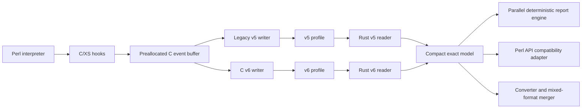

# 00 - Executive Architecture

## Objective

Modernize Devel::NYTProf so that exact profiling remains exact while reducing:

- bytes written per captured event;
- CPU spent serializing, compressing, parsing, and formatting;
- peak memory used while loading profiles and building reports;
- elapsed time required to generate all existing reports.

The modernization must retain the complete feature set and provide controlled coexistence with Devel::NYTProf 6.15 for regression testing and rollout.

## Core architecture decision

Use a hybrid architecture rather than a whole-project language rewrite.



### Why the collector remains C/XS

The collector already executes inside Perl debugger/interpreter hooks and touches Perl internals for every breakable statement and call transition. Moving that boundary to Rust per event would add foreign-function overhead and preserve the same unsafe C API dependency. C/XS therefore remains responsible for:

- entering from Perl internals;
- reading the profiler clock using the existing semantics;
- capturing the event without allocation where possible;
- maintaining interpreter-specific state;
- discounting profiler overhead exactly as the legacy implementation does;
- handling fork/PID transitions and shutdown boundaries;
- encoding v5 or v6 records through in-process C sinks;
- buffering and flushing without a mandatory cross-language transition on the event path.

Rust is kept out of the per-event collector path. It is used for offline decoding, aggregation, validation, conversion, merging, and report generation. A batched in-process Rust encoder may be evaluated later, but it is not part of the baseline architecture and must outperform the C writer without changing timing semantics.

### Why Rust is used for the rest

Rust is a strong fit for new binary format work, bounded parsing, compact typed storage, deterministic parallel report generation, and a stable C ABI wrapper. The expected gains come primarily from representation and algorithms, not from language substitution alone.

## Exactness model

The v6 format stores the full ordered event stream. It does not replace events with summaries.

Lossless space reductions come from:

1. Interning repeated strings and source blobs.
2. Encoding file, line, depth, and dictionary references as deltas or variable-length integers.
3. Storing timing as explicit integer ticks with clock metadata rather than native Perl floating-point memory images.
4. Grouping events into independently compressed chunks.
5. Avoiding repeated source content through content-addressed blobs.
6. Encoding repeated event patterns efficiently while retaining exact order and multiplicity.
7. Writing optional exact derived indexes only in addition to, never instead of, raw events.

A run-length representation is acceptable only when it expands to the exact original sequence and does not combine timing values or discard boundaries.

## Compatibility model

### Read compatibility

The new engine reads:

- valid v5 profiles produced by Devel::NYTProf 6.15 and supported earlier producers;
- valid v6 profiles;
- incomplete profiles to the same or better extent than the legacy tools, with explicit recovery diagnostics.

### Write compatibility

The new collector supports:

- `format=v5`: output readable by unmodified 6.15 tools;
- `format=v6`: compact portable output for the new engine;
- `format=dual`: developer/test mode that feeds the same captured events to v5 and v6 writers.

`format=dual` is not a production performance mode. Its purpose is exact same-run comparison without clock drift between separate runs.

### API and CLI compatibility

During migration, the distribution retains:

- existing Perl package names and public methods;
- `Devel::NYTProf::ReadStream` callback names, arguments, and event order;
- existing `NYTPROF` option behavior;
- existing executable names and command-line options;
- existing report file names, anchors, navigation, semantics, and data values;
- legacy engine selection for diagnosis and fallback.

Proposed engine selection:

```text
--engine=legacy
--engine=native
--engine=auto
```

Equivalent environment/configuration controls must be available for API consumers.

## Major components

### 1. Collector event buffer

A canonical C event-sink layer and fixed-capacity writer buffers with:

- compact fixed-width in-memory event headers;
- a bounded side arena for variable-size strings/metadata;
- monotonically increasing event sequence numbers;
- no heap allocation for common statement events;
- explicit flush points;
- separate v5 and v6 writer adapters.

### 2. v5 compatibility writer and reader

The existing writer remains the compatibility oracle initially. A new Rust v5 reader is implemented independently and tested against it. A Rust v5 writer may follow, but it is not required before v6 rollout.

### 3. v6 format

A self-describing portable format with:

- fixed prelude and version/feature flags;
- explicit clock and numeric encoding metadata;
- dictionaries for repeated byte strings;
- content-addressed source blobs;
- independently decodable event chunks;
- per-chunk integrity checks;
- optional footer/index and optional exact aggregate cache;
- forward-compatible skippable sections;
- well-defined incomplete-file behavior.

### 4. Rust decode and model engine

A workspace of narrowly scoped crates (canonical names shared with `03` and `06`):

```text
crates/
  nytprof-types/
  nytprof-format-v5/
  nytprof-format-v6/
  nytprof-model/
  nytprof-aggregate/
  nytprof-report-ir/
  nytprof-html/
  nytprof-cli/
  nytprof-ffi/
  nytprof-testkit/
```

The model holds exact integer timing and stable IDs. Conversion to seconds and display rounding occurs only at presentation/API boundaries that historically expose floating-point values.

### 5. Native report engine

The engine performs a single parse/aggregate pass, creates a deterministic report intermediate representation, and renders independent files in parallel. It avoids constructing the legacy Perl hash/array/scalar graph unless a Perl consumer explicitly requests it.

### 6. Compatibility adapter

An XS/Perl adapter materializes existing Perl objects from the compact model. It may use lazy materialization only where observable behavior, identity, mutation, reference shape, and error timing remain compatible.

### 7. Converter, validator, and merger

A single native tool/library provides:

- v5 to v6 conversion;
- v6 to v5 conversion subject to v5 representability, with diagnostics;
- semantic validation;
- canonical event dumping;
- mixed v5/v6 merge;
- index/cache generation.

## Performance strategy

Collection optimization is constrained by exactness. The plan therefore targets overhead that does not contribute to information:

- fewer function calls into compression and I/O;
- fewer copies;
- fewer repeated strings;
- no native floating-point serialization on the v6 hot path;
- larger but bounded batches;
- lower-cost compression chosen by NYTProf-specific benchmarks;
- no per-event Rust transition;
- no report-time Perl object explosion;
- parallel report rendering after deterministic aggregation.

## Migration sequence

1. Baseline current behavior and freeze compatibility fixtures.
2. Build and verify the Rust v5 reader/canonicalizer.
3. Build the compact model and native report path for v5 input.
4. Freeze v6 only after format prototypes and benchmarks.
5. Add collector writer abstraction and same-run dual output.
6. Validate v5/v6 semantic equality across the full matrix.
7. Ship v6 as opt-in while legacy remains default/fallback.
8. Promote native reporting independently from v6 collection.
9. Promote v6 output only after cross-release and recovery gates pass.

## Success definition

Correctness and compatibility are release blockers. Performance targets are measured only after semantic equality has passed. No optimization is accepted if it changes an exact event, time accounting rule, call relationship, report total, or public behavior outside explicitly documented v5 representation limits.
