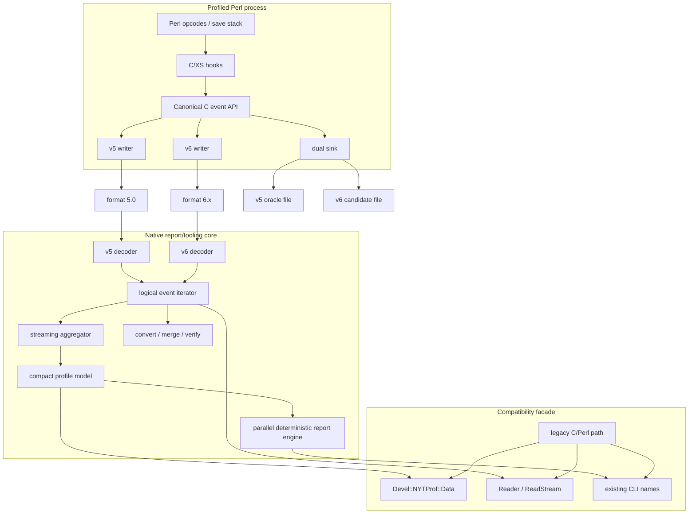

# Target Architecture

## 1. Architectural decision

Use a **hybrid C/XS + Rust architecture**:

- C/XS remains responsible for Perl interpreter hooks and hot-path event production.
- C encoders write v5 or v6 directly; the collector does not cross into Rust per event.
- Rust owns new readers, validation, compact aggregation, conversion, merge, and report generation.
- Perl modules and scripts remain the compatibility facade and fallback.

This design focuses language change where it has the highest expected return: parsing, memory layout, aggregation, parallel report generation, and tooling.

## 2. Component diagram



## 3. Collector event boundary

Introduce a C-level event interface whose functions express semantics rather than wire bytes. Example conceptual surface:

```c
typedef struct nytp_sink nytp_sink;

void nytp_emit_time_line(
    nytp_sink *sink,
    int64_t ticks,
    uint32_t fid,
    uint32_t line
);

void nytp_emit_time_block(
    nytp_sink *sink,
    int64_t ticks,
    uint32_t fid,
    uint32_t line,
    uint32_t block_line,
    uint32_t sub_line
);

void nytp_emit_sub_return(
    nytp_sink *sink,
    uint32_t depth,
    nytp_string_view subname,
    int64_t inclusive_ticks,
    int64_t exclusive_ticks
);
```

The exact API is an implementation task. Its required properties are:

- stack-friendly arguments and no allocation in the common path;
- v5, v6, dual, counting, and test sinks;
- explicit tick units and signedness;
- explicit UTF-8/byte-string distinction;
- error propagation compatible with current behavior;
- no virtual dispatch or indirect-call regression without benchmark evidence;
- ability to compile the legacy v5 path with minimal changes.

## 4. File-format strategy

### 4.1 v5

- frozen compatibility format;
- new collector can still write it;
- new Rust reader can read it;
- legacy reader/report remains available;
- used as an oracle and interchange with old tooling.

### 4.2 v6

- canonical integer ticks;
- ordered logical events;
- dictionary IDs for repeated strings;
- delta-coded locations and depths;
- independent compressed chunks;
- checksums and optional footer index;
- portable encoding independent of Perl `NV` size and host endianness;
- internal derived summaries may be included only as additive, verifiable acceleration data.

### 4.3 Dual mode

The event API fans each event to both writers. The decoded v5 and v6 canonical streams must match exactly for all values representable by v5. Dual mode also verifies lifecycle and finalization ordering.

## 5. Rust workspace strategy

Proposed crates (canonical names; keep identical across architecture docs):

```text
crates/
  nytprof-types/        IDs, ticks, logical events, limits, errors
  nytprof-format-v5/    format 5 decoder and optional encoder/converter support
  nytprof-format-v6/    format 6 decoder/encoder, chunks, codecs, indexes
  nytprof-model/        compact immutable/mutable profile models
  nytprof-aggregate/    streaming aggregators and merge logic
  nytprof-report-ir/    deterministic presentation-independent report IR
  nytprof-html/         HTML and auxiliary report generation
  nytprof-cli/          inspect, verify, convert, merge, html, calls
  nytprof-ffi/          coarse-grained C ABI for Perl/XS integration
  nytprof-testkit/      canonical fixtures, generators, comparators
```

Crates should avoid unnecessary dependencies, expose stable internal interfaces, and isolate `unsafe` code in `nytprof-ffi` and any native-codec boundary.

## 6. Report-side data paths

### 6.1 Streaming callback path

Used by `ReadStream`, canonical dump, converters, and tools that need event order. It does not materialize the full profile.

### 6.2 Compact aggregate path

Used by standard reports. It retains exact totals and relationships in typed vectors/maps, not a Perl object per field.

### 6.3 Compatibility object path

Materializes the legacy Perl AV/HV/SV graph only when an existing Perl caller requires it. This may be lazy or on-demand but must preserve observable shapes.

### 6.4 Call-stream path

Individual call events are streamed into flame/call-path aggregation without building a generic Perl callback tree. Raw event retention is optional and explicit.

## 7. Deployment modes

| Mode | Collector | Reader/report | Purpose |
|---|---|---|---|
| Legacy | v5 | legacy C/Perl | Absolute fallback and old-Perl support. |
| Hybrid-v5 | v5 | Rust | Early report acceleration without new format. |
| Hybrid-v6 | v6 | Rust | Target optimized path. |
| Dual-test | v5 + v6 | both + comparator | Exact regression oracle. |
| Convert-only | n/a | Rust CLI | Interchange and old-tool support. |

## 8. Determinism requirements

- IDs may differ internally, but canonical remapping must be stable.
- Parallel report jobs write independent temporary files and commit them in stable manifest order.
- Sorting rules must be explicit and match legacy tie-breakers.
- Compression may be nondeterministic only if the decompressed logical stream and checksums are stable; deterministic compression is preferred for reproducible fixtures.
- No use of hash iteration order in user-visible output without sorting.

## 9. Failure and fallback behavior

- If the Rust binary/library is unavailable, `reader=auto` falls back to legacy v5 support where possible.
- A v6 file must never be silently treated as v5.
- Unsupported codecs or format features produce a precise error naming the missing capability.
- Corrupt v6 chunks fail with sequence and offset details; salvage mode is explicit.
- A failed optimized report must not overwrite a previously valid report directory unless atomic replacement succeeds.

## 10. Architecture tasks

### ARCH-001 — Define the canonical C event API

- **Status:** proposed
- **Size:** L
- **Dependencies:** COMPAT-001, BASE-002, BASE-003
- **Agent:** C/XS architect
- **Work:** Define POD C event structs/unions, byte ownership and lifetimes, emit functions, sink dispatch, error propagation, batching compatibility, and a complete mapping from current v5 records.
- **Deliverables:** header, ownership/lifetime rules, error model, event-to-v5 mapping table.
- **Acceptance:** every v5 semantic event maps one-to-one; no hot-path heap allocation is required.

### ARCH-002 — Define sink lifecycle and finalization state machine

- **Status:** proposed
- **Size:** L
- **Dependencies:** ARCH-001
- **Agent:** C systems engineer
- **Work:** model open/header/start compression/process start/events/final summaries/source/process end/close/discard/fork/reopen.
- **Deliverables:** lifecycle state diagram, transition table, failure/fork rules, and executable transition tests.
- **Acceptance:** state transitions cover normal exit, signal exit, `_exit`, fork, file switch, and partial failure.

### ARCH-003 — Define Rust logical-event interfaces

- **Status:** proposed
- **Size:** M
- **Dependencies:** COMPAT-001
- **Agent:** Rust API engineer
- **Work:** Define owned and borrowed logical-event types, streaming iterator/visitor interfaces, provenance, limits, and stable semantics shared by v5/v6 readers and downstream consumers.
- **Deliverables:** `Event`, borrowed `EventRef`, iterator/visitor traits, error and limit types.
- **Acceptance:** v5 and v6 decoders share consumers without format-specific branching.

### ARCH-004 — Define compact aggregate model

- **Status:** proposed
- **Size:** L
- **Dependencies:** BASE-004, BASE-008, ARCH-003
- **Agent:** Rust/data-layout engineer
- **Work:** model files, eval parentage, source, line/block/sub totals, sub definitions, call sites, recursion, processes, options, and attributes.
- **Deliverables:** model schema, ownership/indexing rules, memory-layout budget, and canonical serialization used only for tests.
- **Acceptance:** all legacy API/report values are derivable; memory model is measurable and serializable for tests.

### ARCH-005 — Define compatibility facade boundaries

- **Status:** proposed
- **Size:** M
- **Dependencies:** ARCH-003, ARCH-004, COMPAT-004
- **Agent:** Perl/Rust integration engineer
- **Work:** Partition native core, C ABI, XS adapter, Perl facade, standalone CLI, and legacy fallback responsibilities; define coarse-grained calls and object-materialization boundaries.
- **Deliverables:** boundary/API diagram, coarse C ABI proposal, Perl object-materialization rules, and fallback decision table.
- **Acceptance:** clear boundary between native model, Perl wrappers, and legacy fallback; no per-field FFI chatter in report loops.

### ARCH-006 — Define feature negotiation

- **Status:** proposed
- **Size:** M
- **Dependencies:** FMT-001, BUILD-001
- **Agent:** format/build engineer
- **Work:** specify format feature bits, codec IDs, optional indexes, required/optional reader behavior before FMT-002 freezes their byte representation.
- **Deliverables:** feature registry, capability-query schema, required/skippable decision rules, and compatibility vectors.
- **Acceptance:** older v6 readers can reject required unknown features and ignore optional unknown sections safely.

### ARCH-007 — Prototype dual-sink overhead

- **Status:** proposed
- **Size:** M
- **Dependencies:** ARCH-001, COL-001
- **Agent:** performance engineer
- **Work:** implement a temporary fan-out sink and measure dispatch overhead separately from writing.
- **Deliverables:** prototype, generated-assembly comparison, microbenchmark data, and backend recommendation input for COL-009.
- **Acceptance:** production single-sink path can be compiled or specialized to avoid dual-mode overhead.

### ARCH-008 — Establish ADR governance

- **Status:** done
- **Size:** S
- **Dependencies:** none
- **Agent:** technical lead
- **Work:** Create the ADR lifecycle, numbering/template, required evidence, reviewer/owner rules, supersession policy, and merge gates for unresolved semantic or wire-format questions.
- **Deliverables:** ADR template, ownership/reviewer rules, decision log location, and merge-blocking policy for unresolved questions. **In-repo:** `docs/governance/ARCH-008_ADR_PROCESS.md`, `docs/adrs/`.
- **Acceptance:** wire-format, dependency, support, and semantic decisions use numbered ADRs with reviewers and status.
