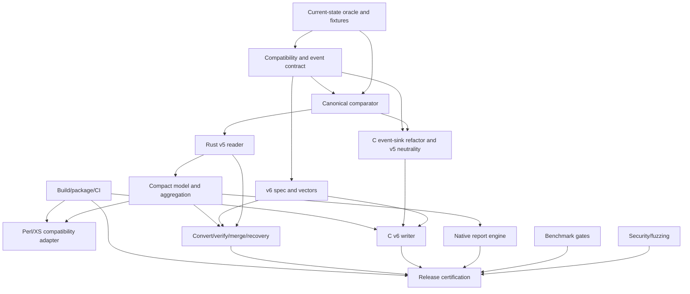

# 15 - Phases, Dependencies, and Critical Path

## Purpose

Sequence the modernization so that high-confidence report-side improvements land before the riskiest collector/format changes, while maintaining a continuously usable legacy path and an exact regression oracle.

The project has three separately promotable outcomes:

1. **Native v5 read/report engine** - accelerates existing profile files without changing collection.
2. **v6 opt-in collection** - adds the compact exact format while v5 remains default.
3. **Default changes** - native reporting and later v6 output become defaults only after independent gates.

These outcomes must not be coupled into one all-or-nothing release.

## Dependency graph



## Phase 0 - Freeze the oracle and contracts

### Objective

Create a trustworthy reference before modifying hot paths or stable outputs.

### Required work

- BASE-001 through BASE-008.
- COMPAT-000 through COMPAT-004.
- FMT-001, then ARCH-001 through ARCH-006 and ARCH-008 at design/specification level.
- TEST-001 through TEST-004.
- BENCH-001 through BENCH-003.
- BUILD-001 and a build-system feasibility spike.
- SEC-001 and SEC-002 planning; ARCH-007 waits for the COL-001 prototype in phase 3.

### Exit criteria

- Pinned v6.15 builds and immutable fixture corpus exist.
- Canonical event/normalization/precision contracts are approved.
- Comparator detects seeded semantic mutations.
- Current API/CLI/report surface inventory is complete enough to block accidental changes.
- Baseline performance/noise data exists.
- No implementation team is relying on undocumented record semantics.

### Forbidden during this phase

- Freeze of v6 numeric IDs without event contract review.
- Major collector hook refactor.
- Updating legacy golden outputs to match candidate behavior.

## Phase 1 - Native v5 reader and compact model

### Objective

Deliver report-side gains on unchanged v5 input, minimizing risk to profiling behavior.

### Required work

- RUST-001 through RUST-010.
- PERL-001 through PERL-006 foundations.
- COMPAT-005, COMPAT-007, COMPAT-009, COMPAT-011, and COMPAT-012.
- TEST-005, TEST-006, TEST-010, and TEST-017.
- BENCH-008.
- BUILD-002 through BUILD-006 and BUILD-009, including legacy-only fallback.
- SEC-002 and SEC-005; prepare SEC-008 evidence for completion after PERL-011.

### Exit criteria

- Native v5 canonical events equal legacy `ReadStream` for required matrix.
- Compact aggregates equal legacy data semantics.
- Peak RSS and parse/aggregate results are measured; promotion targets are understood.
- Legacy engine remains default/fallback.
- Malformed v5 input is bounded and fuzzed.

### Release opportunity

An experimental/opt-in native v5 inspection or report engine may ship after phase-specific security and compatibility review. No collector change is required.

## Phase 2 - Native report feature parity

### Objective

Reproduce all existing report outputs and CLI workflows using the compact model.

### Required work

- RUST-017 and report-facing model/IR support.
- REPORT-001 through REPORT-020.
- TOOL-001, TOOL-010, TOOL-011, and TOOL-012 foundations.
- PERL-002 through PERL-014.
- COMPAT-006 through COMPAT-008 and COMPAT-013.
- TEST-009 through TEST-011, TEST-013, and downstream smoke.
- BENCH-009 and BENCH-010.
- SEC-006 through SEC-008 and SEC-011 for report, filesystem, and FFI paths.

### Exit criteria

- Report semantic manifests, DOM, links, CSV, Callgrind, graph input, and flame/call data match required compatibility rules.
- Deterministic output across worker counts.
- Native report performance/RSS gates pass or approved exceptions exist.
- Existing executable names can select native/legacy engines.
- Atomic output and report security gates pass.

### Release opportunity

Native reporting may become opt-in and later `auto` preferred for v5 input independently of v6 collection.

## Phase 3 - Freeze v6 and neutral collector refactor

### Objective

Prepare exact new storage while proving the collector abstraction does not change v5 behavior.

### Required work

- FMT-002 through FMT-015, using the phase-0 FMT-001 v5 specification.
- ARCH-006 finalization and ARCH-007 dual-sink prototype.
- RUST-011, RUST-012, RUST-014, and RUST-018 reference implementation.
- COL-001 through COL-006, COL-016, and COL-017.
- TEST-003, TEST-007, TEST-014, TEST-015, TEST-017, and TEST-019.
- BENCH-002, BENCH-003, BENCH-005, and BENCH-007 design experiments.
- BUILD-008 and BUILD-010.
- SEC-003 through SEC-005.

### Exit criteria

- Normative v6 spec and immutable vectors are independently implemented.
- Selected dictionary/delta/chunk/codec design is benchmarked and reviewed.
- Collector semantic sink emits v5 with byte/semantic and performance neutrality.
- Fake-clock timing suite covers frozen state machine.
- No mandatory per-event Rust boundary.

### Critical rule

The v5-neutral sink refactor must land and stabilize before v6-specific hook optimizations. Otherwise a mismatch cannot be attributed reliably.

## Phase 4 - v6 writer, dual oracle, and interoperability

### Objective

Collect exact v6 profiles and keep old/new ecosystems interoperable.

### Required work

- COL-007 through COL-015 and COL-018.
- TEST-008, TEST-012, TEST-013, TEST-014, TEST-018, and TEST-019.
- TOOL-002 through TOOL-009 and TOOL-013 through TOOL-016.
- RUST-013.
- BENCH-005 through BENCH-007 and BENCH-012.
- BUILD-007, BUILD-011 through BUILD-013, and platform-matrix expansion.
- SEC-002, SEC-004, SEC-005, and SEC-008 through SEC-012, including full parser/collector fuzzing and audits.

### Exit criteria

- Same-run v5/v6 canonical streams are exactly equal across required fixtures/platforms.
- v6 storage and collector gates pass.
- Strict v5<->v6 conversion works where representable, with old v6.15 tool validation.
- Mixed merge, verify, inspect, repack, and salvage pass.
- Fork/lifecycle/source/call/slow-op/incomplete behavior passes.
- Collector and native-core audits have no unresolved high-severity issue.

### Release opportunity

Ship v6 as opt-in (`format=v6`) with v5 default, native reader/tools, and documented conversion. Dual mode remains developer/test only.

## Phase 5 - Native-report default evaluation

### Objective

Decide whether `engine=auto` should prefer native reporting for supported v5/v6 files.

### Required evidence

- REL-005, REL-006, REL-009, REL-010, and REL-011 execution evidence.
- Complete compatibility matrix and downstream suite.
- Native report sign-off.
- Platform packaging reliability and fallback.
- Controlled-host P3/P4 performance certification.
- Security/recovery certification.
- Telemetry/issue experience from opt-in releases.

### Exit criteria

- Default change ADR approved.
- Users can force `engine=legacy`.
- Failure/fallback policy is documented and tested.
- Rollback criteria and release mechanism exist.

## Phase 6 - v6-output default evaluation

### Objective

Decide whether new profiling runs should default to v6 on native-capable tiers.

### Required evidence

- REL-007, REL-008, REL-009, REL-010, and REL-011 execution evidence.
- At least the approved stability window of opt-in v6 use.
- Cross-version conversion and old-tool workflows proven in releases, not only CI.
- P1/P2 certification across representative corpus.
- Corruption/recovery and long-running/fork reliability evidence.
- No unresolved format-design issue requiring incompatible major revision.
- Clear behavior for legacy-only installations/platforms.

### Exit criteria

- Default-format ADR approved.
- `format=v5` remains supported for the documented compatibility window.
- Upgrade/downgrade and mixed-team workflows documented.
- Rollback can restore v5 default without invalidating v6 files already produced.

## Phase 7 - Legacy retirement review, not automatic removal

### Objective

Evaluate long-term maintenance only after native paths have sustained field use.

Potential decisions are separate:

- stop making legacy report engine default;
- stop installing legacy report engine on native-capable tiers;
- stop supporting v5 writing;
- stop supporting v5 reading;
- raise minimum Perl/toolchain versions.

Each requires its own ADR, ecosystem data, deprecation period, and migration plan under REL-012. Completion of modernization does not automatically authorize any retirement. REL-013 performs the final program review only after the advertised release level and continuing-maintenance ownership are established.

## Critical path

The minimum critical path to v6 opt-in is:

```text
CUR/COMPAT contracts
  -> canonical comparator
  -> normative v5 semantics
  -> v6 spec + independent Rust decoder/encoder
  -> neutral C event-sink + fake-clock parity
  -> C v6 writer
  -> dual-output exact equality
  -> conversion/tooling + platform/security/performance gates
  -> opt-in release certification
```

Native report work can proceed largely in parallel after the v5 reader/model is trusted.

## Integration branch strategy

Recommended:

- Keep main build green in legacy-only mode at all times.
- Land domain/spec/test scaffolding before consumers.
- Hide incomplete native features behind build/runtime flags.
- Merge v5 reader and report work independently from collector v6 work.
- Require immutable vector/spec changes in the same change as wire modifications.
- Use short-lived task branches; avoid one long project branch that delays differential testing.

## Phase-gate artifact bundle

Each phase review receives:

```text
scope/task status
approved ADRs/open blockers
source/build provenance
fixture/spec schema versions
compatibility matrix
correctness hashes/diffs
security/fuzz results
performance raw data/summary
platform/package results
known limitations and rollback plan
release recommendation
```
