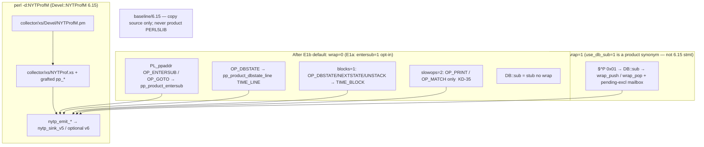
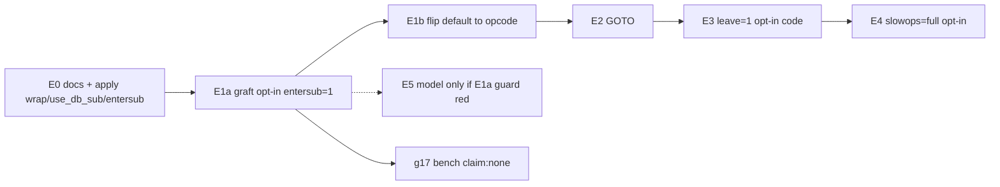

# DI-03: Product opcode / `entersub` attach on the shipped sink

| Field | Value |
|-------|-------|
| **Document title** | Graft 6.15 C opcode / `entersub` attach into NYTProfM; adapt the model only if the C path forces a real semantic change |
| **Author** | design-doc-writer (Grok) |
| **Date** | 2026-08-17 |
| **Status** | Draft (rev 6 — E2 OP_GOTO on default opcode; E3 `leave=1` opt-in landed, default `leave` stays 0; E4 residual) |
| **Board / residual** | Milestone E / **DI-03** on [`docs/DROP_IN_RPM_COMPLETION_v0.md`](https://github.com/hilather/nytprof-modernization/blob/main/docs/DROP_IN_RPM_COMPLETION_v0.md); `DROP-IN-REMAINING` stays residual until this series lands |
| **Does not supersede** | [`docs/PROGRAM_CHARTER.md`](https://github.com/hilather/nytprof-modernization/blob/main/docs/PROGRAM_CHARTER.md), accepted ADRs 0001–0013 (esp. [ADR-0004](https://github.com/hilather/nytprof-modernization/blob/main/docs/adrs/0004-collector-packaging-source-tree.md), [ADR-0007](https://github.com/hilather/nytprof-modernization/blob/main/docs/adrs/0007-production-v6-writer-backend-c-baseline.md)), [`docs/PRODUCT_COMPLETION_DROP_IN_v0.md`](https://github.com/hilather/nytprof-modernization/blob/main/docs/PRODUCT_COMPLETION_DROP_IN_v0.md) (A3 **Reject** / RSK-001), [`docs/schemas/product-xs-graft-annex-v0.md`](https://github.com/hilather/nytprof-modernization/blob/main/docs/schemas/product-xs-graft-annex-v0.md) A.3–A.5, [`docs/contracts/DROP_IN_DOD_v0.md`](https://github.com/hilather/nytprof-modernization/blob/main/docs/contracts/DROP_IN_DOD_v0.md) |
| **Identity** | Product is `perl -d:NYTProfM` / `Devel::NYTProfM` 6.15. Do **not** ship stock `Devel::NYTProf` as the product `.so`. |
| **`collection_default`** | **v5** (capability JSON; no R4 flip). |
| **Perf claim** | **None.** Engineering benches vs isolated 6.15 pin and vs prior native wrap stay `claim: none`. This is not BENCH certification and not “beat 6.15.” |

Agents own **tasks**. This document proposes an implementation sequence and names the only model/report edits that a C graft is allowed to force. It does not override fixtures, ADRs, the charter, or exclusive-honesty rules in [`AGENTS.md`](https://github.com/hilather/nytprof-modernization/blob/main/AGENTS.md) §5.

---

## Overview

Call-heavy collection is still the remaining gap versus the 6.15 pin. After PR-16, default attach still enters every profiled sub through Perl `$^P` bit `0x01` → `DB::sub` → C `wrap_push`/`wrap_pop` → `&$raw`. Statement TIME_LINE is already C (`pp_product_dbstate_line` on `OP_DBSTATE`, PR-15). A same-host, same-script 120k-leaf-call microbench (inner `Time::HiRes`, **not** certified) measured:

| Path | Wall (this host) |
|------|------------------|
| bare Perl | 0.010s |
| NYTProfM wrap (`wrap_push`/`wrap_pop` + C `OP_DBSTATE`) | **1.09s** |
| Isolated 6.15 pin (`-d:NYTProf`, opcode `entersub`) | **0.32s** |

≈ **3.4×** slower on calls. PR-16 made native wrap ~40% faster than *our old wrap* (1.0s vs 1.7s), **not** vs 6.15. Statement-heavy `for` increment looking “faster” on native is `blocks=0` skipping `UNSTACK`; 6.15 hooks it. That is less instrumentation, not a cheaper same profile.

The fix is the already-written DI-03 graft, requested now because wrap is the last large attach cost: **copy** 6.15’s `pp_entersub_profiler` / `pp_subcall_profiler` / destructor accounting into `collector/xs/`, replace every `NYTP_write_*` with `nytp_emit_*` on the **one** product sink, and never run Perl `DB::sub` wrap on the same call. Land the C path **opt-in first** (`entersub=1`), then flip the product default in a second PR once g17/g04/g09/g14/di02 **27** are green on that path. Do not ship `baseline/6.15`’s `.so`. Do not dual-write FileHandle (A7 rejected). Default `stmts=1` must **not** grow onto `NEXTSTATE`/`UNSTACK` (that is `blocks=1` / DI-01). Product `use_db_sub=1` is an **intentional fork** of the 6.15 option (wrap escape, not 6.15 stmt `DB::DB`) — see KD-E11.

**Model / report conclusion (binding for this design):** `ProfileModel` already aggregates the tags opcode attach will emit (`SUB_RETURN`, `SUB_CALLERS`, `SUB_ENTRY`, `TIME_LINE`/`TIME_BLOCK`, `DISCOUNT`). Exclusive is written by collection (PR-14 / g14); the model **sums** what the stream says and must not rescale ticks to match 6.15 HTML seconds. The C path does **not** require a model rewrite if the graft keeps product units (tick NVs on both `SUB_RETURN` and `SUB_CALLERS`). Model/report PRs in this series are **guards + honesty**, plus a **conditional** ingest normalize **only if** a live opcode dump fails the unit-consistency test in § Model / report adaptation.

---

## Background & Motivation

### Why wrap cannot close the gap

6.15’s default is **not** a Perl debugger wrap. [`baseline/6.15/src/lib/Devel/NYTProf.pm`](https://github.com/hilather/nytprof-modernization/blob/main/baseline/6.15/src/lib/Devel/NYTProf.pm) sets `$^P = 0x010 | 0x100 | 0x200` (sub **definition** line range + eval/anon names) and installs `DB::sub` only as a “called unexpectedly” stub on old perl. Call profiling is `PL_ppaddr[OP_ENTERSUB] = pp_entersub_profiler` (and `OP_GOTO`) in [`baseline/6.15/src/NYTProf.xs`](https://github.com/hilather/nytprof-modernization/blob/main/baseline/6.15/src/NYTProf.xs) ~3256–3257. That path never allocates a Perl `DB::sub` frame, never changes `caller()`, and times XS / `goto &sub` via `save_destructor_x` + `incr_sub_inclusive_time`.

Product attach today ([`collector/xs/Devel/NYTProfM.pm`](https://github.com/hilather/nytprof-modernization/blob/main/collector/xs/Devel/NYTProfM.pm) `sub`, [`collector/xs/NYTProf.xs`](https://github.com/hilather/nytprof-modernization/blob/main/collector/xs/NYTProf.xs) `wrap_push`/`wrap_pop`):

1. `$^P |= 0x01` at `file=` so every instrumented CV enters `DB::sub`.
2. Default wrap: one C crossing for COP pin, fid, `nytp_clock_now`, pending-excl, `SUB_RETURN`/`SUB_CALLERS` (PR-16).
3. Then `&$raw` (or `goto &$raw` on the compile-time / caller-sensitive list).
4. `NYTPROF_WRAP_SLOW=1` is the old Perl `caller(0)`+XSUB control (`g16`).

That is still **two** Perl crossings plus a debugger sub frame per call. Opcode `entersub` is one C `pp_*` around the original `pp_entersub`.

### What is already shipped (do not re-design)

| Surface | Evidence | Honesty |
|---------|----------|---------|
| One writer | `nytp_emit_*` → `nytp_sink_v5` (D1-B `-lz` only) | A7 FileHandle dual writer **rejected** |
| Default TIME_LINE | C `pp_product_dbstate_line` on **`OP_DBSTATE` only**; INIT `$DB::single=0` | [`g15_dbstate_timeline_smoke.sh`](https://github.com/hilather/nytprof-modernization/blob/main/scripts/packaging/g15_dbstate_timeline_smoke.sh) |
| Default wrap | C `wrap_push`/`wrap_pop` | [`g16_wrap_enter_smoke.sh`](https://github.com/hilather/nytprof-modernization/blob/main/scripts/packaging/g16_wrap_enter_smoke.sh) — **not** 6.15 `entersub` |
| Thin slowops | `OP_PRINT` / `OP_MATCH` only | KD-35; full [`slowops.h`](https://github.com/hilather/nytprof-modernization/blob/main/baseline/6.15/src/slowops.h) is later |
| `blocks=1` | `pp_product_stmt` on DBSTATE/NEXTSTATE/UNSTACK | DI-01 780/810; **not** default `stmts=1` |
| Exclusive | parent excl = incl − Σ child **inclusive**; slowops fold via `product_pending_child_excl` | PR-14 / [`g14`](https://github.com/hilather/nytprof-modernization/blob/main/scripts/packaging/g14_nested_excl_smoke.sh), PR-9 / [`g09`](https://github.com/hilather/nytprof-modernization/blob/main/scripts/packaging/g09_tokenize_excl_smoke.sh) |
| Counts | live `-d:NYTProfM` leaf **15** / mid **3** / mid→leaf **15** | [`g04_v5_parity_smoke.sh`](https://github.com/hilather/nytprof-modernization/blob/main/scripts/packaging/g04_v5_parity_smoke.sh) |
| Goto list | Exporter/Getopt/`vars`/XSLoader/Memoize/DateTime/Moo/Rex | Needed **because wrap changes `caller()`** |
| Identity | `Devel::NYTProfM` 6.15 | Option B; no `Provides: perl(Devel::NYTProf)` |

### Pain this increment is allowed to claim

- Call overhead vs isolated 6.15 on a **named** wrap/entersub engineering bench (`claim: none`).
- Drop the Perl wrap hot path on the default so `caller()`-sensitive CPAN no longer needs the goto list **on that default**.
- Keep g04 / g09 / g14 / di01 / di02 **green** on real `perl -d:NYTProfM` + shipped dump/report.

It is **not** allowed to claim first GA-candidate, full TEST-003 `compare_jsonl` (DI-05), “faster than 6.15,” or exclusive seconds matching 6.15 HTML units.

### Already-written program design this document implements

[`docs/DROP_IN_RPM_COMPLETION_v0.md`](https://github.com/hilather/nytprof-modernization/blob/main/docs/DROP_IN_RPM_COMPLETION_v0.md) § DI-03 (phase list) and PR-E1 (“dedicated PR series acceptable if sliced”). [`docs/PRODUCT_COMPLETION_DROP_IN_v0.md`](https://github.com/hilather/nytprof-modernization/blob/main/docs/PRODUCT_COMPLETION_DROP_IN_v0.md) **A3 — Full hook rewrite without graft → Reject (RSK-001)**. Annex A.3 already maps every `NYTP_write_*` to `nytp_emit_*`. This design is that later increment, sliced so each PR is reviewable.

---

## Goals & Non-Goals

### Goals

1. After **E1b**, default `perl -d:NYTProfM` with `NYTPROF file=` profiles **calls** via grafted C `OP_ENTERSUB` (+ `OP_GOTO` in E2), writing only through `nytp_emit_*` → `nytp_sink_v5` (D1-A may still use the v6 sink on `format=v6`; same emit API). **E1a** lands the same C path behind **opt-in** `entersub=1`; default stays wrap until E1b.
2. When opcode call attach is active, Perl `DB::sub` must **not** emit `SUB_RETURN`/`SUB_CALLERS` for the same call (no double SUB_RETURN).
3. Wrap escape is product-only **`wrap=1`**. `use_db_sub=1` is a **documented synonym** for that escape (KD-E11) — **not** 6.15’s stmt-path `DB::DB`. Do **not** copy `init_profiler`’s `if (opt_use_db_sub)` block as the E1 switch.
4. Default `stmts=1` stays **DBSTATE-only** TIME_LINE (PR-15). Do **not** hook `NEXTSTATE`/`UNSTACK` on that default.
5. Exclusive honesty unchanged: written excl = incl − Σ child inclusive; slowop children still fold via the **kept** pending-excl mailbox (wrap) and/or current `subr_entry` (opcode); do not rescale to 6.15 HTML seconds.
6. Existing attach gates stay green: g04 15/3/15, g09 tokenize remainder (opcode **and** wrap escape), g14 3-level remainder, di01 780/810 on `blocks=1`, di02 `calls=2` **exact 27** + `CORE:` names (preserve via post-INIT emit gate — do not silently profile BEGIN in E1), g07/g10/g12/g13 compile/`caller` smokes.
7. Engineering bench vs wrap and vs isolated 6.15 pin recorded in [`docs/BENCH_NOTES.md`](https://github.com/hilather/nytprof-modernization/blob/main/docs/BENCH_NOTES.md) with **`claim: none`**.
8. Model/report change **only** if a live opcode dump fails the unit/shape guards in § Model / report adaptation.

### Non-goals

| Non-goal | Residual / owner |
|----------|------------------|
| Ship stock 6.15 `NYTProf.so` / `Devel::NYTProf` as the product | Identity (Option B) |
| Edit `baseline/6.15/src` as SoT | ADR-0004 |
| FileHandle + sink dual writer | A7 / RSK-001 |
| Hook NEXTSTATE/UNSTACK on default `stmts=1` | Constraint 5; DI-01 `blocks=1` |
| Full `slowops.h` in the first PR; silently redefining product `slowops=2` as the full table | E4 may **add** a full-table opt-in; product `slowops=2` stays PRINT/MATCH (KD-35) until a dedicated advertised-options PR |
| Full leave-op table + DISCOUNT stream matching 818; flipping product `leave` default to 1 | Leave **code** is opt-in `leave=1`; product default stays **0** through this series (KD-E14) |
| Copy 6.15 `use_db_sub` stmt meaning (`DB::DB` + skip NEXTSTATE + opcode calls still on) in E1 | Residual; product option is a wrap-escape **fork** (KD-E11) |
| Profile BEGIN / compile-time imports in E1 if that moves di02 off **27** | Later honesty PR with a **recounted** integer + dual-path evidence |
| Mid-deflate-in-child, `_exit` flush, TEST-018 | DI-06 / DI-08 / DI-07 |
| Full TEST-003 `compare_jsonl` tag+args vs oracle goldens | DI-05 (needs DISCOUNT + previous-statement + finalize) |
| Flip `collection_default` to v6 | ADR-0008 / R4 |
| Public perf SLO / “beat 6.15” | BENCH-\*; this series `claim: none` |
| Recompute or rescale exclusive in the model to match 6.15 HTML | [`AGENTS.md`](https://github.com/hilather/nytprof-modernization/blob/main/AGENTS.md) §5 |
| COMPAT-007 bless-array Data, full DOM/tablesorter | DI-13 / DI-15 WAIVED |

---

## Binding constraints (do not violate)

1. **One writer.** All collection bytes go through `nytp_emit_*` → `nytp_sink_v5` (compress, durable, fork, later v6). No FileHandle dual writer.
2. **ADR-0004.** Copy from the pin into `collector/xs/`. Never edit `baseline/6.15/src` as SoT. Oracle pin stays isolated; **never** `crates/` on oracle `PERL5LIB`.
3. **Identity.** `-d:NYTProfM` / `Devel::NYTProfM` 6.15. Do not ship stock `Devel::NYTProf` as the product `.so`.
4. **No double SUB_RETURN.** Opcode `entersub` and Perl `DB::sub` wrap must not run on the same call.
5. **Default `stmts=1`** must not hook `NEXTSTATE`/`UNSTACK` (that is `blocks=1` 780 path / DI-01).
6. **Exclusive honesty.** Parent excl = incl − Σ child **inclusive** (PR-14 / g14). Slowop children fold via the **kept** `product_pending_child_excl` mailbox on the wrap escape and via the current `subr_entry` on the opcode path. Do **not** “fix” exclusive seconds to match 6.15 HTML units. Last-site close-to-seed hook cost **is** subtracted from sub incl/excl (`product_overhead_ticks`, 6.15 `cumulative_overhead_ticks`; KD-E13 superseded). Do **not** rescale remaining ticks to match 6.15 HTML units.
7. Tests must drive real `perl -d:NYTProfM` + shipped dump/report. No fixture-only theater.
8. No public perf SLO / BENCH certification claim. Engineering benches stay `claim: none`.
9. Agents own tasks, not architectural truth. Model adaptations in this document are proposals constrained by ADRs/charter/fixtures.
10. **Preserve di02 exact `sub_entry_events=27`** on `calls=2` unless a later honesty PR recounts it with dual-path evidence. E1 must not profile BEGIN/import as a silent side effect of installing `OP_ENTERSUB` at `file=`.
11. **Keep the pending-excl mailbox** for the wrap escape. E1 must not delete `product_add_pending_child_excl` / `take_pending_child_excl`.

---

## Proposed Design

### Target attach graph



### What to copy (and what to refuse)

Copy **functions and tables**, not the stock module. Line ranges below are pin `NYTProf.xs` (read-only). **Do not** copy “the cited range” as one blob — `subr_entry_setup` is **not** inside the incr block.

| Pin source (`baseline/6.15/src/`, read-only) | Product destination | Adapt |
|----------------------------------------------|---------------------|--------|
| `pp_entersub_profiler` / `pp_subcall_profiler` (~2631–2928) | `collector/xs/pp_entersub.c` (new) | See helper inventory. `NYTP_write_call_entry` → `nytp_emit_sub_entry` (only if `calls>=2` **and** emit gate on). Do **not** emit via FileHandle. |
| `subr_entry_t` + `incr_sub_inclusive_time` / `_ix` (~1950–2274) | same `.c` + `collector/xs/nytprof_pp.h` | **Binding adaptations (KD-E03):** clock = `nytp_clock_now`; fid = `product_fid_for_file_ptr`; emit `nytp_emit_sub_return` **and** `nytp_emit_sub_callers` in **ticks at return**; **do not** create `sub_callers_hv`; **do not** add a finalize `SUB_CALLERS` walk. **KD-E13 superseded:** subtract last-site close-to-seed via `product_overhead_ticks` / `initial_overhead_ticks` (6.15 `cumulative_overhead_ticks`). Keep `already_counted` + destructor-vs-XS double-call guard. Recursion: **wrap semantics** — every return writes full incl/excl, `reci=0`, `rec_depth=0`. Do not silently port `called_cv_depth <= 1` / `NYTP_SCi_RECI_RTIME` (seconds). |
| `subr_entry_setup` (**~2390–2628**, not the incr range) | same `.c` | Savestack `SSNEWa` + `subr_entry_ix` / `subr_entry_ix_ptr` (not `product_wrap_stack`). Product fid/clock. Skip `DB::*` / product internals. `opt_calls>=2` → `nytp_emit_sub_entry` only when emit gate is on. |
| `pp_stmt_profiler` + `DB_stmt` | **Already product** (`pp_product_dbstate_line` / `pp_product_stmt`) | Do **not** replace default with 6.15’s NEXTSTATE+DBSTATE pair. Do **not** copy `init_profiler`’s `if (opt_use_db_sub)` stmt switch. |
| `pp_leave_profiler` + `DB_leave` + `NYTP_write_discount` | later `collector/xs/pp_leave.c` | `nytp_emit_discount`; only when `leave=1`; UNSTACK/LEAVELOOP stay on `pp_product_stmt` when `PRODUCT_BLOCKS` (KD-E14) |
| `pp_slowop_profiler` + `slowops.h` | later; keep `pp_product_slowop` until then | Product `slowops=2` stays PRINT/MATCH (KD-35 / KD-E15) |
| `pp_fork_profiler` | residual vs existing `CORE::GLOBAL::fork` + `nytp_fork_*` | Do not silently replace G06 |
| `FileHandle.xs` / `NYTP_write_*` | **do not copy as writer** | Annex A.4 |

Provenance: extend / create [`docs/graft/PROVENANCE.md`](https://github.com/hilather/nytprof-modernization/blob/main/docs/graft/PROVENANCE.md) (annex A.1): pin SHA, date, file list, delta list. License remains Artistic-1.0-Perl OR GPL-1.0-or-later.

**Refuse:** compiling or `dlopen` of `baseline/6.15/install/.../NYTProf.so` on the product `@INC`. Refuse linking `FileHandle.o` into `NYTProfM.so` for writes.

### Helper inventory (copy vs rewrite vs omit)

`pp_entersub.c` is **not** a closed copy of four functions. E1 must treat this table as the implementer checklist. Savestack + `save_destructor_x` are **required** (do not invent a wrap-like C array for opcode frames — that cannot implement destructor / later `goto`).

| Pin helper | Pin lines (approx.) | E1 disposition |
|------------|---------------------|----------------|
| `subr_entry_t` | ~1980–1995 | **Copy** into `nytprof_pp.h`; drop FileHandle-only fields |
| `incr_sub_inclusive_time` / `_ix` | ~2086–2274 | **Copy + rewrite writes** per binding adaptations above |
| `subr_entry_destroy` / `subr_entry_ix` / `subr_entry_ix_ptr` | adjacent to incr | **Copy**; keep savestack indices |
| Savestack `SSNEWa` allocation of `subr_entry_t` | inside `subr_entry_setup` | **Copy** — not `product_wrap_stack` |
| `save_destructor_x(incr_sub_inclusive_time_ix, …)` | setup + Perl-return path | **Copy** |
| `subr_entry_setup` | **~2390–2628** | **Copy + adapt** fid/clock/skip list/emit gate |
| `pp_entersub_profiler` → `pp_subcall_profiler(0)` | ~2631–2928 | **Copy**; E1 may omit the `OP_GOTO` branch (E2) |
| `run_original_op` + saved `PL_ppaddr_orig[OP_ENTERSUB]` | ~468–471, init | **Rewrite** as product `product_orig_pp_entersub` (same pattern as `product_orig_pp_dbstate_line`) |
| `resolve_sub_to_cv` | ~2277+ | **Copy** (XS vs Perl name) |
| `append_linenum_to_begin` | ~2030s | **Copy** if BEGIN names are needed after emit gate; else omit until BEGIN honesty PR |
| `already_counted` | incr + setup | **Copy** (XS destructor double-call) |
| `DB_*_cv` skip (`DB::_INIT` / `_CHECK` / `_END` / `_fin`) | `pp_subcall_profiler` pre-conditions | **Copy** + add `Devel::NYTProfM` internals |
| `is_profiling` / `profile_subs` | pin globals | **Rewrite** as product emit gate: `product_sink != NULL && product_entersub_emit_enabled()`. **Do not** invent `product_opt_subs()`. `subs` is in `%PRODUCT_NYTPROF_KNOWN` but **never applied** — treat as always-on until a later PR applies it. |
| `opt_calls` | pin option | **Rewrite** → unstatic `product_opt_calls()` (today `static` in `NYTProf.xs` ~1451) |
| `cumulative_subr_ticks` (process accumulator) + `initial_subr_ticks` on `subr_entry_t` | incr ~2121, ~2264 | **Copy.** This is the exclusive remainder (`called_sub_ticks = cumulative − initial`; then `cumulative += excl`). **Not** the omitted overhead accumulator. Omitting it makes `excl = incl` and turns g14 red on `entersub=1`. |
| `logwarn` / `trace_level` | pin | **Omit** or map to existing product log; not required for E1 green |
| `NYTP_MAX_SUB_NAME_LEN` | pin | **Copy** constant (fail closed before huge names) |
| MULTIPLICITY `orig_my_perl` | pin | **Copy** the guard if `MULTIPLICITY`; else omit |
| `reinit_if_forked` / `CHECK_SAWAMPERSAND` | stmt/sub preambles | **Omit** in E1 (G06 fork already product; sawampersand residual) |
| last-site TIME_* | product already | **Do not** call last-site from entersub return |
| `sub_callers_hv` + finalize walk ~3661–3674 | pin finish | **Omit** (KD-E03) |
| `cumulative_overhead_ticks` / `incl -= overhead` | incr ~2118–2129 | **Copied** (KD-E13 superseded). Product name: `product_overhead_ticks` + `initial_overhead_ticks` on opcode `subr_entry` and wrap frames. Accumulator is last-site close-to-seed (and flush emit). **Do not** omit `cumulative_subr_ticks` with this row. |
| `init_profiler` `if (opt_use_db_sub)` stmt block ~3218–3239 | pin | **Omit** — do not copy as the wrap switch (KD-E11) |
| `PL_ppaddr[OP_ENTERSUB]` assign ~3256 | pin | **Rewrite** as `product_install_entersub()` |

### One writer, one clock, one fid table

The graft is **write-site substitution**, not a second profiler:

| 6.15 | Product (keep) |
|------|----------------|
| `get_time_of_day` / `get_ticks_between` | `nytp_clock_now` (`collector/src/nytp_clock.c`) — same clock as last-site TIME_* and wrap |
| `get_file_id` / `fidhash` | `product_fid_for_filename` / `product_fid_for_file_ptr` + existing `NEW_FID` |
| `NYTP_write_call_entry` / `NYTP_write_call_return` | **`nytp_emit_sub_entry` / `nytp_emit_sub_return` only** (annex A.3). There is **no** `nytp_fast_emit_sub_*`; `nytp_fast_emit_*` is TIME_LINE/TIME_BLOCK in `nytp_batch.h`. |
| `NYTP_write_sub_callers` at finalize (seconds) | **`nytp_emit_sub_callers` at return, tick NVs** (same as `wrap_pop`). Do not create `sub_callers_hv`. Optional later: coalesce at finish still in ticks (smaller files) — not E1. |

Do not introduce a second tick origin. Annex A.5 still applies: do not move clock reads around flushes without a timing ADR + oracle test.

### Default vs escape (constraint 4)

```mermaid
sequenceDiagram
  participant Script
  participant Perl
  participant PP as pp_product_entersub
  participant Orig as original pp_entersub
  participant Sink as nytp_sink_v5

  Note over Script,Sink: opcode path (E1a: entersub=1; after E1b: default) — no $^P 0x01
  Script->>Perl: foo()
  Perl->>PP: OP_ENTERSUB
  PP->>PP: subr_entry_setup (COP, fid, t0)
  alt calls>=2
    PP->>Sink: nytp_emit_sub_entry(fid, line)
  end
  PP->>Orig: run original
  Orig-->>PP: first op in sub or next after XS
  Note over PP: Perl sub: save_destructor_x(incr)
  Note over PP: XS/slowop: incr now
  PP->>Sink: nytp_emit_sub_return + nytp_emit_sub_callers (ticks)
```

Perl-side enable ([`NYTProfM.pm`](https://github.com/hilather/nytprof-modernization/blob/main/collector/xs/Devel/NYTProfM.pm) `file=` block):

| Flag / hook | Today | E1a (`entersub=1`) | After E1b default |
|-------------|-------|--------------------|-------------------|
| `$^P \|= 0x01` | set (drives `DB::sub`) | **clear** on opcode path | **clear** (6.15 `$^P` uses `0x10` for def lines, not `0x01`) |
| `$^P \|= 0x02 \| 0x20` | set | keep | keep (dbstate / single-step compile copies) |
| `$^P` `0x100` / `0x200` | already | keep | keep |
| `DB::sub` | wrap / goto list | stub on opcode path | **stub**; wrap body only if `wrap=1` |
| `PL_ppaddr[OP_ENTERSUB]` | untouched | install at `file=` | same |
| Emit gate | `$product_after_init` | **same** (no BEGIN emits) | same until a recounted-27 PR |
| `OP_DBSTATE` TIME_LINE | PR-15 | unchanged | unchanged |
| Goto list | required | keep (default still wrap) | **not required on default**; keep for `wrap=1` |

#### Product `use_db_sub` is an intentional fork (KD-E11)

In 6.15 (`baseline/6.15/src/NYTProf.xs` ~3218–3257), `opt_use_db_sub` only switches **statement** attach to `DB::DB` (`PL_perldb |= PERLDBf_LINE|SINGLE`, skip `PL_ppaddr[OP_NEXTSTATE/DBSTATE]`, leave hooks off). `PL_ppaddr[OP_ENTERSUB]` and `OP_GOTO` are installed **unconditionally**, including when `use_db_sub=1`. 6.15 `Devel/NYTProf.pm` never uses `DB::sub` as the call profiler.

Product **does not implement that meaning** in this series:

| Name | Kind | Meaning on product |
|------|------|--------------------|
| **`wrap=1`** | product-only (canonical escape) | Disable opcode ENTERSUB/GOTO (or never install). `$^P \|= 0x01`. PR-16 `wrap_push`/`wrap_pop`. Pending-excl mailbox stays live. `NYTPROF_WRAP_SLOW=1` still selects Perl vs C wrap **under this escape only**. |
| **`use_db_sub=1`** | **forked synonym for `wrap=1`** | Same as `wrap=1`. **Not** 6.15 `DB::DB` + opcode calls. Document in the operator runbook in **E0**. |
| **`entersub=1`** | product-only (E1a opt-in) | Install opcode ENTERSUB; clear `$^P` `0x01`; stub `DB::sub`. After E1b this is the omit-default. |
| **`entersub=0`** | product-only | Force wrap (same as `wrap=1`) after E1b. |
| 6.15 stmt `use_db_sub` (`DB::DB` + opcode calls still on) | residual | Later PR if ever; must **not** reuse `wrap=1` as that meaning. |

**Do not copy** `init_profiler`’s `if (opt_use_db_sub)` block as the E1 switch. An implementer who does will keep opcode calls on the “escape” and/or install `DB::DB` — the opposite of the wrap rollback.

Precedence: `wrap=1` / `use_db_sub=1` **wins** over `entersub=1` (escape). Fail closed if both opcode ppaddr and `$^P & 0x01` wrap would run on the same call.

`use_db_sub` is already in `%PRODUCT_NYTPROF_KNOWN` (~149) and is **silently ignored** today (`_product_apply_options` never reads it). New keys **`wrap` and `entersub` are not in that map**. `_product_parse_nytprof` dies on unknown keys **before** `_product_int_opt`. E0 **must add `wrap` and `entersub` to `%PRODUCT_NYTPROF_KNOWN`**, then apply `_product_int_opt(..., 'use_db_sub', 0)` (and the same for `wrap` / `entersub`), reject values other than 0/1, stamp `PRODUCT_USE_DB_SUB` / `PRODUCT_WRAP` / `PRODUCT_ENTERSUB` — **no hook change**. Keep g05 unknown-option coverage on a key that is still unknown (do not drop that croak). Without the known-map add, E1a `NYTPROF=file=…:entersub=1` dies as `unknown NYTPROF option: entersub`.

#### Start / emit policy (preserve di02 **27**)

di02 is a **binding exact** `sub_entry_events=27` on `calls=2` ([`scripts/packaging/di02_calls2_sub_entry_smoke.sh`](https://github.com/hilather/nytprof-modernization/blob/main/scripts/packaging/di02_calls2_sub_entry_smoke.sh)). Product wrap reaches 27 because compile-time `DB::sub` always `goto`s (`$product_after_init==0`) and the goto-list skips Exporter/Getopt/`import`. 6.15 `start=begin` profiles `BEGIN`, `warnings::*`, and most imports (oracle `calls2-default` has `main::BEGIN@1` and many `warnings::_expand_bits` rows). Enabling emits at `file=` **will** move 27 unless the skip set happens to match this host’s `warnings` — unproven.

**Binding (resolves OQ-1):**

1. **Install** `PL_ppaddr[OP_ENTERSUB]` at `file=` so later compile copies `op_ppaddr`.
2. **Gate emits** (`SUB_ENTRY` / `SUB_RETURN` / `SUB_CALLERS`) on `product_after_init` (same as wrap). Compile-time / BEGIN / import calls run the original op only.
3. “Profile BEGIN” is a **later honesty PR** with a **recounted** di02 integer and dual-path evidence — not a silent E1 side effect.

A runtime assert must fail closed if both `product_entersub_is_installed()` (and emit gate on) and wrap (`$^P & 0x01` + `DB::sub` wrap body) would emit for the same call.

### Exclusive accounting (collection writes; model sums)

6.15 (`incr_sub_inclusive_time`):

```text
called_sub_ticks = cumulative_subr_ticks - initial_subr_ticks
excl             = incl - called_sub_ticks
cumulative_subr_ticks += excl
```

That global cumulative of **descendant exclusive** is algebraically the same as “incl − Σ **direct child inclusive**” when every descendant is on the same stack (child incl = child excl + grandchildren excl). Product wrap does the equivalent by crediting the parent with child **incl** (PR-14). **Graft the 6.15 destructor/cumulative form for opcode frames** — it handles XS exceptions and later `goto &sub` without a Perl `DESTROY` guard — and keep g14 as the honesty bar.

**Binding write-site rules inside the grafted `incr_*` (do not “faithfully” copy the rest):**

| Pin behavior | Product E1 |
|--------------|------------|
| `called_sub_ticks = cumulative_subr_ticks - initial_subr_ticks`; `cumulative_subr_ticks += excl` | **Copy.** Required for g14 remainder. `initial_subr_ticks` lives on the frame. |
| `incl_subr_ticks -= overhead_ticks` (`cumulative_overhead_ticks`) | **Required** (KD-E13 superseded; last-site close-then-seed). Opcode `product_incr_sub_inclusive_time` and wrap `wrap_pop` subtract `product_overhead_ticks() − initial_overhead_ticks`. g15 if-modifier named-sub incl/excl must stay under 55% of profiled wall. |
| Aggregate `sub_callers_hv`; write `SUB_CALLERS` at finalize as seconds (`/ ticks_per_sec`, ~3661–3674) | **Forbidden.** No `sub_callers_hv`. `nytp_emit_sub_return` **and** `nytp_emit_sub_callers` in **ticks at return** (same as `wrap_pop`). Product `finish_profiler` stays last-site + `SRC_LINE` + `SUB_INFO` + `PID_END` — no CALLERS walk. |
| `called_cv_depth <= 1` vs `reci` (reci stored in **seconds**) | **Do not port in E1.** Match wrap: every return writes full incl/excl; `reci=0`; `rec_depth=0`. Recursion honesty is a later PR. |
| `already_counted` + XS explicit incr + destructor | **Keep** (prevents double SUB_RETURN on XS). |
| `NYTP_write_call_return` only at return | Replace with `nytp_emit_sub_return` **plus** `nytp_emit_sub_callers` (ticks). |

#### Slowop mailbox (do not delete)

Constraint 4 says opcode and wrap never run together, but **PRINT/MATCH stay installed on both paths** and g09 + g16 (`wrap=1`) must stay green. Today `pp_product_slowop` always `product_add_pending_child_excl(incl_nv)` and `wrap_push`/`wrap_pop` consume that mailbox (`NYTProf.xs` ~1588–1589, ~1838–1840, ~1893). If E1 **deletes** the mailbox, `wrap=1` has no `subr_entry` stack and parent excl ≈ `CORE:match` again (PR-9 / language-semantics 2026-08-15).

**Binding:** keep `product_add_pending_child_excl` / `product_take_pending_child_excl`. Add a tiny helper that **branches**:

```c
/* nytprof_pp.h — called from pp_product_slowop instead of mailbox-only */
void product_credit_child_excl(NV incl_nv) {
    if (product_entersub_is_installed() && product_current_subr_entry() != NULL)
        product_subr_add_child_incl(product_current_subr_entry(), incl_nv);
    else
        product_add_pending_child_excl(incl_nv); /* wrap escape / no frame */
}
```

On the opcode path, credit the current `subr_entry`. If no frame, fall back to the mailbox (or discard as wrap does when `wrap_sp==0`). g09 must still show parent excl as a **remainder** on **both** `entersub=1` and `wrap=1`.

If `DB_leave` / DISCOUNT lands later, it is a **count/continuation** marker (A3 `discount_events++`), not a license to retune exclusive.

### Statement path (constraint 5)

6.15 default `stmts=1` hooks **both** `OP_NEXTSTATE` and `OP_DBSTATE`, and with default `leave=1` also `OP_UNSTACK`. That is why a statement-heavy `for` increment is **not** a fair native-vs-6.15 cost compare.

Product default **must stay**:

```c
/* PR-15 — do not expand this in the entersub PR */
PL_ppaddr[OP_DBSTATE] = pp_product_dbstate_line;
/* NEXTSTATE / UNSTACK only when PRODUCT_BLOCKS (DI-01) */
```

DI-03 phase 1 in the completion doc (“NEXTSTATE/DBSTATE if not already taken”) is **already done** for the product default (PR-15) and for `blocks=1` (DI-01). This series **starts at phase 2: ENTERSUB**.

**UNSTACK / LEAVELOOP ownership (E3, binding):** 6.15 default `leave=1` assigns `PL_ppaddr[OP_UNSTACK]` and `OP_LEAVELOOP` to `pp_leave_profiler` (~3224–3234), **overwriting** any stmt hook. Product `blocks=1` assigns those same ops to `pp_product_stmt` (`product_install_stmt_ops`, `NYTProf.xs` ~1386–1395) to land TIME_BLOCK / 810.

When `PRODUCT_BLOCKS`, **UNSTACK and LEAVELOOP stay on `pp_product_stmt`**. Leave profiler may install only the remaining leave ops (`LEAVESUB`, `LEAVE`, `RETURN`, `LEAVEEVAL`, …). Do **not** flip product default `leave=1` in the same PR that lands the code (KD-E14). Default stays `leave=0` until a dedicated honesty PR with di01+g15+g04 green **and** a written UNSTACK matrix.

### `goto &sub` and the wrap goto list

6.15’s `pp_subcall_profiler` treats `OP_GOTO` as return+call: copy the current `subr_entry` as a template so the goto’d sub is attributed to the **original** caller, with the goto site’s fid:line. Product wrap **avoids** profiling those CVs (`goto &$raw`) because wrap breaks `caller()` (Memoize, Exporter, DateTime `%^H`, Rex, …).

With opcode attach, `caller()` is the real caller. After E1b the wrap goto list becomes **unnecessary on the default**. Keep the list **only** on `wrap=1` / `use_db_sub=1`. E1a/E1b may land without full `OP_GOTO` **only if** g12/g10 still pass on the opcode path (they should, because `$^P` `0x01` is off). The GOTO graft (E2) should follow immediately so `goto &sub` is timed (6.15 `t/test17-goto*`).

### CORE: names

6.15 `slowops=2` stores `called_subnam_sv = "CORE:<op>"` and `called_subpkg_pv = CopSTASHPV`, then composes `${pkg}::${sub}` → `main::CORE:match`. Product `product_fill_slowop_name` already emits `pkg::CORE:op`. **Keep that shape.** `slowops=1` (collapsed `CORE::` package) stays fail-closed (existing die string in `NYTProfM.pm`). Product **`slowops=2` stays PRINT/MATCH** (KD-35) for this entire series; E4 may add `slowops=full` / `slowops=3` behind an explicit option, not silently expand `=2`.

### Build / packaging

[`collector/Makefile`](https://github.com/hilather/nytprof-modernization/blob/main/collector/Makefile) `xs-nytprof` today links `NYTProf.o` + `libnytp_sink_v5.a` + `-lz`. Add PIC `pp_entersub.o` (then `pp_leave.o`) into `NYTProfM.so`, compiled with the same `ExtUtils::Embed` `ccopts` as `NYTProf.o` (Perl headers / `pTHX`) — **not** the collector `src/%.c` sink rule. D1-B remains `-lz` only. D1-A `xs-nytprof-v6` links the same pp objects. Do **not** add `libnytp_sink.a` (KD-24).

Identity of the `.so` stays `auto/Devel/NYTProfM/NYTProfM.so`.

### Tests (real attach, not theater)

Every PR in this series that changes attach behavior must drive `perl -d:NYTProfM` with isolated product `PERL5LIB=collector/build/xs-nytprof` (never `crates/`, never oracle pin). Dump/report via shipped `nytprof-cli` / product dump.

| Gate | Must stay / add |
|------|-----------------|
| g04 | leaf **15** / mid **3** / mid→leaf **15**; default still **no** `TIME_BLOCK` |
| g09 | `CORE:match` excl > 0; parent excl remainder |
| g14 | 3-level top excl remainder; `stmts=0` still skips TIME_LINE |
| g15 | default TIME_LINE still DBSTATE-only |
| g16 | **Rewrite in E1b** (E1a: keep asserting **default wrap**). After E1b: (1) default path = opcode — **stop** grepping default `DB::sub` for `wrap_push`; (2) wrap assertions **only** under `wrap=1` / `use_db_sub=1`; (3) `NYTPROF_WRAP_SLOW` only nested under that escape. Same rewrite for `t/wrap_enter_attach.t`. g17 owns the default-opcode bench. |
| di01 / di02 | 780/810 and **exact 27** + `CORE:`. E1 emit gate must keep 27; do not “fix” the golden. |
| g07 / g10 / g12 / g13 | compile + `caller()` honesty. On opcode path, must pass **without** the wrap goto list. |
| **new g17** | E1a: run under `NYTPROF=…:entersub=1`. After E1b: default. Asserts opcode installed; `$^P & 0x01 == 0`; `DB::sub` not on the leaf call stack; **no double** leaf `SUB_RETURN`; **unit-ratio guard** (below); wrap/entersub engineering bench `claim: none`. **Binding:** g17 (or a wrapper it calls) must **re-drive g09, g14, and di02** with the same integers under `entersub=1`. Those scripts today hardcode `NYTPROF=file=…` only and would otherwise keep proving wrap. Acceptable implementation: g17 invokes them with `NYTPROF_ATTACH_OPTS=entersub=1` (or appends `:entersub=1` to `file=`), **or** inlines the same assertions. Not optional; E1b must not be the first time opcode sees exact **27** / tokenize remainder. |

---

## Model / report adaptation

### What the model actually does today

[`crates/nytprof-model/src/lib.rs`](https://github.com/hilather/nytprof-modernization/blob/main/crates/nytprof-model/src/lib.rs) `ProfileModel::accumulate`:

| Tag | Behavior | Opcode impact |
|-----|----------|----------------|
| `TIME_LINE` / `TIME_BLOCK` | A4/A4b `line_totals` / `block_line_totals` (calls + ticks) | None if default stays TIME_LINE-only and `blocks=1` stays TIME_BLOCK |
| `DISCOUNT` | `discount_events += 1` only | Leave graft may raise the count; **no exclusive math** |
| `SUB_ENTRY` | `sub_entry_events += 1` | `calls=2` still 27 on di02; `calls=1` still 0 |
| `SUB_RETURN` | sum `incl`/`excl` f64 per name | Sums whatever collection wrote |
| `SUB_CALLERS` | sum count/incl/excl/reci into `call_edges` + `call_sites` | Multiplicity (per-call vs coalesced) is additive; **counts** stay 15 |

[`JsonlData.pm`](https://github.com/hilather/nytprof-modernization/blob/main/perl/lib/Devel/NYTProf/JsonlData.pm) call-edge maps sum **`count`**, not times. `report --json` / text / CSV stay on raw `format_ticks`. HTML `format_time_cell` ([`crates/nytprof-report/src/lib.rs`](https://github.com/hilather/nytprof-modernization/blob/main/crates/nytprof-report/src/lib.rs) ~2673) divides by `ticks_per_sec` **unless** `|v| < 1` and scaled value underflows — the **already-seconds** heuristic for **oracle** `SUB_CALLERS` (OI-003-02; language-semantics 2026-08-14).

Known unit split ([`docs/agent-notes/language-semantics.md`](https://github.com/hilather/nytprof-modernization/blob/main/docs/agent-notes/language-semantics.md)):

- Oracle `SUB_RETURN` = **ticks**; oracle `SUB_CALLERS` = **seconds** (`incl / ticks_per_sec` at 6.15 finalize, `NYTProf.xs` ~3661–3674).
- Product wrap writes **ticks on both** (`wrap_pop` passes the same `incl`/`excl` doubles to `nytp_emit_sub_return` and `nytp_emit_sub_callers`).

### Forced vs not-forced

| C-path change | Breaks model/report? | Action |
|---------------|----------------------|--------|
| Opcode instead of wrap; same tags, tick NVs, per-return `SUB_CALLERS` count=1 | **No** — g04/g09/g14 already consume this shape | **No model PR.** Tests only. |
| 6.15 finalize `SUB_CALLERS` in **seconds** | **Yes** — product `--json` `call_edges` would flip unit vs `sub_return_totals`; HTML heuristic would treat product edges as already-seconds | **Do not emit seconds** (KD-E03). Collection adaptation, not model. |
| Coalesced one `SUB_CALLERS` per site, still ticks | **No** — model sums `count` | Optional collection size win; no model change |
| `DISCOUNT` + leave previous-statement TIME_* | Model only counts DISCOUNT; line_totals gain continuation ticks | Honesty in residual matrix; **do not** feed DISCOUNT into exclusive |
| `CORE:` names stay `pkg::CORE:op` | No | Keep |
| Double wrap+opcode `SUB_RETURN` | g04 leaf would be 30 | Collection fail-closed; not a model “fix” |
| NEXTSTATE on default `stmts=1` | TIME_LINE multiplicity / di01 confusion | **Forbidden** (constraint 5) |

**Verdict:** the model is already correct for opcode attach **if** collection keeps the product wrap contract (tick NVs, exclusive remainder written at the source, `SUB_ENTRY` only when `calls>=2`). **Do not open a model rewrite PR in parallel with ENTERSUB.**

### Conditional model fix (only if the guard fails)

Implement the guard as a **real attach smoke in E1a** (g17, or a g17 substep): live `perl -d:NYTProfM` → shipped dump → `ProfileModel::from_path` (or `report --json`). Not a text formula only. Not E5-only.

```text
# Both sides are already *sums*. Do not divide by call count.
# Require leaf SUB_RETURN excl > 0 and mid→leaf call_edges excl > 0
# (skip / fail closed if either is 0 — undefined ratio).
# Require attributes["ticks_per_sec"] parse as integer > 0.

unit_ratio = call_edges[(mid, leaf)].excl  /  sub_return_totals[leaf].excl

# After default-calls1-shaped work (15 mid→leaf, 15 leaf returns):
#   same unit (both ticks)     → ratio ≈ 1
#   CALLERS seconds, RETURN ticks → ratio ≈ 1/ticks_per_sec  (~1e-7)
#   CALLERS ticks, RETURN seconds → ratio ≈ ticks_per_sec
```

| Result | Response |
|--------|----------|
| `0.5 < unit_ratio < 2` and both excl > 0 | Model stays. Document “product SUB_* times are ticks.” |
| ratio ≈ `1/ticks_per_sec` (or `ticks_per_sec`) | **Stop.** Prefer reverting collection to tick `SUB_CALLERS`. Open E5 only if collection **cannot** emit ticks. |
| Exclusive remainder broken (g09/g14 red) | Fix **collection** (mailbox / `product_credit_child_excl`). Do not invent model exclusive. |

E5 is skipped unless that E1 smoke fails **and** collection cannot emit ticks.

Flame / `call_sites` / JsonlData: no API change. They key on names + caller fid:line + counts.

### What we will not do to the model

- Rescale statement ticks or sub exclusive so HTML cells match a 6.15 site on a different work count ([`AGENTS.md`](https://github.com/hilather/nytprof-modernization/blob/main/AGENTS.md) §5).
- Recompute exclusive as incl − Σ child exclusive (the failed KD-E; language-semantics 2026-08-17).
- Edit oracle goldens so a hooks-shaped model “equals” opcode dumps (DI-04 stays **projected kinds**; DI-05 is later).

---

## API / Interface Changes

### Operator / `NYTPROF` options

| Option | Default | Behavior |
|--------|---------|----------|
| `wrap` | **0** (omit) | Product-only. `1`: wrap escape (PR-16). Wins over `entersub`. Values other than 0/1 fail-closed. |
| `use_db_sub` | **0** (omit) | **Forked synonym for `wrap`** (KD-E11). Already in `%PRODUCT_NYTPROF_KNOWN` and ignored today — E0 **applies** 0/1 only. **Not** 6.15 stmt `DB::DB`. |
| `entersub` | E1a: **0** (omit = wrap). After E1b: **1** (omit = opcode) | Product-only opt-in then default flip. `0` forces wrap after E1b. |
| `calls` / `blocks` / `stmts` / `slowops` | unchanged | `slowops=1` fail-closed; **`slowops=2` stays PRINT/MATCH** (KD-E15) |
| `leave` | **0** (omit) through this series | Already in `%PRODUCT_NYTPROF_KNOWN`, **not applied** today (same class as pre-E0 `use_db_sub`). E3 **applies** `_product_int_opt(..., 'leave', 0)`, 0/1 only, stamp `PRODUCT_LEAVE`. `leave=1` installs leave ops **except** UNSTACK/LEAVELOOP when `blocks=1`. Do not flip default to 1 here. |
| `format` | v5 | Unchanged; `collection_default` stays v5 |

Capability JSON: **omit** `product_opcode_entersub` until a live XS probe exists. `nytprof-cli capability --json` today hard-codes a fixed key set (`collection_default: "v5"`, `v6_decode`, convert/merge/repack/salvage). A CLI constant that is `true` while an old `.so` is installed is a D6 miss. If a later PR adds the key, document it as **“this tree’s default attach policy, not a runtime `.so` probe”** and keep asserting the existing keys.

### XS / Perl (product only)

```c
/* collector/xs/nytprof_pp.h — shared by NYTProf.xs and pp_entersub.c */

/* Binding E1a: these are file-static in NYTProf.xs today
 * (product_sink ~83, product_fid_for_file_ptr ~475, product_opt_calls ~1451,
 *  product_add_pending_child_excl ~147). Unstatic them, declare here, or
 *  pp_entersub.c will not link. Compile pp_entersub.c with the same
 *  ExtUtils::Embed ccopts as NYTProf.o — not the collector src/%.c rule. */
extern nytp_sink *product_sink;
nytp_fid product_fid_for_file_ptr(pTHX_ const char *file);
IV       product_opt_calls(pTHX);
void     product_add_pending_child_excl(NV);
NV       product_take_pending_child_excl(void);

int  product_install_entersub(pTHX);     /* PL_ppaddr[OP_ENTERSUB]; E2 +GOTO */
int  product_uninstall_entersub(pTHX);   /* restore orig ppaddr for wrap=1 */
int  product_entersub_is_installed(void);
int  product_entersub_emit_enabled(void); /* sink && after_init && !wrap */
void product_entersub_set_emit_enabled(int on); /* INIT flips on */
void *product_current_subr_entry(void);  /* NULL if none */
void product_subr_add_child_incl(void *se, NV incl_nv);
void product_credit_child_excl(NV incl_nv); /* opcode frame else mailbox */
```

`pp_product_slowop` calls `product_credit_child_excl`, not mailbox-only. There is **no** `product_opt_subs()`.

```perl
# NYTProfM.pm file= enable (E1a: opcode only if PRODUCT_ENTERSUB)
# wrap=1 / use_db_sub=1 wins
if ($Devel::NYTProfM::PRODUCT_WRAP) {
    $^P |= 0x01;
    # existing wrap; do not install ENTERSUB (or uninstall)
} elsif ($Devel::NYTProfM::PRODUCT_ENTERSUB) {
    DB::install_product_entersub();
    # do not set $^P 0x01; INIT: DB::entersub_set_emit_enabled(1)
} else {
    # E1a default: wrap (today)
    $^P |= 0x01;
}
```

Wrap XSUBs stay compiled. They must not run when entersub emit is enabled.

### No v5/v6 wire ID changes

ADR-0006 / COL-007 are untouched. Events stay existing kinds. D1-B still `-lz` only.

---

## Data Model Changes

**None required** for the first green ENTERSUB increment.

| Store | Change |
|-------|--------|
| v5 file | Same tags. Possible later: fewer `SUB_CALLERS` records if coalesced at finish (same totals). Possible later: `DISCOUNT` present after leave PR. |
| `ProfileModel` | No schema field changes. Conditional normalize only if unit guard fails. |
| JsonlData | No new accessors. |
| Oracle fixtures | **Do not edit.** |

Migration: none. Old wrap-produced `nytprof.out` files remain valid. New opcode files are valid v5. Readers already understand both.

---

## Alternatives Considered

### Alt-1 — Keep polishing wrap (`wrap_push` only)

| | |
|--|--|
| Idea | More C in `DB::sub`; never take `OP_ENTERSUB`. |
| Pros | Small diffs; no destructor/`goto` complexity. |
| Cons | Cannot remove the Perl debugger frame; 3.4× gap vs 6.15 is that frame. Failed-attempt class: PR-16 already took the cheap C win. |
| **Decision** | **Reject** as the DI-03 path. Keep wrap as `wrap=1` / forked `use_db_sub=1` escape. |

### Alt-2 — Ship / `dlopen` the stock 6.15 `.so`

| | |
|--|--|
| Idea | Product `-d:NYTProf` loads pin `NYTProf.so`. |
| Pros | Instant 0.32s-class calls. |
| Cons | Violates identity, one-writer, ADR-0004 isolation, Option B name, sink/compress/durable/v6. Dual `Devel::NYTProf` vs `NYTProfM`. |
| **Decision** | **Reject.** |

### Alt-3 — Full hook rewrite without graft (A3)

| | |
|--|--|
| Idea | Invent a new C entersub from scratch. |
| Pros | “Clean” product code. |
| Cons | RSK-001; 6.15 already solved XS vs Perl, `goto &sub`, exceptions, `already_counted`. Charter: graft write-sites. |
| **Decision** | **Reject** (already rejected in product completion). |

### Alt-4 — Graft + emit 6.15-shaped `SUB_CALLERS` seconds; fix the model

| | |
|--|--|
| Idea | Copy finalize `/ ticks_per_sec` and normalize in `ProfileModel`. |
| Pros | Byte-closer to oracle dumps for DI-05. |
| Cons | Splits product `--json` units; enlarges OI-003-02; invites exclusive rescale. |
| **Decision** | **Reject for this series.** Prefer tick NVs on both tags. Revisit only if DI-05 cannot land without seconds — that would be a dedicated contract, not a silent HTML hack. |

### Alt-5 — Mega-PR: stmt + entersub + leave + full slowops.h

| | |
|--|--|
| Idea | Completion-doc PR-E1 as one merge. |
| Pros | One provenance stamp. |
| Cons | Unreviewable; default NEXTSTATE risk (constraint 5); blocks A/B-collection if anything regresses. Completion doc already allows a **sliced** series. |
| **Decision** | **Reject as a single PR.** Slice as § PR Plan. |

### Alt-6 — Opt-in opcode, then flip default (preferred slice)

| | |
|--|--|
| Idea | E1a: graft C + install `OP_ENTERSUB` only when `entersub=1`; **default remains wrap**. Prove g17/g04/g09/g14/di02 **27** on the opt-in path. E1b: flip omit-default to opcode; rewrite g16 / `t/wrap_enter_attach.t`; wrap escape is `wrap=1`. |
| Pros | First C merge does not break default attach gates. Reviewable. 27-risk is isolated to `entersub=1` until the emit gate is proven. Matches “dedicated PR series” without a hidden default flip inside the graft PR. |
| Cons | Two merges to get the 3.4×-class default; operators must pass `entersub=1` to try opcode in E1a. |
| **Decision** | **Accept as the E1 plan (KD-E16).** Flipping the product default in the same merge as the first C lines is not required and makes E1 unreviewable. |

---

## Security & Privacy Considerations

| Threat | Severity | Mitigation |
|--------|----------|------------|
| Grafted C from 6.15 has historic memory bugs | Med | Copy a **named** function set; keep product fid/clock; do not take FileHandle I/O. Security backports: annex A.1 (cherry-pick into `collector/xs/`, never rewrite pin archives). |
| Opcode hook on `OP_ENTERSUB` for untrusted eval | Same as 6.15 | Fail-closed sink overflow (`NYTP_ERR_OVERFLOW`); profile default mode `0600`; no setuid module. |
| Double attach corrupting the stream | High | Mutual exclusion opcode vs wrap; g17 asserts leaf `SUB_RETURN` count. |
| Oracle contamination | High | Never put product/`crates/` on oracle `PERL5LIB`; never put pin `.so` on product `@INC`. |
| Oversize names / frames | Med | Keep existing `NYTP_MAX_SUB_NAME_LEN`-class bounds; fail closed before huge allocs. |
| Capability over-claim | Med | Stamp + residual matrix; no “drop-in opcode” marketing until g17 + g04/g09/g14 green. |

No new PII. Profiles still contain source paths and sub names.

---

## Observability

| Signal | Where |
|--------|-------|
| `PRODUCT_WRAP` / `PRODUCT_ENTERSUB` / `product_entersub_is_installed` | Perl + XS; dump `OPTION` if we already emit options |
| capability `product_opcode_entersub` | **Omit** until a live XS probe (or document as tree policy, not `.so` probe) |
| Attach smokes | g04, g09, g14, g15, g16 (rewrite on E1b), **g17** (opt-in then default), di01, di02 **27** |
| Engineering bench | `tools/bench/` or a thin `scripts/packaging/di03_entersub_bench.sh` writing **direction + command + host** into `docs/BENCH_NOTES.md` with `claim: none` |
| Trace | Optional existing `NYTPROF` `trace=` / product log; do not add a second logger |

No public SLO alerts. A red g17 or g04 is a merge blocker, not a pager.

---

## Rollout Plan



| Stage | Ship | Rollback |
|-------|------|----------|
| E0 | Docs, apply `use_db_sub`/`wrap`/`entersub` 0/1, provenance, board DI-03 line, runbook fork | revert docs |
| E1a | C graft; opcode only if `entersub=1`; **default still wrap** | omit `entersub`; files still v5 |
| E1b | Default opcode; `wrap=1` escape; rewrite g16 | `NYTPROF=wrap=1` (or `use_db_sub=1`) or revert E1b |
| E2 | `OP_GOTO` | same escape |
| E3 | leave **code** behind `leave=1`; default stays **0** | omit `leave` |
| E4 | full table behind `slowops=full` / `=3`; `slowops=2` still subset | omit full option |
| E5 | Only if E1a unit guard fails **and** ticks cannot be emitted | revert normalize |

Flags are `NYTPROF` options, not two `.so`s. D1-B/D1-A both get the same pp objects.

Rocky/CPAN: this series does **not** change RPM identity. Re-cert module RPM after E1 if attach bits move (existing B-ship rule).

---

## Risks

| Risk | Severity | Mitigation |
|------|----------|------------|
| Double `SUB_RETURN` if `$^P` `0x01` left on | High | Opcode path must clear the bit; g17 asserts; fail-closed if both hooks armed |
| Copy `init_profiler` `use_db_sub` stmt block as the wrap switch | High | KD-E11; product option is wrap synonym, not 6.15 `DB::DB` |
| Default NEXTSTATE “accidentally” grafted with stmt profiler | High | Do not copy `init_profiler`’s `PL_ppaddr[OP_NEXTSTATE]` assignment; g15 remains the bar |
| Delete pending-excl mailbox; g09 red on `wrap=1` | High | Keep mailbox; `product_credit_child_excl` branches (KD-E12) |
| Emit at `file=` profiles BEGIN; **di02 27** fails | High | Install ppaddr at `file=`; **gate emits** on `product_after_init`. Do not silently recount 27. |
| Exclusive drift vs wrap (destructor timing / overhead subtract) | Med | g09 + g14 on **both** paths; last-site overhead subtracted on both (g15); no HTML rescale |
| `goto &sub` leak of `caller_subnam_sv` (6.15 XXX comment) | Med | Port the REFCNT_inc/mortalize block in E2 |
| DateTime/`%^H` still broken on opcode path | Low | Opcode path does not enter `DB::sub`; g10 must stay green on `entersub=1` |
| Call bench does not move vs wrap | Med | Keep `claim: none`; do not merge E1b “done” if g17 shows no direction **and** opcode is not actually installed |
| Model unit split if someone copies finalize seconds | Med | KD-E03; E1a unit-ratio smoke |
| E1 mega-PR (graft + default flip + g16 rewrite) | High | E1a opt-in then E1b flip (KD-E16 / Alt-6) |
| E3 steals UNSTACK from DI-01 | High | `PRODUCT_BLOCKS` keeps UNSTACK/LEAVELOOP on `pp_product_stmt` |
| Pin edit | High | ADR-0004 |

---

## Open Questions

| ID | Question | Default if unanswered |
|----|----------|------------------------|
| OQ-1 | Install ppaddr at `file=` vs emit at `file=` (6.15 `start=begin`)? | **Resolved:** install ppaddr at `file=`; **gate emits** on `product_after_init`. Profiling BEGIN is a later recounted-27 PR. di02 **27** is in this risk column. |
| OQ-2 | Per-return `SUB_CALLERS` vs 6.15 hash-then-finalize? | **Resolved / binding:** per-return **ticks**. No `sub_callers_hv`. Coalesce later as a size PR. |
| OQ-3 | Does product `use_db_sub=1` mean 6.15 stmt `DB::DB`? | **Resolved:** **no.** Intentional fork = wrap escape (KD-E11). 6.15 stmt meaning is residual and must not reuse `wrap=1`. |
| OQ-4 | When does DI-05 full `compare_jsonl` start? | After leave+DISCOUNT + clock honesty, **not** after E1a/E1b. |
| OQ-5 | Engineering bench script location? | Prefer `scripts/packaging/di03_entersub_bench.sh` + a `BENCH_NOTES.md` row; do not add a certified harness. |

---

## Key Decisions

| ID | Decision | Rationale |
|----|----------|-----------|
| **KD-E01** | After **E1b**, default call attach = grafted C `OP_ENTERSUB`. Canonical wrap escape is **`wrap=1`**. | Drops the Perl `DB::sub` frame (~3.4× vs pin on the call microbench). Escape must not pretend to be 6.15 `use_db_sub`. |
| **KD-E02** | Copy pin `pp_*` / `subr_entry_*` into `collector/xs/` per the helper inventory; replace call writes with `nytp_emit_sub_*`. Never ship pin `.so`. Never edit `baseline/6.15/src`. | Annex A.3 + ADR-0004 + identity. A3 hook-rewrite already rejected (RSK-001). |
| **KD-E03** | Product `SUB_RETURN` **and** `SUB_CALLERS` stay **tick NVs emitted at return**. No `sub_callers_hv`. No finalize `/ ticks_per_sec`. | Avoids a model unit flip and OI-003-02 product contamination. |
| **KD-E04** | Exclusive stays collection-written: incl − Σ child inclusive (opcode uses 6.15 cumulative-excl **and** last-site overhead subtract). Model does not recompute or rescale to 6.15 HTML seconds. | PR-14 / g14 / AGENTS.md §5. |
| **KD-E05** | Default `stmts=1` stays DBSTATE-only. This series **starts at ENTERSUB**, not a stmt-hook expansion. | Constraint 5; PR-15/DI-01 already own stmt/blocks. |
| **KD-E06** | After E1b: no `$^P` `0x01` on the default; `DB::sub` is a stub; goto list is `wrap=1` only. E1a default still wrap. | Matches 6.15 `.pm` on the opcode path; constraint 4. |
| **KD-E07** | One clock (`nytp_clock_now`) and one fid table (product). | Annex A.5; di01 resolved-fid honesty. |
| **KD-E08** | Model/report: **no rewrite** unless the **E1a** live unit-ratio smoke fails; then prefer reverting collection. E5 only if ticks cannot be emitted. | Adapt the model **if we have to**. We do not have to if KD-E03 holds. |
| **KD-E09** | Slice PRs: E0 → **E1a opt-in** → **E1b flip** → GOTO → leave code → slowops **full opt-in**. | Alt-6; E1 as one C+default-flip PR is still a mega-PR. |
| **KD-E10** | Success = opcode on the product sink + green attach gates (incl. di02 **27**) + measured wrap/entersub bench with **`claim: none`**. | Honesty: not BENCH cert, not GA-candidate, not “beat 6.15.” |
| **KD-E11** | Product `use_db_sub=1` is an **intentional fork**: synonym for `wrap=1`, **not** 6.15 stmt `DB::DB` + opcode calls. Do **not** copy `init_profiler`’s `if (opt_use_db_sub)` block. Document in the operator runbook in E0. | 6.15 installs ENTERSUB unconditionally; using the same name as wrap rollback would mislead 6.15 operators **and** implementers. |
| **KD-E12** | Keep the pending-excl mailbox for the wrap escape. Opcode credits `subr_entry` via `product_credit_child_excl`. Do not delete the mailbox in E1. | g09 on `wrap=1` / g16 must stay green (PR-9). |
| **KD-E13** | **Superseded 2026-08-18.** Last-site close-then-seed made TIME_LINE honest; sub incl/excl now subtract the same close-to-seed gap (`product_overhead_ticks`, 6.15 `cumulative_overhead_ticks`) on opcode and wrap. g15 named-sub incl/excl < 55% of profiled wall. Parent excl remains incl − Σ child inclusive (g14). | TIME_LINE-only discount left HTML sub times ≈ profiled wall. |
| **KD-E14** | Product `leave` default remains **0** through this series. When `PRODUCT_BLOCKS`, UNSTACK/LEAVELOOP stay on `pp_product_stmt`. Matching 6.15 `leave=1` is a later honesty PR. | E3 must not steal DI-01 810. TIME_LINE multiplicity must not change “if green.” |
| **KD-E15** | **Superseded 2026-08-18.** Product `slowops=2` now installs the 6.15 full table (operator request: method lists match the pin). `full`/`=3` remain aliases. Exclusive stays thin. | Advertised-options honesty; g19 asserts default emits CORE:stat/sleep/prtf. |
| **KD-E16** | E1 is **opt-in then flip** (Alt-6). Do not change the product default in the same merge as the first C lines. | Makes E1 reviewable; isolates di02 27-risk. |
| **KD-E17** | Install `OP_ENTERSUB` at `file=`; **emit only after INIT**. Preserve di02 exact **27** unless a later PR recounts with dual-path evidence. | OQ-1 vs Goal 6. |

---

## References

| Doc | Role |
|-----|------|
| [DROP_IN_RPM_COMPLETION_v0.md](https://github.com/hilather/nytprof-modernization/blob/main/docs/DROP_IN_RPM_COMPLETION_v0.md) § DI-03, PR-E1 | Program phase list this design slices |
| [product-xs-graft-annex-v0.md](https://github.com/hilather/nytprof-modernization/blob/main/docs/schemas/product-xs-graft-annex-v0.md) A.3–A.5 | Write-site map, sink-only, clock |
| [PRODUCT_COMPLETION_DROP_IN_v0.md](https://github.com/hilather/nytprof-modernization/blob/main/docs/PRODUCT_COMPLETION_DROP_IN_v0.md) A3 | Full hook rewrite **Reject** |
| [ADR-0004](https://github.com/hilather/nytprof-modernization/blob/main/docs/adrs/0004-collector-packaging-source-tree.md) | Overlay `collector/`; pin immutable |
| [DROP_IN_DOD_v0.md](https://github.com/hilather/nytprof-modernization/blob/main/docs/contracts/DROP_IN_DOD_v0.md) | D1–D6; options matrix |
| [AGENTS.md](https://github.com/hilather/nytprof-modernization/blob/main/AGENTS.md) §5 | Oracle vs native time interpretation |
| [language-semantics.md](https://github.com/hilather/nytprof-modernization/blob/main/docs/agent-notes/language-semantics.md) | Exclusive = child **incl**; SUB_CALLERS units |
| [failed-attempts.md](https://github.com/hilather/nytprof-modernization/blob/main/docs/agent-notes/failed-attempts.md) | `di01-dbdb-visit-contexts`, `datetime-defer-0x01-to-init` |
| [BENCH_NOTES.md](https://github.com/hilather/nytprof-modernization/blob/main/docs/BENCH_NOTES.md) | Where to record `claim: none` samples |
| Pin `NYTProf.xs` `pp_subcall_profiler` / `incr_sub_inclusive_time` / `init_profiler` ppaddr table | Graft source (do not edit) |
| Product `NYTProf.xs` `wrap_push`/`wrap_pop`, `pp_product_dbstate_line`, `pp_product_slowop` | Current attach to replace / keep |

---

## PR Plan

Each PR is independently reviewable and mergeable with the offline packaging smokes it names green. Do not combine E1a with E1b, leave, or full `slowops.h`.

### PR-E0 — Docs, apply options, provenance (no attach behavior)

- **PR title:** `docs: DI-03 opcode attach plan + wrap/use_db_sub/entersub apply + graft provenance`
- **Files/components:** repo copy of this design under `docs/` if desired; [`docs/DROP_IN_RPM_COMPLETION_v0.md`](https://github.com/hilather/nytprof-modernization/blob/main/docs/DROP_IN_RPM_COMPLETION_v0.md); [`docs/FIRST_SLICE_BOARD.md`](https://github.com/hilather/nytprof-modernization/blob/main/docs/FIRST_SLICE_BOARD.md) **`DROP-IN-REMAINING` must gain an explicit “DI-03 opcode/`entersub` — in progress, not done” line**; same line on [`docs/contracts/R1_RESIDUAL_READINESS_MATRIX_v0.md`](https://github.com/hilather/nytprof-modernization/blob/main/docs/contracts/R1_RESIDUAL_READINESS_MATRIX_v0.md); [`docs/R1_PREVIEW_OPERATOR_RUNBOOK.md`](https://github.com/hilather/nytprof-modernization/blob/main/docs/R1_PREVIEW_OPERATOR_RUNBOOK.md) **fork note** (`use_db_sub=1` ≠ 6.15 stmt); [`docs/graft/PROVENANCE.md`](https://github.com/hilather/nytprof-modernization/blob/main/docs/graft/PROVENANCE.md); [`collector/xs/Devel/NYTProfM.pm`](https://github.com/hilather/nytprof-modernization/blob/main/collector/xs/Devel/NYTProfM.pm): **add `wrap` and `entersub` to `%PRODUCT_NYTPROF_KNOWN`** (they are not there today; parse dies before apply), then `_product_apply_options` **`_product_int_opt(..., 'use_db_sub', 0)`**, same for `wrap` and `entersub`, reject values other than 0/1, stamp `PRODUCT_USE_DB_SUB` / `PRODUCT_WRAP` / `PRODUCT_ENTERSUB` — **no hook change** (`use_db_sub` is already known-but-ignored)
- **Dependencies:** none
- **Description:** Land the contract. **Known-map add is required** for E1a `entersub=1`. Apply 0/1. Default attach unchanged. Smoke: g05 unknown-option still croaks on a key that is **not** in the map; `use_db_sub=2` / `wrap=2` / `entersub=2` die as out of range.

### PR-E1a — Graft `OP_ENTERSUB` behind `entersub=1` (default still wrap)

- **PR title:** `collector: graft 6.15 entersub onto nytp_emit_* opt-in (DI-03 E1a)`
- **Files/components:** `collector/xs/pp_entersub.c`, `collector/xs/nytprof_pp.h` (full symbol list above), [`collector/xs/NYTProf.xs`](https://github.com/hilather/nytprof-modernization/blob/main/collector/xs/NYTProf.xs) (**unstatic** `product_sink` / `product_fid_for_file_ptr` / `product_opt_calls` / mailbox; `product_credit_child_excl` from `pp_product_slowop`; **keep mailbox**), [`collector/xs/Devel/NYTProfM.pm`](https://github.com/hilather/nytprof-modernization/blob/main/collector/xs/Devel/NYTProfM.pm) (install ENTERSUB **only if** `PRODUCT_ENTERSUB && !PRODUCT_WRAP`; emit gate at INIT), [`collector/Makefile`](https://github.com/hilather/nytprof-modernization/blob/main/collector/Makefile) PIC `pp_entersub.o` with **Embed `ccopts`** (same as `NYTProf.o`, not `src/%.c`), provenance, **new** `scripts/packaging/g17_entersub_attach_smoke.sh` (**requires** `entersub=1`); optional `NYTPROF_ATTACH_OPTS` overlay on g09/g14/di02
- **Dependencies:** PR-E0
- **Description:** Helper-inventory graft. Savestack + destructor, not `product_wrap_stack`. Copy `cumulative_subr_ticks` / `initial_subr_ticks`. `nytp_emit_sub_entry` when `calls>=2` **and** emit gate; `nytp_emit_sub_return` + `nytp_emit_sub_callers` in **ticks at return**. Overhead = 0. No `sub_callers_hv`. No NEXTSTATE/UNSTACK/GOTO/leave/full slowops. **Default attach unchanged** — g16 and `t/wrap_enter_attach.t` stay as **default wrap**. Gates: existing g04/g09/g14/g15/g16/g07/g10/g12/g13/di01/di02 on **default wrap**. **On `entersub=1` (binding, not optional):** g17 **re-drives g09, g14, and di02 27** (overlay `NYTPROF_ATTACH_OPTS=entersub=1` or append `:entersub=1` — those smokes hardcode `file=` only today) **plus** unit-ratio. Bench wrap vs `entersub=1` vs isolated 6.15 → `BENCH_NOTES.md` `claim: none`. **No model crate changes** if unit-ratio is ~1.

### PR-E1b — Flip default to opcode; rewrite wrap tests

- **PR title:** `collector: default call attach is opcode entersub (DI-03 E1b)`
- **Files/components:** `NYTProfM.pm` (omit `entersub` ⇒ on; `wrap=1` / `use_db_sub=1` escape), [`scripts/packaging/g16_wrap_enter_smoke.sh`](https://github.com/hilather/nytprof-modernization/blob/main/scripts/packaging/g16_wrap_enter_smoke.sh) **must** stop assuming default `DB::sub` contains `wrap_push`; wrap assertions only under `wrap=1`; `WRAP_SLOW` nested under escape; same for [`t/wrap_enter_attach.t`](https://github.com/hilather/nytprof-modernization/blob/main/t/wrap_enter_attach.t); g17 becomes default-opcode (no `entersub=1` required)
- **Dependencies:** PR-E1a green on opt-in (g17, g04-shaped 15/3/15, g09, g14, di02 **27**, unit-ratio)
- **Description:** Default flip only. No new C profiler. Re-run the full attach set on **default**. Rollback: `NYTPROF=wrap=1`.

### PR-E2 — `OP_GOTO` (`goto &sub`)

- **PR title:** `collector: graft 6.15 OP_GOTO into product entersub (DI-03 E2)`
- **Files/components:** `pp_entersub.c` (goto template / REFCNT), `NYTProfM.pm` (goto list remains `wrap=1` only), new `scripts/packaging/g18_goto_sub_smoke.sh` driving a tiny `goto &other` under `-d:NYTProfM` (default opcode after E1b)
- **Dependencies:** PR-E1b (or E1a + `entersub=1` if E1b has not flipped)
- **Description:** Port the pin’s `OP_GOTO` branch so goto’d subs keep the original caller and the goto site’s fid:line. g12 Memoize must stay green **without** wrap. Do not treat wrap-list `goto &$raw` as a substitute.

### PR-E3 — Leave ops + DISCOUNT (opt-in `leave=1`; default stays 0)

- **PR title:** `collector: graft leave profiler + nytp_emit_discount behind leave=1 (DI-03 E3)`
- **Files/components:** `collector/xs/pp_leave.c` (new), [`collector/xs/Devel/NYTProfM.pm`](https://github.com/hilather/nytprof-modernization/blob/main/collector/xs/Devel/NYTProfM.pm) **`_product_int_opt(..., 'leave', 0)`** (already known, currently ignored — same class as pre-E0 `use_db_sub`; 0/1 only; stamp `PRODUCT_LEAVE`), install **only** when `PRODUCT_LEAVE`, `nytp_emit_discount`, last-site interaction (do not double-write TIME_*)
- **Dependencies:** PR-E1a (E1b/E2 preferred)
- **Description:** Apply `leave` first (default **0**). Copy `pp_leave_profiler` / `DB_leave` write-sites → `nytp_emit_discount` + previous-statement flush via **existing** last-site helpers. **UNSTACK/LEAVELOOP stay on `pp_product_stmt` when `PRODUCT_BLOCKS`.** Still **no** NEXTSTATE on default `stmts=1`. Product **`leave` default remains 0** — do not flip to 6.15 `leave=1` in this PR (KD-E14). Model: `discount_events` may become non-zero when `leave=1`; do not change exclusive math.

### PR-E4 — Full `slowops.h` behind an explicit option

- **PR title:** `collector: graft full 6.15 slowops.h behind slowops=full (DI-03 E4)`
- **Files/components:** `collector/xs/slowops.h` (copied + provenance), `pp_slowop_profiler` → `pp_subcall_profiler(is_slowop=1)` when full option is on, `NYTProfM.pm` (`slowops=2` **unchanged** PRINT/MATCH; `slowops=1` still fail-closed; new `slowops=full` / `=3`), g08 + g09 + residual-matrix honesty
- **Dependencies:** PR-E1a (E2/E3 preferred)
- **Description:** KD-35 / KD-E15: do **not** redefine product `slowops=2`. Names stay `pkg::CORE:op`. Mailbox stays for wrap; full-table opcode path may share `subr_entry`. Advertised-options change in the same PR.

### PR-E5 — Model/report only if forced

- **PR title:** `model: normalize SUB_CALLERS units if opcode dumps fail the tick guard`
- **Files/components:** `crates/nytprof-model/src/lib.rs` (conditional), `crates/nytprof-report` only if `--json` docs need a sentence, model unit test **plus** live attach `ProfileModel::from_path`, [`docs/agent-notes/language-semantics.md`](https://github.com/hilather/nytprof-modernization/blob/main/docs/agent-notes/language-semantics.md)
- **Dependencies:** PR-E1a; **open only if** the E1a unit-ratio smoke fails **and** collection cannot keep tick CALLERS
- **Description:** Preferred fix is still KD-E03 (emit ticks). **Do not** rescale exclusive to 6.15 HTML. Skip entirely if E1a’s guard is green.

### PR-E6 — Honesty + engineering bench record (docs)

- **PR title:** `docs: DI-03 E1b landed — opcode attach residual honesty + bench claim:none`
- **Files/components:** FIRST_SLICE_BOARD (DI-03 still named; do not mark done until E1b), residual matrix, DROP_IN_DOD options (`wrap` / forked `use_db_sub` / `entersub`), annex status line, `BENCH_NOTES.md`, operator runbook
- **Dependencies:** PR-E1b (update again after E2–E4)
- **Description:** Flip board language only as far as “opcode `entersub` on the product sink; wrap is `wrap=1` (`use_db_sub=1` synonym).” Do **not** mark DI-05 / full TEST-003 / GA-candidate / certified perf.

**Not in this series:** DI-05 full `compare_jsonl`, DI-06 mid-deflate, COL-008, `collection_default` flip, shipping stock 6.15, 6.15 stmt `use_db_sub`, silent `leave=1` / `slowops=2` full-table flips.
